# 🏭 Use Case 5: Factory Providers (useFactory)

> **Goal**: Master dynamic service creation using factory functions - create different service implementations based on runtime conditions, environment, or other dependencies.

---

## 1. 🔍 How It Works (The Concept)

### The Mechanism
Sometimes you need to create a service **dynamically** based on:
- **Environment**: Dev logger vs Prod logger
- **Feature flags**: Mock vs Real API
- **User context**: Different service per user role
- **Other dependencies**: Service needs computed values

`useFactory` lets you provide a **function** that Angular calls to create the dependency.

### Provider Types Comparison

| Provider | Use Case | Creates |
|----------|----------|---------|
| `useClass` | Standard service | Class instance |
| `useValue` | Static configuration | The value itself |
| `useFactory` | **Dynamic creation** | Whatever the function returns |
| `useExisting` | Alias/redirect | Points to another provider |

### 📊 Factory Flow Diagram

```mermaid
flowchart TB
    subgraph Input["📥 Factory Inputs"]
        Env["Environment<br/>'production' | 'development'"]
        Config["API_CONFIG<br/>{ baseUrl, timeout }"]
        User["UserService<br/>Current user"]
    end
    
    subgraph Factory["🏭 Factory Function"]
        Logic["if (env === 'production')<br/>  return new ProdLogger()<br/>else<br/>  return new DevLogger()"]
    end
    
    subgraph Output["📤 Factory Output"]
        Prod["🚀 ProductionLogger"]
        Dev["🐛 DevelopmentLogger"]
    end
    
    Env --> Logic
    Config --> Logic
    User --> Logic
    
    Logic -->|"production"| Prod
    Logic -->|"development"| Dev
    
    style Factory fill:#fff3e0,stroke:#ff6f00,stroke-width:2px
    style Prod fill:#e8f5e9,stroke:#388e3c
    style Dev fill:#e3f2fd,stroke:#1976d2
```



### Default vs. Factory Behavior

| Aspect | useClass | useFactory |
|--------|----------|------------|
| **Creation** | Angular calls `new Service()` | Your function creates it |
| **Dependencies** | Auto-injected via constructor | Manually passed via `deps` |
| **Flexibility** | Fixed class | Any logic, any return type |
| **Testability** | Override with different class | Override with different factory |

---

## 2. 🚀 Step-by-Step Implementation Guide

### Step 1: Define the Service Interface & Implementations

```typescript
// logger.service.ts

/**
 * 🛡️ CRITICAL: Define an interface for type safety
 * Factory will return something that implements this
 */
export interface Logger {
    log(message: string): void;
    warn(message: string): void;
    error(message: string): void;
    getLevel(): string;
}

/**
 * Development logger - verbose, colored output
 */
export class DevelopmentLogger implements Logger {
    log(message: string): void {
        console.log(`%c[DEV] ${this.timestamp()} ${message}`, 'color: #4CAF50');
    }
    
    warn(message: string): void {
        console.warn(`%c[DEV] ${this.timestamp()} ⚠️ ${message}`, 'color: #FF9800');
    }
    
    error(message: string): void {
        console.error(`%c[DEV] ${this.timestamp()} ❌ ${message}`, 'color: #F44336');
    }
    
    getLevel(): string { return 'DEBUG'; }
    
    private timestamp(): string {
        return new Date().toISOString();
    }
}

/**
 * Production logger - minimal, no sensitive data
 */
export class ProductionLogger implements Logger {
    log(message: string): void {
        // In production, maybe send to logging service
        console.log(`[PROD] ${message}`);
    }
    
    warn(message: string): void {
        console.warn(`[PROD] ${message}`);
    }
    
    error(message: string): void {
        console.error(`[PROD] ${message}`);
        // In real app: send to error tracking service
    }
    
    getLevel(): string { return 'ERROR'; }
}
```

### Step 2: Create Injection Tokens

```typescript
// tokens.ts
import { InjectionToken } from '@angular/core';
import { Logger } from './logger.service';

/**
 * 🛡️ CRITICAL: Token for the environment string
 */
export const ENVIRONMENT = new InjectionToken<string>('environment');

/**
 * 🛡️ CRITICAL: Token for the logger (returns interface type)
 */
export const LOGGER = new InjectionToken<Logger>('logger');
```

### Step 3: Create the Factory Function

```typescript
// logger.factory.ts
import { Logger, DevelopmentLogger, ProductionLogger } from './logger.service';

/**
 * 🛡️ CRITICAL: Factory function that decides which logger to create
 * 
 * @param env - The environment string (injected via deps)
 * @returns The appropriate Logger implementation
 */
export function loggerFactory(env: string): Logger {
    console.log(`[Factory] Creating logger for: ${env}`);
    
    switch (env) {
        case 'production':
            return new ProductionLogger();
        case 'staging':
            return new ProductionLogger();  // Same as prod for now
        default:
            return new DevelopmentLogger();
    }
}
```

### Step 4: Configure Providers with useFactory

```typescript
// app.config.ts
import { ApplicationConfig } from '@angular/core';
import { ENVIRONMENT, LOGGER } from './tokens';
import { loggerFactory } from './logger.factory';
import { environment } from '../environments/environment';

export const appConfig: ApplicationConfig = {
    providers: [
        /**
         * Step 1: Provide the environment value
         */
        { 
            provide: ENVIRONMENT, 
            useValue: environment.production ? 'production' : 'development' 
        },
        
        /**
         * 🛡️ CRITICAL: useFactory configuration
         * - provide: The token to associate with this
         * - useFactory: The function that creates the value
         * - deps: Array of tokens whose values are passed to factory
         */
        {
            provide: LOGGER,
            useFactory: loggerFactory,      // The factory function
            deps: [ENVIRONMENT]              // 🛡️ CRITICAL: Dependencies!
        }
    ]
};
```

### Step 5: Inject and Use

```typescript
// app.service.ts
import { Injectable, Inject } from '@angular/core';
import { LOGGER } from './tokens';
import { Logger } from './logger.service';

@Injectable({ providedIn: 'root' })
export class AppService {
    /**
     * 🛡️ CRITICAL: Inject the Logger (type is the interface)
     * At runtime, it's whichever class the factory created
     */
    constructor(@Inject(LOGGER) private logger: Logger) {
        this.logger.log('AppService initialized');
        this.logger.log(`Log level: ${this.logger.getLevel()}`);
    }
    
    doSomething(): void {
        this.logger.log('Doing something...');
    }
}
```

### 📊 Factory Execution Flow

```mermaid
sequenceDiagram
    participant Angular as 🅰️ Angular
    participant DI as 🔧 DI Container
    participant Env as 🔧 ENVIRONMENT Token
    participant Factory as 🏭 loggerFactory
    participant Logger as 📝 Logger Instance
    participant Service as 🛠️ AppService
    
    Note over Angular: App Bootstrap
    Angular->>DI: Register ENVIRONMENT = 'production'
    Angular->>DI: Register LOGGER with useFactory
    
    Note over Service: Service needs Logger
    Service->>DI: Give me LOGGER
    DI->>DI: Found useFactory for LOGGER
    DI->>Env: Resolve deps: ENVIRONMENT
    Env-->>DI: 'production'
    DI->>Factory: Call loggerFactory('production')
    Factory-->>DI: new ProductionLogger()
    DI->>Logger: Cache instance
    Logger-->>Service: Here's your ProductionLogger
    
    Note over Service: ✅ Has production logger!
```



---

## 3. 🐛 Common Pitfalls & Debugging

### ❌ Pitfall 1: Forgetting the `deps` Array

**Bad Code:**
```typescript
// ❌ Factory expects a parameter but deps is missing!
{
    provide: LOGGER,
    useFactory: (env: string) => env === 'prod' ? new ProdLogger() : new DevLogger()
    // Missing deps! env will be undefined
}
```

**Error:** Factory receives `undefined` for parameters.

**Good Code:**
```typescript
// ✅ With deps array
{
    provide: LOGGER,
    useFactory: (env: string) => env === 'prod' ? new ProdLogger() : new DevLogger(),
    deps: [ENVIRONMENT]  // 🛡️ CRITICAL: Must match factory params!
}
```

---

### ❌ Pitfall 2: Wrong Order in `deps` Array

**Bad Code:**
```typescript
// Factory signature: (config, env) => ...
{
    provide: SERVICE,
    useFactory: (config: Config, env: string) => { ... },
    deps: [ENVIRONMENT, CONFIG]  // ❌ Wrong order!
}
// env gets Config object, config gets string!
```

**Good Code:**
```typescript
{
    provide: SERVICE,
    useFactory: (config: Config, env: string) => { ... },
    deps: [CONFIG, ENVIRONMENT]  // ✅ Matches parameter order
}
```

**Rule:** `deps` array order MUST match factory function parameter order.

---

### ❌ Pitfall 3: Factory Creating New Instance Every Time

**Bad Code:**
```typescript
// ❌ Factory runs every time, creating new instance
@Component({
    providers: [
        { 
            provide: LOGGER, 
            useFactory: () => new Logger()  // Creates new instance per component
        }
    ]
})
```

**Good Code:**
```typescript
// ✅ Provide at root level for singleton
// In app.config.ts:
{
    provide: LOGGER,
    useFactory: loggerFactory,
    deps: [ENVIRONMENT]
}
```

**Note:** For component-scoped, this behavior might be intentional. The pitfall is being surprised by it.

---

## 4. ⚡ Performance & Architecture

### Performance Comparison

| Aspect | useClass | useFactory |
|--------|----------|------------|
| **Factory call** | N/A | Once per scope |
| **Instance creation** | Once | Once per scope |
| **Deps resolution** | Auto by DI | Manual via deps |
| **Overhead** | Minimal | Slightly more (function call) |

### Architecture Patterns

```mermaid
flowchart TB
    subgraph Strategy["🎯 Strategy Pattern with Factory"]
        Interface["Logger Interface"]
        Factory["🏭 loggerFactory"]
        DevImpl["DevLogger"]
        ProdImpl["ProdLogger"]
        MockImpl["MockLogger"]
    end
    
    subgraph Consumers["📱 Consumers"]
        Service["AppService"]
        Component["AppComponent"]
    end
    
    Factory --> DevImpl
    Factory --> ProdImpl
    Factory --> MockImpl
    
    Interface --> Factory
    
    DevImpl -.->|"injected"| Service
    ProdImpl -.->|"injected"| Service
    MockImpl -.->|"testing"| Service
    
    style Factory fill:#fff3e0,stroke:#ff6f00,stroke-width:2px
    style Interface fill:#e3f2fd,stroke:#1976d2
```



### Complex Factory with Multiple Dependencies

```typescript
{
    provide: API_SERVICE,
    useFactory: (
        http: HttpClient,
        config: AppConfig,
        logger: Logger,
        auth: AuthService
    ) => {
        // Complex logic with multiple deps
        const baseUrl = config.apiUrl;
        const token = auth.getToken();
        return new ApiService(http, baseUrl, token, logger);
    },
    deps: [HttpClient, APP_CONFIG, LOGGER, AuthService]
}
```

---

## 5. 🌍 Real World Use Cases

### 1. Environment-Based Services
```typescript
// Logger, Error handlers, Analytics
{
    provide: ErrorHandler,
    useFactory: (env) => env.production 
        ? new SentryErrorHandler() 
        : new ConsoleErrorHandler(),
    deps: [ENVIRONMENT]
}
```

### 2. Feature Flag Services
```typescript
{
    provide: PaymentService,
    useFactory: (flags) => flags.newPaymentGateway 
        ? new StripePaymentService() 
        : new LegacyPaymentService(),
    deps: [FEATURE_FLAGS]
}
```

### 3. Mock Services for Testing/Development
```typescript
{
    provide: UserService,
    useFactory: (env) => env === 'test' 
        ? new MockUserService() 
        : new RealUserService(),
    deps: [ENVIRONMENT]
}
```

---

## 6. 📝 The Analogy: "The Restaurant Kitchen" 👨‍🍳

### Without Factory (useClass)
> You order "Burger". Kitchen always makes their standard burger.
> No customization. Fixed recipe.

### With Factory (useFactory)
> You order "Burger".
> Host asks: "Lunch or Dinner menu?"
> - Lunch: Simple patty, basic bun
> - Dinner: Premium beef, brioche bun, truffle aioli
> 
> Same order (BURGER token), different result based on context.

```mermaid
flowchart LR
    subgraph Order["📋 Order: BURGER"]
        Token["'Give me a burger'"]
    end
    
    subgraph Kitchen["🏭 Factory Function"]
        TimeCheck["What time is it?"]
    end
    
    subgraph Lunch["🌞 Lunch"]
        SimpleBurger["Basic Burger<br/>$8"]
    end
    
    subgraph Dinner["🌙 Dinner"]
        FancyBurger["Gourmet Burger<br/>$25"]
    end
    
    Token --> Kitchen
    Kitchen -->|"11am-3pm"| SimpleBurger
    Kitchen -->|"6pm-10pm"| FancyBurger
    
    style Kitchen fill:#fff3e0,stroke:#ff6f00,stroke-width:2px
```



---

## 7. ❓ Interview & Concept Questions

### Core Concepts

**Q1: What's the difference between useClass and useFactory?**
> **A:** 
> - `useClass`: Angular creates instance using `new ClassName()`
> - `useFactory`: You provide a function that creates and returns the instance. You have full control.

**Q2: What is the `deps` array in a factory provider?**
> **A:** `deps` is an array of tokens whose values are resolved by DI and passed as arguments to the factory function, in the same order.

### Implementation

**Q3: How do you pass HttpClient to a factory function?**
> **A:**
> ```typescript
> {
>     provide: API_SERVICE,
>     useFactory: (http: HttpClient) => new ApiService(http),
>     deps: [HttpClient]
> }
> ```

**Q4: Can a factory return a primitive value or only classes?**
> **A:** A factory can return anything: objects, primitives, functions, class instances. Example:
> ```typescript
> { provide: API_URL, useFactory: () => 'https://api.com' }
> ```

### Debugging

**Q5: Factory function receives `undefined`. What's wrong?**
> **A:** Most likely:
> 1. Missing `deps` array
> 2. Wrong order in `deps`
> 3. Dependency itself has no provider

**Q6: How do you debug what arguments a factory receives?**
> **A:** Add console.log at the start:
> ```typescript
> useFactory: (...args) => {
>     console.log('Factory args:', args);
>     // ...
> }
> ```

### Architecture

**Q7: When should you prefer useFactory over useClass?**
> **A:** Use `useFactory` when:
> 1. You need conditional logic (if/switch)
> 2. You need to pass constructor arguments
> 3. You need to compute values before creation
> 4. You're integrating with non-Angular code

### Scenario-Based

**Q8: Create a factory that provides different API BaseURLs per user role.**
> **A:**
> ```typescript
> {
>     provide: API_BASE_URL,
>     useFactory: (user: UserService) => {
>         switch (user.role) {
>             case 'admin': return 'https://admin.api.com';
>             case 'user': return 'https://user.api.com';
>             default: return 'https://public.api.com';
>         }
>     },
>     deps: [UserService]
> }
> ```

**Q9: You need a logger that includes the current timestamp in every message. How?**
> **A:**
> ```typescript
> {
>     provide: LOGGER,
>     useFactory: () => ({
>         log: (msg: string) => console.log(`[${new Date().toISOString()}] ${msg}`)
>     })
> }
> ```

**Q10: How would you make a factory that creates a MockHttp in tests but real HttpClient in production?**
> **A:**
> ```typescript
> // In app config
> { provide: IS_TEST, useValue: false }
> 
> {
>     provide: HTTP_CLIENT,
>     useFactory: (isTest: boolean, realHttp?: HttpClient) => 
>         isTest ? new MockHttpClient() : realHttp,
>     deps: [IS_TEST, [new Optional(), HttpClient]]
> }
> ```
