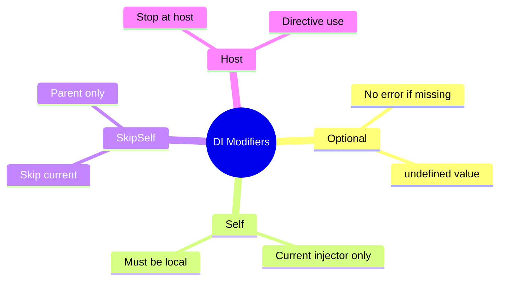

# 🎭 Use Case 5: @Optional, @Self, @SkipSelf, @Host

> **💡 Lightbulb Moment**: These decorators control WHERE Angular looks for dependencies in the injector tree!

---

## 1. 🔍 Resolution Modifiers

| Decorator | Behavior |
|-----------|----------|
| `@Optional()` | Don't error if not found |
| `@Self()` | Only check current injector |
| `@SkipSelf()` | Skip current, check parents |
| `@Host()` | Stop at host component |

---

## 2. 🚀 Examples

### @Optional
```typescript
constructor(@Optional() private logger?: LoggerService) {
    // logger might be undefined - no error!
}
```

### @Self
```typescript
constructor(@Self() private logger: LoggerService) {
    // Only use logger from THIS component's providers
}
```

### @SkipSelf
```typescript
constructor(@SkipSelf() private logger: LoggerService) {
    // Use parent's logger, not local one
}
```

---

## 3. ❓ Interview Questions

### Basic Questions

#### Q1: When use @Optional()?
**Answer:** When the dependency might not exist:
- Optional features
- Plugin systems
- Graceful degradation

#### Q2: @Self vs providedIn: 'root'?
**Answer:** @Self() on a providedIn: 'root' service will fail unless the component also provides it locally.

---

### Scenario-Based Questions

#### Scenario: Parent Service Access
**Question:** Component needs parent's FormGroup, not its own.

**Answer:**
```typescript
constructor(@SkipSelf() private parentForm: FormGroup) {
    // Gets parent's form, skipping local
}
```

---

## 🧠 Mind Map


