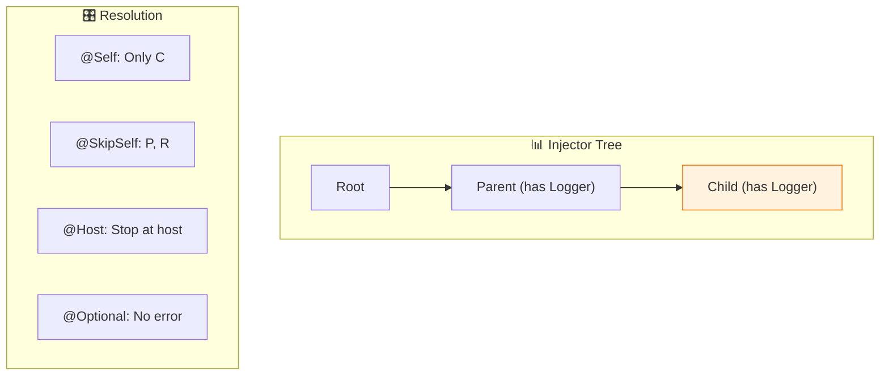
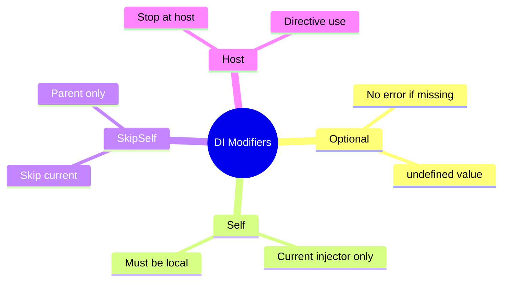

# 🎭 Use Case 5: @Optional, @Self, @SkipSelf, @Host

> **💡 Lightbulb Moment**: These decorators control WHERE Angular looks for dependencies in the injector tree!

---

## 1. 🔍 Resolution Modifiers

| Decorator | Behavior |
|-----------|----------|
| `@Optional()` | Don't error if not found |
| `@Self()` | Only check current injector |
| `@SkipSelf()` | Skip current, check parents |
| `@Host()` | Stop at host component |

---

## 2. 🚀 Examples

### @Optional
```typescript
constructor(@Optional() private logger?: LoggerService) {
    // logger might be undefined - no error!
}
```

### @Self
```typescript
constructor(@Self() private logger: LoggerService) {
    // Only use logger from THIS component's providers
}
```

### @SkipSelf
```typescript
constructor(@SkipSelf() private logger: LoggerService) {
    // Use parent's logger, not local one
}
```

### 📊 Data Flow Diagram



### 📦 Data Flow Summary (Visual Box Diagram)

```
┌─────────────────────────────────────────────────────────────┐
│  RESOLUTION MODIFIERS                                       │
│                                                             │
│   INJECTOR TREE:                                            │
│   ┌───────────────────────────────────────────────────────┐ │
│   │     Root Injector (Logger: RootLogger)                │ │
│   │           │                                           │ │
│   │           ▼                                           │ │
│   │     Parent Component (Logger: ParentLogger)           │ │
│   │           │                                           │ │
│   │           ▼                                           │ │
│   │     Child Component (Logger: ChildLogger)   ← WE ARE  │ │
│   └───────────────────────────────────────────────────────┘ │
│                                                             │
│   ① @Optional() - Don't error if not found                  │
│   ┌───────────────────────────────────────────────────────┐ │
│   │ constructor(@Optional() private logger?: LoggerService)│ │
│   │                                                       │ │
│   │ // If Logger not provided anywhere:                   │ │
│   │ // ❌ Without @Optional: ERROR: No provider!          │ │
│   │ // ✅ With @Optional: logger = undefined (no error)   │ │
│   └───────────────────────────────────────────────────────┘ │
│                                                             │
│   ② @Self() - ONLY check current injector                   │
│   ┌───────────────────────────────────────────────────────┐ │
│   │ constructor(@Self() private logger: LoggerService)    │ │
│   │                                                       │ │
│   │ Search: [Child] ← ONLY HERE, STOP                     │ │
│   │                                                       │ │
│   │ // If Child doesn't provide Logger: ERROR             │ │
│   │ // Ignores Parent and Root even if they have it       │ │
│   └───────────────────────────────────────────────────────┘ │
│                                                             │
│   ③ @SkipSelf() - SKIP current, start at parent             │
│   ┌───────────────────────────────────────────────────────┐ │
│   │ constructor(@SkipSelf() private logger: LoggerService)│ │
│   │                                                       │ │
│   │ Search: [Child]❌ → [Parent]✅ → [Root]                │ │
│   │                                                       │ │
│   │ // Skip own providers, use parent's Logger            │ │
│   │ // Useful: "I want parent's, not my local override"   │ │
│   └───────────────────────────────────────────────────────┘ │
│                                                             │
│   ④ @Host() - Stop at host component boundary               │
│   ┌───────────────────────────────────────────────────────┐ │
│   │ // Used mainly in directives                          │ │
│   │ constructor(@Host() private form: NgForm)             │ │
│   │                                                       │ │
│   │ // Search stops at host component, won't go to root   │ │
│   └───────────────────────────────────────────────────────┘ │
└─────────────────────────────────────────────────────────────┘
```

**When to Use Each:**
| Modifier | Use Case |
|----------|----------|
| `@Optional()` | Optional features, graceful degradation |
| `@Self()` | Force local providers, testing isolation |
| `@SkipSelf()` | Use parent's service, avoid self-reference |
| `@Host()` | Directive needs host component's service |

> **Key Takeaway**: These decorators control WHERE Angular looks in the injector tree. Combine them: `@Optional() @Self()` means "only local, but don't error if missing"!

---

## 3. ❓ Interview Questions

### Basic Questions

#### Q1: When use @Optional()?
**Answer:** When the dependency might not exist:
- Optional features
- Plugin systems
- Graceful degradation

#### Q2: @Self vs providedIn: 'root'?
**Answer:** @Self() on a providedIn: 'root' service will fail unless the component also provides it locally.

---

### Scenario-Based Questions

#### Scenario: Parent Service Access
**Question:** Component needs parent's FormGroup, not its own.

**Answer:**
```typescript
constructor(@SkipSelf() private parentForm: FormGroup) {
    // Gets parent's form, skipping local
}
```

---

## 🧠 Mind Map


