# 🎭 Use Case 5: @Optional, @Self, @SkipSelf, @Host

> **💡 Lightbulb Moment**: These decorators control WHERE Angular looks for dependencies in the injector tree!

---

## 1. 🔍 Resolution Modifiers

| Decorator | Behavior |
|-----------|----------|
| `@Optional()` | Don't error if not found |
| `@Self()` | Only check current injector |
| `@SkipSelf()` | Skip current, check parents |
| `@Host()` | Stop at host component |

---

## 2. 🚀 Examples

### @Optional
```typescript
constructor(@Optional() private logger?: LoggerService) {
    // logger might be undefined - no error!
}
```

### @Self
```typescript
constructor(@Self() private logger: LoggerService) {
    // Only use logger from THIS component's providers
}
```

### @SkipSelf
```typescript
constructor(@SkipSelf() private logger: LoggerService) {
    // Use parent's logger, not local one
}
```

### 📊 Data Flow Diagram

```mermaid
flowchart TD
    subgraph Tree["📊 Injector Tree"]
        R["Root"]
        P["Parent (has Logger)"]
        C["Child (has Logger)"]
    end
    
    R --> P --> C
    
    subgraph Modifiers["🎛️ Resolution"]
        Self["@Self: Only C"]
        SkipSelf["@SkipSelf: P, R"]
        Host["@Host: Stop at host"]
        Optional["@Optional: No error"]
    end
    
    style C fill:#fff3e0,stroke:#ff6f00
```



### 📦 Data Flow Summary (Visual Box Diagram)

```
┌─────────────────────────────────────────────────────────────┐
│  RESOLUTION MODIFIERS                                       │
│                                                             │
│   INJECTOR TREE:                                            │
│   ┌───────────────────────────────────────────────────────┐ │
│   │     Root Injector (Logger: RootLogger)                │ │
│   │           │                                           │ │
│   │           ▼                                           │ │
│   │     Parent Component (Logger: ParentLogger)           │ │
│   │           │                                           │ │
│   │           ▼                                           │ │
│   │     Child Component (Logger: ChildLogger)   ← WE ARE  │ │
│   └───────────────────────────────────────────────────────┘ │
│                                                             │
│   ① @Optional() - Don't error if not found                  │
│   ┌───────────────────────────────────────────────────────┐ │
│   │ constructor(@Optional() private logger?: LoggerService)│ │
│   │                                                       │ │
│   │ // If Logger not provided anywhere:                   │ │
│   │ // ❌ Without @Optional: ERROR: No provider!          │ │
│   │ // ✅ With @Optional: logger = undefined (no error)   │ │
│   └───────────────────────────────────────────────────────┘ │
│                                                             │
│   ② @Self() - ONLY check current injector                   │
│   ┌───────────────────────────────────────────────────────┐ │
│   │ constructor(@Self() private logger: LoggerService)    │ │
│   │                                                       │ │
│   │ Search: [Child] ← ONLY HERE, STOP                     │ │
│   │                                                       │ │
│   │ // If Child doesn't provide Logger: ERROR             │ │
│   │ // Ignores Parent and Root even if they have it       │ │
│   └───────────────────────────────────────────────────────┘ │
│                                                             │
│   ③ @SkipSelf() - SKIP current, start at parent             │
│   ┌───────────────────────────────────────────────────────┐ │
│   │ constructor(@SkipSelf() private logger: LoggerService)│ │
│   │                                                       │ │
│   │ Search: [Child]❌ → [Parent]✅ → [Root]                │ │
│   │                                                       │ │
│   │ // Skip own providers, use parent's Logger            │ │
│   │ // Useful: "I want parent's, not my local override"   │ │
│   └───────────────────────────────────────────────────────┘ │
│                                                             │
│   ④ @Host() - Stop at host component boundary               │
│   ┌───────────────────────────────────────────────────────┐ │
│   │ // Used mainly in directives                          │ │
│   │ constructor(@Host() private form: NgForm)             │ │
│   │                                                       │ │
│   │ // Search stops at host component, won't go to root   │ │
│   └───────────────────────────────────────────────────────┘ │
└─────────────────────────────────────────────────────────────┘
```

**When to Use Each:**
| Modifier | Use Case |
|----------|----------|
| `@Optional()` | Optional features, graceful degradation |
| `@Self()` | Force local providers, testing isolation |
| `@SkipSelf()` | Use parent's service, avoid self-reference |
| `@Host()` | Directive needs host component's service |

> **Key Takeaway**: These decorators control WHERE Angular looks in the injector tree. Combine them: `@Optional() @Self()` means "only local, but don't error if missing"!

---

---

## 🎯 What Problem Does This Solve?

### The Problem: Uncontrolled Dependency Search
**Without Modifiers (BAD):**
```typescript
// Default behavior: Searches local -> parent -> grandparent -> root
constructor(private service: MyService) {}
```

**Problems:**
1.  **Unexpected Parent Instance**: You might want a *fresh* instance, but Angular finds one in a parent component and gives you that instead.
2.  **Crashes**: If a service isn't found anywhere, the app crashes with `NullInjectorError`.
3.  **Leaking Abstractions**: A directive might accidentally depend on a service from a component far up the tree that it shouldn't know about.

### How Modifiers Solve This
**With Modifiers (GOOD):**
```typescript
// ✅ Precise control
constructor(
    @Self() private localService: MyService,        // Must be here
    @Optional() private optionalService?: Logger    // Safe if missing
) {}
```

| Problem | Modifier Solution |
|---------|-------------------|
| Accidental Sharing | **@Self()**: Tells Angular "Look HERE and nowhere else". |
| Crashing | **@Optional()**: Tells Angular "It's fine if it's missing, just give me null". |
| Shadowing | **@SkipSelf()**: Tells Angular "I know I have one, but I want my PARENT's version". |

---

## 📚 Key Classes & Types Explained

### 1. `@Optional()`
*   **Type**: Parameter Decorator.
*   **Effect**: Marks a dependency as optional. If not found, resolves to `null`.
*   **Use when**: The dependency is not critical (e.g., Logger, Analytics).

### 2. `@Self()`
*   **Type**: Parameter Decorator.
*   **Effect**: Restricts resolution to the **NodeInjector** (the current component/directive).
*   **Error**: Throws if providers are not found on THIS element.

### 3. `@SkipSelf()`
*   **Type**: Parameter Decorator.
*   **Effect**: Skips the current NodeInjector and starts search at the **Parent Injector**.
*   **Use when**: A component provides a service but needs to inject the *parent's* instance of that same service (e.g., Tree nodes).

### 4. `@Host()`
*   **Type**: Parameter Decorator.
*   **Effect**: Limits search to the "Host View".
    *   For Components: Same as `@Self()` usually.
    *   For Directives: Looks on the element and its Component (the host), but stops there.

---

## 🌍 Real-World Use Cases

### 1. Recursive Components (Tree)
Each node provides `TreeService`. To link nodes, a child needs to inject its *Parent's* service.
```typescript
constructor(
    @Self() me: TreeService, 
    @SkipSelf() @Optional() parent: TreeService
) {
    parent?.addChild(me);
}
```

### 2. Form Control Value Accessors
To suppress infinite loops when a custom input injects `NgControl`.
```typescript
constructor(@Self() @Optional() public ngControl: NgControl) {
    if (ngControl) ngControl.valueAccessor = this;
}
```

### 3. Optional Plugins / theming
A generic card component that *might* use a `ThemeService` if one is provided, but works fine without it.
```typescript
constructor(@Optional() theme?: ThemeService) {
    this.color = theme?.primaryColor || 'blue'; // Default fallback
}
```

### 4. Isolated Directives
A `TooltipDirective` that wants configuration from the `TooltipHost` component it's attached to, but *not* from a global config.
```typescript
constructor(@Host() config: TooltipConfig) {} 
```

---

## ❓ Complete Interview Questions (20+)

### Basic Questions

**Q1: What is the default resolution behavior?**
> A: Search Local -> Parent -> Grandparent -> ... -> Root -> NullInjectorError.

**Q2: What does `@Optional()` return if not found?**
> A: `null`.

**Q3: Can I combine modifiers?**
> A: Yes! e.g., `@Optional() @Self()`.

**Q4: What happens if `@Self()` doesn't find the provider?**
> A: It throws a `NodeInjector: NOT_FOUND_ERROR`.

**Q5: Why would I use `@SkipSelf()`?**
> A: To access a parent's instance of a service when the current component *also* provides that service.

---

### Scenario-Based Questions

**Q6: Scenario: Recursive Tree Node.**
> A: Use `@SkipSelf()` to get the parent node.

**Q7: Scenario: Custom Form Control.**
> A: Use `@Self() NgControl` to avoid circular dependency errors.

**Q8: Scenario: Optional Logger.**
> A: Use `@Optional() Logger`.

**Q9: Scenario: "I want to ensure I'm getting my own instance, not a parent's."**
> A: Use `@Self()`.

**Q10: Scenario: "I want to ensure I'm getting the Host Component's service, not the Roots."**
> A: Use `@Host()`.

---

### Advanced Questions

**Q11: Difference between @Host and @Self?**
> A: For components, usually same. For directives, `@Host` checks the element AND the component (host) attached to it. `@Self` only checks the element/directive providers.

**Q12: Does @Optional work with @Self?**
> A: Yes. "Check local only. If not found, return null instead of error."

**Q13: What is the 'Host View'?**
> A: The template that wraps the current component/directive.

**Q14: Can I use modifiers in `inject()` function?**
> A: Yes! `inject(Token, { self: true, optional: true })`.

**Q15: How do modifiers affect tree shaking?**
> A: They don't directly.

**Q16: Default modifier?**
> A: None (searches everywhere).

**Q17: @SkipSelf with @Host?**
> A: Starts at parent, stops at host. (Narrow range).

**Q18: What is `ModuleInjector` role here?**
> A: Modifiers usually act on the `ElementInjector` hierarchy. If they reach Root, they hit ModuleInjector.

**Q19: Can I use modifiers in a Factory?**
> A: Yes, via `deps` flags or `inject()`.

**Q20: Why is `@Self` faster?**
> A: O(1) lookup. Doesn't traverse tree.

---

## 🧠 Mind Map


