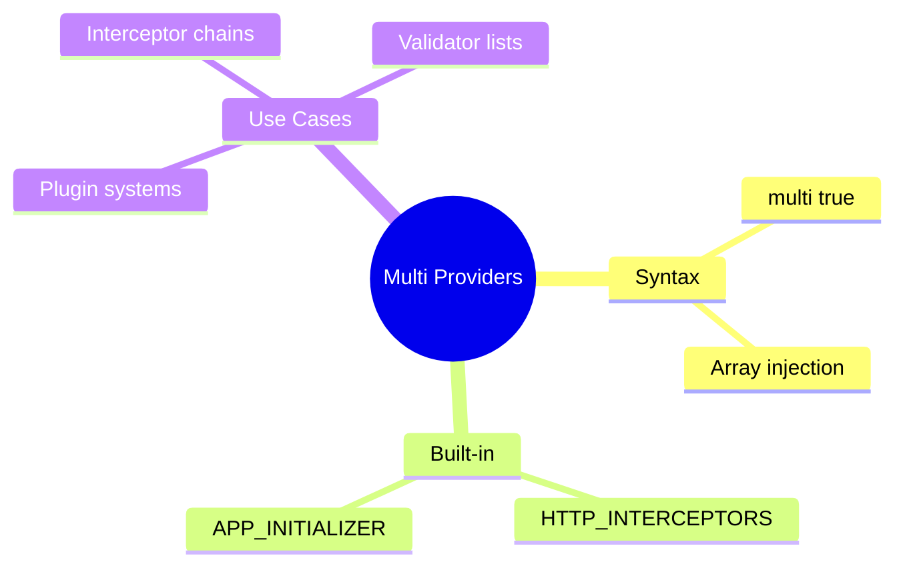

# 🔄 Use Case 6: Multi Providers

> **💡 Lightbulb Moment**: multi: true lets multiple providers contribute to a single token - like plugins!

---

## 1. 🔍 What are Multi Providers?

Multiple providers for the same token, injected as an array.

```typescript
providers: [
    { provide: HTTP_INTERCEPTORS, useClass: AuthInterceptor, multi: true },
    { provide: HTTP_INTERCEPTORS, useClass: LoggingInterceptor, multi: true },
    { provide: HTTP_INTERCEPTORS, useClass: ErrorInterceptor, multi: true }
]
// Injects: [AuthInterceptor, LoggingInterceptor, ErrorInterceptor]
```

---

## 2. 🚀 Custom Multi Provider

```typescript
// Token
export const VALIDATORS = new InjectionToken<Validator[]>('Validators');

// Providers
providers: [
    { provide: VALIDATORS, useClass: RequiredValidator, multi: true },
    { provide: VALIDATORS, useClass: EmailValidator, multi: true },
    { provide: VALIDATORS, useClass: MinLengthValidator, multi: true }
]

// Usage
validators = inject(VALIDATORS);  // Validator[]
```

---

## 3. ❓ Interview Questions

### Basic Questions

#### Q1: What happens without multi: true?
**Answer:** Later providers override earlier ones. Only last wins:
```typescript
{ provide: Logger, useClass: FileLogger },
{ provide: Logger, useClass: ConsoleLogger }  // Only this is used!
```

#### Q2: Common Angular multi providers?
**Answer:**
- `HTTP_INTERCEPTORS` - HTTP interceptor chain
- `APP_INITIALIZER` - App startup tasks
- `HAMMER_GESTURE_CONFIG` - Gesture handlers

---

### Scenario-Based Questions

#### Scenario: Plugin System
**Question:** Create a plugin system where features can register handlers.

**Answer:**
```typescript
export const PLUGINS = new InjectionToken<Plugin[]>('Plugins');

// Feature A registers
{ provide: PLUGINS, useClass: FeatureAPlugin, multi: true }

// Feature B registers
{ provide: PLUGINS, useClass: FeatureBPlugin, multi: true }

// Core loads all
plugins = inject(PLUGINS);
plugins.forEach(p => p.init());
```

---

## 🧠 Mind Map


