# 🔄 Use Case 6: Multi Providers

> **💡 Lightbulb Moment**: multi: true lets multiple providers contribute to a single token - like plugins!

---

## 1. 🔍 What are Multi Providers?

Multiple providers for the same token, injected as an array.

```typescript
providers: [
    { provide: HTTP_INTERCEPTORS, useClass: AuthInterceptor, multi: true },
    { provide: HTTP_INTERCEPTORS, useClass: LoggingInterceptor, multi: true },
    { provide: HTTP_INTERCEPTORS, useClass: ErrorInterceptor, multi: true }
]
// Injects: [AuthInterceptor, LoggingInterceptor, ErrorInterceptor]
```

---

## 2. 🚀 Custom Multi Provider

```typescript
// Token
export const VALIDATORS = new InjectionToken<Validator[]>('Validators');

// Providers
providers: [
    { provide: VALIDATORS, useClass: RequiredValidator, multi: true },
    { provide: VALIDATORS, useClass: EmailValidator, multi: true },
    { provide: VALIDATORS, useClass: MinLengthValidator, multi: true }
]

// Usage
validators = inject(VALIDATORS);  // Validator[]
```

### 📊 Data Flow Diagram

```mermaid
flowchart LR
    subgraph Providers["📦 Providers (multi: true)"]
        P1["AuthInterceptor"]
        P2["LoggingInterceptor"]
        P3["ErrorInterceptor"]
    end
    
    subgraph Token["🎯 Token"]
        HTTP["HTTP_INTERCEPTORS"]
    end
    
    subgraph Result["📤 Injection Result"]
        Array["[Auth, Logging, Error]"]
    end
    
    P1 --> HTTP
    P2 --> HTTP
    P3 --> HTTP
    HTTP --> Array
    
    style Token fill:#e1f5fe,stroke:#0288d1
```



### 📦 Data Flow Summary (Visual Box Diagram)

```
┌─────────────────────────────────────────────────────────────┐
│  MULTI PROVIDERS (one token, many values)                   │
│                                                             │
│   WITHOUT multi: true (LAST WINS)                           │
│   ┌───────────────────────────────────────────────────────┐ │
│   │ providers: [                                          │ │
│   │   { provide: Logger, useClass: FileLogger },          │ │
│   │   { provide: Logger, useClass: ConsoleLogger }        │ │
│   │ ]                                                     │ │
│   │                                                       │ │
│   │ inject(Logger) → ConsoleLogger (overwrote FileLogger!)│ │
│   └───────────────────────────────────────────────────────┘ │
│                                                             │
│   WITH multi: true (ALL COLLECTED)                          │
│   ┌───────────────────────────────────────────────────────┐ │
│   │ providers: [                                          │ │
│   │   { provide: HTTP_INTERCEPTORS,                       │ │
│   │     useClass: AuthInterceptor, multi: true },   ──┐   │ │
│   │                                                   │   │ │
│   │   { provide: HTTP_INTERCEPTORS,                   │   │ │
│   │     useClass: LoggingInterceptor, multi: true },──│   │ │
│   │                                                   │   │ │
│   │   { provide: HTTP_INTERCEPTORS,                   │   │ │
│   │     useClass: ErrorInterceptor, multi: true }  ───│   │ │
│   │ ]                                                 │   │ │
│   │                                                   │   │ │
│   │                                                   ▼   │ │
│   │ inject(HTTP_INTERCEPTORS) →                           │ │
│   │   [AuthInterceptor, LoggingInterceptor, ErrorInterceptor]│
│   │                                                       │ │
│   │ // ALL THREE! Returned as array                       │ │
│   └───────────────────────────────────────────────────────┘ │
│                                                             │
│   COMMON ANGULAR MULTI TOKENS:                              │
│   ┌───────────────────────────────────────────────────────┐ │
│   │ HTTP_INTERCEPTORS  → Interceptor chain                │ │
│   │ APP_INITIALIZER    → Startup tasks (wait for all)     │ │
│   │ ROUTES             → Child routes in lazy modules     │ │
│   │ NG_VALIDATORS      → Form validators                  │ │
│   └───────────────────────────────────────────────────────┘ │
└─────────────────────────────────────────────────────────────┘
```

**Multi Provider Use Cases:**
1. **Interceptor chains**: Each interceptor handles different concern
2. **Plugin systems**: Features register handlers dynamically
3. **Validators**: Multiple validation rules for forms
4. **Initializers**: Multiple async startup tasks

> **Key Takeaway**: `multi: true` collects ALL providers into an array instead of overwriting. Essential for plugin-like patterns!

---

## 3. ❓ Interview Questions

### Basic Questions

#### Q1: What happens without multi: true?
**Answer:** Later providers override earlier ones. Only last wins:
```typescript
{ provide: Logger, useClass: FileLogger },
{ provide: Logger, useClass: ConsoleLogger }  // Only this is used!
```

#### Q2: Common Angular multi providers?
**Answer:**
- `HTTP_INTERCEPTORS` - HTTP interceptor chain
- `APP_INITIALIZER` - App startup tasks
- `HAMMER_GESTURE_CONFIG` - Gesture handlers

---

### Scenario-Based Questions

#### Scenario: Plugin System
**Question:** Create a plugin system where features can register handlers.

**Answer:**
```typescript
export const PLUGINS = new InjectionToken<Plugin[]>('Plugins');

// Feature A registers
{ provide: PLUGINS, useClass: FeatureAPlugin, multi: true }

// Feature B registers
{ provide: PLUGINS, useClass: FeatureBPlugin, multi: true }

// Core loads all
plugins = inject(PLUGINS);
plugins.forEach(p => p.init());
```

---

## 🧠 Mind Map


