# 🎯 Use Case 6: Resolution Modifiers (@Optional, @Self, @SkipSelf, @Host)

> **Goal**: Master the four resolution modifier decorators that control HOW and WHERE Angular looks for dependencies in the injector hierarchy.

---

## 1. 🔍 How It Works (The Concept)

### The Mechanism
By default, Angular searches UP the injector hierarchy until it finds a provider. Resolution modifiers change this behavior:

| Modifier | Behavior |
|----------|----------|
| `@Optional()` | Don't throw if not found, return `null` |
| `@Self()` | Only look in THIS component's injector |
| `@SkipSelf()` | Skip this injector, start from parent |
| `@Host()` | Stop at the host element boundary |

### 📊 Injector Hierarchy & Resolution

```mermaid
flowchart TB
    subgraph Hierarchy["🏗️ Injector Hierarchy"]
        Root["🌍 Root Injector<br/>AuthService ✓"]
        Parent["👨‍💼 Parent Component<br/>LogService ✓"]
        Host["🏠 Host Element<br/>ConfigService ✓"]
        Current["📍 Current Component<br/>LocalService ✓"]
    end
    
    subgraph Modifiers["🎯 Resolution Modifiers"]
        Optional["@Optional()<br/>Returns null if not found"]
        Self["@Self()<br/>Only Current"]
        SkipSelf["@SkipSelf()<br/>Skip Current, search up"]
        HostMod["@Host()<br/>Stop at Host"]
    end
    
    Root --> Parent
    Parent --> Host
    Host --> Current
    
    Self --> Current
    SkipSelf --> Parent
    HostMod --> Host
    
    style Current fill:#c8e6c9,stroke:#388e3c,stroke-width:3px
    style Optional fill:#fff3e0,stroke:#ff6f00
    style Self fill:#ffcdd2,stroke:#c62828
    style SkipSelf fill:#bbdefb,stroke:#1976d2
    style HostMod fill:#e1bee7,stroke:#7b1fa2
```



### 🖼️ Visual Guide


### Default vs. Modified Resolution

| Scenario | Without Modifier | With Modifier |
|----------|------------------|---------------|
| **Not found** | ❌ `NullInjectorError` | `@Optional()`: returns `null` |
| **Want parent's** | Gets own if provided | `@SkipSelf()`: skips to parent |
| **Enforce local** | Might get parent's | `@Self()`: error if not local |
| **Directive scope** | Searches all | `@Host()`: stops at host |

---

## 2. 🛡️ The Problem & Solution

### The Problem: "The Uncontrolled Search" 🕵️‍♂️
By default, Angular's Dependency Injection is **aggressive**. It searches:
1.  **Locally** (Component)
2.  **Parent** (Parent Component)
3.  **Grandparent**... all the way to **Root**.

**Why is this a problem?**
*   **Accidental Sharing**: You might accidentally get a parent's service instance when you wanted a fresh one for yourself.
*   **Infinite Search**: Angular wastes time searching up the tree when you *know* the dependency should be local.
*   **Crashes**: If a service is optional (like a Logger), Angular crashes by default if it's missing.

### The Solution: "Controlled Resolution" 🎮
Resolution Modifiers give you **control** over this search process.
*   **Stop!** (`@Self`, `@Host`): "Don't look any further."
*   **Skip!** (`@SkipSelf`): "Don't look here."
*   **Relax!** (`@Optional`): "It's okay if you don't find it."

---

## 3. 🚀 Step-by-Step Implementation Guide

### @Optional() - Graceful Fallback

```typescript
// optional.demo.ts
import { Component, Injectable, Optional } from '@angular/core';

/**
 * Service that might not always be provided
 */
@Injectable()  // NOT providedIn: 'root'!
export class AnalyticsService {
    track(event: string): void {
        console.log('📊 Tracking:', event);
    }
}

@Component({
    selector: 'app-widget',
    template: `<button (click)="onClick()">Click Me</button>`
    // ⚠️ NO providers for AnalyticsService!
})
export class WidgetComponent {
    /**
     * 🛡️ CRITICAL: @Optional() prevents crash if not provided
     * 
     * Without @Optional(): NullInjectorError thrown!
     * With @Optional(): analytics is null, app continues
     */
    constructor(@Optional() private analytics: AnalyticsService | null) {
        if (analytics) {
            console.log('Analytics available');
        } else {
            console.log('Analytics not provided - tracking disabled');
        }
    }
    
    onClick(): void {
        // Safely use optional dependency
        this.analytics?.track('button_click');  // Optional chaining!
    }
}
```

### @Self() - Enforce Local Provider

```typescript
// self.demo.ts
import { Component, Injectable, Self } from '@angular/core';

@Injectable()
export class FormValidatorService {
    validate(form: any): boolean { return true; }
}

@Component({
    selector: 'app-form',
    template: `<form>...</form>`,
    /**
     * 🛡️ CRITICAL: Component provides its own validator
     * Each form instance has isolated validation
     */
    providers: [FormValidatorService]
})
export class FormComponent {
    /**
     * 🛡️ CRITICAL: @Self() ensures we get THIS component's instance
     * 
     * Without @Self(): Might get a parent's FormValidatorService
     * With @Self(): Only accepts locally provided instance
     */
    constructor(@Self() private validator: FormValidatorService) {
        console.log('Using local validator only');
    }
}

// Nested form - demonstrates isolation
@Component({
    selector: 'app-nested-form',
    template: `<app-form></app-form>`,
    providers: [FormValidatorService]  // DIFFERENT instance!
})
export class NestedFormComponent {
    /**
     * This gets NestedFormComponent's validator
     * The inner <app-form> gets its own separate validator
     */
    constructor(@Self() private validator: FormValidatorService) {}
}
```

### @SkipSelf() - Access Parent's Instance

```typescript
// skipself.demo.ts
import { Component, Injectable, Optional, SkipSelf } from '@angular/core';

@Injectable()
export class TreeNodeService {
    readonly id = Math.random().toString(36).substring(2, 6);
    children: string[] = [];
    
    addChild(childId: string): void {
        this.children.push(childId);
    }
}

@Component({
    selector: 'app-tree-node',
    template: `
        <div class="node">
            Node ID: {{ nodeService.id }}
            <ng-content></ng-content>
        </div>
    `,
    /**
     * 🛡️ CRITICAL: Each node has its own TreeNodeService
     */
    providers: [TreeNodeService]
})
export class TreeNodeComponent {
    constructor(
        /**
         * 🛡️ CRITICAL: @Self() gets THIS node's service
         */
        @Self() public nodeService: TreeNodeService,
        
        /**
         * 🛡️ CRITICAL: @SkipSelf() gets PARENT node's service
         * @Optional() handles the root node (no parent)
         */
        @SkipSelf() @Optional() private parentNodeService: TreeNodeService | null
    ) {
        // Register with parent (if exists)
        if (this.parentNodeService) {
            this.parentNodeService.addChild(this.nodeService.id);
            console.log(`Node ${this.nodeService.id} registered with parent ${this.parentNodeService.id}`);
        } else {
            console.log(`Node ${this.nodeService.id} is root`);
        }
    }
}
```

### @Host() - Stop at Host Element

```typescript
// host.demo.ts
import { Component, Directive, Host, Optional } from '@angular/core';

@Injectable()
export class TooltipConfigService {
    position: 'top' | 'bottom' = 'top';
}

/**
 * Directive that needs config from its host component
 */
@Directive({
    selector: '[appTooltip]'
})
export class TooltipDirective {
    /**
     * 🛡️ CRITICAL: @Host() ensures we only get config from host
     * 
     * Without @Host(): Might get config from anywhere up the tree
     * With @Host(): Only accepts config from the component that has this directive
     */
    constructor(
        @Host() @Optional() private config: TooltipConfigService | null
    ) {
        if (config) {
            console.log('Using host tooltip config:', config.position);
        } else {
            console.log('No host config, using defaults');
        }
    }
}

@Component({
    selector: 'app-button',
    template: `<button appTooltip>Hover me</button>`,
    providers: [TooltipConfigService]  // Host provides config
})
export class ButtonComponent { }
```

### 📊 Resolution Flow Comparison

```mermaid
sequenceDiagram
    participant C as 📍 Current
    participant P as 👨‍💼 Parent
    participant R as 🌍 Root
    
    Note over C,R: Normal Resolution
    C->>C: Check local
    C->>P: Check parent
    C->>R: Check root
    R-->>C: Found ✓
    
    Note over C: @Self()
    C->>C: Check local ONLY
    alt Found
        C-->>C: Return ✓
    else Not Found
        C-->>C: ❌ Error!
    end
    
    Note over C,P: @SkipSelf()
    C->>P: Skip local, check parent
    P->>R: Check root if needed
    R-->>C: Found in parent/root ✓
    
    Note over C: @Optional() + any
    C->>C: Check local
    C->>P: Check parent
    C->>R: Check root
    alt Found
        R-->>C: Return value ✓
    else Not Found
        C-->>C: Return null ✓
    end
```



### 📦 Data Flow Summary (Visual Box Diagram)

```
┌─────────────────────────────────────────────────────────────┐
│  RESOLUTION MODIFIERS SUMMARY                               │
│                                                             │
│   ① @Optional() 🛡️                                          │
│   ┌───────────────────────────────────────────────────────┐ │
│   │  Search: 📍 Local ➔ 👨‍💼 Parent ➔ 🌍 Root              │ │
│   │  Found:  ✅ Return Instance                           │ │
│   │  Miss:   ⛔ Return NULL (No Error)                    │ │
│   └───────────────────────────────────────────────────────┘ │
│                                                             │
│   ② @Self() 📍                                              │
│   ┌───────────────────────────────────────────────────────┐ │
│   │  Search: 📍 Local ONLY                                │ │
│   │  Found:  ✅ Return Instance                           │ │
│   │  Miss:   ❌ THROW ERROR                               │ │
│   └───────────────────────────────────────────────────────┘ │
│                                                             │
│   ③ @SkipSelf() ⏭️                                         │
│   ┌───────────────────────────────────────────────────────┐ │
│   │  Search: 👨‍💼 Parent ➔ 🌍 Root (Skip Local)            │ │
│   │  Found:  ✅ Return Instance                           │ │
│   │  Miss:   ❌ THROW ERROR                               │ │
│   └───────────────────────────────────────────────────────┘ │
│                                                             │
│   ④ @Host() 🏠                                              │
│   ┌───────────────────────────────────────────────────────┐ │
│   │  Search: 📍 Local ➔ 🏠 Host Element Boundary          │ │
│   │  Found:  ✅ Return Instance                           │ │
│   │  Miss:   ❌ THROW ERROR                               │ │
│   └───────────────────────────────────────────────────────┘ │
└─────────────────────────────────────────────────────────────┘
```

---

## 3. 🐛 Common Pitfalls & Debugging

### ❌ Pitfall 1: @Self() Without Local Provider

**Bad Code:**
```typescript
@Component({
    selector: 'app-example',
    // ❌ NO providers array!
})
export class ExampleComponent {
    constructor(@Self() private svc: MyService) { }  // ❌ Error!
}
```

**Error:** `NullInjectorError: No provider for MyService`

**Good Code:**
```typescript
@Component({
    selector: 'app-example',
    providers: [MyService]  // ✅ Local provider
})
export class ExampleComponent {
    constructor(@Self() private svc: MyService) { }  // ✅ Works!
}
```

---

### ❌ Pitfall 2: Forgetting Type Union with @Optional()

**Bad Code:**
```typescript
// ❌ TypeScript thinks svc is always defined!
constructor(@Optional() private svc: MyService) {
    this.svc.doSomething();  // ❌ Runtime error if null!
}
```

**Good Code:**
```typescript
// ✅ Type reflects possibility of null
constructor(@Optional() private svc: MyService | null) {
    this.svc?.doSomething();  // ✅ Optional chaining
    // OR
    if (this.svc) {
        this.svc.doSomething();  // ✅ Type guard
    }
}
```

---

### ❌ Pitfall 3: @SkipSelf() at Root Level

**Bad Code:**
```typescript
// Root component - no parent!
@Component({
    selector: 'app-root',
    providers: [LogService]
})
export class AppComponent {
    constructor(@SkipSelf() private log: LogService) { }  // ❌ No parent!
}
```

**Error:** Can't find provider in parent (there is no parent)

**Good Code:**
```typescript
@Component({
    selector: 'app-root',
    providers: [LogService]
})
export class AppComponent {
    // ✅ Combine with @Optional() for safety
    constructor(@SkipSelf() @Optional() private log: LogService | null) { }
}
```

---

## 4. ⚡ Performance & Architecture

### Performance Impact

| Modifier | Performance | Notes |
|----------|-------------|-------|
| Default | O(h) | h = hierarchy depth |
| `@Self()` | O(1) | Constant - only one check |
| `@SkipSelf()` | O(h-1) | Slightly less than default |
| `@Host()` | O(d) | d = distance to host |
| `@Optional()` | Same + null check | Negligible overhead |

### Architectural Patterns

```mermaid
flowchart TB
    subgraph Tree["🌲 Tree Structure Pattern"]
        Root["Root Node<br/>providers: [TreeService]"]
        Branch1["Branch<br/>providers: [TreeService]"]
        Branch2["Branch<br/>providers: [TreeService]"]
        Leaf1["Leaf<br/>@SkipSelf() TreeService"]
        Leaf2["Leaf<br/>@SkipSelf() TreeService"]
    end
    
    subgraph Form["📝 Form Pattern"]
        FormHost["FormGroup<br/>providers: [FormService]"]
        Field1["Field<br/>@Self() FormService"]
        Field2["Field<br/>@Self() FormService"]
    end
    
    Root --> Branch1
    Root --> Branch2
    Branch1 --> Leaf1
    Branch2 --> Leaf2
    
    FormHost --> Field1
    FormHost --> Field2
    
    style Root fill:#e8f5e9,stroke:#388e3c
    style FormHost fill:#e3f2fd,stroke:#1976d2
```



### Architectural Benefits 🏗️

1.  **Encapsulation (`@Self`)**:
    *   **Concept**: Keeps a component self-contained.
    *   **Why**: Prevents "leaking" dependencies from parents. Ensures the component works in isolation with its *own* state.
    *   **Example**: A `TabComponent` that needs its own `TabStateService`, not one shared with other tabs.

2.  **Safety (`@Host`)**:
    *   **Concept**: Limits the scope to the immediate context.
    *   **Why**: Prevents a directive from accidentally grabbing a service from a far-away parent, which could lead to unpredictable bugs.
    *   **Example**: A `TooltipDirective` grabbing configuration only from the button it's attached to.

3.  **Flexibility (`@Optional`)**:
    *   **Concept**: Allows "Pluggable" dependencies.
    *   **Why**: Makes your component reusable in different contexts (with or without the service).
    *   **Example**: A `Logger` that is only active if the app provides it.

### When to Use Each

| Modifier | Use When |
|----------|----------|
| `@Optional()` | Plugin systems, optional analytics, graceful degradation |
| `@Self()` | Form fields, isolated widgets, enforcing local instance |
| `@SkipSelf()` | Tree structures, recursive components, parent access |
| `@Host()` | Directives, attribute components, host-specific config |

---

## 5. 🌍 Real World Use Cases

### 1. Form Field Validation Service
```typescript
@Component({
    selector: 'app-input',
    providers: [ValidationService]
})
export class InputComponent {
    // Each input has its own validation state
    constructor(@Self() private validation: ValidationService) {}
}
```

### 2. Recursive Tree Component
```typescript
@Component({
    selector: 'app-tree-item',
    providers: [TreeStateService]
})
export class TreeItemComponent {
    constructor(
        @Self() public myState: TreeStateService,
        @SkipSelf() @Optional() public parentState: TreeStateService | null
    ) {
        // Build parent-child relationships
    }
}
```

### 3. Optional Analytics
```typescript
export class ConfirmDialogComponent {
    constructor(@Optional() private analytics: AnalyticsService | null) {
        // Works with or without analytics
    }
    
    confirm(): void {
        this.analytics?.track('confirm_clicked');
    }
}
```

---

## 6. 📝 The Analogy: "Lost and Found at the Mall" 🛍️

Imagine you lost your keys at the mall:

### Default Resolution (No Modifier)
> Ask at every store, floor by floor, until found.
> Start at your current store, go up to mall office.

### @Optional()
> "If no one has my keys, I'll just call a locksmith."
> You don't panic, you have a backup plan.

### @Self()
> "I'm SURE I dropped them in THIS store."
> Only check this store. If not here, don't bother looking elsewhere.

### @SkipSelf()
> "I definitely didn't leave them here. Check upstairs."
> Skip current store, start searching from the next level.

### @Host()
> "They must be in this wing of the mall."
> Only search stores in your wing, don't go to other wings.

```mermaid
flowchart TB
    subgraph Mall["🏬 The Mall (Injector Hierarchy)"]
        Office["🏢 Mall Office (Root)"]
        Wing1["🏪 East Wing (Parent)"]
        Store1["🛒 Your Store (Current)"]
    end
    
    subgraph Search["🔍 Search Strategies"]
        Default["Default: Store → Wing → Office"]
        Optional["@Optional: Search all, give up gracefully"]
        Self["@Self: Only this store!"]
        SkipSelf["@SkipSelf: Wing → Office"]
    end
    
    Office --> Wing1
    Wing1 --> Store1
    
    style Store1 fill:#c8e6c9,stroke:#388e3c,stroke-width:2px
```



---

---

## 7. ❓ Interview & Concept Questions (20+)

### Core Concepts

**Q1: What does @Optional() return if the service is not found?**
> **A:** It returns `null`. Without it, Angular throws a `NullInjectorError`.

**Q2: What is the scope of @Self()?**
> **A:** It restricts the search to the **current ElementInjector** only. It does not check parents or the ModuleInjector.

**Q3: How does @SkipSelf() differ from @Optional()?**
> **A:** `@SkipSelf()` changes *where* search starts (parent). `@Optional()` changes *what* happens if search fails (no error).

**Q4: When does @Host() stop searching?**
> **A:** It stops at the "Host" element. For components, this is the component itself. For directives, it is the component the directive is on.

**Q5: Can I use multiple modifiers?**
> **A:** Yes! `@SkipSelf() @Optional()` is a common pattern to find a parent service or fail gracefully.

---

### Debugging & Logic

**Q6: Why would I get a NullInjectorError even with @Optional()?**
> **A:** You might have a typo in the token, or the *dependency of the dependency* is missing (and that one isn't optional).

**Q7: Usage of @Self() in Lazy Loaded modules?**
> **A:** `@Self()` doesn't care about modules. It only cares about the Component tree.

**Q8: Can @SkipSelf() go to Root?**
> **A:** Yes, if it doesn't find it in parents, it continues up to Root (unless `@Host` is also present).

**Q9: What is the "Host View"?**
> **A:** The template that contains the component/directive. `@Host()` searches until it hits the boundary of this view.

**Q10: If a component is projected (ng-content), where does @Host() stop?**
> **A:** It stops at the component *hosting* the projected content, i.e., the component where the `<ng-content>` tag actually lives in the DOM structure.

---

### Scenario-Based

**Q11: Scenario: Parent Access.**
> **Q:** How do I get the specific `ListNode` instance that contains my `ListItem`?
> **A:** Inject `ListNode` with `@SkipSelf()` (if item is inside node template) or just `ListNode` (standard lookup).

**Q12: Scenario: Directive Isolation.**
> **Q:** A `tooltip` directive needs config from the button it's on, but NOT from global config.
> **A:** Use `@Self()` or `@Host()` to limit search to the button.

**Q13: Scenario: Circular Dependency.**
> **Q:** A service needs to inject a component that uses the service?
> **A:** This is bad design, but `@Self()` on `Injector` can sometimes help extract it lazily.

**Q14: Scenario: Theme Overrides.**
> **Q:** A section of the app wants to force 'Dark Mode' for all children.
> **A:** Provide `ThemeService` in the SectionComponent. Children get this instance. Use `@SkipSelf()` if you need to consult the global theme first.

**Q15: Scenario: Avoiding Infinite Loops.**
> **Q:** A custom form control implements `ControlValueAccessor` and injects `NgControl`.
> **A:** Use `@Self()` to get the control on *this* element without circular referencing errors.

---

### Value & Performance

**Q16: Performance of modifiers?**
> **A:** `@Self()` is fastest (check one place). Others are standard tree traversal.

**Q17: Does @Optional() increase bundle size?**
> **A:** No.

**Q18: Can I use modifiers with `useFactory`?**
> **A:** Yes! You can pass flags to the factory or use `inject(Token, {optional: true})` inside it.

**Q19: What is the default if no modifier is used?**
> **A:** Search starts at local, goes up to Root, throws error if missing.

**Q20: Can I use modifiers in constructor of a Pipe?**
> **A:** Yes, pipes are created by the injector of the component where they are used.

**Q21: Does `@Host()` works on Services?**
> **A:** Services don't have a "Host Element" in the DOM sense. It's used in Components/Directives.
