# 🎯 Use Case 6: Resolution Modifiers (@Optional, @Self, @SkipSelf, @Host)

> **Goal**: Master the four resolution modifier decorators that control HOW and WHERE Angular looks for dependencies in the injector hierarchy.

---

## 1. 🔍 How It Works (The Concept)

### The Mechanism
By default, Angular searches UP the injector hierarchy until it finds a provider. Resolution modifiers change this behavior:

| Modifier | Behavior |
|----------|----------|
| `@Optional()` | Don't throw if not found, return `null` |
| `@Self()` | Only look in THIS component's injector |
| `@SkipSelf()` | Skip this injector, start from parent |
| `@Host()` | Stop at the host element boundary |

### 📊 Injector Hierarchy & Resolution


### Default vs. Modified Resolution

| Scenario | Without Modifier | With Modifier |
|----------|------------------|---------------|
| **Not found** | ❌ `NullInjectorError` | `@Optional()`: returns `null` |
| **Want parent's** | Gets own if provided | `@SkipSelf()`: skips to parent |
| **Enforce local** | Might get parent's | `@Self()`: error if not local |
| **Directive scope** | Searches all | `@Host()`: stops at host |

---

## 2. 🚀 Step-by-Step Implementation Guide

### @Optional() - Graceful Fallback

```typescript
// optional.demo.ts
import { Component, Injectable, Optional } from '@angular/core';

/**
 * Service that might not always be provided
 */
@Injectable()  // NOT providedIn: 'root'!
export class AnalyticsService {
    track(event: string): void {
        console.log('📊 Tracking:', event);
    }
}

@Component({
    selector: 'app-widget',
    template: `<button (click)="onClick()">Click Me</button>`
    // ⚠️ NO providers for AnalyticsService!
})
export class WidgetComponent {
    /**
     * 🛡️ CRITICAL: @Optional() prevents crash if not provided
     * 
     * Without @Optional(): NullInjectorError thrown!
     * With @Optional(): analytics is null, app continues
     */
    constructor(@Optional() private analytics: AnalyticsService | null) {
        if (analytics) {
            console.log('Analytics available');
        } else {
            console.log('Analytics not provided - tracking disabled');
        }
    }
    
    onClick(): void {
        // Safely use optional dependency
        this.analytics?.track('button_click');  // Optional chaining!
    }
}
```

### @Self() - Enforce Local Provider

```typescript
// self.demo.ts
import { Component, Injectable, Self } from '@angular/core';

@Injectable()
export class FormValidatorService {
    validate(form: any): boolean { return true; }
}

@Component({
    selector: 'app-form',
    template: `<form>...</form>`,
    /**
     * 🛡️ CRITICAL: Component provides its own validator
     * Each form instance has isolated validation
     */
    providers: [FormValidatorService]
})
export class FormComponent {
    /**
     * 🛡️ CRITICAL: @Self() ensures we get THIS component's instance
     * 
     * Without @Self(): Might get a parent's FormValidatorService
     * With @Self(): Only accepts locally provided instance
     */
    constructor(@Self() private validator: FormValidatorService) {
        console.log('Using local validator only');
    }
}

// Nested form - demonstrates isolation
@Component({
    selector: 'app-nested-form',
    template: `<app-form></app-form>`,
    providers: [FormValidatorService]  // DIFFERENT instance!
})
export class NestedFormComponent {
    /**
     * This gets NestedFormComponent's validator
     * The inner <app-form> gets its own separate validator
     */
    constructor(@Self() private validator: FormValidatorService) {}
}
```

### @SkipSelf() - Access Parent's Instance

```typescript
// skipself.demo.ts
import { Component, Injectable, Optional, SkipSelf } from '@angular/core';

@Injectable()
export class TreeNodeService {
    readonly id = Math.random().toString(36).substring(2, 6);
    children: string[] = [];
    
    addChild(childId: string): void {
        this.children.push(childId);
    }
}

@Component({
    selector: 'app-tree-node',
    template: `
        <div class="node">
            Node ID: {{ nodeService.id }}
            <ng-content></ng-content>
        </div>
    `,
    /**
     * 🛡️ CRITICAL: Each node has its own TreeNodeService
     */
    providers: [TreeNodeService]
})
export class TreeNodeComponent {
    constructor(
        /**
         * 🛡️ CRITICAL: @Self() gets THIS node's service
         */
        @Self() public nodeService: TreeNodeService,
        
        /**
         * 🛡️ CRITICAL: @SkipSelf() gets PARENT node's service
         * @Optional() handles the root node (no parent)
         */
        @SkipSelf() @Optional() private parentNodeService: TreeNodeService | null
    ) {
        // Register with parent (if exists)
        if (this.parentNodeService) {
            this.parentNodeService.addChild(this.nodeService.id);
            console.log(`Node ${this.nodeService.id} registered with parent ${this.parentNodeService.id}`);
        } else {
            console.log(`Node ${this.nodeService.id} is root`);
        }
    }
}
```

### @Host() - Stop at Host Element

```typescript
// host.demo.ts
import { Component, Directive, Host, Optional } from '@angular/core';

@Injectable()
export class TooltipConfigService {
    position: 'top' | 'bottom' = 'top';
}

/**
 * Directive that needs config from its host component
 */
@Directive({
    selector: '[appTooltip]'
})
export class TooltipDirective {
    /**
     * 🛡️ CRITICAL: @Host() ensures we only get config from host
     * 
     * Without @Host(): Might get config from anywhere up the tree
     * With @Host(): Only accepts config from the component that has this directive
     */
    constructor(
        @Host() @Optional() private config: TooltipConfigService | null
    ) {
        if (config) {
            console.log('Using host tooltip config:', config.position);
        } else {
            console.log('No host config, using defaults');
        }
    }
}

@Component({
    selector: 'app-button',
    template: `<button appTooltip>Hover me</button>`,
    providers: [TooltipConfigService]  // Host provides config
})
export class ButtonComponent { }
```

### 📊 Resolution Flow Comparison

```mermaid
sequenceDiagram
    participant C as 📍 Current
    participant P as 👨‍💼 Parent
    participant R as 🌍 Root
    
    Note over C,R: Normal Resolution
    C->>C: Check local
    C->>P: Check parent
    C->>R: Check root
    R-->>C: Found ✓
    
    Note over C: @Self()
    C->>C: Check local ONLY
    alt Found
        C-->>C: Return ✓
    else Not Found
        C-->>C: ❌ Error!
    end
    
    Note over C,P: @SkipSelf()
    C->>P: Skip local, check parent
    P->>R: Check root if needed
    R-->>C: Found in parent/root ✓
    
    Note over C: @Optional() + any
    C->>C: Check local
    C->>P: Check parent
    C->>R: Check root
    alt Found
        R-->>C: Return value ✓
    else Not Found
        C-->>C: Return null ✓
    end
```



---

## 3. 🐛 Common Pitfalls & Debugging

### ❌ Pitfall 1: @Self() Without Local Provider

**Bad Code:**
```typescript
@Component({
    selector: 'app-example',
    // ❌ NO providers array!
})
export class ExampleComponent {
    constructor(@Self() private svc: MyService) { }  // ❌ Error!
}
```

**Error:** `NullInjectorError: No provider for MyService`

**Good Code:**
```typescript
@Component({
    selector: 'app-example',
    providers: [MyService]  // ✅ Local provider
})
export class ExampleComponent {
    constructor(@Self() private svc: MyService) { }  // ✅ Works!
}
```

---

### ❌ Pitfall 2: Forgetting Type Union with @Optional()

**Bad Code:**
```typescript
// ❌ TypeScript thinks svc is always defined!
constructor(@Optional() private svc: MyService) {
    this.svc.doSomething();  // ❌ Runtime error if null!
}
```

**Good Code:**
```typescript
// ✅ Type reflects possibility of null
constructor(@Optional() private svc: MyService | null) {
    this.svc?.doSomething();  // ✅ Optional chaining
    // OR
    if (this.svc) {
        this.svc.doSomething();  // ✅ Type guard
    }
}
```

---

### ❌ Pitfall 3: @SkipSelf() at Root Level

**Bad Code:**
```typescript
// Root component - no parent!
@Component({
    selector: 'app-root',
    providers: [LogService]
})
export class AppComponent {
    constructor(@SkipSelf() private log: LogService) { }  // ❌ No parent!
}
```

**Error:** Can't find provider in parent (there is no parent)

**Good Code:**
```typescript
@Component({
    selector: 'app-root',
    providers: [LogService]
})
export class AppComponent {
    // ✅ Combine with @Optional() for safety
    constructor(@SkipSelf() @Optional() private log: LogService | null) { }
}
```

---

## 4. ⚡ Performance & Architecture

### Performance Impact

| Modifier | Performance | Notes |
|----------|-------------|-------|
| Default | O(h) | h = hierarchy depth |
| `@Self()` | O(1) | Constant - only one check |
| `@SkipSelf()` | O(h-1) | Slightly less than default |
| `@Host()` | O(d) | d = distance to host |
| `@Optional()` | Same + null check | Negligible overhead |

### Architectural Patterns


### When to Use Each

| Modifier | Use When |
|----------|----------|
| `@Optional()` | Plugin systems, optional analytics, graceful degradation |
| `@Self()` | Form fields, isolated widgets, enforcing local instance |
| `@SkipSelf()` | Tree structures, recursive components, parent access |
| `@Host()` | Directives, attribute components, host-specific config |

---

## 5. 🌍 Real World Use Cases

### 1. Form Field Validation Service
```typescript
@Component({
    selector: 'app-input',
    providers: [ValidationService]
})
export class InputComponent {
    // Each input has its own validation state
    constructor(@Self() private validation: ValidationService) {}
}
```

### 2. Recursive Tree Component
```typescript
@Component({
    selector: 'app-tree-item',
    providers: [TreeStateService]
})
export class TreeItemComponent {
    constructor(
        @Self() public myState: TreeStateService,
        @SkipSelf() @Optional() public parentState: TreeStateService | null
    ) {
        // Build parent-child relationships
    }
}
```

### 3. Optional Analytics
```typescript
export class ConfirmDialogComponent {
    constructor(@Optional() private analytics: AnalyticsService | null) {
        // Works with or without analytics
    }
    
    confirm(): void {
        this.analytics?.track('confirm_clicked');
    }
}
```

---

## 6. 📝 The Analogy: "Lost and Found at the Mall" 🛍️

Imagine you lost your keys at the mall:

### Default Resolution (No Modifier)
> Ask at every store, floor by floor, until found.
> Start at your current store, go up to mall office.

### @Optional()
> "If no one has my keys, I'll just call a locksmith."
> You don't panic, you have a backup plan.

### @Self()
> "I'm SURE I dropped them in THIS store."
> Only check this store. If not here, don't bother looking elsewhere.

### @SkipSelf()
> "I definitely didn't leave them here. Check upstairs."
> Skip current store, start searching from the next level.

### @Host()
> "They must be in this wing of the mall."
> Only search stores in your wing, don't go to other wings.

```mermaid
flowchart TB
    subgraph Mall["🏬 The Mall (Injector Hierarchy)"]
        Office["🏢 Mall Office (Root)"]
        Wing1["🏪 East Wing (Parent)"]
        Store1["🛒 Your Store (Current)"]
    end
    
    subgraph Search["🔍 Search Strategies"]
        Default["Default: Store → Wing → Office"]
        Optional["@Optional: Search all, give up gracefully"]
        Self["@Self: Only this store!"]
        SkipSelf["@SkipSelf: Wing → Office"]
    end
    
    Office --> Wing1
    Wing1 --> Store1
    
    style Store1 fill:#c8e6c9,stroke:#388e3c,stroke-width:2px
```



---

## 7. ❓ Interview & Concept Questions

### Core Concepts

**Q1: What does @Optional() do and when would you use it?**
> **A:** `@Optional()` tells Angular to inject `null` instead of throwing an error if the dependency isn't found. Use it for:
> - Optional features (analytics, logging)
> - Plugin architectures
> - Graceful degradation

**Q2: Explain the difference between @Self() and @SkipSelf().**
> **A:**
> - `@Self()`: Only look in THIS component's injector. Error if not found locally.
> - `@SkipSelf()`: Ignore THIS component's injector, start search from parent.

### Debugging

**Q3: You get NullInjectorError but you have @Optional(). What's happening?**
> **A:** Likely scenarios:
> 1. @Optional() isn't on the right parameter
> 2. There's a typo in the import
> 3. A transitive dependency is missing (the optional service needs something)

**Q4: A child component is getting the parent's service when it has its own. Fix?**
> **A:** Use `@Self()` to enforce using only the local provider:
> ```typescript
> constructor(@Self() private svc: MyService) {}
> ```

### Performance

**Q5: Does @Self() have any performance benefit?**
> **A:** Yes, minor. `@Self()` does O(1) lookup (only current injector) vs O(h) for default (h = hierarchy depth). Usually negligible, but good for consistency.

### Architecture

**Q6: How would you implement a recursive tree where children know their parent?**
> **A:**
> ```typescript
> @Component({
>     providers: [TreeNodeService]
> })
> export class TreeNode {
>     constructor(
>         @Self() private self: TreeNodeService,
>         @SkipSelf() @Optional() private parent: TreeNodeService | null
>     ) {
>         if (parent) parent.addChild(self);
>     }
> }
> ```

**Q7: When would you use @Host() over @Self()?**
> **A:** `@Host()` is for directives that need config from their host component but shouldn't search beyond. `@Self()` is for components that provide their own services.

### Scenario-Based

**Q8: Build a form where each field has its own validation state.**
> **A:**
> ```typescript
> @Component({
>     selector: 'app-field',
>     providers: [FieldValidation]
> })
> export class FieldComponent {
>     constructor(@Self() private validation: FieldValidation) {
>         // Each field isolated
>     }
> }
> ```

**Q9: You want a component that works with or without analytics. Design it.**
> **A:**
> ```typescript
> @Component({ ... })
> export class MyComponent {
>     constructor(@Optional() private analytics: AnalyticsService | null) {}
>     
>     doAction(): void {
>         this.analytics?.track('action');  // Safe even if null
>         // Actual action here
>     }
> }
> ```

**Q10: Combine multiple modifiers: @SkipSelf() @Optional(). Explain behavior.**
> **A:** This says "Look for the dependency starting from my PARENT (skip self), and if not found anywhere, return null (optional)." Common for:
> ```typescript
> @SkipSelf() @Optional() parent: ParentService | null
> // Get parent's instance if exists, null if I'm the root
> ```
