# 🔄 Use Case 8: Multi Providers (Plugin System)

> **💡 Goal**: Implement a modular Plugin System where multiple features can register themselves to a single `APP_PLUGINS` token using `multi: true`.

---

## 1. 📂 File Structure

```
use-case-8/
├── plugin.model.ts             # AppPlugin Interface
├── plugin.token.ts             # InjectionToken<AppPlugin[]>
├── plugin.implementations.ts   # Analytics, Logger, Theme plugins
├── multi-provider-example.component.ts # Main component consuming plugins
└── guide.md                    # This documentation
```

---

## 2. 📝 The Code Explained

### Step 1: The Contract (`plugin.model.ts`)
We define a common interface for all plugins.

```typescript
export interface AppPlugin {
    name: string;
    init(): void;
}
```

### Step 2: The Token (`plugin.token.ts`)
We define the token that will hold an **Array** of plugins.

```typescript
export const APP_PLUGINS = new InjectionToken<AppPlugin[]>('APP_PLUGINS');
```

### Step 3: The Implementations (`plugin.implementations.ts`)
We create multiple services that implement `AppPlugin`.

```typescript
@Injectable() export class AnalyticsPlugin implements AppPlugin { ... }
@Injectable() export class LoggerPlugin implements AppPlugin { ... }
@Injectable() export class ThemePlugin implements AppPlugin { ... }
```

### Step 4: The Multi Provider (`multi-provider-example.component.ts`)
We provide multiple classes for the **SAME** token using `multi: true`.

```typescript
providers: [
    { provide: APP_PLUGINS, useClass: AnalyticsPlugin, multi: true },
    { provide: APP_PLUGINS, useClass: LoggerPlugin, multi: true },
    { provide: APP_PLUGINS, useClass: ThemePlugin, multi: true }
]
```

### Step 5: Usage
We inject the token and get an array!

```typescript
constructor(@Inject(APP_PLUGINS) public plugins: AppPlugin[]) {
    this.plugins.forEach(p => p.init());
}
```

### 📊 Data Flow Diagram

```mermaid
flowchart LR
    subgraph Providers["📦 Providers (multi: true)"]
        P1["AuthInterceptor"]
        P2["LoggingInterceptor"]
        P3["ErrorInterceptor"]
    end
    
    subgraph Token["🎯 Token"]
        HTTP["HTTP_INTERCEPTORS"]
    end
    
    subgraph Result["📤 Injection Result"]
        Array["[Auth, Logging, Error]"]
    end
    
    P1 --> HTTP
    P2 --> HTTP
    P3 --> HTTP
    HTTP --> Array
    
    style Token fill:#e1f5fe,stroke:#0288d1
```



### 📦 Data Flow Summary (Visual Box Diagram)

```
┌─────────────────────────────────────────────────────────────┐
│  MULTI PROVIDERS (one token, many values)                   │
│                                                             │
│   WITHOUT multi: true (LAST WINS)                           │
│   ┌───────────────────────────────────────────────────────┐ │
│   │ providers: [                                          │ │
│   │   { provide: Logger, useClass: FileLogger },          │ │
│   │   { provide: Logger, useClass: ConsoleLogger }        │ │
│   │ ]                                                     │ │
│   │                                                       │ │
│   │ inject(Logger) → ConsoleLogger (overwrote FileLogger!)│ │
│   └───────────────────────────────────────────────────────┘ │
│                                                             │
│   WITH multi: true (ALL COLLECTED)                          │
│   ┌───────────────────────────────────────────────────────┐ │
│   │ providers: [                                          │ │
│   │   { provide: HTTP_INTERCEPTORS,                       │ │
│   │     useClass: AuthInterceptor, multi: true },   ──┐   │ │
│   │                                                   │   │ │
│   │   { provide: HTTP_INTERCEPTORS,                   │   │ │
│   │     useClass: LoggingInterceptor, multi: true },──│   │ │
│   │                                                   │   │ │
│   │   { provide: HTTP_INTERCEPTORS,                   │   │ │
│   │     useClass: ErrorInterceptor, multi: true }  ───│   │ │
│   │ ]                                                 │   │ │
│   │                                                   │   │ │
│   │                                                   ▼   │ │
│   │ inject(HTTP_INTERCEPTORS) →                           │ │
│   │   [AuthInterceptor, LoggingInterceptor, ErrorInterceptor]│
│   │                                                       │ │
│   │ // ALL THREE! Returned as array                       │ │
│   └───────────────────────────────────────────────────────┘ │
│                                                             │
│   COMMON ANGULAR MULTI TOKENS:                              │
│   ┌───────────────────────────────────────────────────────┐ │
│   │ HTTP_INTERCEPTORS  → Interceptor chain                │ │
│   │ APP_INITIALIZER    → Startup tasks (wait for all)     │ │
│   │ ROUTES             → Child routes in lazy modules     │ │
│   │ NG_VALIDATORS      → Form validators                  │ │
│   └───────────────────────────────────────────────────────┘ │
└─────────────────────────────────────────────────────────────┘
```

**Multi Provider Use Cases:**
1. **Interceptor chains**: Each interceptor handles different concern
2. **Plugin systems**: Features register handlers dynamically
3. **Validators**: Multiple validation rules for forms
4. **Initializers**: Multiple async startup tasks

> **Key Takeaway**: `multi: true` collects ALL providers into an array instead of overwriting. Essential for plugin-like patterns!

---

---

## 3. 🛡️ The Problem & Solution

### The Problem: "The Overwrite" ⚔️
Without `multi: true`, Dependency Injection is a "Last One Wins" game.
If multiple providers try to provide the **SAME** token, the last one registered overwrites all previous ones.

*   **Scenario**: You have a `Logger` token.
*   **Module A** provides `FileLogger`.
*   **Module B** provides `ConsoleLogger`.
*   **Result**: The app only uses `ConsoleLogger`. `FileLogger` is lost. 😱

### The Solution: "The Collection" 🤲
With `multi: true`, Angular changes its behavior:
1.  It does **not** overwrite.
2.  It **collects** all providers into an Array.
3.  It injects `Array<T>` instead of just `T`.

### Why & When to use it?
*   **✅ Extensibility (Open/Closed Principle)**: You can extend the application's behavior (add a new plugin/interceptor) *without modifying* the core code. Just provide a new token!
*   **✅ Decoupling**: The core system (e.g., the Dashboard) doesn't need to know *which* plugins exist. It just asks for "All Plugins".
*   **✅ Distributed Configuration**: Different feature modules can contribute to a central configuration (like routes or validators) without knowing about each other.

---

## 4. 🏗️ Architecture & Performance

### Architecture View: The "Plugin Pattern"
This pattern enables a **Modular Architecture**.
*   **Core Module**: Defines the Token (`APP_PLUGINS`) and the Interface (`AppPlugin`).
*   **Feature Modules**: Provide implementations (`AnalyticsPlugin`, `ThemePlugin`).
*   **Benefit**: You can add/remove features by simply adding/removing their providers. No other code changes needed!

### Performance View ⚡
*   **Creation Cost**: Very low. Angular simply pushes instances into an array.
*   **Memory**: Depends on the *number* of plugins. Since they are usually Singletons, it's efficient.
*   **Runtime**: Iterating over an array (e.g., `plugins.forEach`) is extremely fast.
*   **⚠️ Caution**: If you have a `multi` provider that performs heavy work in its `init()` or constructor, and you have *many* of them, it can slow down startup.
    *   **Tip**: Keep the constructors lightweight. Do heavy work lazily.

---

## 5. 🌍 Real-World Applications

When do we actually use this in a real project?

### 1. HTTP Interceptors (`HTTP_INTERCEPTORS`)
This is the most common use case. You want to "chain" multiple interceptors to handle different aspects of HTTP requests.
*   **AuthInterceptor**: Adds the Bearer token.
*   **LoggingInterceptor**: Logs the request time.
*   **ErrorInterceptor**: Catches 401/500 errors globally.

```typescript
providers: [
  { provide: HTTP_INTERCEPTORS, useClass: AuthInterceptor, multi: true },
  { provide: HTTP_INTERCEPTORS, useClass: LoggingInterceptor, multi: true }
]
```

### 2. App Initialization (`APP_INITIALIZER`)
You might have multiple setup tasks that need to run before the app starts.
*   **ConfigService**: Load settings from a JSON file.
*   **AuthService**: Check if the user is already logged in.
*   **LanguageService**: Load translations.

```typescript
providers: [
  { 
    provide: APP_INITIALIZER, 
    useFactory: (config: ConfigService) => () => config.load(), 
    deps: [ConfigService], 
    multi: true 
  },
  { 
    provide: APP_INITIALIZER, 
    useFactory: (auth: AuthService) => () => auth.checkLogin(), 
    deps: [AuthService], 
    multi: true 
  }
]
```
Angular waits for ALL of these to complete (if they return Promises/Observables) before bootstrapping the app.

### 3. Form Validation (`NG_VALIDATORS`)
When you create a custom validator directive (like `appForbiddenName`), you need to register it with Angular's built-in validators. You don't want to *replace* the built-in ones (required, minLength), you want to *add* to them.

```typescript
providers: [{ 
  provide: NG_VALIDATORS, 
  useExisting: ForbiddenValidatorDirective, 
  multi: true 
}]
```

### 4. Custom Plugin Systems
As shown in this example! If you are building a dashboard where different modules (Sales, HR, IT) need to register widgets or menu items dynamically, `multi: true` is the perfect solution.

---

## 6. ❓ Interview Questions

### Basic Questions

#### Q1: What happens without multi: true?
**Answer:** Later providers override earlier ones. Only last wins:
```typescript
{ provide: Logger, useClass: FileLogger },
{ provide: Logger, useClass: ConsoleLogger }  // Only this is used!
```

#### Q2: Common Angular multi providers?
**Answer:**
- `HTTP_INTERCEPTORS` - HTTP interceptor chain
- `APP_INITIALIZER` - App startup tasks
- `HAMMER_GESTURE_CONFIG` - Gesture handlers

---

### Scenario-Based Questions

#### Scenario: Plugin System
**Question:** Create a plugin system where features can register handlers.

**Answer:**
```typescript
export const PLUGINS = new InjectionToken<Plugin[]>('Plugins');

// Feature A registers
{ provide: PLUGINS, useClass: FeatureAPlugin, multi: true }

// Feature B registers
{ provide: PLUGINS, useClass: FeatureBPlugin, multi: true }

// Core loads all
plugins = inject(PLUGINS);
plugins.forEach(p => p.init());
```

---

## 🧠 Mind Map


