# 🔀 Signal Inputs

> **💡 Lightbulb Moment**: Signal inputs (Angular 17+) combine @Input() with signals for reactive input binding!


## 📋 Table of Contents
- [1. 🔍 What are Signal Inputs?](#1--what-are-signal-inputs)
- [2. 🚀 Comparison](#2--comparison)
  - [📊 Data Flow Diagram](#data-flow-diagram)
  - [📦 Data Flow Summary (Visual Box Diagram)](#data-flow-summary-visual-box-diagram)
- [3. ❓ Interview Questions](#3--interview-questions)
  - [Basic Questions](#basic-questions)
    - [Q1: Why use signal inputs over @Input()?](#q1-why-use-signal-inputs-over-input)
    - [Q2: How to add transform?](#q2-how-to-add-transform)
  - [Scenario-Based Questions](#scenario-based-questions)
    - [Scenario: Derived Value from Input](#scenario-derived-value-from-input)
- [🧠 Mind Map](#mind-map)
- [🎯 What Problem Does This Solve?](#what-problem-does-this-solve)
  - [The Problem: @Input() Doesn't Play Well with Signals](#the-problem-input-doesnt-play-well-with-signals)
  - [How Signal Inputs Solve This](#how-signal-inputs-solve-this)
- [📚 Key Classes & Types Explained](#key-classes--types-explained)
  - [1. `input<T>()` Function (Optional Input)](#1-inputt-function-optional-input)
  - [2. `input.required<T>()` Function](#2-inputrequiredt-function)
  - [3. `InputSignal<T>` Type](#3-inputsignalt-type)
  - [4. Input Options](#4-input-options)
- [🌍 Real-World Use Cases](#real-world-use-cases)
  - [1. User Card Component](#1-user-card-component)
  - [2. Configurable Button](#2-configurable-button)
  - [3. Data Table Row](#3-data-table-row)
  - [4. Modal with Transforms](#4-modal-with-transforms)
  - [5. Product Detail with ID Lookup](#5-product-detail-with-id-lookup)
- [❓ Complete Interview Questions (20+)](#complete-interview-questions-20)
  - [Basic Conceptual Questions](#basic-conceptual-questions)
  - [Type Safety Questions](#type-safety-questions)
  - [Transform Questions](#transform-questions)
  - [Integration Questions](#integration-questions)
  - [Scenario Questions](#scenario-questions)
  - [Migration Questions](#migration-questions)
  - [Advanced Questions](#advanced-questions)

---
---

## 1. 🔍 What are Signal Inputs?

New way to declare inputs that are automatically signals.

```typescript
import { input } from '@angular/core';

@Component({...})
export class UserCardComponent {
    // Signal input - automatically a signal!
    name = input<string>();           // Optional
    id = input.required<number>();    // Required
    
    // Use in template
    // {{ name() }}
}
```

---

## 2. 🚀 Comparison

```typescript
// OLD way
@Input() name: string = '';

// NEW way (Angular 17+)
name = input<string>('');  // With default
name = input.required<string>();  // Required
```

### 📊 Data Flow Diagram

```mermaid
flowchart TD
    subgraph Parent["👨‍💼 Parent Component"]
        Data["[name]='John'"]
    end
    
    subgraph Child["👶 Child Component"]
        Input["name = input<string>()"]
        Read["{{ name() }}"]
    end
    
    Data --> Input
    Input --> Read
    
    style Input fill:#e1f5fe,stroke:#0288d1
```



### 📦 Data Flow Summary (Visual Box Diagram)

```
┌─────────────────────────────────────────────────────────────┐
│  PARENT COMPONENT                                           │
│                                                             │
│   userName = 'John';                                        │
│                                                             │
│   Template:                                                 │
│   ┌───────────────────────────────────────────────────────┐ │
│   │ <app-user-card [name]="userName"></app-user-card>     │ │
│   │                   │                                   │ │
│   └───────────────────│───────────────────────────────────┘ │
│                       │                                     │
└───────────────────────│─────────────────────────────────────┘
                        │
          'John' flows DOWN ⬇️ (Property Binding)
                        │
┌───────────────────────│─────────────────────────────────────┐
│  CHILD COMPONENT      │                                     │
│                       ▼                                     │
│   ① SIGNAL INPUT (Angular 17+)                              │
│   ┌───────────────────────────────────────────────────────┐ │
│   │ name = input<string>();        // Optional            │ │
│   │ id = input.required<number>(); // Required            │ │
│   │                                                       │ │
│   │ // This IS a signal! Read with ()                     │ │
│   └───────────────────────────────────────────────────────┘ │
│                       │                                     │
│                       ▼                                     │
│   ② USE IN TEMPLATE                                         │
│   ┌───────────────────────────────────────────────────────┐ │
│   │ <h3>{{ name() }}</h3>  ← Call like any signal!        │ │
│   └───────────────────────────────────────────────────────┘ │
│                       │                                     │
│                       ▼                                     │
│   ③ USE WITH computed() / effect()                          │
│   ┌───────────────────────────────────────────────────────┐ │
│   │ greeting = computed(() => `Hello, ${this.name()}!`);  │ │
│   │                                                       │ │
│   │ // Derived values auto-update when input changes!     │ │
│   └───────────────────────────────────────────────────────┘ │
└─────────────────────────────────────────────────────────────┘
```

**Signal Input Benefits:**
1. **Reactive by default**: Input IS a signal, works with computed/effect
2. **Type-safe**: `input.required<T>()` enforces at compile time
3. **Transform built-in**: `input(false, { transform: booleanAttribute })`
4. **Cleaner API**: No decorator syntax needed

> **Key Takeaway**: Signal inputs (`input()`) replace `@Input()` and are automatically signals - use them directly with `computed()` and `effect()`!

---

## 3. ❓ Interview Questions

### Basic Questions

#### Q1: Why use signal inputs over @Input()?
**Answer:**
- Reactive by default
- Works with computed() and effect()
- Better type safety
- Transform built-in

#### Q2: How to add transform?
**Answer:**
```typescript
disabled = input(false, { transform: booleanAttribute });
```

---

### Scenario-Based Questions

#### Scenario: Derived Value from Input
**Question:** Create computed based on signal input.

**Answer:**
```typescript
userId = input.required<number>();

// Derived computation
userLabel = computed(() => `User #${this.userId()}`);
```

---

## 🧠 Mind Map


---

## 🎯 What Problem Does This Solve?

### The Problem: @Input() Doesn't Play Well with Signals

**With Traditional @Input() (Problematic):**
```typescript
@Component({...})
export class OldComponent {
    @Input() userId!: number;
    userLabel = '';  // Must manually sync!
    
    ngOnChanges(changes: SimpleChanges) {
        if (changes['userId']) {
            this.userLabel = `User #${this.userId}`;
        }
    }
}
```

**Problems:**
1. **Manual sync**: Need ngOnChanges to react to input changes
2. **Not reactive**: @Input values aren't signals
3. **Boilerplate**: ngOnChanges + SimpleChanges pattern
4. **Disconnect**: Can't use computed() or effect() directly

### How Signal Inputs Solve This

**With Signal Inputs (GOOD):**
```typescript
@Component({...})
export class SignalComponent {
    userId = input.required<number>();
    
    // Works directly with computed! Auto-updates!
    userLabel = computed(() => `User #${this.userId()}`);
    
    // No ngOnChanges needed!
}
```

| Problem | Signal Input Solution |
|---------|----------------------|
| Manual ngOnChanges | **Automatic**: computed/effect react to input changes |
| Not reactive | **Signal by default**: input() returns a signal |
| Boilerplate | **Zero config**: just use computed() |
| Type unsafety | **type-safe**: input.required<T>() enforces types |

---

## 📚 Key Classes & Types Explained

### 1. `input<T>()` Function (Optional Input)

```typescript
import { input } from '@angular/core';

name = input<string>();        // Optional, undefined if not provided
name = input('default');       // Optional with default value
```

**What it returns:** `InputSignal<T>` (read-only signal)

**Characteristics:**
- Value is `undefined` if not provided (unless default specified)
- Read-only (can't `set()` from inside component)
- Works with computed() and effect()

---

### 2. `input.required<T>()` Function

```typescript
id = input.required<number>();  // MUST be provided by parent
```

**Compile-time enforcement:**
```html
<!-- ❌ Error! Missing required input -->
<app-user-card></app-user-card>

<!-- ✅ Required input provided -->
<app-user-card [id]="userId"></app-user-card>
```

---

### 3. `InputSignal<T>` Type

```typescript
interface InputSignal<T> extends Signal<T> {
    // Read-only signal - no set() or update()
}
```

**Usage in component:**
```typescript
// Read value
const currentId = this.id();

// Use in computed
fullName = computed(() => `${this.firstName()} ${this.lastName()}`);

// React with effect
constructor() {
    effect(() => console.log('ID changed:', this.id()));
}
```

---

### 4. Input Options

```typescript
name = input('', {
    alias: 'userName',         // External binding name
    transform: (v: string) => v.trim()  // Transform before setting
});

disabled = input(false, {
    transform: booleanAttribute  // Built-in transform
});
```

| Option | Purpose |
|--------|---------|
| `alias` | Different name for template binding |
| `transform` | Transform value before setting |

**Built-in transforms:**
- `booleanAttribute` - treats presence as true
- `numberAttribute` - converts to number

---

## 🌍 Real-World Use Cases

### 1. User Card Component
```typescript
@Component({...})
export class UserCardComponent {
    user = input.required<User>();
    
    initials = computed(() => {
        const u = this.user();
        return `${u.firstName[0]}${u.lastName[0]}`;
    });
    
    fullName = computed(() => 
        `${this.user().firstName} ${this.user().lastName}`
    );
}
```

### 2. Configurable Button
```typescript
@Component({...})
export class ButtonComponent {
    label = input('Submit');
    disabled = input(false, { transform: booleanAttribute });
    variant = input<'primary' | 'secondary'>('primary');
    
    classes = computed(() => 
        `btn btn-${this.variant()} ${this.disabled() ? 'disabled' : ''}`
    );
}
```

### 3. Data Table Row
```typescript
@Component({...})
export class TableRowComponent {
    item = input.required<Product>();
    selected = input(false);
    
    rowClass = computed(() => 
        this.selected() ? 'selected' : ''
    );
    
    formattedPrice = computed(() => 
        `$${this.item().price.toFixed(2)}`
    );
}
```

### 4. Modal with Transforms
```typescript
@Component({...})
export class ModalComponent {
    open = input(false, { transform: booleanAttribute });
    title = input('', { transform: (v: string) => v.toUpperCase() });
    
    isOpen = computed(() => this.open());
    
    constructor() {
        effect(() => {
            if (this.open()) {
                document.body.style.overflow = 'hidden';
            } else {
                document.body.style.overflow = '';
            }
        });
    }
}
```

### 5. Product Detail with ID Lookup
```typescript
@Component({...})
export class ProductDetailComponent {
    productId = input.required<string>();
    
    private productService = inject(ProductService);
    
    product = computed(() => 
        this.productService.getProductSync(this.productId())
    );
    
    relatedProducts = computed(() => 
        this.productService.getRelated(this.productId())
    );
}
```

---

## ❓ Complete Interview Questions (20+)

### Basic Conceptual Questions

**Q1: What is a signal input?**
> A: A component input declared with `input()` that is automatically a signal. Angular 17+ feature.

**Q2: What's the difference between input() and @Input()?**
> A:
> - `input()`: Returns a signal, reactive, works with computed/effect
> - `@Input()`: Regular property, needs ngOnChanges for reaction

**Q3: How do you declare a required input?**
> A: Use `input.required<T>()`:
> ```typescript
> id = input.required<number>();
> ```

**Q4: Can you modify a signal input from inside the component?**
> A: No! Signal inputs are read-only. They're controlled by the parent.

**Q5: How do you provide a default value?**
> A: Pass it to input():
> ```typescript
> name = input('Guest');  // Default is 'Guest'
> ```

---

### Type Safety Questions

**Q6: What type does input<string>() return?**
> A: `InputSignal<string | undefined>` - undefined if not provided.

**Q7: What type does input.required<string>() return?**
> A: `InputSignal<string>` - guaranteed to be provided.

**Q8: How do you handle optional inputs in templates?**
> A: Use optional chaining or nullish coalescing:
> ```html
> {{ name() ?? 'Unknown' }}
> ```

---

### Transform Questions

**Q9: How do you transform input values?**
> A:
> ```typescript
> name = input('', { transform: (v: string) => v.trim() });
> ```

**Q10: What is booleanAttribute transform?**
> A: Converts presence of attribute to true:
> ```typescript
> disabled = input(false, { transform: booleanAttribute });
> ```
> `<button disabled>` → disabled() is true

**Q11: What is numberAttribute transform?**
> A: Converts string attribute to number:
> ```typescript
> count = input(0, { transform: numberAttribute });
> ```
> `<counter count="5">` → count() is 5 (number)

---

### Integration Questions

**Q12: How do you use signal inputs with computed?**
> A:
> ```typescript
> firstName = input.required<string>();
> lastName = input.required<string>();
> fullName = computed(() => `${this.firstName()} ${this.lastName()}`);
> ```

**Q13: How do you react to input changes with effect?**
> A:
> ```typescript
> id = input.required<number>();
> constructor() {
>     effect(() => console.log('ID:', this.id()));
> }
> ```

**Q14: Can signal inputs be used in OnPush components?**
> A: Yes! They work perfectly and trigger change detection only when needed.

---

### Scenario Questions

**Q15: Create a user card that shows initials.**
> A:
> ```typescript
> user = input.required<User>();
> initials = computed(() => 
>     this.user().firstName[0] + this.user().lastName[0]
> );
> ```

**Q16: Create a button with disabled attribute transform.**
> A:
> ```typescript
> disabled = input(false, { transform: booleanAttribute });
> // <my-button disabled></my-button>
> ```

**Q17: How do you alias an input name?**
> A:
> ```typescript
> name = input('', { alias: 'userName' });
> // Parent uses: <comp [userName]="value">
> ```

---

### Migration Questions

**Q18: How do you migrate from @Input to input()?**
> A:
> ```typescript
> // Before
> @Input() name: string = '';
> 
> // After
> name = input('');
> 
> // Update template: {{ name }} → {{ name() }}
> ```

**Q19: What happens to ngOnChanges with signal inputs?**
> A: You don't need it! Use computed() or effect() instead.

**Q20: Can you mix @Input and input() in one component?**
> A: Yes, but prefer consistency. Migrate all to input() when possible.

---

### Advanced Questions

**Q21: When is the input signal value available?**
> A: After the first change detection, similar to ngOnInit.

**Q22: Can signal inputs have setters?**
> A: No, they're read-only. Use effect() for reactions.

**Q23: How do inputs work with content projection?**
> A: Same as @Input - inputs are set by parent, not affected by ng-content.

**Q24: What's the difference between input() and model()?**
> A:
> - `input()`: One-way (parent → child), read-only
> - `model()`: Two-way, writable signal

**Q25: Can you use signal inputs in services?**
> A: No, inputs are for components/directives only.

