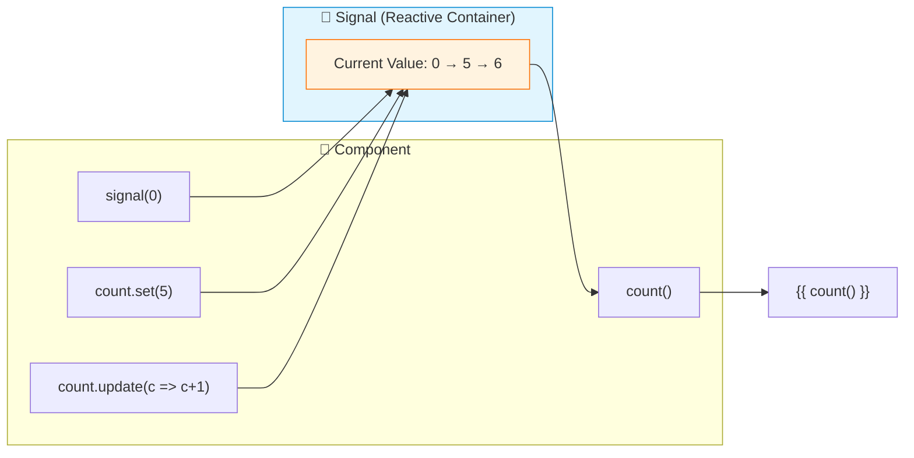
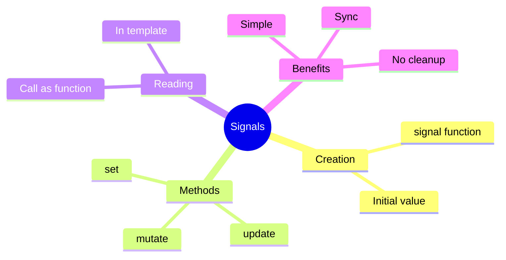

# 📡 Use Case 1: Basic Signals

> **💡 Lightbulb Moment**: Signals are reactive primitives that notify consumers when their value changes - no subscriptions needed!

---

## 1. 🔍 What are Signals?

A wrapper around a value that notifies interested consumers when that value changes.

```typescript
import { signal } from '@angular/core';

// Create a signal
const count = signal(0);

// Read value
console.log(count());  // 0

// Update value
count.set(5);
count.update(c => c + 1);
```

---

## 2. 🚀 Signals vs Observables

| Aspect | Signal | Observable |
|--------|--------|------------|
| Value access | Synchronous | Async subscription |
| Syntax | `signal()` to read | `.subscribe()` |
| Memory | No cleanup needed | Must unsubscribe |
| Learning curve | Simple | Complex |

### 📊 Data Flow Diagram



### 📦 Data Flow Summary (Visual Box Diagram)

```
┌─────────────────────────────────────────────────────────────┐
│  COMPONENT                                                  │
│                                                             │
│   ① CREATE SIGNAL                                           │
│   ┌───────────────────────────────────────────────────────┐ │
│   │ count = signal(0);  ─────────────────────┐            │ │
│   │   // Writable signal with initial value  │            │ │
│   └──────────────────────────────────────────│────────────┘ │
│                                              │              │
│                                              ▼              │
│   ┌───────────────────────────────────────────────────────┐ │
│   │  📡 SIGNAL (Reactive Container)                       │ │
│   │  ┌─────────────────────────────────────────────────┐  │ │
│   │  │  value: 0 ──► 5 ──► 6                           │  │ │
│   │  │  (tracks current value, notifies on change)     │  │ │
│   │  └─────────────────────────────────────────────────┘  │ │
│   └───────────────────────────────────────────────────────┘ │
│       ▲           ▲           │                             │
│       │           │           │                             │
│   ② SET      ③ UPDATE     ④ READ                           │
│       │           │           │                             │
│   ┌───┴───┐   ┌───┴───┐   ┌───┴───┐                         │
│   │set(5) │   │update │   │count()│                         │
│   │Replace│   │(c=>c+1│   │Returns│                         │
│   │ value │   │Transform│  │ value │                        │
│   └───────┘   └───────┘   └───┬───┘                         │
│                               │                             │
│                               ▼                             │
│   ⑤ TEMPLATE BINDING                                        │
│   ┌───────────────────────────────────────────────────────┐ │
│   │ <span>{{ count() }}</span>  ← Auto-updates on change  │ │
│   └───────────────────────────────────────────────────────┘ │
└─────────────────────────────────────────────────────────────┘
```

**Signal Lifecycle:**
1. **Create**: `signal(0)` creates a reactive container with initial value
2. **Set**: `count.set(5)` replaces the entire value
3. **Update**: `count.update(c => c + 1)` transforms based on current value
4. **Read**: `count()` returns current value synchronously
5. **Template**: `{{ count() }}` auto-updates when signal changes

> **Key Takeaway**: Signals are synchronous reactive containers. Read with `()`, write with `set()` or `update()`. Angular automatically detects changes and updates the view!

---

## 3. ❓ Interview Questions

### Basic Questions

#### Q1: What problem do Signals solve?
**Answer:** Simpler reactivity without RxJS complexity:
- No subscriptions to manage
- Synchronous value access
- Automatic change detection
- Easier to learn

#### Q2: set() vs update() - when to use which?
**Answer:**
```typescript
count.set(10);           // Replace with new value
count.update(c => c + 1); // Transform based on current value
```

#### Q3: Do Signals replace Observables?
**Answer:** No! They complement each other:
- Signals: Synchronous, local state
- Observables: Async, streams, HTTP

---

### Scenario-Based Questions

#### Scenario: Counter Component
**Question:** Build a counter with Signals.

**Answer:**
```typescript
@Component({
    template: `
        <button (click)="decrement()">-</button>
        <span>{{ count() }}</span>
        <button (click)="increment()">+</button>
    `
})
export class CounterComponent {
    count = signal(0);
    
    increment() { this.count.update(c => c + 1); }
    decrement() { this.count.update(c => c - 1); }
}
```

---

## 📻 Walkie-Talkie Analogy (Easy to Remember!)

Think of Signals like **walkie-talkies**:

| Concept | Walkie-Talkie Analogy | Memory Trick |
|---------|----------------------|--------------| 
| **Signal** | 📻 **Walkie-talkie**: Holds current message, instantly readable | **"Current value holder"** |
| **signal()** | 📢 **Check message**: "What's the current message?" | **"Read now"** |
| **set()** | 📡 **New broadcast**: "Everyone, new message is X!" | **"Replace message"** |
| **update()** | 🔄 **Modify message**: "Add to current message..." | **"Transform current"** |
| **computed()** | 🔗 **Relay station**: Listens to others, broadcasts combined | **"Derived value"** |

### 📖 Story to Remember:

> 📻 **The Radio Station**
>
> Your component is a radio station broadcasting values:
>
> **Observable (old radio - complex):**
> ```typescript
> temperature$.subscribe(t => console.log(t));  // Must tune in
> // Don't forget to unsubscribe!!!
> // Complex RxJS operators needed
> ```
>
> **Signal (walkie-talkie - simple):**
> ```typescript
> const temperature = signal(72);
> 
> console.log(temperature());     // 📻 Just check it: 72
> temperature.set(75);            // 📡 Broadcast new value
> temperature.update(t => t + 1); // 🔄 Modify: 76
> // No cleanup needed! ✅
> ```
>
> **Signals are simpler: just call to read, set to write, done!**

### 🎯 Quick Reference:
```
📻 signal(value)  = Create walkie-talkie with initial message
📢 signal()       = Read current message
📡 set(newValue)  = Broadcast new message
🔄 update(fn)     = Transform current message
🔗 computed()     = Combine signals automatically
```

---

## 🧠 Mind Map


