# 📡 Use Case 1: Basic Signals

> **💡 Lightbulb Moment**: Signals are reactive primitives that notify consumers when their value changes - no subscriptions needed!


---

## 1. 🔍 What are Signals?

A wrapper around a value that notifies interested consumers when that value changes.

```typescript
import { signal } from '@angular/core';

// Create a signal
const count = signal(0);

// Read value
console.log(count());  // 0

// Update value
count.set(5);
count.update(c => c + 1);
```

---

## 2. 🚀 Signals vs Observables

| Aspect | Signal | Observable |
|--------|--------|------------|
| Value access | Synchronous | Async subscription |
| Syntax | `signal()` to read | `.subscribe()` |
| Memory | No cleanup needed | Must unsubscribe |
| Learning curve | Simple | Complex |

### 📊 Data Flow Diagram

```mermaid
flowchart LR
    subgraph Component["🎯 Component"]
        Create["signal(0)"]
        Read["count()"]
        Set["count.set(5)"]
        Update["count.update(c => c+1)"]
    end
    
    subgraph Signal["📡 Signal (Reactive Container)"]
        Value["Current Value: 0 → 5 → 6"]
    end
    
    Create --> Value
    Set --> Value
    Update --> Value
    Value --> Read
    Read --> Template["{{ count() }}"]
    
    style Signal fill:#e1f5fe,stroke:#0288d1
    style Value fill:#fff3e0,stroke:#ff6f00
```



### 📦 Data Flow Summary (Visual Box Diagram)

```
┌─────────────────────────────────────────────────────────────┐
│  COMPONENT                                                  │
│                                                             │
│   ① CREATE SIGNAL                                           │
│   ┌───────────────────────────────────────────────────────┐ │
│   │ count = signal(0);  ─────────────────────┐            │ │
│   │   // Writable signal with initial value  │            │ │
│   └──────────────────────────────────────────│────────────┘ │
│                                              │              │
│                                              ▼              │
│   ┌───────────────────────────────────────────────────────┐ │
│   │  📡 SIGNAL (Reactive Container)                       │ │
│   │  ┌─────────────────────────────────────────────────┐  │ │
│   │  │  value: 0 ──► 5 ──► 6                           │  │ │
│   │  │  (tracks current value, notifies on change)     │  │ │
│   │  └─────────────────────────────────────────────────┘  │ │
│   └───────────────────────────────────────────────────────┘ │
│       ▲           ▲           │                             │
│       │           │           │                             │
│   ② SET      ③ UPDATE     ④ READ                           │
│       │           │           │                             │
│   ┌───┴───┐   ┌───┴───┐   ┌───┴───┐                         │
│   │set(5) │   │update │   │count()│                         │
│   │Replace│   │(c=>c+1│   │Returns│                         │
│   │ value │   │Transform│  │ value │                        │
│   └───────┘   └───────┘   └───┬───┘                         │
│                               │                             │
│                               ▼                             │
│   ⑤ TEMPLATE BINDING                                        │
│   ┌───────────────────────────────────────────────────────┐ │
│   │ <span>{{ count() }}</span>  ← Auto-updates on change  │ │
│   └───────────────────────────────────────────────────────┘ │
└─────────────────────────────────────────────────────────────┘
```

**Signal Lifecycle:**
1. **Create**: `signal(0)` creates a reactive container with initial value
2. **Set**: `count.set(5)` replaces the entire value
3. **Update**: `count.update(c => c + 1)` transforms based on current value
4. **Read**: `count()` returns current value synchronously
5. **Template**: `{{ count() }}` auto-updates when signal changes

> **Key Takeaway**: Signals are synchronous reactive containers. Read with `()`, write with `set()` or `update()`. Angular automatically detects changes and updates the view!

---

## 3. ❓ Interview Questions

### Basic Questions

#### Q1: What problem do Signals solve?
**Answer:** Simpler reactivity without RxJS complexity:
- No subscriptions to manage
- Synchronous value access
- Automatic change detection
- Easier to learn

#### Q2: set() vs update() - when to use which?
**Answer:**
```typescript
count.set(10);           // Replace with new value
count.update(c => c + 1); // Transform based on current value
```

#### Q3: Do Signals replace Observables?
**Answer:** No! They complement each other:
- Signals: Synchronous, local state
- Observables: Async, streams, HTTP

---

### Scenario-Based Questions

#### Scenario: Counter Component
**Question:** Build a counter with Signals.

**Answer:**
```typescript
@Component({
    template: `
        <button (click)="decrement()">-</button>
        <span>{{ count() }}</span>
        <button (click)="increment()">+</button>
    `
})
export class CounterComponent {
    count = signal(0);
    
    increment() { this.count.update(c => c + 1); }
    decrement() { this.count.update(c => c - 1); }
}
```

---

## 📻 Walkie-Talkie Analogy (Easy to Remember!)

Think of Signals like **walkie-talkies**:

| Concept | Walkie-Talkie Analogy | Memory Trick |
|---------|----------------------|--------------| 
| **Signal** | 📻 **Walkie-talkie**: Holds current message, instantly readable | **"Current value holder"** |
| **signal()** | 📢 **Check message**: "What's the current message?" | **"Read now"** |
| **set()** | 📡 **New broadcast**: "Everyone, new message is X!" | **"Replace message"** |
| **update()** | 🔄 **Modify message**: "Add to current message..." | **"Transform current"** |
| **computed()** | 🔗 **Relay station**: Listens to others, broadcasts combined | **"Derived value"** |

### 📖 Story to Remember:

> 📻 **The Radio Station**
>
> Your component is a radio station broadcasting values:
>
> **Observable (old radio - complex):**
> ```typescript
> temperature$.subscribe(t => console.log(t));  // Must tune in
> // Don't forget to unsubscribe!!!
> // Complex RxJS operators needed
> ```
>
> **Signal (walkie-talkie - simple):**
> ```typescript
> const temperature = signal(72);
> 
> console.log(temperature());     // 📻 Just check it: 72
> temperature.set(75);            // 📡 Broadcast new value
> temperature.update(t => t + 1); // 🔄 Modify: 76
> // No cleanup needed! ✅
> ```
>
> **Signals are simpler: just call to read, set to write, done!**

### 🎯 Quick Reference:
```
📻 signal(value)  = Create walkie-talkie with initial message
📢 signal()       = Read current message
📡 set(newValue)  = Broadcast new message
🔄 update(fn)     = Transform current message
🔗 computed()     = Combine signals automatically
```

---

## 🧠 Mind Map


---

## 🎯 What Problem Does This Solve?

### The Problem: Zone.js Change Detection Is Expensive

**How Angular Traditionally Works:**
```typescript
// Zone.js patches EVERY async operation
// Click events, setTimeout, HTTP calls, promises...

@Component({...})
export class OldComponent {
    count = 0;
    
    increment() {
        this.count++;  // Zone.js detects this
        // Angular checks ENTIRE component tree for changes!
    }
}
```

**Problems with Zone.js:**
1. **Performance overhead**: Patches every async API
2. **Full tree checking**: Any change checks all components
3. **Memory footprint**: Zone.js is ~100KB
4. **Hidden magic**: Hard to understand when/why things update

**RxJS Observables Are Complex:**
```typescript
// Observable approach - powerful but complex
@Component({...})
export class RxJSComponent implements OnInit, OnDestroy {
    count$!: BehaviorSubject<number>;
    private destroy$ = new Subject<void>();
    
    ngOnInit() {
        this.count$ = new BehaviorSubject(0);
        
        this.count$.pipe(
            takeUntil(this.destroy$)
        ).subscribe(count => {
            console.log(count);
        });
    }
    
    ngOnDestroy() {
        this.destroy$.next();
        this.destroy$.complete();  // Must cleanup!
    }
}
```

### How Signals Solve This

**With Signals (GOOD):**
```typescript
@Component({...})
export class SignalComponent {
    count = signal(0);  // That's it!
    
    increment() {
        this.count.update(c => c + 1);  // Fine-grained reactivity
        // Only THIS component updates, not entire tree
    }
}
// No OnDestroy needed, no subscriptions to manage
```

| Problem | Signal Solution |
|---------|----------------|
| Zone.js overhead | Signals enable zoneless change detection |
| Full tree checking | Fine-grained: only signal consumers update |
| Subscription management | No subscriptions, just call `signal()` |
| Complex operators | Simple `set()`, `update()`, `computed()` |
| Memory leaks | No cleanup needed, GC handles it |

---

## 📚 Key Classes & Types Explained

### 1. `signal<T>()` Function

```typescript
import { signal } from '@angular/core';

const count = signal(0);            // WritableSignal<number>
const name = signal('John');        // WritableSignal<string>
const user = signal<User | null>(null);  // Explicit type
```

**What it returns:** `WritableSignal<T>`

**Methods on WritableSignal:**

| Method | Purpose | Example |
|--------|---------|---------|
| `()` | Read value | `count()` returns `0` |
| `set(value)` | Replace value | `count.set(5)` |
| `update(fn)` | Transform value | `count.update(c => c + 1)` |
| `asReadonly()` | Get readonly version | `count.asReadonly()` |

---

### 2. `WritableSignal<T>` Type

```typescript
interface WritableSignal<T> extends Signal<T> {
    set(value: T): void;
    update(updateFn: (value: T) => T): void;
    asReadonly(): Signal<T>;
}
```

**When to use:** For state that the component owns and modifies.

---

### 3. `Signal<T>` Type (Readonly)

```typescript
interface Signal<T> {
    (): T;  // Call to read value
}
```

**When to use:** For signals exposed to other components (inputs, public API).

```typescript
@Component({...})
export class ParentComponent {
    private _count = signal(0);
    
    // Expose as readonly to children
    readonly count: Signal<number> = this._count.asReadonly();
}
```

---

### 4. `computed<T>()` Function

```typescript
import { computed } from '@angular/core';

const firstName = signal('John');
const lastName = signal('Doe');

// Derived signal - automatically updates when dependencies change
const fullName = computed(() => `${firstName()} ${lastName()}`);

console.log(fullName());  // "John Doe"
firstName.set('Jane');
console.log(fullName());  // "Jane Doe" - auto-updated!
```

**Key characteristics:**
- Read-only (can't set a computed)
- Memoized (cached until dependencies change)
- Lazy (only computes when read)

---

### 5. `effect()` Function

```typescript
import { effect } from '@angular/core';

const count = signal(0);

// Runs when signal changes
effect(() => {
    console.log('Count is now:', count());
    // This runs on initial + every change
});
```

**Use cases:**
- Logging/debugging
- Syncing with external systems
- Side effects (localStorage, analytics)

**IMPORTANT:** Effects must be created in injection context (constructor or field initializer).

---

## 🌍 Real-World Use Cases

### 1. Form State Management
```typescript
@Component({...})
export class LoginFormComponent {
    email = signal('');
    password = signal('');
    isSubmitting = signal(false);
    
    // Derived state
    isValid = computed(() => 
        this.email().includes('@') && 
        this.password().length >= 8
    );
    
    canSubmit = computed(() => 
        this.isValid() && !this.isSubmitting()
    );
    
    async submit() {
        this.isSubmitting.set(true);
        try {
            await this.authService.login(this.email(), this.password());
        } finally {
            this.isSubmitting.set(false);
        }
    }
}
```

### 2. Shopping Cart
```typescript
@Component({...})
export class CartComponent {
    items = signal<CartItem[]>([]);
    
    subtotal = computed(() => 
        this.items().reduce((sum, item) => sum + item.price * item.qty, 0)
    );
    
    tax = computed(() => this.subtotal() * 0.1);
    total = computed(() => this.subtotal() + this.tax());
    itemCount = computed(() => this.items().length);
    
    addItem(item: CartItem) {
        this.items.update(items => [...items, item]);
    }
    
    removeItem(id: string) {
        this.items.update(items => items.filter(i => i.id !== id));
    }
}
```

### 3. Theme Toggle with Persistence
```typescript
@Component({...})
export class ThemeService {
    theme = signal<'light' | 'dark'>(this.getStoredTheme());
    
    constructor() {
        // Persist to localStorage on change
        effect(() => {
            localStorage.setItem('theme', this.theme());
            document.body.className = this.theme();
        });
    }
    
    toggle() {
        this.theme.update(t => t === 'light' ? 'dark' : 'light');
    }
    
    private getStoredTheme(): 'light' | 'dark' {
        return localStorage.getItem('theme') as 'light' | 'dark' ?? 'light';
    }
}
```

### 4. Real-Time Search Filter
```typescript
@Component({...})
export class ProductListComponent {
    products = signal<Product[]>([]);
    searchTerm = signal('');
    sortBy = signal<'name' | 'price'>('name');
    
    filteredProducts = computed(() => {
        const term = this.searchTerm().toLowerCase();
        const sorted = [...this.products()]
            .filter(p => p.name.toLowerCase().includes(term))
            .sort((a, b) => 
                this.sortBy() === 'name' 
                    ? a.name.localeCompare(b.name)
                    : a.price - b.price
            );
        return sorted;
    });
}
```

### 5. Loading State Pattern
```typescript
@Component({...})
export class DataComponent {
    data = signal<User[] | null>(null);
    error = signal<string | null>(null);
    isLoading = signal(false);
    
    // Derived states
    hasData = computed(() => this.data() !== null);
    hasError = computed(() => this.error() !== null);
    isEmpty = computed(() => this.data()?.length === 0);
    
    async loadData() {
        this.isLoading.set(true);
        this.error.set(null);
        
        try {
            const users = await this.api.getUsers();
            this.data.set(users);
        } catch (e) {
            this.error.set(e.message);
        } finally {
            this.isLoading.set(false);
        }
    }
}
```

---

## ❓ Complete Interview Questions (20+)

### Basic Conceptual Questions

**Q1: What is a Signal in Angular?**
> A: A Signal is a reactive primitive that wraps a value and notifies consumers when that value changes. It's synchronous and doesn't require subscriptions.

**Q2: How do you read a signal's value?**
> A: Call it as a function: `const value = mySignal();`

**Q3: What's the difference between `set()` and `update()`?**
> A: 
> - `set(value)`: Replaces the signal's value completely
> - `update(fn)`: Transforms based on current value: `update(x => x + 1)`

**Q4: Do Signals replace Observables?**
> A: No! They complement each other:
> - Signals: Synchronous local state
> - Observables: Async streams, HTTP, events

**Q5: What is a computed signal?**
> A: A read-only signal that derives its value from other signals. It automatically updates when dependencies change.

---

### Lifecycle & Memory Questions

**Q6: Do Signals require cleanup in ngOnDestroy?**
> A: No! Unlike Observables, signals are garbage collected automatically. No unsubscribe needed.

**Q7: What is an effect and when should you use it?**
> A: An effect runs side effects when signals change. Use for:
> - Logging
> - Syncing to localStorage
> - External system updates
> - Analytics

**Q8: Where must effects be created?**
> A: In an injection context - typically in the constructor or as a field initializer. Not in ngOnInit or methods.

**Q9: Are computed signals lazy or eager?**
> A: Lazy! They only compute when read, and cache the result until dependencies change.

---

### Type System Questions

**Q10: What's the difference between `Signal<T>` and `WritableSignal<T>`?**
> A:
> - `Signal<T>`: Read-only, only has `()` method
> - `WritableSignal<T>`: Has `()`, `set()`, `update()`, `asReadonly()`

**Q11: How do you expose a signal as read-only?**
> A: Use `asReadonly()`:
> ```typescript
> private _count = signal(0);
> readonly count = this._count.asReadonly();
> ```

**Q12: How do you type a signal that can be null?**
> A: Explicit generic: `signal<User | null>(null)`

---

### Template Questions

**Q13: How do you use a signal in a template?**
> A: Call it: `{{ mySignal() }}` or `[value]="mySignal()"`

**Q14: Why use parentheses in templates for signals?**
> A: Signals are getter functions. The `()` calls the getter to retrieve the current value.

**Q15: How does Angular detect signal changes in templates?**
> A: Angular's change detection tracks which signals are read during template rendering. When those signals change, Angular knows to re-render only affected views.

---

### Scenario Questions

**Q16: Build a counter with increment/decrement using signals.**
> A:
> ```typescript
> count = signal(0);
> increment() { this.count.update(c => c + 1); }
> decrement() { this.count.update(c => c - 1); }
> ```

**Q17: How do you compute fullName from firstName and lastName signals?**
> A:
> ```typescript
> firstName = signal('John');
> lastName = signal('Doe');
> fullName = computed(() => `${this.firstName()} ${this.lastName()}`);
> ```

**Q18: How do you persist a signal to localStorage?**
> A:
> ```typescript
> theme = signal(localStorage.getItem('theme') ?? 'light');
> constructor() {
>     effect(() => localStorage.setItem('theme', this.theme()));
> }
> ```

**Q19: How do you handle array updates with signals?**
> A: Use `update()` with spread or array methods:
> ```typescript
> items = signal<Item[]>([]);
> add(item: Item) { this.items.update(arr => [...arr, item]); }
> remove(id: string) { this.items.update(arr => arr.filter(i => i.id !== id)); }
> ```

**Q20: How do you convert an Observable to a Signal?**
> A: Use `toSignal()` from `@angular/core/rxjs-interop`:
> ```typescript
> import { toSignal } from '@angular/core/rxjs-interop';
> data = toSignal(this.http.get<Data[]>('/api/data'));
> ```

---

### Advanced Questions

**Q21: What is the `toSignal()` function?**
> A: Converts an Observable to a Signal. Initial value is undefined unless `initialValue` option is provided.

**Q22: What is `toObservable()`?**
> A: Converts a Signal to an Observable for RxJS interop:
> ```typescript
> count$ = toObservable(this.count);
> ```

**Q23: Can you use signals with OnPush change detection?**
> A: Yes! Signals work perfectly with OnPush and are even more efficient - only affected bindings update.

**Q24: What is zoneless Angular and how do signals enable it?**
> A: Zoneless Angular removes Zone.js dependency. Signals provide fine-grained reactivity that tells Angular exactly what changed, eliminating need for Zone.js.

**Q25: How do signals compare to React useState?**
> A:
> - Similar: Both hold reactive state
> - Different: Signals are objects with methods, useState returns `[value, setter]` tuple
> - Signals: `count.set(5)`, React: `setCount(5)`

