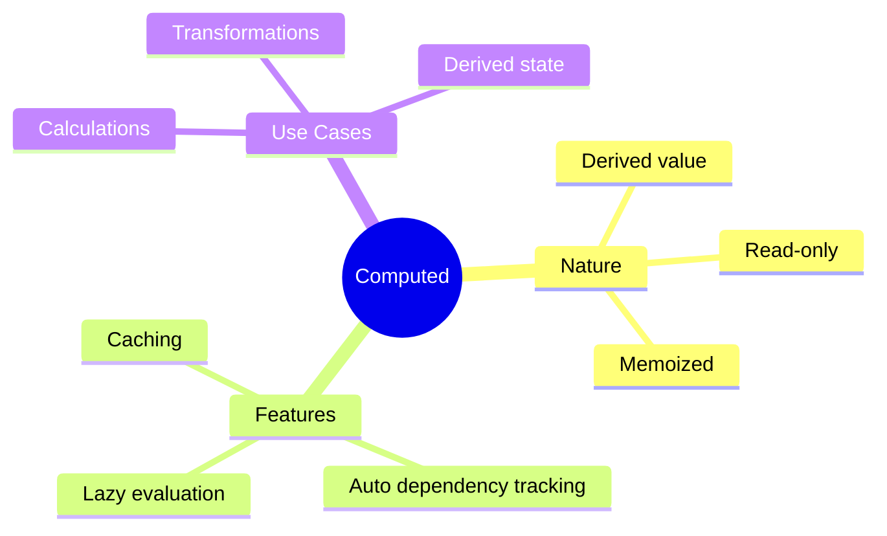

# 🧮 Use Case 2: Computed Signals

> **💡 Lightbulb Moment**: Computed signals automatically derive values from other signals - like reactive formulas!

---

## 1. 🔍 What are Computed Signals?

Read-only signals that derive their value from other signals.

```typescript
import { signal, computed } from '@angular/core';

const price = signal(100);
const quantity = signal(2);

// Computed automatically updates when price or quantity change!
const total = computed(() => price() * quantity());

console.log(total());  // 200
price.set(150);
console.log(total());  // 300 (automatically updated!)
```

---

## 2. 🚀 Key Characteristics

### Lazy Evaluation
```typescript
const expensive = computed(() => {
    console.log('Computing...');  // Only runs when accessed
    return signal1() + signal2();
});
// No log yet!
expensive();  // Now it runs: "Computing..."
```

### Memoization
```typescript
const result = computed(() => heavyCalculation(data()));
result();  // Calculates
result();  // Returns cached value (if dependencies unchanged)
```

---

## 3. ❓ Interview Questions

### Basic Questions

#### Q1: Can you modify a computed signal?
**Answer:** No! Computed signals are read-only:
```typescript
const doubleCount = computed(() => count() * 2);
doubleCount.set(10);  // ERROR! Not allowed
```

#### Q2: When does computed recalculate?
**Answer:** When any of its dependent signals change AND when the computed is read.

---

### Scenario-Based Questions

#### Scenario: Shopping Cart Total
**Question:** Calculate subtotal, tax, and total using computed.

**Answer:**
```typescript
items = signal<CartItem[]>([...]);
taxRate = signal(0.08);

subtotal = computed(() => 
    this.items().reduce((sum, i) => sum + i.price * i.qty, 0)
);

tax = computed(() => 
    this.subtotal() * this.taxRate()
);

total = computed(() => 
    this.subtotal() + this.tax()
);
```

---

## 📊 Spreadsheet Formula Analogy (Easy to Remember!)

Think of computed signals like **Excel formulas**:

| Concept | Spreadsheet Analogy | Memory Trick |
|---------|--------------------|--------------| 
| **signal()** | 📝 **Cell value**: A1 = 100, B1 = 2 | **"Input cell"** |
| **computed()** | 📐 **Formula cell**: C1 = A1 * B1 | **"Formula cell"** |
| **Auto-update** | 🔄 **Recalculate**: Change A1, C1 updates instantly | **"Live formula"** |
| **Read-only** | 🔒 **Formula = locked**: Can't type into C1 directly | **"Output only"** |
| **Memoization** | 💾 **Cached result**: Same inputs = skip recalc | **"Smart cache"** |

### 📖 Story to Remember:

> 📊 **The Smart Spreadsheet**
>
> You're building a spreadsheet with formulas:
>
> **Setting Up Cells:**
> ```typescript
> // A1: Price (editable cell)
> const price = signal(100);
>
> // B1: Quantity (editable cell)
> const quantity = signal(2);
>
> // C1: =A1*B1 (formula cell - AUTO-UPDATES!)
> const total = computed(() => price() * quantity());
> ```
>
> **How It Works:**
> ```
> Initial: price=100, quantity=2 → total=200
>
> User types in A1: price.set(150)
> → Spreadsheet recalculates: total=300 ✨
>
> User types in C1: total.set(999)
> → ERROR! Can't type into formula cell! 🔒
> ```
>
> **Computed = Excel formula. Changes inputs? Output auto-updates!**

### 🎯 Quick Reference:
```
📝 signal()     = Editable cell (input values)
📐 computed()   = Formula cell (derived values)
🔄 Dependencies = Cells used in formula
🔒 Read-only    = Can't directly modify formula cell
💾 Memoization  = Skip recalc if inputs unchanged
```

---

## 🧠 Mind Map


