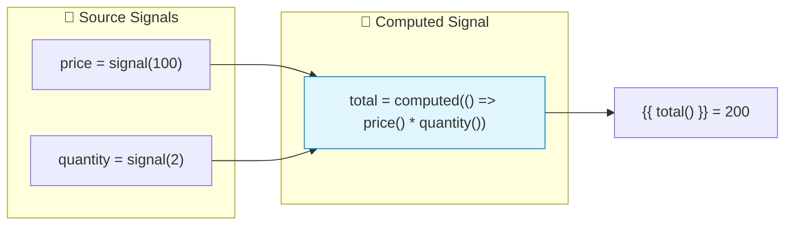
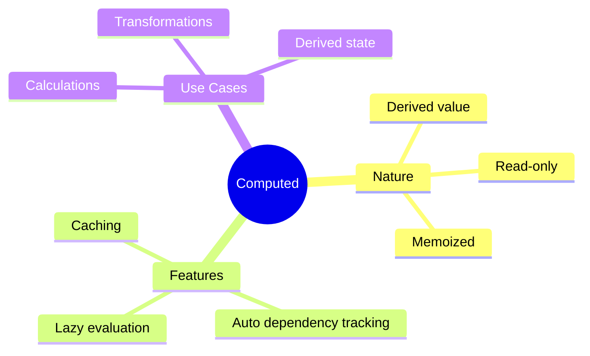

# 🧮 Use Case 2: Computed Signals

> **💡 Lightbulb Moment**: Computed signals automatically derive values from other signals - like reactive formulas!

---

## 1. 🔍 What are Computed Signals?

Read-only signals that derive their value from other signals.

```typescript
import { signal, computed } from '@angular/core';

const price = signal(100);
const quantity = signal(2);

// Computed automatically updates when price or quantity change!
const total = computed(() => price() * quantity());

console.log(total());  // 200
price.set(150);
console.log(total());  // 300 (automatically updated!)
```

---

## 2. 🚀 Key Characteristics

### Lazy Evaluation
```typescript
const expensive = computed(() => {
    console.log('Computing...');  // Only runs when accessed
    return signal1() + signal2();
});
// No log yet!
expensive();  // Now it runs: "Computing..."
```

### Memoization
```typescript
const result = computed(() => heavyCalculation(data()));
result();  // Calculates
result();  // Returns cached value (if dependencies unchanged)
```

### 📊 Data Flow Diagram



### 📦 Data Flow Summary (Visual Box Diagram)

```
┌─────────────────────────────────────────────────────────────┐
│  COMPONENT                                                  │
│                                                             │
│   ① SOURCE SIGNALS (Editable)                               │
│   ┌───────────────────────────────────────────────────────┐ │
│   │ price = signal(100);     quantity = signal(2);        │ │
│   │      │                         │                      │ │
│   └──────│─────────────────────────│──────────────────────┘ │
│          │                         │                        │
│          └────────────┬────────────┘                        │
│                       │                                     │
│                       ▼                                     │
│   ② COMPUTED SIGNAL (Formula Cell - Read-Only)              │
│   ┌───────────────────────────────────────────────────────┐ │
│   │ total = computed(() => price() * quantity());         │ │
│   │                                                       │ │
│   │  ┌─────────────────────────────────────────────────┐  │ │
│   │  │  📐 Derived Value: 100 × 2 = 200                │  │ │
│   │  │  (Auto-recalculates when dependencies change)   │  │ │
│   │  └─────────────────────────────────────────────────┘  │ │
│   │                                                       │ │
│   │  ❌ total.set(999);  // ERROR! Read-only              │ │
│   └───────────────────────────────────────────────────────┘ │
│                       │                                     │
│                       ▼                                     │
│   ③ TEMPLATE (Auto-Updates)                                 │
│   ┌───────────────────────────────────────────────────────┐ │
│   │ <span>Total: {{ total() }}</span>  ← Shows: 200       │ │
│   └───────────────────────────────────────────────────────┘ │
│                                                             │
│   ④ CHANGE PROPAGATION                                      │
│   ┌───────────────────────────────────────────────────────┐ │
│   │ price.set(150);  // Change source                     │ │
│   │      ↓                                                │ │
│   │ total() auto-updates to 150 × 2 = 300                 │ │
│   │      ↓                                                │ │
│   │ Template shows: 300 (automatic!)                      │ │
│   └───────────────────────────────────────────────────────┘ │
└─────────────────────────────────────────────────────────────┘
```

**Computed Signal Flow:**
1. **Source signals** hold editable values (`price`, `quantity`)
2. **Computed signal** defines a formula referencing source signals
3. **Auto-dependency tracking**: Angular tracks which signals are read
4. **Memoization**: Value cached until dependencies change
5. **Read-only**: Computed signals CANNOT be set directly

> **Key Takeaway**: `computed()` is like an Excel formula cell - it automatically updates when its dependencies change, but you can't type into it directly!

---

## 3. ❓ Interview Questions

### Basic Questions

#### Q1: Can you modify a computed signal?
**Answer:** No! Computed signals are read-only:
```typescript
const doubleCount = computed(() => count() * 2);
doubleCount.set(10);  // ERROR! Not allowed
```

#### Q2: When does computed recalculate?
**Answer:** When any of its dependent signals change AND when the computed is read.

---

### Scenario-Based Questions

#### Scenario: Shopping Cart Total
**Question:** Calculate subtotal, tax, and total using computed.

**Answer:**
```typescript
items = signal<CartItem[]>([...]);
taxRate = signal(0.08);

subtotal = computed(() => 
    this.items().reduce((sum, i) => sum + i.price * i.qty, 0)
);

tax = computed(() => 
    this.subtotal() * this.taxRate()
);

total = computed(() => 
    this.subtotal() + this.tax()
);
```

---

## 📊 Spreadsheet Formula Analogy (Easy to Remember!)

Think of computed signals like **Excel formulas**:

| Concept | Spreadsheet Analogy | Memory Trick |
|---------|--------------------|--------------| 
| **signal()** | 📝 **Cell value**: A1 = 100, B1 = 2 | **"Input cell"** |
| **computed()** | 📐 **Formula cell**: C1 = A1 * B1 | **"Formula cell"** |
| **Auto-update** | 🔄 **Recalculate**: Change A1, C1 updates instantly | **"Live formula"** |
| **Read-only** | 🔒 **Formula = locked**: Can't type into C1 directly | **"Output only"** |
| **Memoization** | 💾 **Cached result**: Same inputs = skip recalc | **"Smart cache"** |

### 📖 Story to Remember:

> 📊 **The Smart Spreadsheet**
>
> You're building a spreadsheet with formulas:
>
> **Setting Up Cells:**
> ```typescript
> // A1: Price (editable cell)
> const price = signal(100);
>
> // B1: Quantity (editable cell)
> const quantity = signal(2);
>
> // C1: =A1*B1 (formula cell - AUTO-UPDATES!)
> const total = computed(() => price() * quantity());
> ```
>
> **How It Works:**
> ```
> Initial: price=100, quantity=2 → total=200
>
> User types in A1: price.set(150)
> → Spreadsheet recalculates: total=300 ✨
>
> User types in C1: total.set(999)
> → ERROR! Can't type into formula cell! 🔒
> ```
>
> **Computed = Excel formula. Changes inputs? Output auto-updates!**

### 🎯 Quick Reference:
```
📝 signal()     = Editable cell (input values)
📐 computed()   = Formula cell (derived values)
🔄 Dependencies = Cells used in formula
🔒 Read-only    = Can't directly modify formula cell
💾 Memoization  = Skip recalc if inputs unchanged
```

---

## 🧠 Mind Map



---

## 🎯 What Problem Does This Solve?

### The Problem: Derived State Gets Out of Sync

**Without Computed Signals (BAD):**
```typescript
@Component({...})
export class BadComponent {
    firstName = 'John';
    lastName = 'Doe';
    fullName = 'John Doe';  // Manually synced!
    
    updateFirstName(name: string) {
        this.firstName = name;
        this.fullName = `${this.firstName} ${this.lastName}`;  // Easy to forget!
    }
    
    updateLastName(name: string) {
        this.lastName = name;
        // Oops! Forgot to update fullName - now it's out of sync!
    }
}
```

**Problems:**
1. **Manual synchronization**: Must remember to update derived values
2. **Bug-prone**: Easy to forget one update path
3. **Duplicate logic**: Same calculation in multiple places
4. **Performance**: May recalculate unnecessarily

### How Computed Signals Solve This

**With Computed Signals (GOOD):**
```typescript
@Component({...})
export class GoodComponent {
    firstName = signal('John');
    lastName = signal('Doe');
    
    // Automatically updates! Can't get out of sync!
    fullName = computed(() => `${this.firstName()} ${this.lastName()}`);
    
    // No need to manually update fullName - it's automatic!
}
```

| Problem | Computed Solution |
|---------|------------------|
| Manual sync | **Auto-updates**: computed recalculates on dependency change |
| Forgetting updates | **Impossible**: computed always reflects current state |
| Duplicate logic | **Single definition**: formula in one place |
| Unnecessary recalc | **Memoization**: caches until dependencies change |
| Complex chains | **Composable**: computed can use other computed |

---

## 📚 Key Classes & Types Explained

### 1. `computed<T>()` Function

```typescript
import { computed } from '@angular/core';

const total = computed(() => price() * quantity());
```

**What it returns:** `Signal<T>` (read-only signal)

**Parameters:**
- **Computation function**: `() => T` - function that returns derived value

**Characteristics:**
- **Read-only**: No `set()` or `update()` methods
- **Lazy**: Only computes when read
- **Memoized**: Caches result until dependencies change
- **Auto-tracking**: Automatically knows which signals to watch

---

### 2. Computation Function

```typescript
const fullName = computed(() => {
    // Everything accessed here is auto-tracked
    const first = firstName();  // Tracked!
    const last = lastName();    // Tracked!
    return `${first} ${last}`;
});
```

**Rules:**
- Must be a PURE function (no side effects)
- Can call other signals/computed
- Runs during first read and when dependencies change
- Should be deterministic

---

### 3. Dependency Graph

```typescript
const a = signal(1);
const b = signal(2);
const c = computed(() => a() + b());  // Depends on a, b
const d = computed(() => c() * 2);    // Depends on c (indirectly on a, b)

a.set(5);  // Invalidates c, which invalidates d
```

**How it works:**
- Angular builds a dependency graph automatically
- When a signal changes, only dependent computeds are invalidated
- Lazy: They compute only when read, not immediately

---

## 🌍 Real-World Use Cases

### 1. Shopping Cart Totals
```typescript
items = signal<CartItem[]>([]);
subtotal = computed(() => 
    this.items().reduce((sum, i) => sum + i.price * i.qty, 0)
);
tax = computed(() => this.subtotal() * 0.08);
shipping = computed(() => this.subtotal() > 50 ? 0 : 5.99);
total = computed(() => this.subtotal() + this.tax() + this.shipping());
```

### 2. Form Validation
```typescript
email = signal('');
password = signal('');
confirmPassword = signal('');

isEmailValid = computed(() => this.email().includes('@'));
isPasswordValid = computed(() => this.password().length >= 8);
passwordsMatch = computed(() => this.password() === this.confirmPassword());
isFormValid = computed(() => 
    this.isEmailValid() && this.isPasswordValid() && this.passwordsMatch()
);
```

### 3. Filtered & Sorted Lists
```typescript
products = signal<Product[]>([]);
searchTerm = signal('');
sortBy = signal<'name' | 'price'>('name');

filteredProducts = computed(() => {
    const term = this.searchTerm().toLowerCase();
    return this.products()
        .filter(p => p.name.toLowerCase().includes(term))
        .sort((a, b) => 
            this.sortBy() === 'name' 
                ? a.name.localeCompare(b.name) 
                : a.price - b.price
        );
});
```

### 4. UI State Derivation
```typescript
items = signal<Item[]>([]);
selectedIds = signal<Set<string>>(new Set());

selectedItems = computed(() => 
    this.items().filter(i => this.selectedIds().has(i.id))
);
allSelected = computed(() => 
    this.items().length > 0 && 
    this.items().every(i => this.selectedIds().has(i.id))
);
hasSelection = computed(() => this.selectedIds().size > 0);
```

### 5. Chained Computations
```typescript
basePrice = signal(100);
discountPercent = signal(10);

// Chain of computeds
discountAmount = computed(() => 
    this.basePrice() * (this.discountPercent() / 100)
);
priceAfterDiscount = computed(() => 
    this.basePrice() - this.discountAmount()
);
tax = computed(() => this.priceAfterDiscount() * 0.08);
finalPrice = computed(() => this.priceAfterDiscount() + this.tax());
```

---

## ❓ Complete Interview Questions (20+)

### Basic Conceptual Questions

**Q1: What is a computed signal?**
> A: A read-only signal that derives its value from other signals and automatically updates when dependencies change.

**Q2: Can you set() a computed signal?**
> A: No! Computed signals are read-only. You can only read their value with `()`.

**Q3: What is memoization in computed signals?**
> A: Computed signals cache their result. If dependencies haven't changed, reading returns the cached value without recomputing.

**Q4: Are computed signals lazy or eager?**
> A: Lazy! They only compute when actually read, not when dependencies change.

**Q5: How does Angular know which signals to track?**
> A: Auto-tracking: Angular records which signals are read during the computation function execution.

---

### Behavior Questions

**Q6: What happens when you read a computed signal twice?**
> A: First read computes and caches. Second read returns cached value (assuming dependencies unchanged).

**Q7: When does a computed signal recompute?**
> A: When it's read AND at least one dependency has changed since last computation.

**Q8: Can a computed depend on another computed?**
> A: Yes! Computed signals can form chains. Changes propagate through the chain.

**Q9: What if the computation function has a bug?**
> A: The error propagates when reading. The computed will try again next time.

---

### Comparison Questions

**Q10: computed() vs effect() - when to use each?**
> A: 
> - `computed()`: Derive a VALUE from signals (pure, return value)
> - `effect()`: Run SIDE EFFECTS when signals change (impure, no return)

**Q11: Computed signals vs RxJS combineLatest?**
> A: Similar purpose, different style:
> - Computed: Synchronous, simpler
> - combineLatest: Async, requires subscribe

**Q12: Computed vs getter property?**
> A: 
> - Getter: Recalculates on every access
> - Computed: Caches, only recalculates when dependencies change

---

### Scenario Questions

**Q13: Implement a full name from first and last name signals.**
> A:
> ```typescript
> firstName = signal('John');
> lastName = signal('Doe');
> fullName = computed(() => `${this.firstName()} ${this.lastName()}`);
> ```

**Q14: Calculate total price with tax for a cart.**
> A:
> ```typescript
> items = signal<CartItem[]>([]);
> subtotal = computed(() => this.items().reduce((s, i) => s + i.price, 0));
> total = computed(() => this.subtotal() * 1.1);  // 10% tax
> ```

**Q15: Create a search filter that updates when query changes.**
> A:
> ```typescript
> query = signal('');
> data = signal<Item[]>([]);
> filtered = computed(() => 
>     this.data().filter(d => d.name.includes(this.query()))
> );
> ```

**Q16: Show if form is valid based on multiple field signals.**
> A:
> ```typescript
> email = signal('');
> password = signal('');
> isValid = computed(() => 
>     this.email().includes('@') && this.password().length >= 8
> );
> ```

---

### Advanced Questions

**Q17: Can you read a signal conditionally in computed?**
> A: Yes, but be careful - only signals actually read are tracked:
> ```typescript
> // flag() is always tracked
> // value() is only tracked when flag is true
> result = computed(() => flag() ? value() : 'default');
> ```

**Q18: How do you handle expensive computations?**
> A: Computed's memoization helps! Also consider:
> - Breaking into smaller computeds
> - Using computed for filtering before expensive operations

**Q19: Can computed signals cause infinite loops?**
> A: Yes, if computed A reads computed B which reads computed A. Avoid circular dependencies.

**Q20: How do computed signals work with OnPush?**
> A: Perfectly! Computed signals trigger change detection only when needed.

---

### Debug & Performance Questions

**Q21: How do you debug which signals a computed depends on?**
> A: Log in computation function or use Angular DevTools:
> ```typescript
> fullName = computed(() => {
>     console.log('Computing fullName...');
>     return `${firstName()} ${lastName()}`;
> });
> ```

**Q22: What if computed doesn't update when expected?**
> A: Check:
> - Is the dependency actually a signal?
> - Are you mutating the signal's value instead of replacing?
> - Is the signal read inside the computation function?

**Q23: How do computed signals affect performance?**
> A: Positively! Memoization prevents unnecessary recalculations. Only affected computeds update.

**Q24: Can you use computed in services?**
> A: Yes! Computed works anywhere signals work.

**Q25: What's the glitch-free guarantee?**
> A: Computed signals never show intermediate "glitchy" states. They always reflect a consistent snapshot of their dependencies.

