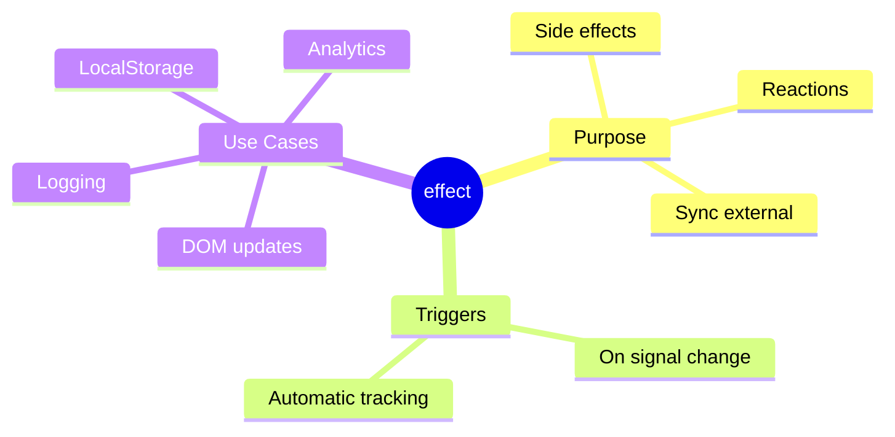

# ⚡ Use Case 3: Effect

> **💡 Lightbulb Moment**: Effects automatically run side effects when their tracked signals change!

---

## 1. 🔍 What is effect()?

Runs a callback whenever any signal it reads changes.

```typescript
import { signal, effect } from '@angular/core';

const name = signal('John');

effect(() => {
    console.log(`Name changed to: ${name()}`);
});

name.set('Jane');  // Logs: "Name changed to: Jane"
```

---

## 2. 🚀 Common Use Cases

### Logging/Analytics
```typescript
effect(() => {
    console.log('User:', this.user());
    analytics.track('user_changed', this.user());
});
```

### LocalStorage Sync
```typescript
effect(() => {
    localStorage.setItem('settings', JSON.stringify(this.settings()));
});
```

### DOM Manipulation
```typescript
effect(() => {
    document.title = `${this.unreadCount()} messages`;
});
```

---

## 3. ❓ Interview Questions

### Basic Questions

#### Q1: effect() vs computed() - what's the difference?
**Answer:**
| computed | effect |
|----------|--------|
| Returns value | No return value |
| For derived data | For side effects |
| Lazy | Eager |
| Pure | Has side effects |

#### Q2: Can you use effect() outside components?
**Answer:** Yes, but you need an injection context:
```typescript
constructor() {
    effect(() => { ... });  // Works - has injection context
}
```

---

### Scenario-Based Questions

#### Scenario: Auto-save Form
**Question:** Auto-save form data when it changes.

**Answer:**
```typescript
formData = signal({ name: '', email: '' });

constructor() {
    effect(() => {
        this.autoSave(this.formData());
    });
}
```

---

## 🚨 Motion Sensor Analogy (Easy to Remember!)

Think of effect() like a **motion sensor light**:

| Concept | Sensor Analogy | Memory Trick |
|---------|---------------|--------------| 
| **effect()** | 🚨 **Motion sensor**: Watches and reacts | **"Auto-reaction"** |
| **Signal** | 🚶 **Motion**: Something changes (movement) | **"The trigger"** |
| **Callback** | 💡 **Light turns on**: Automatic reaction | **"Side effect"** |
| **Auto-tracking** | 👁️ **Smart sensor**: Knows what to watch | **"No manual setup"** |
| **No return** | 🔇 **Just light**: Doesn't produce anything | **"Action only"** |

### 📖 Story to Remember:

> 🚨 **The Smart Home System**
>
> Your app is a smart home with motion sensors:
>
> **Setting up the sensor:**
> ```typescript
> name = signal('John');
>
> constructor() {
>   // 🚨 Install motion sensor
>   effect(() => {
>     // 💡 Light turns on when motion detected
>     console.log(`Hello ${this.name()}!`);
>   });
> }
> ```
>
> **How it works:**
> ```
> name.set('Jane');  // 🚶 Motion detected!
>                    // 💡 Log: "Hello Jane!"
> 
> name.set('Bob');   // 🚶 More motion!
>                    // 💡 Log: "Hello Bob!"
> ```
>
> **Sensor automatically knows WHAT to watch. No wiring needed!**

### 🎯 Quick Reference:
```
🚨 effect()      = Motion sensor (watches & reacts)
🚶 signal()      = Movement (triggers reaction)
💡 callback      = Light (the side effect)
👁️ Auto-track   = Knows what to watch
🔇 No return     = Action only, no value produced
```

---

## 🧠 Mind Map


