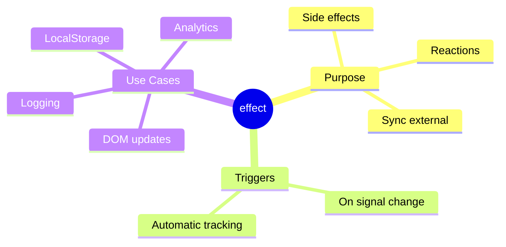

# ⚡ Use Case 3: Effect

> **💡 Lightbulb Moment**: Effects automatically run side effects when their tracked signals change!

---

## 1. 🔍 What is effect()?

Runs a callback whenever any signal it reads changes.

```typescript
import { signal, effect } from '@angular/core';

const name = signal('John');

effect(() => {
    console.log(`Name changed to: ${name()}`);
});

name.set('Jane');  // Logs: "Name changed to: Jane"
```

---

## 2. 🚀 Common Use Cases

### Logging/Analytics
```typescript
effect(() => {
    console.log('User:', this.user());
    analytics.track('user_changed', this.user());
});
```

### LocalStorage Sync
```typescript
effect(() => {
    localStorage.setItem('settings', JSON.stringify(this.settings()));
});
```

### DOM Manipulation
```typescript
effect(() => {
    document.title = `${this.unreadCount()} messages`;
});
```

---

## 3. ❓ Interview Questions

### Basic Questions

#### Q1: effect() vs computed() - what's the difference?
**Answer:**
| computed | effect |
|----------|--------|
| Returns value | No return value |
| For derived data | For side effects |
| Lazy | Eager |
| Pure | Has side effects |

#### Q2: Can you use effect() outside components?
**Answer:** Yes, but you need an injection context:
```typescript
constructor() {
    effect(() => { ... });  // Works - has injection context
}
```

---

### Scenario-Based Questions

#### Scenario: Auto-save Form
**Question:** Auto-save form data when it changes.

**Answer:**
```typescript
formData = signal({ name: '', email: '' });

constructor() {
    effect(() => {
        this.autoSave(this.formData());
    });
}
```

---

## 🧠 Mind Map


