# ⚡ Use Case 3: Effect

> **💡 Lightbulb Moment**: Effects automatically run side effects when their tracked signals change!


---

## 1. 🔍 What is effect()?

Runs a callback whenever any signal it reads changes.

```typescript
import { signal, effect } from '@angular/core';

const name = signal('John');

effect(() => {
    console.log(`Name changed to: ${name()}`);
});

name.set('Jane');  // Logs: "Name changed to: Jane"
```

---

## 2. 🚀 Common Use Cases

### Logging/Analytics
```typescript
effect(() => {
    console.log('User:', this.user());
    analytics.track('user_changed', this.user());
});
```

### LocalStorage Sync
```typescript
effect(() => {
    localStorage.setItem('settings', JSON.stringify(this.settings()));
});
```

### DOM Manipulation
```typescript
effect(() => {
    document.title = `${this.unreadCount()} messages`;
});
```

### 📊 Data Flow Diagram

```mermaid
flowchart LR
    subgraph Signal["📡 Signal"]
        Value["name = signal('John')"]
    end
    
    subgraph Effect["🚨 Effect (Motion Sensor)"]
        Watch["effect(() => console.log(name()))"]
    end
    
    subgraph SideEffect["💡 Side Effect"]
        Log["Console: 'John'"]
    end
    
    Value --> Watch
    Watch --> Log
    
    style Effect fill:#fff3e0,stroke:#ff6f00
```



### 📦 Data Flow Summary (Visual Box Diagram)

```
┌─────────────────────────────────────────────────────────────┐
│  COMPONENT                                                  │
│                                                             │
│   ① CREATE SIGNAL                                           │
│   ┌───────────────────────────────────────────────────────┐ │
│   │ name = signal('John');                                │ │
│   └───────────────────────────────────────────────────────┘ │
│          │                                                  │
│          ▼                                                  │
│   ② REGISTER EFFECT (in constructor)                        │
│   ┌───────────────────────────────────────────────────────┐ │
│   │ effect(() => {                                        │ │
│   │   // 🚨 This callback runs automatically when         │ │
│   │   // any signal it READS changes                      │ │
│   │   console.log(`Hello ${this.name()}!`);               │ │
│   │ });                    │                              │ │
│   │                        │                              │ │
│   │  Angular auto-tracks: "This effect reads name()"      │ │
│   └────────────────────────│──────────────────────────────┘ │
│                            │                                │
│                            ▼                                │
│   ③ SIDE EFFECT EXECUTES                                    │
│   ┌───────────────────────────────────────────────────────┐ │
│   │ Console: "Hello John!"  (runs immediately on setup)   │ │
│   └───────────────────────────────────────────────────────┘ │
│                                                             │
│   ④ SIGNAL CHANGES                                          │
│   ┌───────────────────────────────────────────────────────┐ │
│   │ name.set('Jane');  // 🚶 "Motion detected!"           │ │
│   │      ↓                                                │ │
│   │ Effect automatically re-runs                          │ │
│   │      ↓                                                │ │
│   │ Console: "Hello Jane!"  💡                            │ │
│   └───────────────────────────────────────────────────────┘ │
│                                                             │
│   ⚠️ KEY DIFFERENCES FROM computed():                       │
│   ┌───────────────────────────────────────────────────────┐ │
│   │ • effect() has NO return value (side effects only)    │ │
│   │ • effect() runs EAGERLY (not lazy like computed)      │ │
│   │ • effect() is for: logging, API calls, localStorage   │ │
│   └───────────────────────────────────────────────────────┘ │
└─────────────────────────────────────────────────────────────┘
```

**Effect Lifecycle:**
1. **Register** effect in constructor (needs injection context)
2. **Auto-track** dependencies: Angular sees which signals are read
3. **Run immediately** on registration
4. **Re-run automatically** whenever tracked signals change
5. **Cleanup** automatically on component destroy

> **Key Takeaway**: `effect()` is a motion sensor - it watches signals and reacts. Use for side effects (logging, localStorage, DOM), NOT for derived values (use `computed()` for that)!

---

## 3. ❓ Interview Questions

### Basic Questions

#### Q1: effect() vs computed() - what's the difference?
**Answer:**
| computed | effect |
|----------|--------|
| Returns value | No return value |
| For derived data | For side effects |
| Lazy | Eager |
| Pure | Has side effects |

#### Q2: Can you use effect() outside components?
**Answer:** Yes, but you need an injection context:
```typescript
constructor() {
    effect(() => { ... });  // Works - has injection context
}
```

---

### Scenario-Based Questions

#### Scenario: Auto-save Form
**Question:** Auto-save form data when it changes.

**Answer:**
```typescript
formData = signal({ name: '', email: '' });

constructor() {
    effect(() => {
        this.autoSave(this.formData());
    });
}
```

---

## 🚨 Motion Sensor Analogy (Easy to Remember!)

Think of effect() like a **motion sensor light**:

| Concept | Sensor Analogy | Memory Trick |
|---------|---------------|--------------| 
| **effect()** | 🚨 **Motion sensor**: Watches and reacts | **"Auto-reaction"** |
| **Signal** | 🚶 **Motion**: Something changes (movement) | **"The trigger"** |
| **Callback** | 💡 **Light turns on**: Automatic reaction | **"Side effect"** |
| **Auto-tracking** | 👁️ **Smart sensor**: Knows what to watch | **"No manual setup"** |
| **No return** | 🔇 **Just light**: Doesn't produce anything | **"Action only"** |

### 📖 Story to Remember:

> 🚨 **The Smart Home System**
>
> Your app is a smart home with motion sensors:
>
> **Setting up the sensor:**
> ```typescript
> name = signal('John');
>
> constructor() {
>   // 🚨 Install motion sensor
>   effect(() => {
>     // 💡 Light turns on when motion detected
>     console.log(`Hello ${this.name()}!`);
>   });
> }
> ```
>
> **How it works:**
> ```
> name.set('Jane');  // 🚶 Motion detected!
>                    // 💡 Log: "Hello Jane!"
> 
> name.set('Bob');   // 🚶 More motion!
>                    // 💡 Log: "Hello Bob!"
> ```
>
> **Sensor automatically knows WHAT to watch. No wiring needed!**

### 🎯 Quick Reference:
```
🚨 effect()      = Motion sensor (watches & reacts)
🚶 signal()      = Movement (triggers reaction)
💡 callback      = Light (the side effect)
👁️ Auto-track   = Knows what to watch
🔇 No return     = Action only, no value produced
```

---

## 🧠 Mind Map


---

## 🎯 What Problem Does This Solve?

### The Problem: Reacting to Changes Requires Manual Wiring

**Without Effects (BAD):**
```typescript
@Component({...})
export class BadComponent {
    theme = 'light';
    
    setTheme(t: string) {
        this.theme = t;
        
        // Must manually call all reactions
        localStorage.setItem('theme', t);
        document.body.className = t;
        analytics.track('theme_changed', t);
        
        // What if we add more reactions later? Easy to forget!
    }
    
    // Somewhere else that also changes theme...
    toggleTheme() {
        this.theme = this.theme === 'light' ? 'dark' : 'light';
        // Oops! Forgot to update localStorage!
    }
}
```

**Problems:**
1. **Scattered side effects**: Must remember to call everywhere
2. **Easy to forget**: New change paths miss reactions
3. **No centralization**: Same logic duplicated
4. **Manual dependency tracking**: Must know what reacts to what

### How Effects Solve This

**With Effects (GOOD):**
```typescript
@Component({...})
export class GoodComponent {
    theme = signal('light');
    
    constructor() {
        // Define reaction ONCE - runs automatically on ANY change!
        effect(() => {
            localStorage.setItem('theme', this.theme());
            document.body.className = this.theme();
            analytics.track('theme_changed', this.theme());
        });
    }
    
    setTheme(t: string) {
        this.theme.set(t);  // Effect auto-runs!
    }
    
    toggleTheme() {
        this.theme.update(t => t === 'light' ? 'dark' : 'light');  // Effect auto-runs!
    }
}
```

| Problem | Effect Solution |
|---------|----------------|
| Scattered side effects | **Centralized**: Define once, runs on all changes |
| Forgotten updates | **Automatic**: Effect runs whenever signal changes |
| Duplicate logic | **Single source**: One effect definition |
| Manual tracking | **Auto-tracking**: Angular knows dependencies |

---

## 📚 Key Classes & Types Explained

### 1. `effect()` Function

```typescript
import { effect } from '@angular/core';

effect(() => {
    console.log('Count is now:', count());
});
```

**What it returns:** `EffectRef` (handle to control the effect)

**When it runs:**
- Once immediately when created
- Again whenever tracked signals change

**Requirements:**
- Must be created in an injection context (constructor, field initializer)
- Cannot return a value (side effects only)

---

### 2. `EffectRef` Type

```typescript
const ref = effect(() => {
    console.log('Running');
});

// Later...
ref.destroy();  // Stop the effect
```

**Methods:**

| Method | Purpose |
|--------|---------|
| `destroy()` | Stop the effect permanently |

---

### 3. Effect Options

```typescript
effect(() => { ... }, {
    allowSignalWrites: true,  // Allow writing to signals inside
    injector: customInjector  // Custom injection context
});
```

| Option | Default | Purpose |
|--------|---------|---------|
| `allowSignalWrites` | false | Allow `set()`/`update()` inside effect |
| `injector` | current | Provide custom injection context |

---

### 4. Cleanup Function

```typescript
effect((onCleanup) => {
    const subscription = eventSource.subscribe(data => {
        mySignal.set(data);
    });
    
    // Cleanup before next run or on destroy
    onCleanup(() => {
        subscription.unsubscribe();
    });
});
```

**onCleanup callback runs:**
- Before the effect re-runs
- When the effect is destroyed

---

## 🌍 Real-World Use Cases

### 1. Persist to LocalStorage
```typescript
theme = signal(localStorage.getItem('theme') ?? 'light');

constructor() {
    effect(() => {
        localStorage.setItem('theme', this.theme());
    });
}
```

### 2. Sync Document Title
```typescript
unreadCount = signal(0);

constructor() {
    effect(() => {
        document.title = this.unreadCount() > 0 
            ? `(${this.unreadCount()}) Messages` 
            : 'Messages';
    });
}
```

### 3. Analytics Tracking
```typescript
currentPage = signal('/home');

constructor() {
    effect(() => {
        analytics.trackPageView(this.currentPage());
    });
}
```

### 4. WebSocket Connection
```typescript
userId = signal<string | null>(null);

constructor() {
    effect((onCleanup) => {
        const id = this.userId();
        if (id) {
            const socket = new WebSocket(`/ws/${id}`);
            onCleanup(() => socket.close());
        }
    });
}
```

### 5. Logging & Debugging
```typescript
formData = signal({ name: '', email: '' });

constructor() {
    effect(() => {
        console.log('[DEBUG] Form state:', this.formData());
    });
}
```

---

## ❓ Complete Interview Questions (20+)

### Basic Conceptual Questions

**Q1: What is an effect in Angular Signals?**
> A: A function that runs side effects automatically when any signal it reads changes.

**Q2: Does effect() return a value?**
> A: No! Effects are for side effects only. Use `computed()` for derived values.

**Q3: When does an effect run?**
> A: Once immediately on creation, then again whenever any tracked signal changes.

**Q4: Where must effects be created?**
> A: In an injection context - typically constructor or field initializer.

**Q5: How does Angular know which signals to track?**
> A: Auto-tracking: Angular records which signals are read during effect execution.

---

### Comparison Questions

**Q6: effect() vs computed() - when to use each?**
> A: 
> - **computed()**: Derive a value (pure, memoized, lazy)
> - **effect()**: Run side effects (impure, eager, no return)

**Q7: effect() vs RxJS subscribe() - differences?**
> A: 
> - Effect: Automatic cleanup, auto-tracks dependencies
> - Subscribe: Manual unsubscribe, explicit source

**Q8: Can effects replace all RxJS subscriptions?**
> A: No! Effects work with signals. Use RxJS for Observables, HTTP, events.

---

### Lifecycle Questions

**Q9: Do effects auto-cleanup on component destroy?**
> A: Yes! Effects created in components automatically cleanup.

**Q10: How do you manually stop an effect?**
> A: Use the returned EffectRef:
> ```typescript
> const ref = effect(() => {...});
> ref.destroy();
> ```

**Q11: How do you handle cleanup within an effect?**
> A: Use the onCleanup callback:
> ```typescript
> effect((onCleanup) => {
>     const sub = source.subscribe();
>     onCleanup(() => sub.unsubscribe());
> });
> ```

---

### Advanced Questions

**Q12: Can you write to signals inside effects?**
> A: By default no. Enable with `allowSignalWrites: true`:
> ```typescript
> effect(() => { signal.set(value); }, { allowSignalWrites: true });
> ```

**Q13: Why is allowSignalWrites false by default?**
> A: To prevent infinite loops and make data flow more predictable.

**Q14: Can effects cause infinite loops?**
> A: Yes, if effect writes to a signal it reads. Use allowSignalWrites carefully.

**Q15: How do you create an effect outside a component?**
> A: Provide an injector:
> ```typescript
> effect(() => {...}, { injector: someInjector });
> ```

---

### Scenario Questions

**Q16: Sync theme to localStorage when it changes.**
> A:
> ```typescript
> theme = signal('light');
> constructor() {
>     effect(() => localStorage.setItem('theme', this.theme()));
> }
> ```

**Q17: Log form values for debugging.**
> A:
> ```typescript
> form = signal({ name: '', email: '' });
> constructor() {
>     effect(() => console.log('Form:', this.form()));
> }
> ```

**Q18: Update document title with unread count.**
> A:
> ```typescript
> unread = signal(0);
> constructor() {
>     effect(() => document.title = `(${this.unread()}) Inbox`);
> }
> ```

**Q19: Connect/disconnect WebSocket based on user login.**
> A:
> ```typescript
> user = signal<User | null>(null);
> constructor() {
>     effect((onCleanup) => {
>         if (this.user()) {
>             const ws = this.connect();
>             onCleanup(() => ws.close());
>         }
>     });
> }
> ```

**Q20: Track analytics when page changes.**
> A:
> ```typescript
> page = signal('/home');
> constructor() {
>     effect(() => analytics.trackPageView(this.page()));
> }
> ```

---

### Debug & Best Practices

**Q21: Why is my effect not running?**
> A: Check:
> - Is it in an injection context?
> - Are you reading signals inside (not just referencing)?
> - Is the signal actually changing (reference vs mutation)?

**Q22: Should effects call APIs?**
> A: Generally no. Use computed to derive what data you need, then fetch imperatively or use NgRx.

**Q23: What's the order of multiple effects?**
> A: Not guaranteed. Don't rely on effect execution order.

**Q24: Can effects be async?**
> A: The effect function itself cannot be async, but it can trigger async operations.

**Q25: How do you test effects?**
> A: Effects are side-effect heavy - test the outcomes:
> - Check localStorage after signal change
> - Verify analytics was called
> - Use TestBed with injection context

