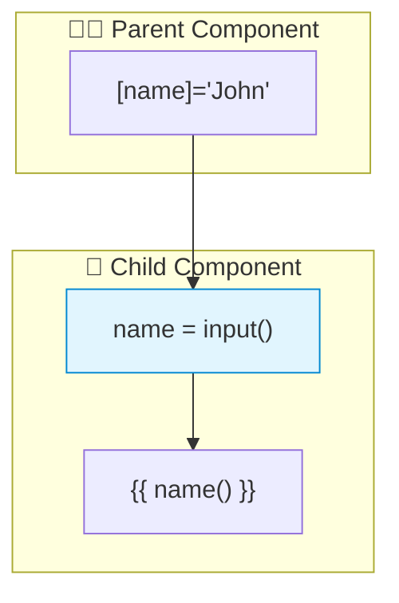
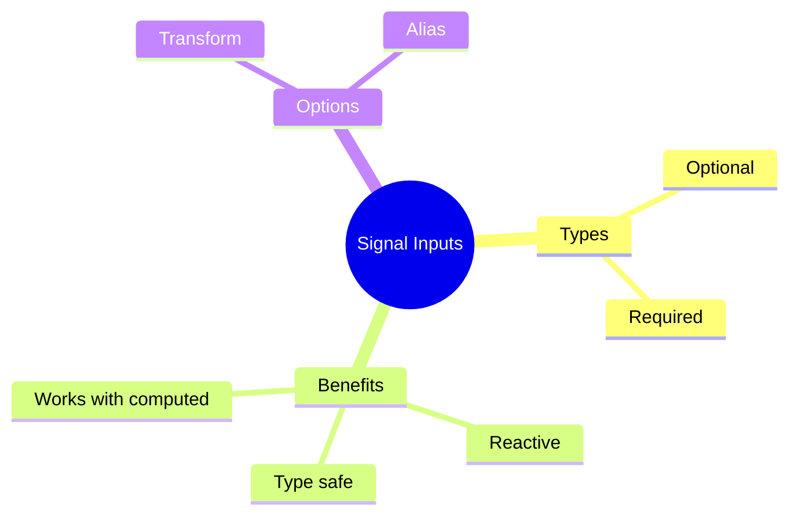

# 🔀 Use Case 4: Signal Inputs

> **💡 Lightbulb Moment**: Signal inputs (Angular 17+) combine @Input() with signals for reactive input binding!

---

## 1. 🔍 What are Signal Inputs?

New way to declare inputs that are automatically signals.

```typescript
import { input } from '@angular/core';

@Component({...})
export class UserCardComponent {
    // Signal input - automatically a signal!
    name = input<string>();           // Optional
    id = input.required<number>();    // Required
    
    // Use in template
    // {{ name() }}
}
```

---

## 2. 🚀 Comparison

```typescript
// OLD way
@Input() name: string = '';

// NEW way (Angular 17+)
name = input<string>('');  // With default
name = input.required<string>();  // Required
```

### 📊 Data Flow Diagram



### 📦 Data Flow Summary (Visual Box Diagram)

```
┌─────────────────────────────────────────────────────────────┐
│  PARENT COMPONENT                                           │
│                                                             │
│   userName = 'John';                                        │
│                                                             │
│   Template:                                                 │
│   ┌───────────────────────────────────────────────────────┐ │
│   │ <app-user-card [name]="userName"></app-user-card>     │ │
│   │                   │                                   │ │
│   └───────────────────│───────────────────────────────────┘ │
│                       │                                     │
└───────────────────────│─────────────────────────────────────┘
                        │
          'John' flows DOWN ⬇️ (Property Binding)
                        │
┌───────────────────────│─────────────────────────────────────┐
│  CHILD COMPONENT      │                                     │
│                       ▼                                     │
│   ① SIGNAL INPUT (Angular 17+)                              │
│   ┌───────────────────────────────────────────────────────┐ │
│   │ name = input<string>();        // Optional            │ │
│   │ id = input.required<number>(); // Required            │ │
│   │                                                       │ │
│   │ // This IS a signal! Read with ()                     │ │
│   └───────────────────────────────────────────────────────┘ │
│                       │                                     │
│                       ▼                                     │
│   ② USE IN TEMPLATE                                         │
│   ┌───────────────────────────────────────────────────────┐ │
│   │ <h3>{{ name() }}</h3>  ← Call like any signal!        │ │
│   └───────────────────────────────────────────────────────┘ │
│                       │                                     │
│                       ▼                                     │
│   ③ USE WITH computed() / effect()                          │
│   ┌───────────────────────────────────────────────────────┐ │
│   │ greeting = computed(() => `Hello, ${this.name()}!`);  │ │
│   │                                                       │ │
│   │ // Derived values auto-update when input changes!     │ │
│   └───────────────────────────────────────────────────────┘ │
└─────────────────────────────────────────────────────────────┘
```

**Signal Input Benefits:**
1. **Reactive by default**: Input IS a signal, works with computed/effect
2. **Type-safe**: `input.required<T>()` enforces at compile time
3. **Transform built-in**: `input(false, { transform: booleanAttribute })`
4. **Cleaner API**: No decorator syntax needed

> **Key Takeaway**: Signal inputs (`input()`) replace `@Input()` and are automatically signals - use them directly with `computed()` and `effect()`!

---

## 3. ❓ Interview Questions

### Basic Questions

#### Q1: Why use signal inputs over @Input()?
**Answer:**
- Reactive by default
- Works with computed() and effect()
- Better type safety
- Transform built-in

#### Q2: How to add transform?
**Answer:**
```typescript
disabled = input(false, { transform: booleanAttribute });
```

---

### Scenario-Based Questions

#### Scenario: Derived Value from Input
**Question:** Create computed based on signal input.

**Answer:**
```typescript
userId = input.required<number>();

// Derived computation
userLabel = computed(() => `User #${this.userId()}`);
```

---

## 🧠 Mind Map


