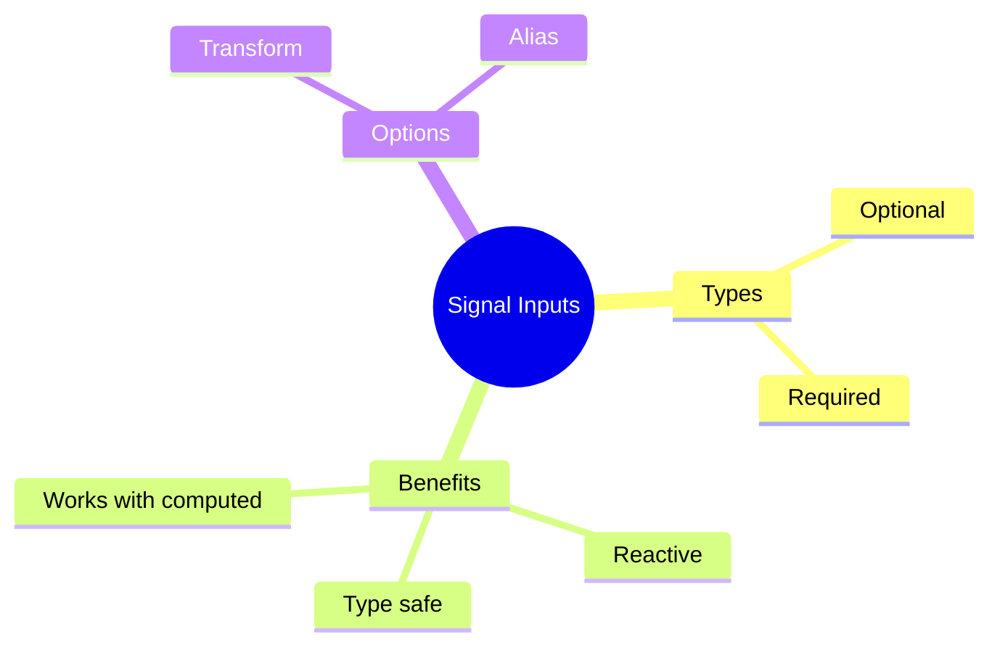

# 🔀 Use Case 4: Signal Inputs

> **💡 Lightbulb Moment**: Signal inputs (Angular 17+) combine @Input() with signals for reactive input binding!

---

## 1. 🔍 What are Signal Inputs?

New way to declare inputs that are automatically signals.

```typescript
import { input } from '@angular/core';

@Component({...})
export class UserCardComponent {
    // Signal input - automatically a signal!
    name = input<string>();           // Optional
    id = input.required<number>();    // Required
    
    // Use in template
    // {{ name() }}
}
```

---

## 2. 🚀 Comparison

```typescript
// OLD way
@Input() name: string = '';

// NEW way (Angular 17+)
name = input<string>('');  // With default
name = input.required<string>();  // Required
```

---

## 3. ❓ Interview Questions

### Basic Questions

#### Q1: Why use signal inputs over @Input()?
**Answer:**
- Reactive by default
- Works with computed() and effect()
- Better type safety
- Transform built-in

#### Q2: How to add transform?
**Answer:**
```typescript
disabled = input(false, { transform: booleanAttribute });
```

---

### Scenario-Based Questions

#### Scenario: Derived Value from Input
**Question:** Create computed based on signal input.

**Answer:**
```typescript
userId = input.required<number>();

// Derived computation
userLabel = computed(() => `User #${this.userId()}`);
```

---

## 🧠 Mind Map


