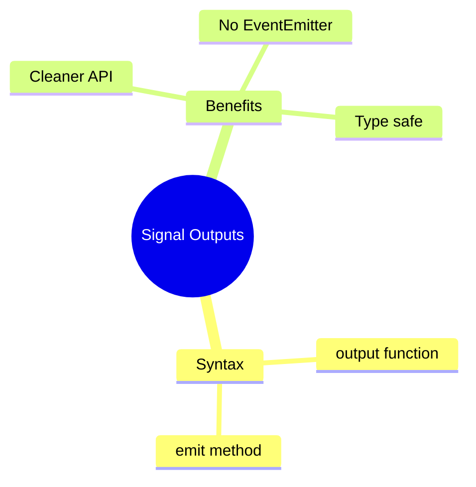

# 📤 Use Case 5: Signal Outputs

> **💡 Lightbulb Moment**: Signal outputs (Angular 17+) provide a cleaner syntax for component outputs!

---

## 1. 🔍 What are Signal Outputs?

New way to declare outputs without EventEmitter.

```typescript
import { output } from '@angular/core';

@Component({...})
export class ButtonComponent {
    // Signal output
    clicked = output<void>();
    selected = output<Item>();
    
    onClick() {
        this.clicked.emit();
    }
    
    onSelect(item: Item) {
        this.selected.emit(item);
    }
}
```

---

## 2. 🚀 Comparison

```typescript
// OLD way
@Output() clicked = new EventEmitter<void>();

// NEW way (Angular 17+)
clicked = output<void>();
```

---

## 3. ❓ Interview Questions

### Basic Questions

#### Q1: output() vs @Output - what's different?
**Answer:**
| @Output | output() |
|---------|----------|
| EventEmitter | OutputEmitterRef |
| Decorator | Function |
| Verbose | Concise |

---

### Scenario-Based Questions

#### Scenario: Modal Component
**Question:** Create modal with close and confirm outputs.

**Answer:**
```typescript
@Component({...})
export class ModalComponent {
    closed = output<void>();
    confirmed = output<{ accept: boolean }>();
    
    close() { this.closed.emit(); }
    confirm() { this.confirmed.emit({ accept: true }); }
}
```

---

## 🧠 Mind Map


