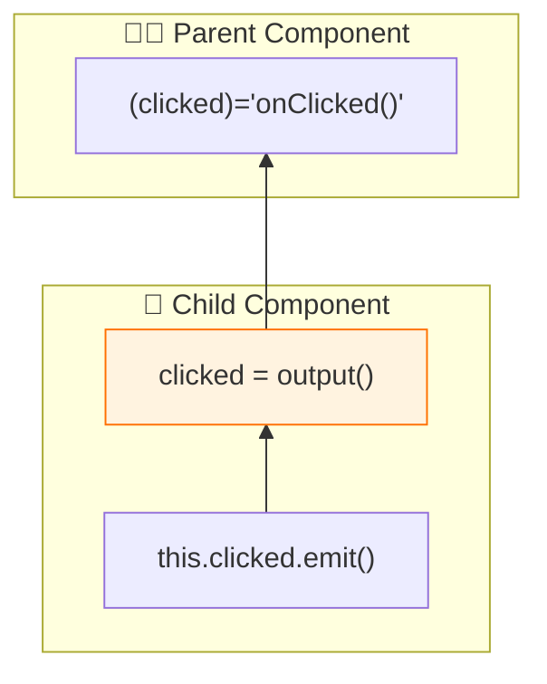
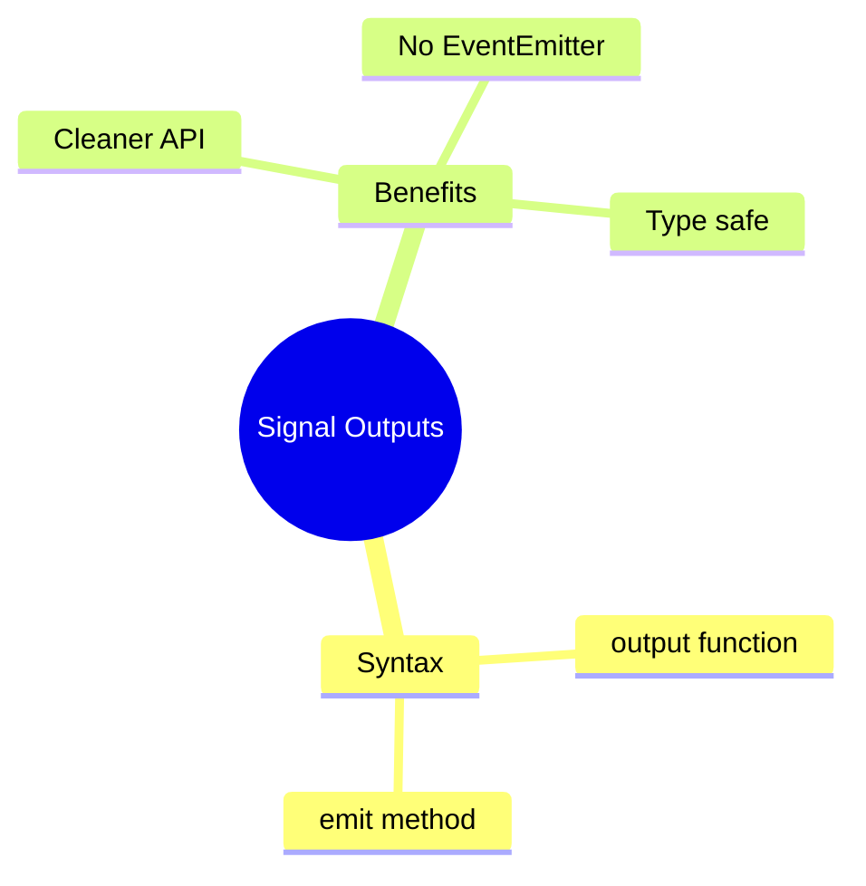

# 📤 Use Case 5: Signal Outputs

> **💡 Lightbulb Moment**: Signal outputs (Angular 17+) provide a cleaner syntax for component outputs!

---

## 1. 🔍 What are Signal Outputs?

New way to declare outputs without EventEmitter.

```typescript
import { output } from '@angular/core';

@Component({...})
export class ButtonComponent {
    // Signal output
    clicked = output<void>();
    selected = output<Item>();
    
    onClick() {
        this.clicked.emit();
    }
    
    onSelect(item: Item) {
        this.selected.emit(item);
    }
}
```

---

## 2. 🚀 Comparison

```typescript
// OLD way
@Output() clicked = new EventEmitter<void>();

// NEW way (Angular 17+)
clicked = output<void>();
```

### 📊 Data Flow Diagram



### 📦 Data Flow Summary (Visual Box Diagram)

```
┌─────────────────────────────────────────────────────────────┐
│  PARENT COMPONENT                                           │
│                                                             │
│   handleClick() {                                           │
│     console.log('Button was clicked!');                     │
│   }                                                         │
│                                             ▲               │
│   Template:                                 │               │
│   ┌─────────────────────────────────────────│─────────────┐ │
│   │ <app-button (clicked)="handleClick()"></app-button>   │ │
│   │                  │                                    │ │
│   └──────────────────│────────────────────────────────────┘ │
│                      │                                      │
└──────────────────────│──────────────────────────────────────┘
                       │
         Event flows UP ⬆️ (output.emit())
                       │
┌──────────────────────│──────────────────────────────────────┐
│  CHILD COMPONENT     ▲                                      │
│                      │                                      │
│   ① SIGNAL OUTPUT (Angular 17+)                             │
│   ┌───────────────────────────────────────────────────────┐ │
│   │ clicked = output<void>();     // No payload           │ │
│   │ selected = output<Item>();    // With payload         │ │
│   │                                                       │ │
│   │ // Replaces: @Output() clicked = new EventEmitter();  │ │
│   └───────────────────────────────────────────────────────┘ │
│                      │                                      │
│   ② EMIT FROM CHILD  │                                      │
│   ┌───────────────────────────────────────────────────────┐ │
│   │ onClick() {                                           │ │
│   │   this.clicked.emit();  // ────────────────────────►  │ │
│   │ }                                                     │ │
│   │                                                       │ │
│   │ onSelect(item: Item) {                                │ │
│   │   this.selected.emit(item);  // With data             │ │
│   │ }                                                     │ │
│   └───────────────────────────────────────────────────────┘ │
│                                                             │
│   Template:                                                 │
│   ┌───────────────────────────────────────────────────────┐ │
│   │ <button (click)="onClick()">Click me</button>         │ │
│   └───────────────────────────────────────────────────────┘ │
└─────────────────────────────────────────────────────────────┘
```

**Signal Output Benefits:**
1. **Cleaner API**: No `@Output()` decorator or `new EventEmitter()`
2. **Same emit()**: Use `.emit(value)` just like EventEmitter
3. **Type-safe**: Generic type `output<T>()` enforces payload type
4. **Consistent**: Matches the signal ecosystem pattern

> **Key Takeaway**: `output()` is the modern replacement for `@Output() + EventEmitter`. Same functionality, cleaner syntax!

---

## 3. ❓ Interview Questions

### Basic Questions

#### Q1: output() vs @Output - what's different?
**Answer:**
| @Output | output() |
|---------|----------|
| EventEmitter | OutputEmitterRef |
| Decorator | Function |
| Verbose | Concise |

---

### Scenario-Based Questions

#### Scenario: Modal Component
**Question:** Create modal with close and confirm outputs.

**Answer:**
```typescript
@Component({...})
export class ModalComponent {
    closed = output<void>();
    confirmed = output<{ accept: boolean }>();
    
    close() { this.closed.emit(); }
    confirm() { this.confirmed.emit({ accept: true }); }
}
```

---

## 🧠 Mind Map


