# 📤 Use Case 5: Signal Outputs

> **💡 Lightbulb Moment**: Signal outputs (Angular 17+) provide a cleaner syntax for component outputs!


---

## 1. 🔍 What are Signal Outputs?

New way to declare outputs without EventEmitter.

```typescript
import { output } from '@angular/core';

@Component({...})
export class ButtonComponent {
    // Signal output
    clicked = output<void>();
    selected = output<Item>();
    
    onClick() {
        this.clicked.emit();
    }
    
    onSelect(item: Item) {
        this.selected.emit(item);
    }
}
```

---

## 2. 🚀 Comparison

```typescript
// OLD way
@Output() clicked = new EventEmitter<void>();

// NEW way (Angular 17+)
clicked = output<void>();
```

### 📊 Data Flow Diagram

```mermaid
flowchart BT
    subgraph Child["👶 Child Component"]
        Output["clicked = output<void>()"]
        Emit["this.clicked.emit()"]
    end
    
    subgraph Parent["👨‍💼 Parent Component"]
        Handler["(clicked)='onClicked()'"]
    end
    
    Emit --> Output
    Output --> Handler
    
    style Output fill:#fff3e0,stroke:#ff6f00
```



### 📦 Data Flow Summary (Visual Box Diagram)

```
┌─────────────────────────────────────────────────────────────┐
│  PARENT COMPONENT                                           │
│                                                             │
│   handleClick() {                                           │
│     console.log('Button was clicked!');                     │
│   }                                                         │
│                                             ▲               │
│   Template:                                 │               │
│   ┌─────────────────────────────────────────│─────────────┐ │
│   │ <app-button (clicked)="handleClick()"></app-button>   │ │
│   │                  │                                    │ │
│   └──────────────────│────────────────────────────────────┘ │
│                      │                                      │
└──────────────────────│──────────────────────────────────────┘
                       │
         Event flows UP ⬆️ (output.emit())
                       │
┌──────────────────────│──────────────────────────────────────┐
│  CHILD COMPONENT     ▲                                      │
│                      │                                      │
│   ① SIGNAL OUTPUT (Angular 17+)                             │
│   ┌───────────────────────────────────────────────────────┐ │
│   │ clicked = output<void>();     // No payload           │ │
│   │ selected = output<Item>();    // With payload         │ │
│   │                                                       │ │
│   │ // Replaces: @Output() clicked = new EventEmitter();  │ │
│   └───────────────────────────────────────────────────────┘ │
│                      │                                      │
│   ② EMIT FROM CHILD  │                                      │
│   ┌───────────────────────────────────────────────────────┐ │
│   │ onClick() {                                           │ │
│   │   this.clicked.emit();  // ────────────────────────►  │ │
│   │ }                                                     │ │
│   │                                                       │ │
│   │ onSelect(item: Item) {                                │ │
│   │   this.selected.emit(item);  // With data             │ │
│   │ }                                                     │ │
│   └───────────────────────────────────────────────────────┘ │
│                                                             │
│   Template:                                                 │
│   ┌───────────────────────────────────────────────────────┐ │
│   │ <button (click)="onClick()">Click me</button>         │ │
│   └───────────────────────────────────────────────────────┘ │
└─────────────────────────────────────────────────────────────┘
```

**Signal Output Benefits:**
1. **Cleaner API**: No `@Output()` decorator or `new EventEmitter()`
2. **Same emit()**: Use `.emit(value)` just like EventEmitter
3. **Type-safe**: Generic type `output<T>()` enforces payload type
4. **Consistent**: Matches the signal ecosystem pattern

> **Key Takeaway**: `output()` is the modern replacement for `@Output() + EventEmitter`. Same functionality, cleaner syntax!

---

## 3. ❓ Interview Questions

### Basic Questions

#### Q1: output() vs @Output - what's different?
**Answer:**
| @Output | output() |
|---------|----------|
| EventEmitter | OutputEmitterRef |
| Decorator | Function |
| Verbose | Concise |

---

### Scenario-Based Questions

#### Scenario: Modal Component
**Question:** Create modal with close and confirm outputs.

**Answer:**
```typescript
@Component({...})
export class ModalComponent {
    closed = output<void>();
    confirmed = output<{ accept: boolean }>();
    
    close() { this.closed.emit(); }
    confirm() { this.confirmed.emit({ accept: true }); }
}
```

---

## 🧠 Mind Map


---

## 🎯 What Problem Does This Solve?

### The Problem: @Output + EventEmitter Is Verbose

**With Traditional @Output (Verbose):**
```typescript
@Component({...})
export class OldButtonComponent {
    @Output() clicked = new EventEmitter<void>();
    @Output() selected = new EventEmitter<Item>();
    
    handleClick() {
        this.clicked.emit();
    }
    
    handleSelect(item: Item) {
        this.selected.emit(item);
    }
}
```

**Problems:**
1. **Verbose**: Need `new EventEmitter<T>()` every time
2. **Decorator overhead**: Must use `@Output()` decorator
3. **Import burden**: Import both `Output` and `EventEmitter`
4. **Inconsistent**: Doesn't match signal-based input() pattern

### How Signal Outputs Solve This

**With Signal Outputs (GOOD):**
```typescript
@Component({...})
export class SignalButtonComponent {
    clicked = output<void>();
    selected = output<Item>();
    
    handleClick() {
        this.clicked.emit();
    }
    
    handleSelect(item: Item) {
        this.selected.emit(item);
    }
}
```

| Problem | Output Solution |
|---------|----------------|
| Verbose syntax | **Clean**: `output<T>()` |
| Decorator | **Function**: No decorator needed |
| Multiple imports | **Single**: Just `output` |
| Inconsistent | **Matches**: `input()` pattern |

---

## 📚 Key Classes & Types Explained

### 1. `output<T>()` Function

```typescript
import { output } from '@angular/core';

clicked = output<void>();     // No payload
selected = output<Item>();    // With payload
confirmed = output<{ accept: boolean }>();  // Complex payload
```

**What it returns:** `OutputEmitterRef<T>`

**Methods:**

| Method | Purpose |
|--------|---------|
| `emit(value?: T)` | Emit event to parent |

---

### 2. `OutputEmitterRef<T>` Type

```typescript
interface OutputEmitterRef<T> {
    emit(value: T): void;
}

// For void outputs
interface OutputEmitterRef<void> {
    emit(): void;
}
```

**Usage:**
```typescript
// Emit without value
this.closed.emit();

// Emit with value
this.selected.emit(item);
```

---

### 3. Output Options

```typescript
changed = output<string>({
    alias: 'valueChanged'  // Exposed name to parent
});
```

| Option | Purpose |
|--------|---------|
| `alias` | External binding name in parent template |

---

## 🌍 Real-World Use Cases

### 1. Custom Button
```typescript
@Component({
    selector: 'app-button',
    template: `<button (click)="handleClick()">{{ label() }}</button>`
})
export class ButtonComponent {
    label = input('Click me');
    clicked = output<void>();
    
    handleClick() {
        this.clicked.emit();
    }
}
```

### 2. Modal with Multiple Outputs
```typescript
@Component({...})
export class ModalComponent {
    closed = output<void>();
    confirmed = output<boolean>();
    
    close() {
        this.closed.emit();
    }
    
    confirm(accepted: boolean) {
        this.confirmed.emit(accepted);
    }
}
```

**Parent usage:**
```html
<app-modal 
    (closed)="onClose()" 
    (confirmed)="onConfirm($event)">
</app-modal>
```

### 3. Autocomplete Component
```typescript
@Component({...})
export class AutocompleteComponent {
    search = output<string>();
    selected = output<Option>();
    cleared = output<void>();
    
    onInput(term: string) {
        this.search.emit(term);
    }
    
    onSelect(option: Option) {
        this.selected.emit(option);
    }
    
    onClear() {
        this.cleared.emit();
    }
}
```

### 4. Pagination Component
```typescript
@Component({...})
export class PaginationComponent {
    currentPage = input(1);
    totalPages = input.required<number>();
    
    pageChanged = output<number>();
    
    goTo(page: number) {
        if (page >= 1 && page <= this.totalPages()) {
            this.pageChanged.emit(page);
        }
    }
    
    next() { this.goTo(this.currentPage() + 1); }
    prev() { this.goTo(this.currentPage() - 1); }
}
```

### 5. File Upload Component
```typescript
@Component({...})
export class FileUploadComponent {
    filesSelected = output<File[]>();
    uploadProgress = output<number>();
    uploadComplete = output<UploadResult>();
    error = output<Error>();
    
    onFilesChosen(event: Event) {
        const files = Array.from((event.target as HTMLInputElement).files ?? []);
        this.filesSelected.emit(files);
    }
}
```

---

## ❓ Complete Interview Questions (20+)

### Basic Conceptual Questions

**Q1: What is output() in Angular?**
> A: A function that creates component outputs without EventEmitter. Angular 17+ feature.

**Q2: How does output() differ from @Output()?**
> A:
> - `output()`: Function-based, cleaner, no EventEmitter
> - `@Output()`: Decorator-based, requires `new EventEmitter()`

**Q3: How do you emit an event?**
> A: Call `.emit()`:
> ```typescript
> clicked = output<void>();
> this.clicked.emit();
> ```

**Q4: How do you emit with a payload?**
> A:
> ```typescript
> selected = output<Item>();
> this.selected.emit(item);
> ```

**Q5: What type does output<T>() return?**
> A: `OutputEmitterRef<T>`

---

### Template Questions

**Q6: How do parents listen to outputs?**
> A: Same as @Output - event binding:
> ```html
> <child-comp (clicked)="handleClick()"></child-comp>
> ```

**Q7: How do you access the emitted value?**
> A: Use $event:
> ```html
> <child-comp (selected)="handleSelect($event)"></child-comp>
> ```

**Q8: Can you alias output names?**
> A: Yes:
> ```typescript
> changed = output<string>({ alias: 'valueChanged' });
> ```

---

### Comparison Questions

**Q9: Is output() a signal?**
> A: No! Despite being part of the signals API, outputs are not signals. They're event emitters.

**Q10: Can you subscribe to output() like Observable?**
> A: No, outputs are fire-and-forget. Parents listen via template binding.

**Q11: EventEmitter or OutputEmitterRef - which is newer?**
> A: `OutputEmitterRef` (from output()). It's the modern approach.

---

### Pattern Questions

**Q12: Create a component that emits on button click.**
> A:
> ```typescript
> clicked = output<void>();
> onClick() { this.clicked.emit(); }
> ```
> ```html
> <button (click)="onClick()">Click</button>
> ```

**Q13: Create a modal with close and save outputs.**
> A:
> ```typescript
> closed = output<void>();
> saved = output<FormData>();
> 
> close() { this.closed.emit(); }
> save(data: FormData) { this.saved.emit(data); }
> ```

**Q14: How do you handle output with complex payload?**
> A:
> ```typescript
> submitted = output<{ name: string; email: string }>();
> onSubmit() {
>     this.submitted.emit({ name: 'John', email: 'john@test.com' });
> }
> ```

---

### Migration Questions

**Q15: How do you migrate from @Output to output()?**
> A:
> ```typescript
> // Before
> @Output() clicked = new EventEmitter<void>();
> 
> // After
> clicked = output<void>();
> 
> // emit() stays the same!
> ```

**Q16: Do parent templates need changes after migration?**
> A: No! Template syntax is identical:
> ```html
> <comp (clicked)="handle()"></comp>
> ```

**Q17: Can you mix @Output and output()?**
> A: Yes, but prefer output() for consistency.

---

### Advanced Questions

**Q18: Can outputs be required?**
> A: No, there's no `output.required()`. Outputs are always optional.

**Q19: What happens if parent doesn't listen to output?**
> A: Nothing - the event is emitted but no handler runs. No errors.

**Q20: Can you emit from ngOnInit?**
> A: Yes, but the parent might not be ready. Better to emit on actual events.

---

### Best Practice Questions

**Q21: How should you name outputs?**
> A: Use verbs (past tense for completed actions):
> - `clicked`, `selected`, `submitted`, `closed`
> - NOT: `click`, `select`, `submit`

**Q22: Should outputs emit mutable objects?**
> A: No, emit immutable data or new objects to prevent parent modifications affecting child.

**Q23: How do you type void outputs?**
> A: Use `output<void>()`:
> ```typescript
> canceled = output<void>();
> this.canceled.emit();
> ```

**Q24: Can you use output() in services?**
> A: No, outputs are for components/directives only.

**Q25: What's the relationship between input() and output()?**
> A:
> - `input()`: Data flows parent → child (read-only)
> - `output()`: Events flow child → parent (emit-only)
> - Together they replace `@Input()` and `@Output()`

