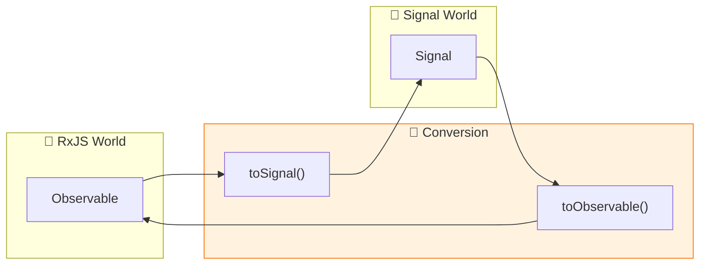
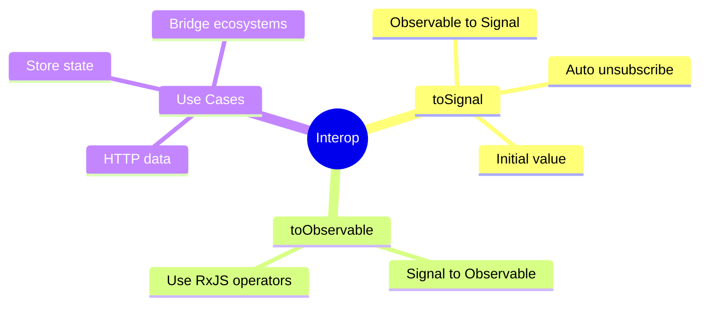

# 🔗 Use Case 6: toSignal & toObservable

> **💡 Lightbulb Moment**: These functions let you bridge between RxJS and Signals!

---

## 1. 🔍 Converting Between RxJS and Signals

### toSignal - Observable to Signal
```typescript
import { toSignal } from '@angular/core/rxjs-interop';

// Convert observable to signal
user$ = this.http.get<User>('/api/user');
user = toSignal(this.user$, { initialValue: null });

// Use in template: {{ user()?.name }}
```

### toObservable - Signal to Observable
```typescript
import { toObservable } from '@angular/core/rxjs-interop';

count = signal(0);
count$ = toObservable(this.count);

// Use with RxJS operators
count$.pipe(debounceTime(500)).subscribe(...)
```

---

## 2. 🚀 toSignal Options

```typescript
// With initial value
data = toSignal(obs$, { initialValue: [] });

// Allow undefined (no initial value)
data = toSignal(obs$);  // Signal<T | undefined>

// Require sync
data = toSignal(obs$, { requireSync: true });  // Errors if not sync
```

### 📊 Data Flow Diagram



### 📦 Data Flow Summary (Visual Box Diagram)

```
┌─────────────────────────────────────────────────────────────┐
│  COMPONENT                                                  │
│                                                             │
│   ━━━━━━━━━━━━━━━━━━━━━━━━━━━━━━━━━━━━━━━━━━━━━━━━━━━━━━━   │
│   toSignal() - Observable → Signal                          │
│   ━━━━━━━━━━━━━━━━━━━━━━━━━━━━━━━━━━━━━━━━━━━━━━━━━━━━━━━   │
│                                                             │
│   ① HTTP Observable                                         │
│   ┌───────────────────────────────────────────────────────┐ │
│   │ private http = inject(HttpClient);                    │ │
│   │ user$ = this.http.get<User>('/api/user');             │ │
│   └───────────────────────────────────────────────────────┘ │
│          │                                                  │
│          ▼                                                  │
│   ② Convert to Signal                                       │
│   ┌───────────────────────────────────────────────────────┐ │
│   │ user = toSignal(this.user$, { initialValue: null });  │ │
│   │                                                       │ │
│   │ // ✅ Auto-subscribes on creation                     │ │
│   │ // ✅ Auto-unsubscribes on component destroy          │ │
│   │ // ✅ Now usable with computed() and effect()         │ │
│   └───────────────────────────────────────────────────────┘ │
│          │                                                  │
│          ▼                                                  │
│   ③ Use in Template/Computed                                │
│   ┌───────────────────────────────────────────────────────┐ │
│   │ displayName = computed(() => this.user()?.name);      │ │
│   │                                                       │ │
│   │ // Template: {{ user()?.email }}                      │ │
│   └───────────────────────────────────────────────────────┘ │
│                                                             │
│   ━━━━━━━━━━━━━━━━━━━━━━━━━━━━━━━━━━━━━━━━━━━━━━━━━━━━━━━   │
│   toObservable() - Signal → Observable                      │
│   ━━━━━━━━━━━━━━━━━━━━━━━━━━━━━━━━━━━━━━━━━━━━━━━━━━━━━━━   │
│                                                             │
│   ④ Start with Signal                                       │
│   ┌───────────────────────────────────────────────────────┐ │
│   │ count = signal(0);                                    │ │
│   │ count$ = toObservable(this.count);                    │ │
│   └───────────────────────────────────────────────────────┘ │
│          │                                                  │
│          ▼                                                  │
│   ⑤ Use with RxJS Operators                                 │
│   ┌───────────────────────────────────────────────────────┐ │
│   │ this.count$.pipe(                                     │ │
│   │   debounceTime(300),                                  │ │
│   │   distinctUntilChanged()                              │ │
│   │ ).subscribe(val => this.save(val));                   │ │
│   └───────────────────────────────────────────────────────┘ │
└─────────────────────────────────────────────────────────────┘
```

**Interop Guidelines:**
| Scenario | Use |
|----------|-----|
| HTTP → Signal | `toSignal(http.get(...), { initialValue: null })` |
| Signal → RxJS operators | `toObservable(signal).pipe(...)` |
| Store selector → Signal | `toSignal(store.select(...))` |

> **Key Takeaway**: `toSignal()` and `toObservable()` are bridges between RxJS and Signals. Use them to leverage both ecosystems!

---

## 3. ❓ Interview Questions

### Basic Questions

#### Q1: When use toSignal?
**Answer:** When you want to use Observable data in a signal-based workflow:
- HTTP responses with signals
- Store selectors to signals
- Any async data to sync signals

#### Q2: Does toSignal auto-unsubscribe?
**Answer:** Yes! When the component/context is destroyed, it automatically unsubscribes.

---

### Scenario-Based Questions

#### Scenario: HTTP with Signals
**Question:** Fetch user data and use with computed.

**Answer:**
```typescript
private http = inject(HttpClient);

user = toSignal(
    this.http.get<User>('/api/user'),
    { initialValue: null }
);

displayName = computed(() => 
    this.user()?.name ?? 'Guest'
);
```

---

## 🧠 Mind Map


