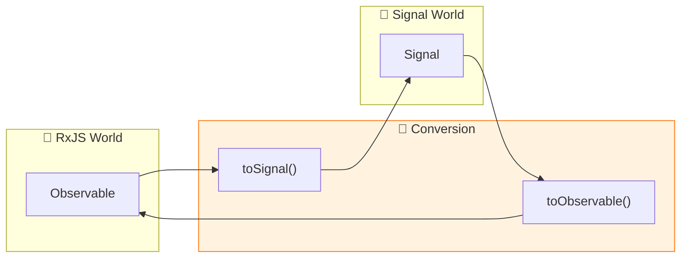
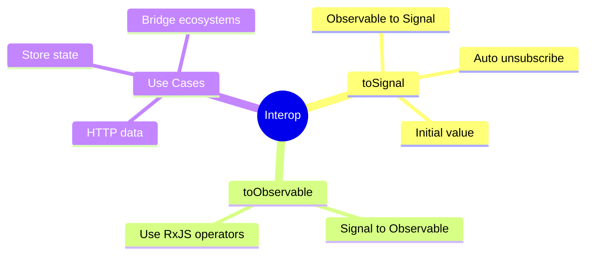

# 🔗 Use Case 6: toSignal & toObservable

> **💡 Lightbulb Moment**: These functions let you bridge between RxJS and Signals!


---

## 1. 🔍 Converting Between RxJS and Signals

### toSignal - Observable to Signal
```typescript
import { toSignal } from '@angular/core/rxjs-interop';

// Convert observable to signal
user$ = this.http.get<User>('/api/user');
user = toSignal(this.user$, { initialValue: null });

// Use in template: {{ user()?.name }}
```

### toObservable - Signal to Observable
```typescript
import { toObservable } from '@angular/core/rxjs-interop';

count = signal(0);
count$ = toObservable(this.count);

// Use with RxJS operators
count$.pipe(debounceTime(500)).subscribe(...)
```

---

## 2. 🚀 toSignal Options

```typescript
// With initial value
data = toSignal(obs$, { initialValue: [] });

// Allow undefined (no initial value)
data = toSignal(obs$);  // Signal<T | undefined>

// Require sync
data = toSignal(obs$, { requireSync: true });  // Errors if not sync
```

### 📊 Data Flow Diagram



### 📦 Data Flow Summary (Visual Box Diagram)

```
┌─────────────────────────────────────────────────────────────┐
│  COMPONENT                                                  │
│                                                             │
│   ━━━━━━━━━━━━━━━━━━━━━━━━━━━━━━━━━━━━━━━━━━━━━━━━━━━━━━━   │
│   toSignal() - Observable → Signal                          │
│   ━━━━━━━━━━━━━━━━━━━━━━━━━━━━━━━━━━━━━━━━━━━━━━━━━━━━━━━   │
│                                                             │
│   ① HTTP Observable                                         │
│   ┌───────────────────────────────────────────────────────┐ │
│   │ private http = inject(HttpClient);                    │ │
│   │ user$ = this.http.get<User>('/api/user');             │ │
│   └───────────────────────────────────────────────────────┘ │
│          │                                                  │
│          ▼                                                  │
│   ② Convert to Signal                                       │
│   ┌───────────────────────────────────────────────────────┐ │
│   │ user = toSignal(this.user$, { initialValue: null });  │ │
│   │                                                       │ │
│   │ // ✅ Auto-subscribes on creation                     │ │
│   │ // ✅ Auto-unsubscribes on component destroy          │ │
│   │ // ✅ Now usable with computed() and effect()         │ │
│   └───────────────────────────────────────────────────────┘ │
│          │                                                  │
│          ▼                                                  │
│   ③ Use in Template/Computed                                │
│   ┌───────────────────────────────────────────────────────┐ │
│   │ displayName = computed(() => this.user()?.name);      │ │
│   │                                                       │ │
│   │ // Template: {{ user()?.email }}                      │ │
│   └───────────────────────────────────────────────────────┘ │
│                                                             │
│   ━━━━━━━━━━━━━━━━━━━━━━━━━━━━━━━━━━━━━━━━━━━━━━━━━━━━━━━   │
│   toObservable() - Signal → Observable                      │
│   ━━━━━━━━━━━━━━━━━━━━━━━━━━━━━━━━━━━━━━━━━━━━━━━━━━━━━━━   │
│                                                             │
│   ④ Start with Signal                                       │
│   ┌───────────────────────────────────────────────────────┐ │
│   │ count = signal(0);                                    │ │
│   │ count$ = toObservable(this.count);                    │ │
│   └───────────────────────────────────────────────────────┘ │
│          │                                                  │
│          ▼                                                  │
│   ⑤ Use with RxJS Operators                                 │
│   ┌───────────────────────────────────────────────────────┐ │
│   │ this.count$.pipe(                                     │ │
│   │   debounceTime(300),                                  │ │
│   │   distinctUntilChanged()                              │ │
│   │ ).subscribe(val => this.save(val));                   │ │
│   └───────────────────────────────────────────────────────┘ │
└─────────────────────────────────────────────────────────────┘
```

**Interop Guidelines:**
| Scenario | Use |
|----------|-----|
| HTTP → Signal | `toSignal(http.get(...), { initialValue: null })` |
| Signal → RxJS operators | `toObservable(signal).pipe(...)` |
| Store selector → Signal | `toSignal(store.select(...))` |

> **Key Takeaway**: `toSignal()` and `toObservable()` are bridges between RxJS and Signals. Use them to leverage both ecosystems!

---

## 3. ❓ Interview Questions

### Basic Questions

#### Q1: When use toSignal?
**Answer:** When you want to use Observable data in a signal-based workflow:
- HTTP responses with signals
- Store selectors to signals
- Any async data to sync signals

#### Q2: Does toSignal auto-unsubscribe?
**Answer:** Yes! When the component/context is destroyed, it automatically unsubscribes.

---

### Scenario-Based Questions

#### Scenario: HTTP with Signals
**Question:** Fetch user data and use with computed.

**Answer:**
```typescript
private http = inject(HttpClient);

user = toSignal(
    this.http.get<User>('/api/user'),
    { initialValue: null }
);

displayName = computed(() => 
    this.user()?.name ?? 'Guest'
);
```

---

## 🧠 Mind Map



---

## 🎯 What Problem Does This Solve?

### The Problem: Signals and RxJS Are Different Worlds

**Without Interop (Problematic):**
```typescript
@Component({...})
export class ProblemComponent implements OnInit, OnDestroy {
    user$!: Observable<User>;
    user: User | null = null;  // Duplicate state!
    private destroy$ = new Subject<void>();
    
    ngOnInit() {
        this.user$ = this.http.get<User>('/api/user');
        
        // Manual subscription
        this.user$.pipe(
            takeUntil(this.destroy$)
        ).subscribe(user => {
            this.user = user;  // Manually sync
        });
    }
    
    // Can't use signals' computed() with Observable data!
    // fullName = computed(() => this.user?.name);  // Won't work!
    
    ngOnDestroy() {
        this.destroy$.next();
        this.destroy$.complete();
    }
}
```

**Problems:**
1. **Duplicate state**: Observable AND property
2. **Manual subscription**: Subscribe + takeUntil pattern
3. **Manual cleanup**: ngOnDestroy boilerplate
4. **No signal benefits**: Can't use computed/effect with Observable data

### How Interop Solves This

**With toSignal (GOOD):**
```typescript
@Component({...})
export class SolutionComponent {
    private http = inject(HttpClient);
    
    // Convert Observable to Signal - done!
    user = toSignal(
        this.http.get<User>('/api/user'),
        { initialValue: null }
    );
    
    // Now use with computed!
    fullName = computed(() => this.user()?.name ?? 'Guest');
    
    // Auto-unsubscribes on destroy! No cleanup needed!
}
```

| Problem | Interop Solution |
|---------|-----------------|
| Duplicate state | **Single source**: toSignal creates the signal |
| Manual subscription | **Automatic**: toSignal subscribes for you |
| Manual cleanup | **Automatic**: unsubscribes on destroy |
| No signal benefits | **Full integration**: works with computed/effect |

---

## 📚 Key Classes & Types Explained

### 1. `toSignal<T>()` Function

```typescript
import { toSignal } from '@angular/core/rxjs-interop';

// Basic usage
data = toSignal(observable$);

// With initial value
user = toSignal(user$, { initialValue: null });

// Require sync (errors if observable doesn't emit immediately)
config = toSignal(config$, { requireSync: true });
```

**What it returns:** `Signal<T>` or `Signal<T | undefined>`

**Behavior:**
- Subscribes immediately on creation
- Updates signal when Observable emits
- Unsubscribes when injection context is destroyed
- Holds last emitted value

---

### 2. toSignal Options

```typescript
toSignal(obs$, {
    initialValue: defaultValue,    // Value before first emit
    requireSync: false,            // Require sync first emit
    injector: customInjector       // Custom injection context
});
```

| Option | Type | Purpose |
|--------|------|---------|
| `initialValue` | T | Value before Observable emits |
| `requireSync` | boolean | Error if Observable doesn't emit sync |
| `injector` | Injector | Custom injection context |

**Type differences:**
```typescript
// Without initialValue: Signal<T | undefined>
data = toSignal(obs$);  

// With initialValue: Signal<T>
data = toSignal(obs$, { initialValue: [] });
```

---

### 3. `toObservable<T>()` Function

```typescript
import { toObservable } from '@angular/core/rxjs-interop';

count = signal(0);
count$ = toObservable(this.count);

// Now use RxJS operators!
debounced$ = this.count$.pipe(
    debounceTime(300),
    distinctUntilChanged()
);
```

**What it returns:** `Observable<T>`

**Behavior:**
- Emits current value immediately
- Emits on every signal change
- Works with ALL RxJS operators

---

### 4. Injection Context Requirement

```typescript
@Component({...})
export class MyComponent {
    // ✅ Works - field initializer is injection context
    user = toSignal(this.http.get<User>('/api/user'));
    
    constructor() {
        // ✅ Works - constructor is injection context
        this.data = toSignal(obs$);
    }
    
    ngOnInit() {
        // ❌ Error! Not an injection context
        this.items = toSignal(obs$);
        
        // ✅ Fix with injector option
        this.items = toSignal(obs$, { injector: this.injector });
    }
}
```

---

## 🌍 Real-World Use Cases

### 1. HTTP Data to Signal
```typescript
@Component({...})
export class UserProfileComponent {
    private http = inject(HttpClient);
    
    user = toSignal(
        this.http.get<User>('/api/me'),
        { initialValue: null }
    );
    
    isAdmin = computed(() => this.user()?.role === 'admin');
    displayName = computed(() => this.user()?.name ?? 'Guest');
}
```

### 2. Store State to Signal
```typescript
@Component({...})
export class CartComponent {
    private store = inject(Store);
    
    // NgRx to Signal
    items = toSignal(
        this.store.select(selectCartItems),
        { initialValue: [] }
    );
    
    total = computed(() => 
        this.items().reduce((sum, i) => sum + i.price, 0)
    );
}
```

### 3. Route Params to Signal
```typescript
@Component({...})
export class ProductDetailComponent {
    private route = inject(ActivatedRoute);
    
    productId = toSignal(
        this.route.paramMap.pipe(map(p => p.get('id'))),
        { initialValue: null }
    );
    
    // React to route changes
    constructor() {
        effect(() => {
            const id = this.productId();
            if (id) console.log('Loading product:', id);
        });
    }
}
```

### 4. Signal to Debounced Observable
```typescript
@Component({...})
export class SearchComponent {
    searchTerm = signal('');
    
    // Convert to Observable for debouncing
    searchResults$ = toObservable(this.searchTerm).pipe(
        debounceTime(300),
        distinctUntilChanged(),
        filter(term => term.length >= 2),
        switchMap(term => this.api.search(term))
    );
    
    // Convert back to Signal
    results = toSignal(this.searchResults$, { initialValue: [] });
}
```

### 5. WebSocket to Signal
```typescript
@Component({...})
export class ChatComponent {
    private ws = inject(WebSocketService);
    
    messages = toSignal(
        this.ws.messages$,
        { initialValue: [] }
    );
    
    lastMessage = computed(() => 
        this.messages().at(-1)
    );
}
```

---

## ❓ Complete Interview Questions (20+)

### Basic Conceptual Questions

**Q1: What does toSignal() do?**
> A: Converts an Observable to a Signal, auto-subscribing and auto-cleaning up.

**Q2: What does toObservable() do?**
> A: Converts a Signal to an Observable, emitting on every signal change.

**Q3: Does toSignal() require manual unsubscribe?**
> A: No! It automatically unsubscribes when the injection context is destroyed.

**Q4: What's the default value of toSignal() without initialValue?**
> A: `undefined`. The signal type is `Signal<T | undefined>`.

**Q5: Where can you call toSignal()?**
> A: In injection context - field initializers or constructor.

---

### Type Questions

**Q6: How does initialValue affect typing?**
> A:
> - Without: `Signal<T | undefined>`
> - With: `Signal<T>`

**Q7: What is requireSync option?**
> A: Throws error if Observable doesn't emit synchronously. Use for BehaviorSubject.

**Q8: How do you type nullable initialValue?**
> A:
> ```typescript
> user = toSignal(user$, { initialValue: null as User | null });
> ```

---

### Usage Questions

**Q9: How do you convert HTTP response to signal?**
> A:
> ```typescript
> data = toSignal(this.http.get<Data>('/api'), { initialValue: null });
> ```

**Q10: How do you use toSignal with NgRx?**
> A:
> ```typescript
> items = toSignal(this.store.select(selectItems), { initialValue: [] });
> ```

**Q11: Can you use RxJS operators with toSignal result?**
> A: No! Convert back with toObservable() first.

**Q12: How do you debounce a signal?**
> A:
> ```typescript
> debounced$ = toObservable(signal).pipe(debounceTime(300));
> debouncedSignal = toSignal(debounced$);
> ```

---

### Scenario Questions

**Q13: Fetch user and show loading state.**
> A:
> ```typescript
> private user$ = this.http.get<User>('/api/user');
> user = toSignal(this.user$, { initialValue: null });
> isLoading = computed(() => this.user() === null);
> ```

**Q14: Convert route param changes to signal.**
> A:
> ```typescript
> id = toSignal(
>     this.route.paramMap.pipe(map(p => p.get('id'))),
>     { initialValue: null }
> );
> ```

**Q15: Log every signal change using RxJS tap.**
> A:
> ```typescript
> count = signal(0);
> constructor() {
>     toObservable(this.count).pipe(
>         tap(v => console.log('Count:', v))
>     ).subscribe();
> }
> ```

---

### Error Handling Questions

**Q16: What happens if Observable errors?**
> A: The error propagates. Handle with catchError before toSignal:
> ```typescript
> data = toSignal(
>     obs$.pipe(catchError(() => of(null))),
>     { initialValue: null }
> );
> ```

**Q17: What happens if Observable completes?**
> A: Signal retains last value. No more updates.

**Q18: Why does toSignal fail in ngOnInit?**
> A: ngOnInit is not an injection context. Use injector option:
> ```typescript
> toSignal(obs$, { injector: this.injector });
> ```

---

### Advanced Questions

**Q19: Can you chain toSignal and toObservable?**
> A: Yes! Common for adding RxJS operators:
> ```typescript
> search = signal('');
> results = toSignal(
>     toObservable(this.search).pipe(debounceTime(300), switchMap(...))
> );
> ```

**Q20: When to use toSignal vs manual subscription?**
> A: 
> - toSignal: When you want signal benefits (computed, effect)
> - Manual: When you need fine-grained control

**Q21: Does toObservable emit on subscribe?**
> A: Yes, it emits the current signal value immediately.

**Q22: Can you use toSignal in services?**
> A: Yes, if called in constructor (injection context):
> ```typescript
> @Injectable({ providedIn: 'root' })
> export class DataService {
>     data = toSignal(this.http.get('/api'), { initialValue: [] });
> }
> ```

**Q23: What's the memory impact of toSignal?**
> A: Minimal - it's just one subscription that's cleaned up automatically.

**Q24: Can toSignal handle multiple emissions?**
> A: Yes, it updates the signal on every emission.

**Q25: How do you handle async initial value?**
> A: Use a loading state:
> ```typescript
> data = toSignal(obs$, { initialValue: null });
> loading = computed(() => this.data() === null);
> ```

