# Use Case 1: SSR Fundamentals

## 📚 Overview

Server-Side Rendering (SSR) is a technique where your Angular application is rendered on the server instead of the browser. The server generates the full HTML content and sends it to the browser, where it's immediately visible to users.

## 🎯 Learning Objectives

After completing this use case, you will:
- Understand what SSR is and why it matters
- Know how Angular Universal works
- Learn to set up SSR in an Angular project
- Understand the SSR request/response lifecycle

---

## 🔄 SSR vs Client-Side Rendering

```mermaid
%%{init: {'theme': 'base', 'themeVariables': { 'primaryColor': '#6366f1', 'primaryTextColor': '#fff', 'primaryBorderColor': '#4f46e5', 'lineColor': '#8b5cf6', 'secondaryColor': '#a855f7', 'tertiaryColor': '#f3e8ff'}}}%%
flowchart LR
    subgraph CSR["🌐 Client-Side Rendering"]
        A1[Browser Requests Page] --> A2[Server Sends Empty HTML]
        A2 --> A3[Browser Downloads JS]
        A3 --> A4[JS Renders Content]
        A4 --> A5[User Sees Content]
    end
    
    subgraph SSR["🖥️ Server-Side Rendering"]
        B1[Browser Requests Page] --> B2[Server Renders HTML]
        B2 --> B3[Server Sends Full HTML]
        B3 --> B4[User Sees Content]
        B4 --> B5[JS Hydrates App]
    end
    
    style CSR fill:#fee2e2,stroke:#ef4444
    style SSR fill:#d1fae5,stroke:#10b981
```



### Key Differences

| Aspect | Client-Side Rendering | Server-Side Rendering |
|--------|----------------------|----------------------|
| **Initial HTML** | Empty shell | Full content |
| **Time to First Paint** | Slower (waits for JS) | Faster (immediate) |
| **SEO** | Challenging | Excellent |
| **Server Load** | Low | Higher |
| **JavaScript Required** | Yes, for any content | No, for initial view |

---

## 🏗️ Angular Universal Architecture


---

## 💻 Setting Up SSR

### Step 1: Add Angular SSR Package

```bash
# Angular 17+ uses the new @angular/ssr package
ng add @angular/ssr
```

This command automatically:
- Adds server-side dependencies
- Creates `server.ts` file
- Updates `angular.json` with SSR configuration
- Creates `app.config.server.ts`

### Step 2: Project Structure After SSR Setup

```
src/
├── app/
│   ├── app.component.ts
│   ├── app.config.ts           # Client config
│   └── app.config.server.ts    # Server config
├── main.ts                     # Client entry point
└── main.server.ts              # Server entry point
server.ts                       # Express server
```

### Step 3: Server Configuration (server.ts)

```typescript
import { APP_BASE_HREF } from '@angular/common';
import { CommonEngine } from '@angular/ssr';
import express from 'express';
import { fileURLToPath } from 'node:url';
import { dirname, join, resolve } from 'node:path';
import bootstrap from './src/main.server';

/**
 * The Express app is exported so that it can be used by serverless Functions.
 */
export function app(): express.Express {
    const server = express();
    const serverDistFolder = dirname(fileURLToPath(import.meta.url));
    const browserDistFolder = resolve(serverDistFolder, '../browser');
    const indexHtml = join(serverDistFolder, 'index.server.html');

    const commonEngine = new CommonEngine();

    server.set('view engine', 'html');
    server.set('views', browserDistFolder);

    // Serve static files from /browser
    server.get('*.*', express.static(browserDistFolder, {
        maxAge: '1y'
    }));

    // All regular routes use the Angular engine
    server.get('*', (req, res, next) => {
        const { protocol, originalUrl, baseUrl, headers } = req;

        commonEngine
            .render({
                bootstrap,
                documentFilePath: indexHtml,
                url: `${protocol}://${headers.host}${originalUrl}`,
                publicPath: browserDistFolder,
                providers: [
                    { provide: APP_BASE_HREF, useValue: baseUrl }
                ],
            })
            .then((html) => res.send(html))
            .catch((err) => next(err));
    });

    return server;
}
```

### Step 4: Server App Configuration

```typescript
// app.config.server.ts
import { mergeApplicationConfig, ApplicationConfig } from '@angular/core';
import { provideServerRendering } from '@angular/platform-server';
import { appConfig } from './app.config';

const serverConfig: ApplicationConfig = {
    providers: [
        provideServerRendering()
    ]
};

export const config = mergeApplicationConfig(appConfig, serverConfig);
```

---

## 🔄 SSR Request Lifecycle


---

## 📋 When to Use SSR

### ✅ Good Use Cases
- **Content websites** - Blogs, news sites, marketing pages
- **E-commerce** - Product pages need SEO
- **Social sharing** - Facebook, Twitter previews
- **Low-powered devices** - Reduce client computation
- **First-time visitors** - No cached JavaScript

### ❌ When SSR May Not Help
- **Dashboards** - Behind login, SEO not needed
- **Real-time apps** - Chat apps, live updates
- **Heavy interactivity** - Games, complex editors
- **High server costs** - Limited infrastructure

---

## 🧪 Running SSR Locally

```bash
# Build both browser and server bundles
npm run build

# Start the SSR server
npm run serve:ssr:your-app-name
```

### Development Mode
```bash
# Angular 17+ supports SSR in dev mode
ng serve --ssr
```

---

## ⚠️ Common Pitfalls

### 1. Browser-Only APIs
```typescript
// ❌ This will break on server
ngOnInit() {
    const width = window.innerWidth; // window doesn't exist on server!
}

// ✅ Use platform detection
ngOnInit() {
    if (isPlatformBrowser(this.platformId)) {
        const width = window.innerWidth;
    }
}
```

### 2. Timeouts and Subscriptions
```typescript
// ❌ This can delay server response
setTimeout(() => {
    this.loadData();
}, 5000);

// ✅ Cancel on server or use resolvers
```

### 3. Memory Leaks
```typescript
// ❌ Subscriptions must be cleaned up
this.data$ = this.http.get('/api/data');

// ✅ Use takeUntilDestroyed or async pipe
this.data$ = this.http.get('/api/data').pipe(
    takeUntilDestroyed()
);
```

---

## 📊 Interview Questions

### Basic
1. **What is Server-Side Rendering and why is it important?**
2. **What is Angular Universal?**
3. **What are the benefits of SSR over client-side rendering?**

### Intermediate
4. **Explain the SSR request lifecycle in Angular.**
5. **What changes are needed in angular.json for SSR?**
6. **How does the CommonEngine work?**

### Advanced
7. **How would you handle browser-specific code in an SSR application?**
8. **What are the performance implications of SSR at scale?**
9. **How does SSR affect caching strategies?**

---

## 🔗 Related Use Cases
- [Use Case 2: Hydration](../use-case-2/guide.md) - Client takeover
- [Use Case 4: Platform Detection](../use-case-4/guide.md) - Browser vs Server
- [Use Case 6: Prerendering](../use-case-6/guide.md) - Static generation
