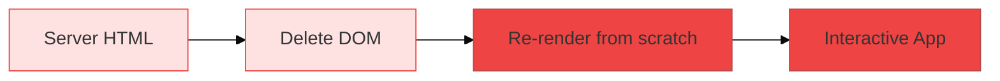
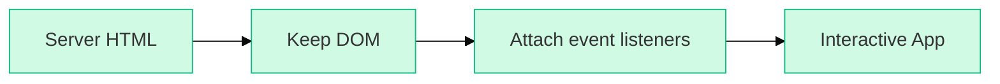
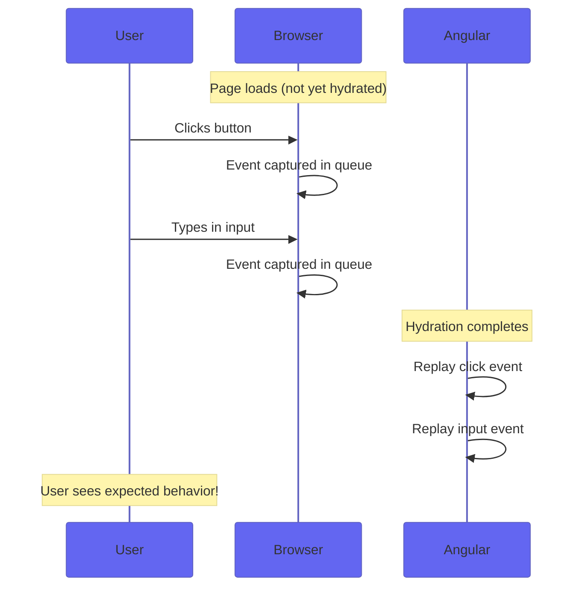
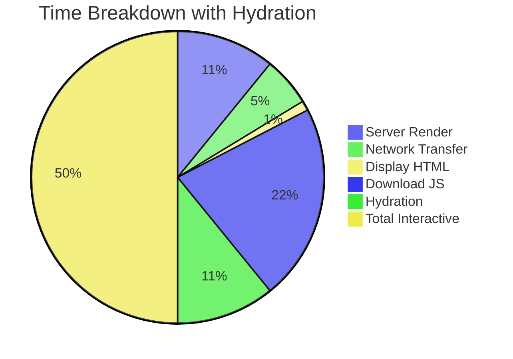

# Use Case 2: Hydration

## 📚 Overview

Hydration is the process where the client-side Angular application "takes over" the server-rendered HTML. It attaches event listeners, initializes component state, and makes the page fully interactive without re-rendering the entire DOM.

## 🎯 Learning Objectives

After completing this use case, you will:
- Understand what hydration is and why it's crucial for SSR
- Learn about Angular's non-destructive hydration (Angular 16+)
- Understand event replay and its benefits
- Handle common hydration issues

---

## 💧 What is Hydration?

```mermaid
%%{init: {'theme': 'base', 'themeVariables': { 'primaryColor': '#6366f1', 'primaryTextColor': '#fff'}}}%%
flowchart LR
    subgraph Server["🖥️ Server"]
        A[Render HTML] --> B[Send to Browser]
    end
    
    subgraph Browser["🌐 Browser"]
        C[Display HTML] --> D[Load JavaScript]
        D --> E[Hydration]
        E --> F[Interactive App]
    end
    
    B --> C
    
    style Server fill:#ede9fe,stroke:#8b5cf6
    style Browser fill:#dbeafe,stroke:#3b82f6
```



### The Hydration Process

1. **Server renders HTML** - Full content generated on server
2. **Browser displays HTML** - User sees content immediately
3. **JavaScript loads** - Angular bundles download in background
4. **Hydration begins** - Angular "attaches" to existing DOM
5. **App becomes interactive** - Events work, state is synchronized

---

## 🔄 Destructive vs Non-Destructive Hydration

### Before Angular 16 (Destructive)


**Problems:**
- ❌ Screen flicker as content is replaced
- ❌ Loses scroll position
- ❌ Wastes server rendering work
- ❌ Poor Cumulative Layout Shift (CLS)

### Angular 16+ (Non-Destructive)


**Benefits:**
- ✅ No flicker - DOM is preserved
- ✅ Scroll position maintained
- ✅ Server work is utilized
- ✅ Excellent CLS score

---

## 💻 Enabling Hydration

### Step 1: Configure Client Hydration

```typescript
// app.config.ts
import { ApplicationConfig } from '@angular/core';
import { provideClientHydration } from '@angular/platform-browser';

export const appConfig: ApplicationConfig = {
    providers: [
        provideClientHydration()  // Enable non-destructive hydration
    ]
};
```

### Step 2: Enhanced Options (Angular 17+)

```typescript
import { 
    provideClientHydration,
    withEventReplay,          // Replay events during hydration
    withHttpTransferCacheOptions  // Configure HTTP cache
} from '@angular/platform-browser';

export const appConfig: ApplicationConfig = {
    providers: [
        provideClientHydration(
            withEventReplay(),  // Queue and replay user events
            withHttpTransferCacheOptions({
                includePostRequests: true  // Cache POST requests too
            })
        )
    ]
};
```

---

## 🎮 Event Replay

Event Replay is a feature that captures user interactions (clicks, inputs) that happen **before** hydration completes, then replays them after.



### Why Event Replay Matters

Without event replay:
```
User clicks "Add to Cart" → Nothing happens → User frustrated 😤
```

With event replay:
```
User clicks "Add to Cart" → Event queued → Hydration → Event replayed → Item added! 🎉
```

---

## ⚠️ Common Hydration Issues

### 1. Hydration Mismatch
When server and client render different content:

```typescript
// ❌ BAD: Different content on server vs client
@Component({
    template: `<p>Current time: {{ currentTime }}</p>`
})
export class TimeComponent {
    currentTime = new Date().toISOString(); // Different on server vs client!
}

// ✅ GOOD: Use consistent data or skip hydration
@Component({
    template: `<p>Page loaded at: {{ loadTime$ | async }}</p>`
})
export class TimeComponent {
    loadTime$ = of(new Date().toISOString()).pipe(
        // Only emit on client
        isPlatformBrowser(this.platformId) ? tap() : EMPTY
    );
}
```

### 2. DOM Manipulation Before Hydration
```typescript
// ❌ BAD: Modifying DOM breaks hydration
ngOnInit() {
    document.body.classList.add('loaded'); // Breaks hydration!
}

// ✅ GOOD: Use Angular bindings or afterNextRender
ngOnInit() {
    afterNextRender(() => {
        document.body.classList.add('loaded');
    });
}
```

### 3. Skip Hydration for Dynamic Content
```html
<!-- Skip hydration for this subtree -->
<div ngSkipHydration>
    <app-live-clock></app-live-clock>
    <app-random-ad></app-random-ad>
</div>
```

---

## 🔍 Debugging Hydration

### Enable Hydration Warnings

```typescript
// main.ts (development only)
import { enableProdMode } from '@angular/core';

if (!environment.production) {
    // Hydration errors will be logged to console
}
```

### Common Warning Types

| Warning | Meaning | Solution |
|---------|---------|----------|
| `NodeMismatch` | DOM structure differs | Ensure consistent rendering |
| `TextNodeMismatch` | Text content differs | Avoid dynamic text on server |
| `AttributeMismatch` | Different attributes | Check bindings |

---

## 📊 Hydration Performance



### Key Metrics

| Metric | Without Hydration | With Hydration |
|--------|-------------------|----------------|
| **First Paint** | ~800ms | ~150ms |
| **Time to Interactive** | ~800ms | ~500ms |
| **CLS Score** | 0.15 (Poor) | 0 (Excellent) |
| **LCP** | ~1.2s | ~300ms |

---

## 📋 Interview Questions

### Basic
1. **What is hydration in the context of SSR?**
2. **What is the difference between destructive and non-destructive hydration?**
3. **How do you enable hydration in Angular 17+?**

### Intermediate
4. **What is event replay and why is it important?**
5. **When would you use ngSkipHydration?**
6. **What causes hydration mismatch errors?**

### Advanced
7. **How does Angular's hydration algorithm match server and client DOM?**
8. **What are the performance implications of large hydration trees?**
9. **How would you troubleshoot a hydration mismatch in production?**

---

## 🔗 Related Use Cases
- [Use Case 1: SSR Fundamentals](../use-case-1/guide.md) - Understanding SSR
- [Use Case 3: Transfer State](../use-case-3/guide.md) - Data sharing
- [Use Case 4: Platform Detection](../use-case-4/guide.md) - Browser/server code
