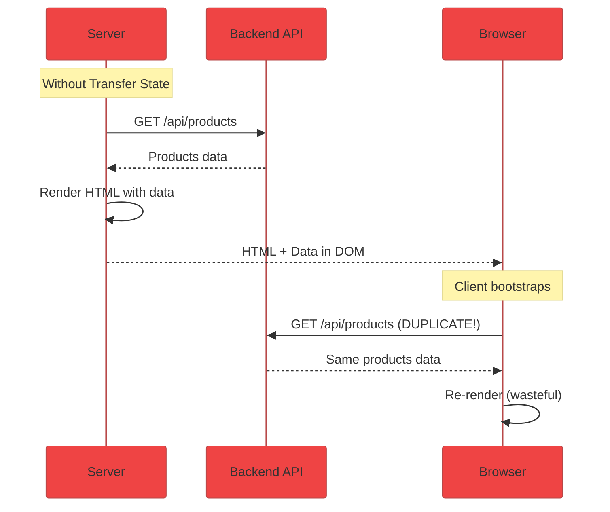
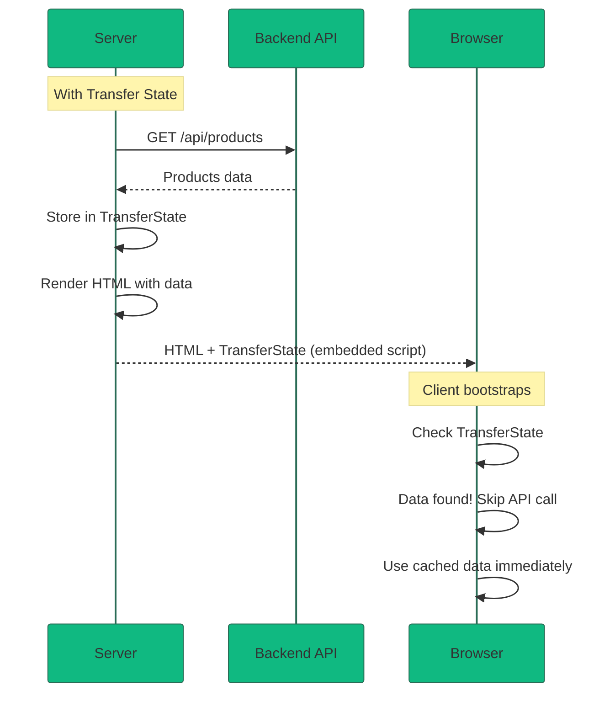

# Use Case 3: Transfer State

## 📚 Overview

Transfer State is a mechanism to share data between the server and client in Angular SSR applications. It prevents duplicate API calls by transferring the data fetched on the server to the client during hydration.

## 🎯 Learning Objectives

After completing this use case, you will:
- Understand why Transfer State is needed
- Learn to use TransferState API
- Implement HTTP caching for SSR
- Optimize API performance with state transfer

---

## 🤔 The Problem: Duplicate API Calls



### Problems Without Transfer State

- ❌ **Duplicate API calls** - Server and client fetch same data
- ❌ **Slower TTI** - Time to Interactive delayed
- ❌ **Server load** - Double the API requests
- ❌ **Flickering** - UI may flash as data reloads
- ❌ **Cache issues** - Data might be different

---

## ✅ The Solution: Transfer State



---

## 💻 Implementation

### Method 1: Manual TransferState API

```typescript
import { Component, OnInit, inject } from '@angular/core';
import { HttpClient } from '@angular/common/http';
import { TransferState, makeStateKey } from '@angular/core';
import { isPlatformServer } from '@angular/common';
import { PLATFORM_ID } from '@angular/core';

// Create a unique key for the data
const PRODUCTS_KEY = makeStateKey<Product[]>('products');

@Component({
    selector: 'app-products',
    template: `
        <div *ngFor="let product of products">
            {{ product.name }}
        </div>
    `
})
export class ProductsComponent implements OnInit {
    private http = inject(HttpClient);
    private transferState = inject(TransferState);
    private platformId = inject(PLATFORM_ID);
    
    products: Product[] = [];

    ngOnInit() {
        // Check if data exists in transfer state
        const cachedProducts = this.transferState.get(PRODUCTS_KEY, null);
        
        if (cachedProducts) {
            // Data found! Use it and remove from state
            this.products = cachedProducts;
            this.transferState.remove(PRODUCTS_KEY);
        } else {
            // No cached data, fetch from API
            this.http.get<Product[]>('/api/products').subscribe(data => {
                this.products = data;
                
                // If on server, store for transfer to client
                if (isPlatformServer(this.platformId)) {
                    this.transferState.set(PRODUCTS_KEY, data);
                }
            });
        }
    }
}
```

### Method 2: Automatic HTTP Caching (Angular 16+)

```typescript
// app.config.ts - Enable automatic HTTP transfer cache
import { ApplicationConfig } from '@angular/core';
import { provideClientHydration, withHttpTransferCacheOptions } from '@angular/platform-browser';

export const appConfig: ApplicationConfig = {
    providers: [
        provideClientHydration(
            withHttpTransferCacheOptions({
                // Cache GET requests automatically (default)
                includePostRequests: false,
                
                // Optional: Include POST requests
                // includePostRequests: true,
                
                // Optional: Filter which requests to cache
                filter: (req) => !req.url.includes('/no-cache')
            })
        )
    ]
};
```

With this configuration, HTTP GET requests are **automatically cached** with no code changes needed!

---

## 📦 How Transfer State Works Internally

### Server Side

```html
<!-- The server embeds TransferState as a script tag -->
<script id="ng-state" type="application/json">
{
    "products": [
        { "id": 1, "name": "Widget A" },
        { "id": 2, "name": "Widget B" }
    ]
}
</script>
```

### Client Side

```typescript
// Angular automatically reads this script tag
// and populates the TransferState service
```

---

## 🔧 Advanced Patterns

### Pattern 1: Service with Transfer State

```typescript
@Injectable({ providedIn: 'root' })
export class ProductService {
    private http = inject(HttpClient);
    private transferState = inject(TransferState);
    private platformId = inject(PLATFORM_ID);
    
    getProducts(): Observable<Product[]> {
        const key = makeStateKey<Product[]>('products');
        const cached = this.transferState.get(key, null);
        
        if (cached) {
            this.transferState.remove(key);
            return of(cached);
        }
        
        return this.http.get<Product[]>('/api/products').pipe(
            tap(data => {
                if (isPlatformServer(this.platformId)) {
                    this.transferState.set(key, data);
                }
            })
        );
    }
}
```

### Pattern 2: Resolver with Transfer State

```typescript
export const productResolver: ResolveFn<Product[]> = (route) => {
    const http = inject(HttpClient);
    const transferState = inject(TransferState);
    const platformId = inject(PLATFORM_ID);
    
    const key = makeStateKey<Product[]>(`products-${route.params['category']}`);
    const cached = transferState.get(key, null);
    
    if (cached) {
        transferState.remove(key);
        return of(cached);
    }
    
    return http.get<Product[]>(`/api/products/${route.params['category']}`).pipe(
        tap(data => {
            if (isPlatformServer(platformId)) {
                transferState.set(key, data);
            }
        })
    );
};
```

### Pattern 3: Dynamic State Keys

```typescript
// Use dynamic keys for paginated or filtered data
function createProductKey(page: number, filter: string): StateKey<Product[]> {
    return makeStateKey<Product[]>(`products-page-${page}-filter-${filter}`);
}
```

---

## ⚠️ Common Pitfalls

### 1. Forgetting to Remove State
```typescript
// ❌ Data stays in transfer state forever
const data = this.transferState.get(KEY, null);
this.items = data;

// ✅ Always remove after consuming
const data = this.transferState.get(KEY, null);
if (data) {
    this.items = data;
    this.transferState.remove(KEY);  // Important!
}
```

### 2. Non-Serializable Data
```typescript
// ❌ Functions and circular references can't be serialized
this.transferState.set(KEY, {
    data: products,
    loadMore: () => {}  // Will fail!
});

// ✅ Only store plain data
this.transferState.set(KEY, products);
```

### 3. Sensitive Data
```typescript
// ❌ This ends up in the HTML source!
this.transferState.set(makeStateKey('user'), {
    authToken: 'secret123',  // Visible to anyone!
    email: 'user@example.com'
});

// ✅ Never transfer sensitive data
// Fetch auth data client-side only
```

---

## 📊 Performance Impact

| Metric | Without Transfer State | With Transfer State |
|--------|----------------------|---------------------|
| **API Calls** | 2x (server + client) | 1x (server only) |
| **TTI** | ~1200ms | ~600ms |
| **Network Usage** | 2x data transfer | 1x data transfer |
| **Server Load** | Higher | Lower |

---

## 📋 Interview Questions

### Basic
1. **What is Transfer State and why is it needed?**
2. **How do you create a state key in TransferState?**
3. **What happens if you don't remove items from TransferState?**

### Intermediate
4. **How does automatic HTTP caching work in Angular 16+?**
5. **What data types can be stored in TransferState?**
6. **How would you handle paginated data with Transfer State?**

### Advanced
7. **How does Angular serialize and deserialize TransferState?**
8. **What are the security considerations for Transfer State?**
9. **How would you implement cache invalidation with Transfer State?**

---

## 🔗 Related Use Cases
- [Use Case 1: SSR Fundamentals](../use-case-1/guide.md) - SSR basics
- [Use Case 2: Hydration](../use-case-2/guide.md) - Client takeover
- [Use Case 5: SEO Optimization](../use-case-5/guide.md) - Meta tags
