# Use Case 4: Platform Detection

## 📚 Overview

Platform detection allows you to determine whether your code is running on the server or in the browser. This is crucial in SSR applications because many browser APIs (like `window`, `document`, `localStorage`) don't exist on the server.

## 🎯 Learning Objectives

After completing this use case, you will:
- Understand why platform detection is necessary
- Use `isPlatformBrowser` and `isPlatformServer` functions
- Handle browser-only code safely
- Implement conditional logic based on platform

---

## 🤔 The Problem

```mermaid
%%{init: {'theme': 'base', 'themeVariables': { 'primaryColor': '#ef4444'}}}%%
flowchart LR
    A[SSR App] --> B{window.innerWidth}
    B -->|Server| C[💥 ReferenceError: window is not defined]
    B -->|Browser| D[✅ Returns width]
    
    style C fill:#fee2e2,stroke:#ef4444
    style D fill:#d1fae5,stroke:#10b981
```



### Common Browser-Only APIs That Break SSR

| API | Why It Fails | Alternative |
|-----|-------------|-------------|
| `window` | Not available on Node.js | Platform check |
| `document` | DOM doesn't exist on server | Renderer2, platform check |
| `localStorage` | Browser storage API | Platform check + service |
| `navigator` | Browser info API | Platform check |
| `setTimeout` | Can delay server response | Use carefully with cleanup |

---

## 💻 Solution: Platform Detection

### Basic Usage

```typescript
import { Component, PLATFORM_ID, inject } from '@angular/core';
import { isPlatformBrowser, isPlatformServer } from '@angular/common';

@Component({
    selector: 'app-platform-aware',
    template: `<p>Running on: {{ platform }}</p>`
})
export class PlatformAwareComponent {
    private platformId = inject(PLATFORM_ID);
    
    platform = isPlatformBrowser(this.platformId) ? 'Browser' : 'Server';
    
    ngOnInit() {
        // ✅ Safe to use window
        if (isPlatformBrowser(this.platformId)) {
            console.log('Window width:', window.innerWidth);
        }
    }
}
```

### The PLATFORM_ID Token

```typescript
// Angular provides this injection token
import { PLATFORM_ID } from '@angular/core';

// On browser: "browser"
// On server: "server"

constructor(@Inject(PLATFORM_ID) private platformId: Object) {
    console.log('Platform ID:', platformId); 
}
```

---

## 📋 Common Patterns

### Pattern 1: Conditional Initialization

```typescript
@Component({...})
export class ChartComponent implements OnInit {
    private platformId = inject(PLATFORM_ID);
    
    ngOnInit() {
        if (isPlatformBrowser(this.platformId)) {
            // Chart.js requires DOM
            this.initializeChart();
        }
    }
    
    private initializeChart() {
        // Safe to access canvas element
        const ctx = document.getElementById('chart');
        new Chart(ctx, { ... });
    }
}
```

### Pattern 2: Platform-Safe Service

```typescript
@Injectable({ providedIn: 'root' })
export class StorageService {
    private platformId = inject(PLATFORM_ID);
    private storage = new Map<string, string>();
    
    get(key: string): string | null {
        if (isPlatformBrowser(this.platformId)) {
            return localStorage.getItem(key);
        }
        // Fallback for server
        return this.storage.get(key) || null;
    }
    
    set(key: string, value: string): void {
        if (isPlatformBrowser(this.platformId)) {
            localStorage.setItem(key, value);
        } else {
            this.storage.set(key, value);
        }
    }
}
```

### Pattern 3: afterNextRender Hook (Angular 17+)

```typescript
import { afterNextRender, afterRender } from '@angular/core';

@Component({...})
export class AnimatedComponent {
    constructor() {
        // Only runs in browser, after component renders
        afterNextRender(() => {
            // Safe to access DOM
            const element = document.querySelector('.animate');
            element.classList.add('visible');
        });
    }
}
```

### Pattern 4: Conditional Template Rendering

```typescript
@Component({
    template: `
        <!-- Only render on browser -->
        <ng-container *ngIf="isBrowser">
            <app-video-player [src]="videoUrl"></app-video-player>
        </ng-container>
        
        <!-- Server placeholder -->
        <ng-container *ngIf="!isBrowser">
            <div class="video-placeholder">
                <p>Video will load in browser</p>
            </div>
        </ng-container>
    `
})
export class VideoContainerComponent {
    isBrowser = isPlatformBrowser(inject(PLATFORM_ID));
}
```

---

## 🔧 Advanced Techniques

### Using Renderer2 Instead of DOM APIs

```typescript
// ❌ Direct DOM manipulation
document.body.classList.add('dark-theme');

// ✅ Using Renderer2 (works on server too)
@Component({...})
export class ThemeComponent {
    private renderer = inject(Renderer2);
    private document = inject(DOCUMENT);
    
    setDarkTheme() {
        this.renderer.addClass(this.document.body, 'dark-theme');
    }
}
```

### Using DOCUMENT Token

```typescript
import { DOCUMENT } from '@angular/common';

@Component({...})
export class ScrollComponent {
    private document = inject(DOCUMENT);
    private platformId = inject(PLATFORM_ID);
    
    scrollToTop() {
        if (isPlatformBrowser(this.platformId)) {
            this.document.defaultView?.scrollTo(0, 0);
        }
    }
}
```

---

## ⚠️ Common Pitfalls

### 1. Checking Platform Too Late

```typescript
// ❌ Error happens before check
export class BadComponent {
    windowWidth = window.innerWidth; // 💥 Error on server!
    
    ngOnInit() {
        if (isPlatformBrowser(this.platformId)) {
            // Too late!
        }
    }
}

// ✅ Check before accessing
export class GoodComponent {
    windowWidth: number | null = null;
    
    ngOnInit() {
        if (isPlatformBrowser(this.platformId)) {
            this.windowWidth = window.innerWidth;
        }
    }
}
```

### 2. Memory Leaks with Subscriptions

```typescript
// ❌ Subscription never cleaned up on server
export class BadComponent implements OnInit {
    ngOnInit() {
        fromEvent(window, 'resize').subscribe(...);
    }
}

// ✅ Guard and cleanup
export class GoodComponent implements OnInit, OnDestroy {
    private destroy$ = new Subject<void>();
    
    ngOnInit() {
        if (isPlatformBrowser(this.platformId)) {
            fromEvent(window, 'resize').pipe(
                takeUntil(this.destroy$)
            ).subscribe(...);
        }
    }
    
    ngOnDestroy() {
        this.destroy$.next();
    }
}
```

### 3. Third-Party Libraries

```typescript
// ❌ Library accesses window immediately
import Swiper from 'swiper'; // 💥 May crash on server!

// ✅ Dynamic import only on browser
async initSlider() {
    if (isPlatformBrowser(this.platformId)) {
        const { default: Swiper } = await import('swiper');
        new Swiper('.slider', { ... });
    }
}
```

---

## 📊 Decision Tree

```mermaid
%%{init: {'theme': 'base', 'themeVariables': { 'primaryColor': '#6366f1'}}}%%
flowchart TD
    A[Need Browser API?] -->|Yes| B{Is it required on server?}
    A -->|No| Z[✅ Proceed normally]
    
    B -->|No| C[Use isPlatformBrowser guard]
    B -->|Yes| D{Is there an Angular alternative?}
    
    D -->|Yes| E[Use Renderer2, DOCUMENT, etc.]
    D -->|No| F[Provide server fallback]
    
    style C fill:#d1fae5,stroke:#10b981
    style E fill:#d1fae5,stroke:#10b981
    style F fill:#fef3c7,stroke:#f59e0b
```



---

### 📦 Data Flow Summary (Visual Box Diagram)

```
┌─────────────────────────────────────────────────────────────┐
│  PLATFORM DETECTION: BROWSER vs SERVER                      │
│                                                             │
│   PROBLEM:                                                  │
│   ┌───────────────────────────────────────────────────────┐ │
│   │ window.innerWidth  → 💥 Server: "window is undefined" │ │
│   │ localStorage       → 💥 Server: "localStorage undefined"│
│   │ document.querySelector → 💥 Server: no DOM           │ │
│   └───────────────────────────────────────────────────────┘ │
│                                                             │
│   SOLUTION:                                                 │
│   ┌───────────────────────────────────────────────────────┐ │
│   │ import { isPlatformBrowser } from '@angular/common';  │ │
│   │ private platformId = inject(PLATFORM_ID);             │ │
│   │                                                       │ │
│   │ if (isPlatformBrowser(this.platformId)) {             │ │
│   │   // Safe to use window, localStorage, etc.           │ │
│   │   console.log(window.innerWidth);                     │ │
│   │ }                                                     │ │
│   └───────────────────────────────────────────────────────┘ │
│                                                             │
│   MODERN ALTERNATIVE (Angular 17+):                         │
│   ┌───────────────────────────────────────────────────────┐ │
│   │ afterNextRender(() => {                               │ │
│   │   // Only runs in browser, after render               │ │
│   │   element.classList.add('visible');                   │ │
│   │ });                                                   │ │
│   └───────────────────────────────────────────────────────┘ │
│                                                             │
│   Use Renderer2 instead of document.* for SSR safety!      │
└─────────────────────────────────────────────────────────────┘
```

> **Key Takeaway**: isPlatformBrowser guard before window/localStorage. Use afterNextRender for DOM access. Use Renderer2 instead of direct DOM!

---

## 📋 Interview Questions

### Basic
1. **What is PLATFORM_ID in Angular?**
2. **What's the difference between isPlatformBrowser and isPlatformServer?**
3. **Why can't we use window directly in SSR apps?**

### Intermediate
4. **How would you make localStorage work in an SSR app?**
5. **What is afterNextRender and when would you use it?**
6. **How do you handle third-party libraries that require DOM access?**

### Advanced
7. **What are the performance implications of platform checks?**
8. **How would you lazy-load a browser-only library?**
9. **What strategies exist for testing platform-dependent code?**

---

## 🔗 Related Use Cases
- [Use Case 1: SSR Fundamentals](../use-case-1/guide.md) - SSR basics
- [Use Case 2: Hydration](../use-case-2/guide.md) - Client takeover
- [Use Case 5: SEO Optimization](../use-case-5/guide.md) - Meta tags
