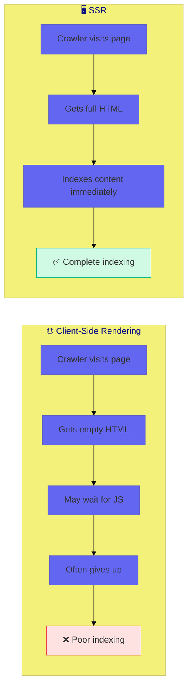

# Use Case 5: SEO Optimization

## 📚 Overview

SSR provides a perfect opportunity to implement SEO best practices. Since pages are rendered on the server with full content, search engine crawlers can properly index your site. This use case covers meta tags, Open Graph, structured data, and other SEO techniques.

## 🎯 Learning Objectives

After completing this use case, you will:
- Implement dynamic meta tags with Meta and Title services
- Add Open Graph tags for social sharing
- Implement structured data (JSON-LD)
- Create SEO-friendly URLs and canonical tags

---

## 📊 Why SSR is Essential for SEO



---

## 💻 Meta Tags

### Title Service

```typescript
import { Title } from '@angular/platform-browser';
import { Component, inject } from '@angular/core';

@Component({
    selector: 'app-product-page',
    template: `<h1>{{ product.name }}</h1>`
})
export class ProductPageComponent {
    private titleService = inject(Title);
    product = { name: 'Amazing Widget', brand: 'Acme' };
    
    ngOnInit() {
        this.titleService.setTitle(
            `${this.product.name} | ${this.product.brand} - Best Prices`
        );
    }
}
```

### Meta Service

```typescript
import { Meta, Title } from '@angular/platform-browser';

@Component({...})
export class ProductPageComponent {
    private meta = inject(Meta);
    private title = inject(Title);
    
    ngOnInit() {
        // Set page title
        this.title.setTitle('Amazing Widget - Best Prices | Acme Store');
        
        // Set meta description
        this.meta.updateTag({ 
            name: 'description', 
            content: 'Buy Amazing Widget at the best price. Free shipping on orders over $50.'
        });
        
        // Set robots directives
        this.meta.updateTag({ 
            name: 'robots', 
            content: 'index, follow' 
        });
        
        // Set canonical URL
        this.meta.updateTag({ 
            rel: 'canonical', 
            href: 'https://example.com/products/amazing-widget' 
        });
    }
    
    ngOnDestroy() {
        // Clean up meta tags
        this.meta.removeTag('name="description"');
    }
}
```

---

## 📱 Open Graph Tags

Open Graph tags control how your pages appear when shared on social media.

```typescript
@Component({...})
export class ProductPageComponent {
    private meta = inject(Meta);
    
    setOpenGraphTags(product: Product) {
        // Basic OG tags
        this.meta.updateTag({ property: 'og:title', content: product.name });
        this.meta.updateTag({ property: 'og:description', content: product.shortDescription });
        this.meta.updateTag({ property: 'og:image', content: product.imageUrl });
        this.meta.updateTag({ property: 'og:url', content: `https://example.com/products/${product.slug}` });
        this.meta.updateTag({ property: 'og:type', content: 'product' });
        
        // Twitter Card tags
        this.meta.updateTag({ name: 'twitter:card', content: 'summary_large_image' });
        this.meta.updateTag({ name: 'twitter:title', content: product.name });
        this.meta.updateTag({ name: 'twitter:description', content: product.shortDescription });
        this.meta.updateTag({ name: 'twitter:image', content: product.imageUrl });
        
        // Product-specific OG tags
        this.meta.updateTag({ property: 'product:price:amount', content: product.price.toString() });
        this.meta.updateTag({ property: 'product:price:currency', content: 'USD' });
    }
}
```

### Resulting HTML

```html
<head>
    <title>Amazing Widget - Best Prices | Acme Store</title>
    <meta name="description" content="Buy Amazing Widget at the best price...">
    <meta property="og:title" content="Amazing Widget">
    <meta property="og:description" content="The best widget for your needs">
    <meta property="og:image" content="https://example.com/images/widget.jpg">
    <meta property="og:url" content="https://example.com/products/amazing-widget">
    <meta name="twitter:card" content="summary_large_image">
    <!-- ... -->
</head>
```

---

## 📋 Structured Data (JSON-LD)

Structured data helps search engines understand your content and display rich snippets.

```typescript
import { DOCUMENT } from '@angular/common';

@Component({...})
export class ProductPageComponent {
    private document = inject(DOCUMENT);
    private renderer = inject(Renderer2);
    
    addStructuredData(product: Product) {
        const script = this.renderer.createElement('script');
        script.type = 'application/ld+json';
        
        const structuredData = {
            '@context': 'https://schema.org',
            '@type': 'Product',
            name: product.name,
            description: product.description,
            image: product.imageUrl,
            sku: product.sku,
            brand: {
                '@type': 'Brand',
                name: product.brand
            },
            offers: {
                '@type': 'Offer',
                price: product.price,
                priceCurrency: 'USD',
                availability: 'https://schema.org/InStock',
                url: `https://example.com/products/${product.slug}`
            },
            aggregateRating: {
                '@type': 'AggregateRating',
                ratingValue: product.rating,
                reviewCount: product.reviewCount
            }
        };
        
        script.text = JSON.stringify(structuredData);
        this.renderer.appendChild(this.document.head, script);
    }
}
```

### Common Schema Types

| Type | Use Case |
|------|----------|
| `Product` | E-commerce product pages |
| `Article` | Blog posts, news articles |
| `Organization` | Company pages |
| `BreadcrumbList` | Navigation breadcrumbs |
| `FAQPage` | FAQ sections |
| `HowTo` | Tutorial pages |
| `Event` | Event listings |

---

## 🔧 SEO Service Pattern

Create a reusable SEO service:

```typescript
@Injectable({ providedIn: 'root' })
export class SeoService {
    private meta = inject(Meta);
    private title = inject(Title);
    private document = inject(DOCUMENT);
    private renderer = inject(Renderer2);
    private platformId = inject(PLATFORM_ID);
    
    updateSeo(config: SeoConfig) {
        // Title
        if (config.title) {
            this.title.setTitle(config.title);
        }
        
        // Meta tags
        if (config.description) {
            this.meta.updateTag({ name: 'description', content: config.description });
        }
        
        // Open Graph
        if (config.ogTitle) {
            this.meta.updateTag({ property: 'og:title', content: config.ogTitle });
        }
        if (config.ogImage) {
            this.meta.updateTag({ property: 'og:image', content: config.ogImage });
        }
        
        // Canonical
        if (config.canonical) {
            this.updateCanonical(config.canonical);
        }
        
        // Structured data
        if (config.structuredData) {
            this.addStructuredData(config.structuredData);
        }
    }
    
    private updateCanonical(url: string) {
        let link: HTMLLinkElement = this.document.querySelector('link[rel="canonical"]');
        
        if (!link) {
            link = this.renderer.createElement('link');
            this.renderer.setAttribute(link, 'rel', 'canonical');
            this.renderer.appendChild(this.document.head, link);
        }
        
        this.renderer.setAttribute(link, 'href', url);
    }
    
    private addStructuredData(data: object) {
        const script = this.renderer.createElement('script');
        script.type = 'application/ld+json';
        script.text = JSON.stringify(data);
        this.renderer.appendChild(this.document.head, script);
    }
}

interface SeoConfig {
    title?: string;
    description?: string;
    ogTitle?: string;
    ogImage?: string;
    canonical?: string;
    structuredData?: object;
}
```

### Using the Service

```typescript
@Component({...})
export class ProductPageComponent {
    private seo = inject(SeoService);
    private route = inject(ActivatedRoute);
    
    ngOnInit() {
        this.route.data.subscribe(({ product }) => {
            this.seo.updateSeo({
                title: `${product.name} | Acme Store`,
                description: product.shortDescription,
                ogTitle: product.name,
                ogImage: product.imageUrl,
                canonical: `https://example.com/products/${product.slug}`,
                structuredData: this.buildProductSchema(product)
            });
        });
    }
}
```

---

## 🌐 Route-Based SEO with Resolvers

```typescript
// product.resolver.ts
export const productResolver: ResolveFn<Product> = (route) => {
    const productService = inject(ProductService);
    const seo = inject(SeoService);
    
    return productService.getProduct(route.params['slug']).pipe(
        tap(product => {
            seo.updateSeo({
                title: `${product.name} | Store`,
                description: product.description.substring(0, 160),
                ogImage: product.imageUrl
            });
        })
    );
};

// app.routes.ts
const routes: Routes = [
    {
        path: 'products/:slug',
        component: ProductPageComponent,
        resolve: { product: productResolver }
    }
];
```

---

## 📋 SEO Checklist

✅ **Title Tags**
- Unique per page
- 50-60 characters
- Include primary keyword

✅ **Meta Descriptions**
- Unique per page
- 150-160 characters
- Include call to action

✅ **Open Graph**
- og:title, og:description, og:image
- Image should be 1200x630px

✅ **Structured Data**
- Valid JSON-LD
- Match page content
- Test with Google's tool

✅ **Technical**
- Canonical URLs
- robots.txt
- XML sitemap

---

## 📋 Interview Questions

### Basic
1. **Why is SSR important for SEO?**
2. **How do you set page titles dynamically in Angular?**
3. **What are Open Graph tags?**

### Intermediate
4. **How do you implement structured data in Angular?**
5. **What's the difference between Meta.updateTag and Meta.addTag?**
6. **How would you handle SEO for a route with dynamic data?**

### Advanced
7. **How do you implement canonical URLs dynamically?**
8. **What strategies exist for SEO in SPAs without SSR?**
9. **How would you generate a dynamic sitemap.xml?**

---

## 🔗 Related Use Cases
- [Use Case 1: SSR Fundamentals](../use-case-1/guide.md) - SSR basics
- [Use Case 3: Transfer State](../use-case-3/guide.md) - Data sharing
- [Use Case 6: Prerendering](../use-case-6/guide.md) - Static generation
