# Use Case 6: Prerendering (SSG)

## 📚 Overview

Prerendering (also called Static Site Generation or SSG) generates HTML at **build time** rather than runtime. Unlike SSR which renders on each request, prerendered pages are generated once and served as static files - providing the fastest possible page loads.

## 🎯 Learning Objectives

After completing this use case, you will:
- Understand the difference between SSR and SSG
- Configure prerendering in Angular
- Know when to use SSG vs SSR
- Implement dynamic route prerendering

---

## 🔄 SSR vs SSG Comparison

```mermaid
%%{init: {'theme': 'base', 'themeVariables': { 'primaryColor': '#6366f1'}}}%%
flowchart TB
    subgraph SSR["🖥️ Server-Side Rendering"]
        A1[Request] --> A2[Server renders HTML]
        A2 --> A3[Response with HTML]
        A3 --> A4[Every request = new render]
    end
    
    subgraph SSG["📄 Static Site Generation"]
        B1[Build] --> B2[Pre-render all pages]
        B2 --> B3[Static HTML files]
        B3 --> B4[Serve from CDN]
        B4 --> B5[Instant delivery]
    end
    
    style SSR fill:#dbeafe,stroke:#3b82f6
    style SSG fill:#d1fae5,stroke:#10b981
```



### Key Differences

| Aspect | SSR | SSG (Prerendering) |
|--------|-----|-------------------|
| **When rendered** | On each request | At build time |
| **Server needed** | Yes (Node.js) | No (static hosting) |
| **Response time** | ~100-500ms | ~10-50ms |
| **Data freshness** | Real-time | Build-time snapshot |
| **Hosting cost** | Higher | Lower (CDN/S3) |
| **Best for** | Dynamic content | Static content |

---

## ⚡ When to Use Prerendering

### ✅ Great Use Cases

- **Marketing pages** - Landing pages, pricing, features
- **Documentation** - Help docs, guides, tutorials
- **Blogs** - Articles, news (with rebuild on publish)
- **E-commerce listings** - Product catalog pages
- **Legal pages** - Terms, privacy policy

### ❌ Not Recommended

- **User dashboards** - Personalized content
- **Real-time data** - Stock prices, live scores
- **Search results** - Dynamic query results
- **Shopping carts** - User-specific state

---

## 💻 Configuring Prerendering

### Step 1: angular.json Configuration

```json
{
    "projects": {
        "your-app": {
            "architect": {
                "prerender": {
                    "builder": "@angular-devkit/build-angular:prerender",
                    "options": {
                        "routes": [
                            "/",
                            "/about",
                            "/products",
                            "/contact"
                        ]
                    },
                    "configurations": {
                        "production": {
                            "browserTarget": "your-app:build:production",
                            "serverTarget": "your-app:server:production"
                        }
                    }
                }
            }
        }
    }
}
```

### Step 2: Run Prerender Build

```bash
# Generate static HTML files
ng run your-app:prerender

# Or with npm script
npm run prerender
```

### Step 3: Output Structure

```
dist/
├── your-app/
│   ├── browser/
│   │   ├── index.html           # Prerendered home page
│   │   ├── about/
│   │   │   └── index.html       # Prerendered about page
│   │   ├── products/
│   │   │   └── index.html       # Prerendered products page
│   │   ├── contact/
│   │   │   └── index.html       # Prerendered contact page
│   │   └── *.js, *.css          # Static assets
```

---

## 🔧 Dynamic Route Prerendering

### Option 1: routes.txt File

Create a file listing all routes to prerender:

```text
# routes.txt
/
/about
/products
/products/widget-a
/products/widget-b
/products/gadget-x
/blog
/blog/getting-started
/blog/advanced-tips
```

Then reference it in angular.json:

```json
{
    "prerender": {
        "options": {
            "routesFile": "routes.txt"
        }
    }
}
```

### Option 2: Route Discovery Script

```typescript
// scripts/generate-routes.ts
import { writeFileSync } from 'fs';

async function generateRoutes() {
    // Fetch products from API/CMS
    const products = await fetch('https://api.example.com/products')
        .then(r => r.json());
    
    // Fetch blog posts
    const posts = await fetch('https://api.example.com/posts')
        .then(r => r.json());
    
    const routes = [
        '/',
        '/about',
        '/contact',
        ...products.map(p => `/products/${p.slug}`),
        ...posts.map(p => `/blog/${p.slug}`)
    ];
    
    writeFileSync('routes.txt', routes.join('\n'));
    console.log(`Generated ${routes.length} routes`);
}

generateRoutes();
```

Run before build:

```bash
npx ts-node scripts/generate-routes.ts
ng run your-app:prerender
```

---

## 🌐 Hybrid Approach: SSR + SSG

You can combine both strategies:

```typescript
// app.routes.ts
const routes: Routes = [
    // Prerendered (static)
    { path: '', component: HomePage },
    { path: 'about', component: AboutPage },
    { path: 'pricing', component: PricingPage },
    
    // SSR (dynamic)
    { path: 'dashboard', component: DashboardPage },
    { path: 'search', component: SearchPage },
    { path: 'cart', component: CartPage }
];
```

### Deployment Strategy


---

## 📊 Performance Comparison

| Metric | CSR | SSR | SSG |
|--------|-----|-----|-----|
| **TTFB** | ~500ms | ~200ms | ~20ms |
| **FCP** | ~1.5s | ~400ms | ~100ms |
| **LCP** | ~2s | ~600ms | ~200ms |
| **TTI** | ~2.5s | ~800ms | ~500ms |

### Why SSG is Fastest

1. **No server computation** - HTML is ready
2. **CDN edge caching** - Served from nearest location
3. **No database queries** - Content is baked in
4. **Optimal caching headers** - Aggressive cache policies

---

## 🔄 Incremental Static Regeneration (ISR)

For content that changes occasionally, you can implement ISR:

```typescript
// Rebuild specific pages periodically
// Using a revalidation endpoint

// api/revalidate.ts (example with Edge function)
export default async function handler(req, res) {
    const { path, secret } = req.query;
    
    if (secret !== process.env.REVALIDATE_SECRET) {
        return res.status(401).json({ error: 'Unauthorized' });
    }
    
    try {
        await triggerRebuildForPath(path);
        return res.json({ revalidated: true });
    } catch (err) {
        return res.status(500).json({ error: 'Revalidation failed' });
    }
}
```

---

## 📦 Deployment Options

### CDN/Static Hosting

| Provider | Features |
|----------|----------|
| **Vercel** | Edge caching, ISR support |
| **Netlify** | Edge functions, instant rollback |
| **Cloudflare Pages** | Global CDN, Web Analytics |
| **AWS S3 + CloudFront** | Scalable, cost-effective |
| **Firebase Hosting** | Google CDN, easy setup |

### Example: Netlify Deployment

```toml
# netlify.toml
[build]
    command = "npm run prerender"
    publish = "dist/your-app/browser"

[[redirects]]
    from = "/*"
    to = "/index.html"
    status = 200
```

---

## ⚠️ Common Pitfalls

### 1. Forgetting Dynamic Data

```typescript
// ❌ This will show stale data
@Component({
    template: `<p>Last updated: {{ now }}</p>`
})
export class BadComponent {
    now = new Date().toISOString(); // Frozen at build time!
}

// ✅ Hydrate with fresh data on client
@Component({
    template: `<p>Last updated: {{ now$ | async }}</p>`
})
export class GoodComponent {
    now$ = isPlatformBrowser(this.platformId) 
        ? of(new Date().toISOString())
        : of('Loading...');
}
```

### 2. API Routes Not Available at Build

```typescript
// ❌ API might not be available during build
ngOnInit() {
    this.http.get('/api/config').subscribe(...);
}

// ✅ Use transfer state or environment files
environment.config.apiUrl // Configured at build time
```

### 3. Missing Routes

```bash
# ❌ Route not in prerender list = 404
# User visits /products/new-product

# ✅ Ensure dynamic routes are generated
npx ts-node generate-routes.ts
```

---

## 📋 Interview Questions

### Basic
1. **What is prerendering/SSG and how does it differ from SSR?**
2. **What are the benefits of serving prerendered pages from a CDN?**
3. **When would you choose SSG over SSR?**

### Intermediate
4. **How do you configure prerendering for dynamic routes?**
5. **What is Incremental Static Regeneration (ISR)?**
6. **How do you handle content that changes after build?**

### Advanced
7. **How would you implement a hybrid SSR/SSG architecture?**
8. **What are the trade-offs between build time and page count in SSG?**
9. **How do you manage cache invalidation for prerendered content?**

---

## 🔗 Related Use Cases
- [Use Case 1: SSR Fundamentals](../use-case-1/guide.md) - SSR basics
- [Use Case 2: Hydration](../use-case-2/guide.md) - Client takeover
- [Use Case 5: SEO Optimization](../use-case-5/guide.md) - Meta tags
