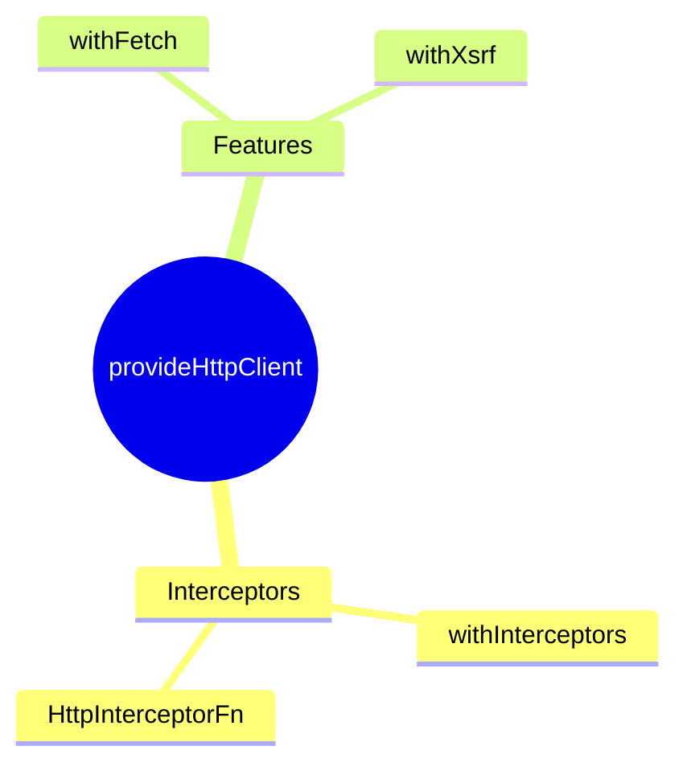

# 🌐 provideHttpClient

> **💡 Lightbulb Moment**: Functional interceptors = simple functions, no class boilerplate!


## 📋 Table of Contents
- [Functional Interceptor](#functional-interceptor)
- [HTTP Features](#http-features)
  - [📦 Data Flow Summary (Visual Box Diagram)](#data-flow-summary-visual-box-diagram)
- [🧠 Mind Map](#mind-map)

---
---

## Functional Interceptor

```typescript
export const authInterceptor: HttpInterceptorFn = (req, next) => {
    const token = getToken();
    if (token) {
        req = req.clone({ setHeaders: { Authorization: `Bearer ${token}` } });
    }
    return next(req);
};
```

---

## HTTP Features

| Feature | Purpose |
|---------|---------|
| `withInterceptors()` | Functional interceptors |
| `withFetch()` | Use fetch API |
| `withXsrfConfiguration()` | XSRF protection |

---

### 📦 Data Flow Summary (Visual Box Diagram)

```
┌─────────────────────────────────────────────────────────────┐
│  provideHttpClient: FUNCTIONAL HTTP CONFIG                  │
│                                                             │
│   FUNCTIONAL INTERCEPTOR (NO CLASS!):                       │
│   ┌───────────────────────────────────────────────────────┐ │
│   │ export const authInterceptor: HttpInterceptorFn =     │ │
│   │   (req, next) => {                                    │ │
│   │     const token = getToken();                         │ │
│   │     if (token) {                                      │ │
│   │       req = req.clone({                               │ │
│   │         setHeaders: { Authorization: `Bearer ${token}` }│
│   │       });                                             │ │
│   │     }                                                 │ │
│   │     return next(req);                                 │ │
│   │   };                                                  │ │
│   └───────────────────────────────────────────────────────┘ │
│                                                             │
│   REGISTRATION:                                             │
│   provideHttpClient(                                        │
│     withInterceptors([authInterceptor, loggingInterceptor]),│
│     withFetch(),               // Use fetch API            │
│     withXsrfConfiguration()    // XSRF protection          │
│   )                                                         │
└─────────────────────────────────────────────────────────────┘
```

> **Key Takeaway**: Functional interceptors = simple functions! No @Injectable or class boilerplate. Use withInterceptors() to register!

---

## 🧠 Mind Map


