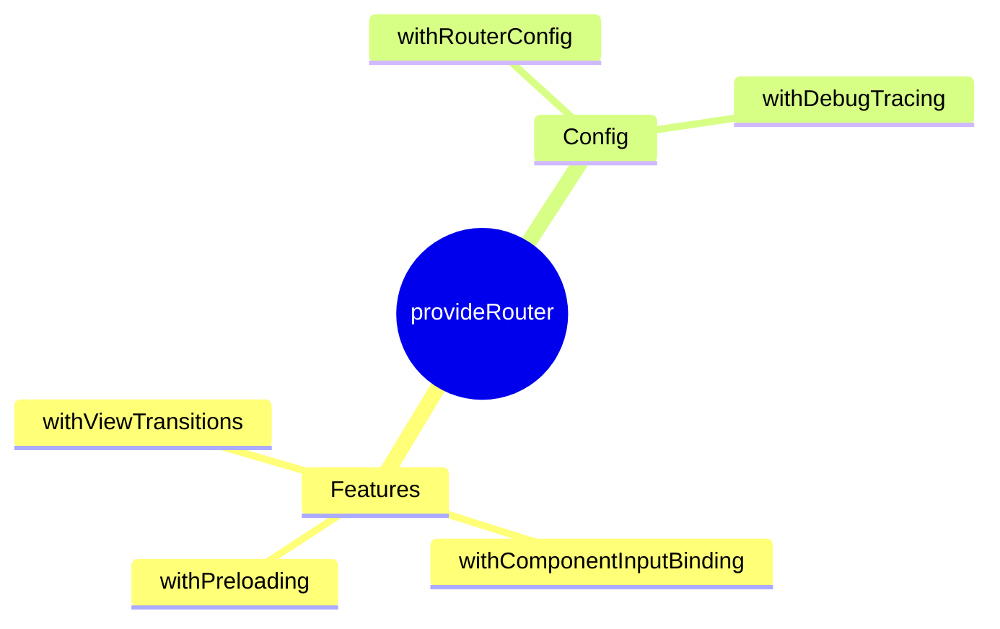

# 🛤️ provideRouter

> **💡 Lightbulb Moment**: `withComponentInputBinding()` = route params automatically bind to @Input()!


## 📋 Table of Contents
- [Basic Setup](#basic-setup)
- [Router Features](#router-features)
  - [📦 Data Flow Summary (Visual Box Diagram)](#data-flow-summary-visual-box-diagram)
- [🧠 Mind Map](#mind-map)

---
---

## Basic Setup

```typescript
provideRouter(routes)
```

---

## Router Features

| Feature | Purpose |
|---------|---------|
| `withPreloading()` | Preload lazy routes |
| `withComponentInputBinding()` | Bind params to inputs |
| `withViewTransitions()` | Page animations |
| `withHashLocation()` | Hash-based URLs |

---

### 📦 Data Flow Summary (Visual Box Diagram)

```
┌─────────────────────────────────────────────────────────────┐
│  provideRouter: FUNCTIONAL ROUTING CONFIG                   │
│                                                             │
│   BASIC:                                                    │
│   provideRouter(routes)                                     │
│                                                             │
│   WITH FEATURES:                                            │
│   ┌───────────────────────────────────────────────────────┐ │
│   │ provideRouter(routes,                                 │ │
│   │   withPreloading(PreloadAllModules),  // Preload lazy │ │
│   │   withComponentInputBinding(),  // Params → @Input()! │ │
│   │   withViewTransitions(),        // Page animations    │ │
│   │   withHashLocation()            // Hash-based URLs    │ │
│   │ )                                                     │ │
│   └───────────────────────────────────────────────────────┘ │
│                                                             │
│   withComponentInputBinding() MAGIC:                        │
│   Route: { path: 'user/:id', component: UserComponent }    │
│   Component: @Input() id!: string;  // Auto-bound! 🎉      │
└─────────────────────────────────────────────────────────────┘
```

> **Key Takeaway**: withComponentInputBinding() auto-binds route params to @Input()! No more ActivatedRoute subscription!

---

## 🧠 Mind Map


