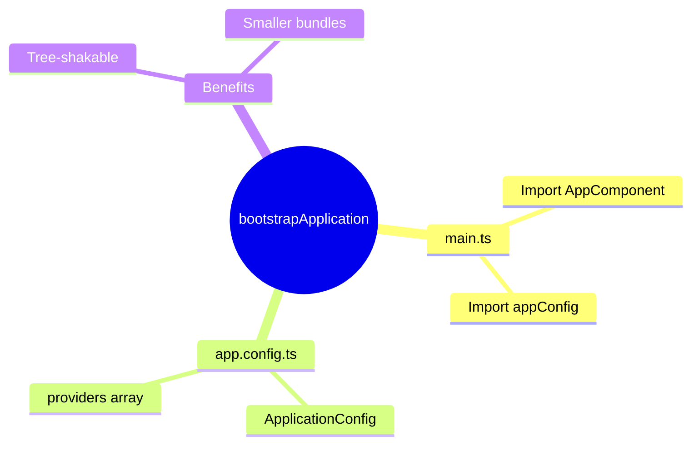

# ⚡ Use Case 1: bootstrapApplication

> **💡 Lightbulb Moment**: No more AppModule! Bootstrap directly with a component and config.

---

## Old vs New

```typescript
// ❌ Old (NgModule)
platformBrowserDynamic().bootstrapModule(AppModule);

// ✅ New (Standalone)
bootstrapApplication(AppComponent, appConfig);
```

---

## app.config.ts

```typescript
export const appConfig: ApplicationConfig = {
    providers: [
        provideRouter(routes),
        provideHttpClient(),
        provideAnimations()
    ]
};
```

---

## 🧠 Mind Map


