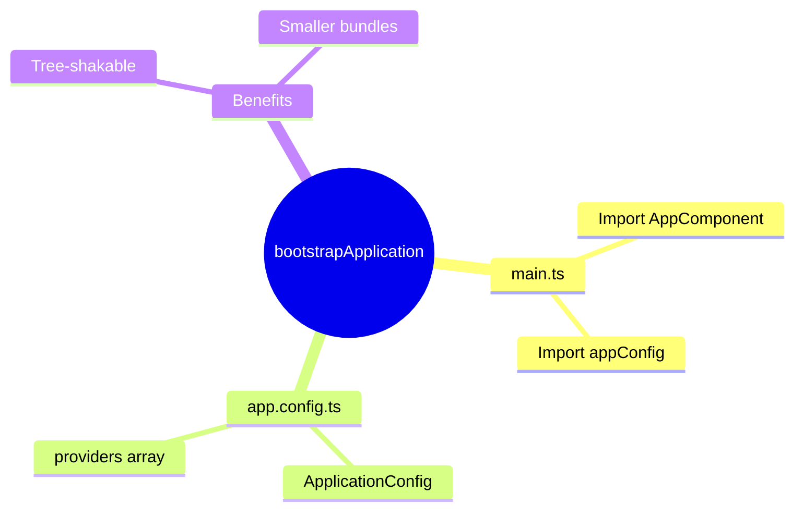

# ⚡ Use Case 1: bootstrapApplication

> **💡 Lightbulb Moment**: No more AppModule! Bootstrap directly with a component and config.

---

## Old vs New

```typescript
// ❌ Old (NgModule)
platformBrowserDynamic().bootstrapModule(AppModule);

// ✅ New (Standalone)
bootstrapApplication(AppComponent, appConfig);
```

---

## app.config.ts

```typescript
export const appConfig: ApplicationConfig = {
    providers: [
        provideRouter(routes),
        provideHttpClient(),
        provideAnimations()
    ]
};
```

---

### 📦 Data Flow Summary (Visual Box Diagram)

```
┌─────────────────────────────────────────────────────────────┐
│  bootstrapApplication: NO MORE APPMODULE!                   │
│                                                             │
│   OLD WAY (NgModule):                                       │
│   ┌───────────────────────────────────────────────────────┐ │
│   │ platformBrowserDynamic().bootstrapModule(AppModule);  │ │
│   │ // Loads everything, even unused providers            │ │
│   └───────────────────────────────────────────────────────┘ │
│                                                             │
│   NEW WAY (Standalone):                                     │
│   ┌───────────────────────────────────────────────────────┐ │
│   │ // main.ts                                            │ │
│   │ bootstrapApplication(AppComponent, appConfig);        │ │
│   │                                                       │ │
│   │ // app.config.ts                                      │ │
│   │ export const appConfig: ApplicationConfig = {         │ │
│   │   providers: [                                        │ │
│   │     provideRouter(routes),                            │ │
│   │     provideHttpClient(),                              │ │
│   │     provideAnimations()                               │ │
│   │   ]                                                   │ │
│   │ };                                                    │ │
│   └───────────────────────────────────────────────────────┘ │
│                                                             │
│   ✅ Tree-shakable  ✅ Smaller bundles  ✅ Simpler setup   │
└─────────────────────────────────────────────────────────────┘
```

> **Key Takeaway**: bootstrapApplication + appConfig = modern Angular. No AppModule needed. Tree-shakable providers = smaller bundles!

---

## 🧠 Mind Map


