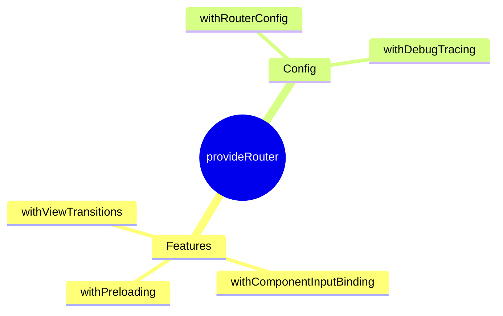

# 🛤️ Use Case 2: provideRouter

> **💡 Lightbulb Moment**: `withComponentInputBinding()` = route params automatically bind to @Input()!

---

## Basic Setup

```typescript
provideRouter(routes)
```

---

## Router Features

| Feature | Purpose |
|---------|---------|
| `withPreloading()` | Preload lazy routes |
| `withComponentInputBinding()` | Bind params to inputs |
| `withViewTransitions()` | Page animations |
| `withHashLocation()` | Hash-based URLs |

---

## 🧠 Mind Map


