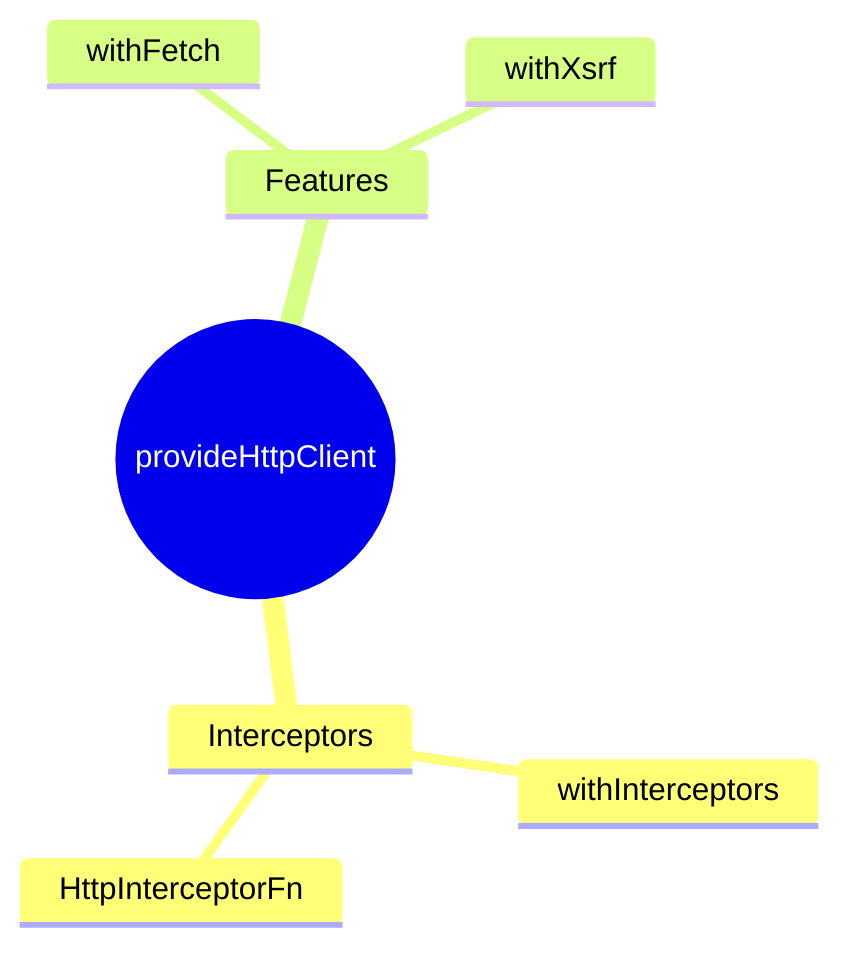

# 🌐 Use Case 3: provideHttpClient

> **💡 Lightbulb Moment**: Functional interceptors = simple functions, no class boilerplate!

---

## Functional Interceptor

```typescript
export const authInterceptor: HttpInterceptorFn = (req, next) => {
    const token = getToken();
    if (token) {
        req = req.clone({ setHeaders: { Authorization: `Bearer ${token}` } });
    }
    return next(req);
};
```

---

## HTTP Features

| Feature | Purpose |
|---------|---------|
| `withInterceptors()` | Functional interceptors |
| `withFetch()` | Use fetch API |
| `withXsrfConfiguration()` | XSRF protection |

---

## 🧠 Mind Map


