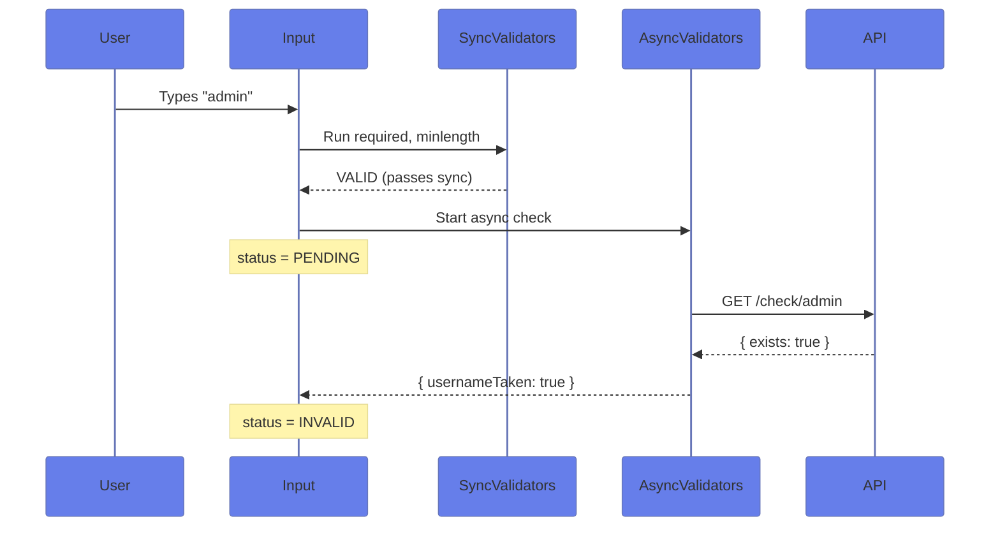

# ⏳ Async Validators in Template-Driven Forms

> **Goal**: Validate form fields asynchronously (e.g., checking username availability via API) using custom validator directives.


## 📋 Table of Contents
- [🏛️ What Problem Does It Solve?](#what-problem-does-it-solve)
  - [The "Is This Username Taken?" Problem](#the-is-this-username-taken-problem)
  - [The "Pending State" Problem](#the-pending-state-problem)
- [🔬 Deep Dive: Important Classes & Directives](#deep-dive-important-classes--directives)
  - [A. The `AsyncValidator` Interface](#a-the-asyncvalidator-interface)
  - [B. The `NG_ASYNC_VALIDATORS` Provider](#b-the-ng_async_validators-provider)
  - [C. Control States During Async Validation](#c-control-states-during-async-validation)
- [1. 🔍 How It Works (The Concept)](#1--how-it-works-the-concept)
  - [📊 Async Validation Flow](#async-validation-flow)
- [2. 🚀 Step-by-Step Implementation Guide](#2--step-by-step-implementation-guide)
  - [Step 1: Create the Async Validator Directive](#step-1-create-the-async-validator-directive)
  - [Step 2: Apply to Template](#step-2-apply-to-template)
  - [Step 3: Handle Form-Level Pending](#step-3-handle-form-level-pending)
- [3. 🌍 Real World Use Cases](#3--real-world-use-cases)
- [4. ⚠️ Common Pitfalls](#4--common-pitfalls)
  - [❌ Forgetting `multi: true`](#forgetting-multi-true)
  - [❌ Not Handling Empty Values](#not-handling-empty-values)
  - [❌ Forgetting to Complete the Observable](#forgetting-to-complete-the-observable)
- [7. ❓ Interview & Practice Questions](#7--interview--practice-questions)
  - [Q1: How do async validators differ from sync validators in Template-Driven Forms?](#q1-how-do-async-validators-differ-from-sync-validators-in-template-driven-forms)
  - [Q2: When does Angular run async validators?](#q2-when-does-angular-run-async-validators)
  - [Q3: How do you show a loading state during async validation?](#q3-how-do-you-show-a-loading-state-during-async-validation)
  - [Q4: Can you have multiple async validators on one control?](#q4-can-you-have-multiple-async-validators-on-one-control)
  - [Q5: Why do we use `of(null)` for empty values instead of `null`?](#q5-why-do-we-use-ofnull-for-empty-values-instead-of-null)
  - [Q6: SCENARIO: Your async validator is being called on every keystroke, overloading your API. How do you fix it?](#q6-scenario-your-async-validator-is-being-called-on-every-keystroke-overloading-your-api-how-do-you-fix-it)
  - [Q7: What is the difference between `NG_VALIDATORS` and `NG_ASYNC_VALIDATORS`?](#q7-what-is-the-difference-between-ng_validators-and-ng_async_validators)
  - [Q8: How do you pass parameters to an async validator directive?](#q8-how-do-you-pass-parameters-to-an-async-validator-directive)
  - [Q9: SCENARIO: Your async validator should only run when the user leaves the field (blur). How do you configure this?](#q9-scenario-your-async-validator-should-only-run-when-the-user-leaves-the-field-blur-how-do-you-configure-this)
  - [Q10: What happens to the form's `valid` property while async validation is running?](#q10-what-happens-to-the-forms-valid-property-while-async-validation-is-running)
  - [Q11: Can async validators access services via dependency injection?](#q11-can-async-validators-access-services-via-dependency-injection)
  - [Q12: SCENARIO: You need to cancel the previous API call when the user types a new character. Which RxJS operator helps?](#q12-scenario-you-need-to-cancel-the-previous-api-call-when-the-user-types-a-new-character-which-rxjs-operator-helps)
  - [Q13: How do you test an async validator directive?](#q13-how-do-you-test-an-async-validator-directive)
  - [Q14: What is the return type of an async validator?](#q14-what-is-the-return-type-of-an-async-validator)
  - [Q15: SCENARIO: Your async validator needs to compare with another field (like checking email domain matches company). How do you access the parent form?](#q15-scenario-your-async-validator-needs-to-compare-with-another-field-like-checking-email-domain-matches-company-how-do-you-access-the-parent-form)
  - [Q16: Why is `useExisting` used instead of `useClass` in the provider?](#q16-why-is-useexisting-used-instead-of-useclass-in-the-provider)
  - [Q17: Can you combine sync and async validators on the same directive?](#q17-can-you-combine-sync-and-async-validators-on-the-same-directive)
  - [Q18: SCENARIO: Your API returns different error codes (taken, banned, invalid chars). How do you handle multiple error types?](#q18-scenario-your-api-returns-different-error-codes-taken-banned-invalid-chars-how-do-you-handle-multiple-error-types)
  - [Q19: What happens if the async validator's Observable throws an error?](#q19-what-happens-if-the-async-validators-observable-throws-an-error)
  - [Q20: How do you disable the submit button during async validation?](#q20-how-do-you-disable-the-submit-button-during-async-validation)

---
---

## 🏛️ What Problem Does It Solve?

### The "Is This Username Taken?" Problem
*   **The Problem**: You can't synchronously check if a username exists in your database. You need to make an API call, wait for the response, and then update the validation state.
*   **The Solution**: Create an **Async Validator Directive** that returns an `Observable<ValidationErrors | null>`.
*   **The Benefit**: Real-time feedback for users before they submit the form.

### The "Pending State" Problem
*   **The Problem**: While the async validation is running, the form is in an indeterminate state. Users don't know if they should wait.
*   **The Solution**: Angular provides a `pending` state on form controls. Use `control.pending` to show loading indicators.

---

## 🔬 Deep Dive: Important Classes & Directives

### A. The `AsyncValidator` Interface
```typescript
interface AsyncValidator {
    validate(control: AbstractControl): Observable<ValidationErrors | null>;
}
```
- Your directive MUST implement this interface
- The `validate()` method is called automatically by Angular

### B. The `NG_ASYNC_VALIDATORS` Provider
```typescript
@Directive({
    providers: [{
        provide: NG_ASYNC_VALIDATORS,
        useExisting: MyAsyncValidatorDirective,
        multi: true
    }]
})
```
- `multi: true` allows multiple validators on the same control
- Angular collects all async validators and runs them in parallel

### C. Control States During Async Validation
| State | Meaning |
|-------|---------|
| `control.pending` | Async validation is running |
| `control.status === 'PENDING'` | Same as above, string version |
| `form.pending` | ANY control in the form is pending |

---

## 1. 🔍 How It Works (The Concept)

### 📊 Async Validation Flow



---

## 2. 🚀 Step-by-Step Implementation Guide

### Step 1: Create the Async Validator Directive

```typescript
@Directive({
    selector: '[appAsyncUsername]',
    standalone: true,
    providers: [{
        provide: NG_ASYNC_VALIDATORS,
        useExisting: AsyncUsernameValidatorDirective,
        multi: true
    }]
})
export class AsyncUsernameValidatorDirective implements AsyncValidator {
    
    validate(control: AbstractControl): Observable<ValidationErrors | null> {
        return this.checkUsername(control.value).pipe(
            map(isTaken => isTaken ? { usernameTaken: true } : null)
        );
    }
    
    private checkUsername(username: string): Observable<boolean> {
        // Simulate API call
        return of(['admin', 'user'].includes(username)).pipe(delay(500));
    }
}
```

### Step 2: Apply to Template

```html
<input 
    name="username"
    [(ngModel)]="model.username"
    #usernameCtrl="ngModel"
    required
    appAsyncUsername
>

<!-- Show pending state -->
<span *ngIf="usernameCtrl.pending">Checking...</span>

<!-- Show error -->
<span *ngIf="usernameCtrl.errors?.['usernameTaken']">
    Username is taken!
</span>
```

### Step 3: Handle Form-Level Pending

```html
<button [disabled]="form.invalid || form.pending">
    {{ form.pending ? 'Validating...' : 'Submit' }}
</button>
```

---

## 3. 🌍 Real World Use Cases

1. **Username/Email Availability**: Check if the identifier is already registered
2. **Promo Code Validation**: Verify discount codes against the server
3. **Address Verification**: Validate postal addresses via external API
4. **Credit Card Validation**: Luhn check + BIN lookup for card type
5. **Domain Availability**: Check if a domain name is available for registration

---

## 4. ⚠️ Common Pitfalls

### ❌ Forgetting `multi: true`
```typescript
// WRONG - will replace other validators
{ provide: NG_ASYNC_VALIDATORS, useExisting: MyValidator }

// CORRECT - adds to existing validators
{ provide: NG_ASYNC_VALIDATORS, useExisting: MyValidator, multi: true }
```

### ❌ Not Handling Empty Values
```typescript
validate(control: AbstractControl) {
    // Always handle empty case - let 'required' validator handle it
    if (!control.value) return of(null);
    
    return this.checkApi(control.value);
}
```

### ❌ Forgetting to Complete the Observable
```typescript
// WRONG - observable never completes
return new Subject<ValidationErrors | null>();

// CORRECT - use finite observables
return this.http.get('/api').pipe(map(...));
```

---

## 7. ❓ Interview & Practice Questions

### Q1: How do async validators differ from sync validators in Template-Driven Forms?
**A:** Sync validators run immediately and return `ValidationErrors | null`. Async validators return `Observable<ValidationErrors | null>` or `Promise<ValidationErrors | null>`. They use `NG_ASYNC_VALIDATORS` instead of `NG_VALIDATORS`.

### Q2: When does Angular run async validators?
**A:** Angular only runs async validators AFTER all sync validators pass. This is an optimization - no point checking the database if the field is empty.

### Q3: How do you show a loading state during async validation?
**A:** Use `control.pending` or `control.status === 'PENDING'`:
```html
<span *ngIf="usernameCtrl.pending">Checking availability...</span>
```

### Q4: Can you have multiple async validators on one control?
**A:** Yes! Use `multi: true` in the provider. Angular runs them in parallel and merges the error objects.

### Q5: Why do we use `of(null)` for empty values instead of `null`?
**A:** The `validate()` method must return an Observable, not a plain value. `of(null)` creates an Observable that emits `null` and completes.

### Q6: SCENARIO: Your async validator is being called on every keystroke, overloading your API. How do you fix it?
**A:** Apply `debounceTime()` in your observable chain:
```typescript
return of(control.value).pipe(
    debounceTime(300),
    switchMap(value => this.api.check(value))
);
```

### Q7: What is the difference between `NG_VALIDATORS` and `NG_ASYNC_VALIDATORS`?
**A:** `NG_VALIDATORS` is for synchronous validators (return value directly). `NG_ASYNC_VALIDATORS` is for async validators (return Observable/Promise).

### Q8: How do you pass parameters to an async validator directive?
**A:** Use `@Input()`:
```typescript
@Input('appAsyncUsername') debounceMs = 500;
```
```html
<input appAsyncUsername="1000">
```

### Q9: SCENARIO: Your async validator should only run when the user leaves the field (blur). How do you configure this?
**A:** Use the `updateOn` option:
```html
<input [ngModelOptions]="{ updateOn: 'blur' }" appAsyncUsername>
```

### Q10: What happens to the form's `valid` property while async validation is running?
**A:** The form's `valid` is `false` while `pending` is `true`. Only when async validation completes AND passes does `valid` become `true`.

### Q11: Can async validators access services via dependency injection?
**A:** Yes! Inject services in the directive's constructor:
```typescript
constructor(private http: HttpClient) {}
```

### Q12: SCENARIO: You need to cancel the previous API call when the user types a new character. Which RxJS operator helps?
**A:** Use `switchMap` - it automatically cancels the previous inner observable:
```typescript
return of(value).pipe(switchMap(v => this.api.check(v)));
```

### Q13: How do you test an async validator directive?
**A:** Use `fakeAsync` and `tick`:
```typescript
it('should mark control invalid for taken username', fakeAsync(() => {
    control.setValue('admin');
    tick(500); // Wait for debounce
    expect(control.errors?.['usernameTaken']).toBeTruthy();
}));
```

### Q14: What is the return type of an async validator?
**A:** `Observable<ValidationErrors | null>` or `Promise<ValidationErrors | null>`.

### Q15: SCENARIO: Your async validator needs to compare with another field (like checking email domain matches company). How do you access the parent form?
**A:** Access the parent via `control.parent`:
```typescript
const companyDomain = control.parent?.get('company')?.value;
```

### Q16: Why is `useExisting` used instead of `useClass` in the provider?
**A:** `useExisting` reuses the same directive instance. `useClass` would create a new instance, which wouldn't have access to the directive's injected dependencies.

### Q17: Can you combine sync and async validators on the same directive?
**A:** Yes, but you need to provide both `NG_VALIDATORS` and `NG_ASYNC_VALIDATORS` and implement both `Validator` and `AsyncValidator` interfaces.

### Q18: SCENARIO: Your API returns different error codes (taken, banned, invalid chars). How do you handle multiple error types?
**A:** Return different error keys:
```typescript
return this.api.check(value).pipe(
    map(result => {
        if (result.taken) return { usernameTaken: true };
        if (result.banned) return { usernameBanned: true };
        return null;
    })
);
```

### Q19: What happens if the async validator's Observable throws an error?
**A:** The control remains in `PENDING` state indefinitely. Always use `catchError`:
```typescript
.pipe(catchError(() => of(null)))
```

### Q20: How do you disable the submit button during async validation?
**A:**
```html
<button [disabled]="form.invalid || form.pending">Submit</button>
```
