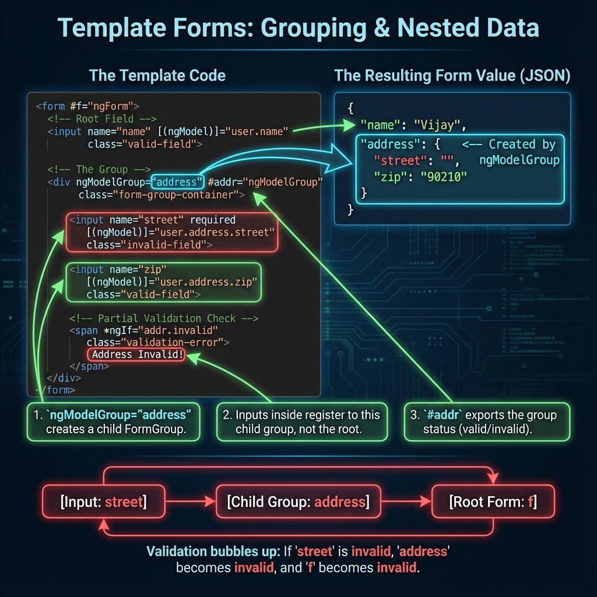
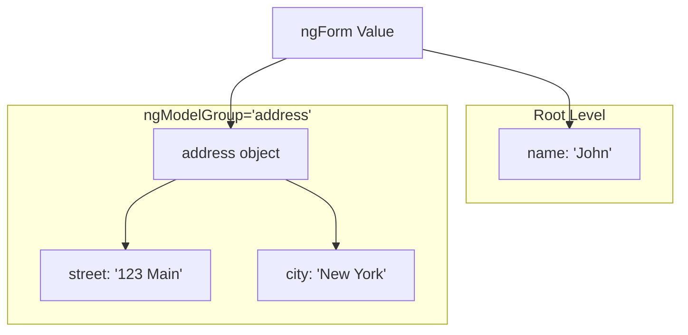
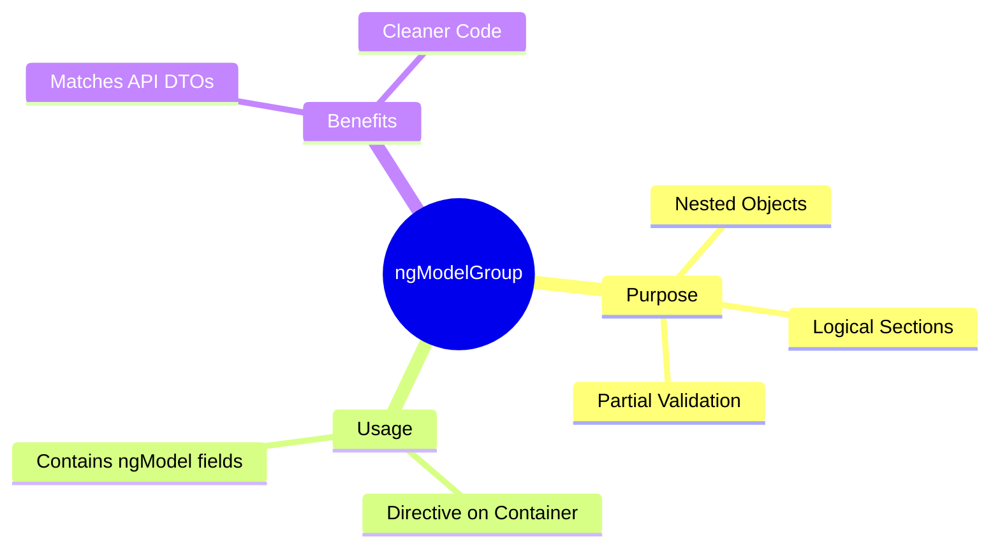

# 🗂️ Grouping Data

> **Goal**: Organize form data into nested objects without writing custom object mapping logic.


## 📋 Table of Contents
- [🖼️ Visual Flow](#visual-flow)
- [🆕 1. What Problem Does It Solve?](#1-what-problem-does-it-solve)
- [🆕 2. Real-World Scenarios](#2-real-world-scenarios)
  - [🏠 Scenario A: Address Block](#scenario-a-address-block)
  - [💳 Scenario B: Payment Methods](#scenario-b-payment-methods)
- [3. 🔍 How It Works (Original Section)](#3--how-it-works-original-section)
  - [The Mechanism](#the-mechanism)
  - [📊 Structure Visualization](#structure-visualization)
- [🆕 Deep Dive: The "Magic" Classes](#deep-dive-the-magic-classes)
  - [A. `NgModelGroup` (The Directive)](#a-ngmodelgroup-the-directive)
  - [B. `ControlContainer` (The Dependency Injection)](#b-controlcontainer-the-dependency-injection)
- [4. 🚀 Step-by-Step Implementation](#4--step-by-step-implementation)
  - [Step 1: Define the Structure](#step-1-define-the-structure)
  - [Step 2: Use ngModelGroup](#step-2-use-ngmodelgroup)
  - [Step 3: Accessing Group Status](#step-3-accessing-group-status)
- [🆕 Interview & Scenario Questions](#interview--scenario-questions)
  - [🛑 Scenario 1: Accessing Child Groups in TS](#scenario-1-accessing-child-groups-in-ts)
  - [🔄 Scenario 2: Nested Validation Bubbling](#scenario-2-nested-validation-bubbling)
  - [🏗️ Scenario 3: Can I nest groups inside groups?](#scenario-3-can-i-nest-groups-inside-groups)
- [🆕 Summary Cheat Sheet](#summary-cheat-sheet)
  - [📦 Data Flow Summary (Visual Box Diagram)](#data-flow-summary-visual-box-diagram)
- [5. 🧠 Mind Map: Quick Visual Reference](#5--mind-map-quick-visual-reference)

---
---

## 🖼️ Visual Flow



---

## 🆕 1. What Problem Does It Solve?

In enterprise forms, your API typically expects nested JSON objects (e.g., `{ user: { address: { city: '...' } } }`).
Without `ngModelGroup`:
1.  All your inputs flatten into a single object `{ city: '...' }`.
2.  You must write manual "mapping code" in `onSubmit()` to reconstruct the nested object.
3.  Validating a specific *section* (like just the address) is hard because controls are mixed together.

**`ngModelGroup`** solves this by:
*   **Automatic Nesting**: Creates a child `FormGroup` automatically.
*   **Matching DTOs**: The form `value` naturally matches your API structure.
*   **Scoped Validation**: You can check `addressGroup.invalid` to see if *just* the address section has errors.

---

## 🆕 2. Real-World Scenarios

### 🏠 Scenario A: Address Block
*   **Context**: A User Profile form with a "Shipping Address" section.
*   **Value**: `form.value` becomes `{ name: 'Vijay', shipping: { street: '...', zip: '...' } }`.
*   **Benefit**: You can pass `value.shipping` directly to a child component or API service.

### 💳 Scenario B: Payment Methods
*   **Context**: A checkout form with "Credit Card" details.
*   **Value**: `{ card: { number: '...', expiry: '...' } }`.
*   **Benefit**: You can validate the card group independently before letting the user proceed.

---

## 3. 🔍 How It Works (Original Section)

### The Mechanism
By default, `ngModel` registers controls as direct properties of the form object (flat structure).
`ngModelGroup` creates a **child FormGroup** within the parent form. All `ngModel` directives inside the group are registered to that child group.

**Result**: Only the form *structure* changes; the HTML layout is irrelevant to the data structure unless you use `ngModelGroup`.

### 📊 Structure Visualization



---

## 🆕 Deep Dive: The "Magic" Classes

### A. `NgModelGroup` (The Directive)
*   **Selector**: `[ngModelGroup]`
*   **Role**: It creates a `FormGroup` instance (just like the root `NgForm` does) but registers it as a *child* of the parent form.
*   **Export**: Export it as `#group="ngModelGroup"` to access its specific status (valid/invalid/dirty).

### B. `ControlContainer` (The Dependency Injection)
*   **Role**: This is how `ngModel` knows where to register. When you put an input inside `ngModelGroup`, the input asks Angular DI for the nearest `ControlContainer`. It finds the group instead of the root form!

---

## 4. 🚀 Step-by-Step Implementation

### Step 1: Define the Structure
Decide how you want your data to look.

```typescript
// Desired Output
{
  name: "John",
  address: {
    street: "123 Main St",
    zip: "90210"
  }
}
```

### Step 2: Use ngModelGroup
Wrap the related inputs in an element (div, fieldset) and add the directive.

```html
<!-- Root prop -->
<input name="name" [(ngModel)]="user.name">

<!-- Nested group -->
<div ngModelGroup="address">
  <input name="street" [(ngModel)]="user.address.street">
  <input name="zip" [(ngModel)]="user.address.zip">
</div>
```

### Step 3: Accessing Group Status
You can even export the group to check validation just for that section!

```html
<div ngModelGroup="address" #addrGroup="ngModelGroup">
  <p *ngIf="addrGroup.invalid">Address is incomplete!</p>
</div>
```

---

## 🆕 Interview & Scenario Questions

### 🛑 Scenario 1: Accessing Child Groups in TS
**Q: How do I access the 'address' group in my component TypeScript?**
> **A:** You can use `@ViewChild('addrGroup') addr: NgModelGroup;` if you added a template reference variable. Or, access it via the form: `form.controls['address']`.

### 🔄 Scenario 2: Nested Validation Bubbling
**Q: If a field inside the group is invalid, is the main form invalid?**
> **A:** Yes! Validation status bubbles up. `Input Invalid` → `Group Invalid` → `Form Invalid`.

### 🏗️ Scenario 3: Can I nest groups inside groups?
**Q: Can I have `ngModelGroup="user"` inside `ngModelGroup="company"`?**
> **A:** Absolutely. You can nest them as deep as needed to match your data structure.

---

## 🆕 Summary Cheat Sheet

| Directive | Role | Export Variable |
| :--- | :--- | :--- |
| **`ngModelGroup`** | Creates nested `FormGroup`. | `#ref="ngModelGroup"` |
| **`ngModel`** | Registers to *nearest* container. | `#ref="ngModel"` |

---

### 📦 Data Flow Summary (Visual Box Diagram)

```
┌─────────────────────────────────────────────────────────────┐
│  ngModelGroup: NESTED DATA STRUCTURE                        │
│                                                             │
│   WITHOUT ngModelGroup (flat):                              │
│   ┌───────────────────────────────────────────────────────┐ │
│   │ form.value = {                                        │ │
│   │   name: "John",                                       │ │
│   │   street: "123 Main",  // ❌ Flat!                    │ │
│   │   city: "NYC"                                         │ │
│   │ }                                                     │ │
│   └───────────────────────────────────────────────────────┘ │
│                                                             │
│   WITH ngModelGroup (nested):                               │
│   ┌───────────────────────────────────────────────────────┐ │
│   │ <input name="name" [(ngModel)]="user.name">           │ │
│   │                                                       │ │
│   │ <div ngModelGroup="address">                          │ │
│   │   <input name="street" [(ngModel)]="user.address.street">│ │
│   │   <input name="city" [(ngModel)]="user.address.city"> │ │
│   │ </div>                                                │ │
│   │                                                       │ │
│   │ form.value = {                                        │ │
│   │   name: "John",                                       │ │
│   │   address: {              // ✅ Nested object!        │ │
│   │     street: "123 Main",                               │ │
│   │     city: "NYC"                                       │ │
│   │   }                                                   │ │
│   │ }                                                     │ │
│   └───────────────────────────────────────────────────────┘ │
└─────────────────────────────────────────────────────────────┘
```

> **Key Takeaway**: Use `ngModelGroup` to create nested objects. Matches API DTOs without manual mapping!

---

## 5. 🧠 Mind Map: Quick Visual Reference


