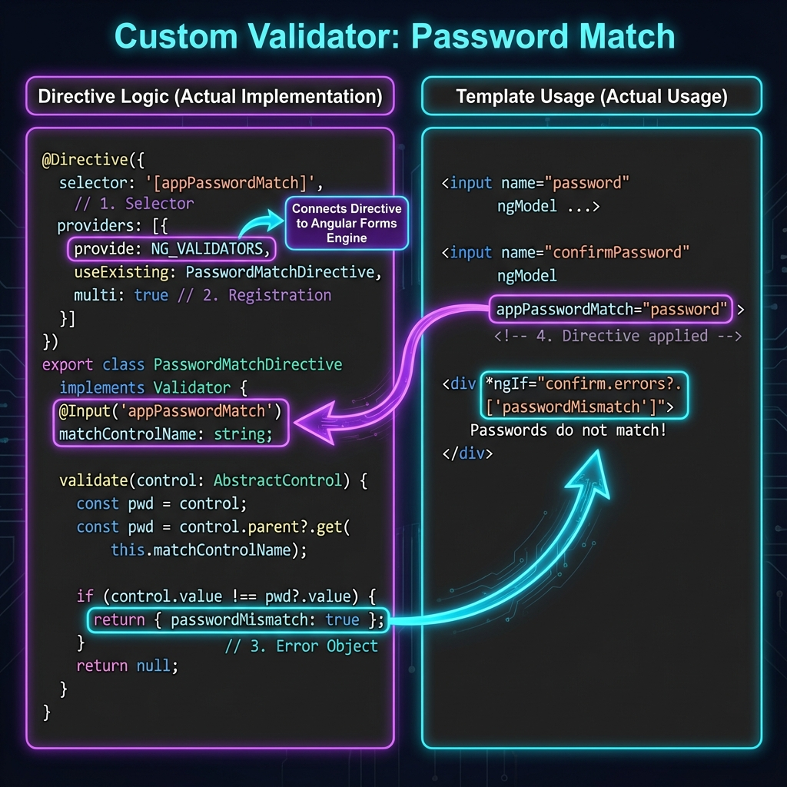
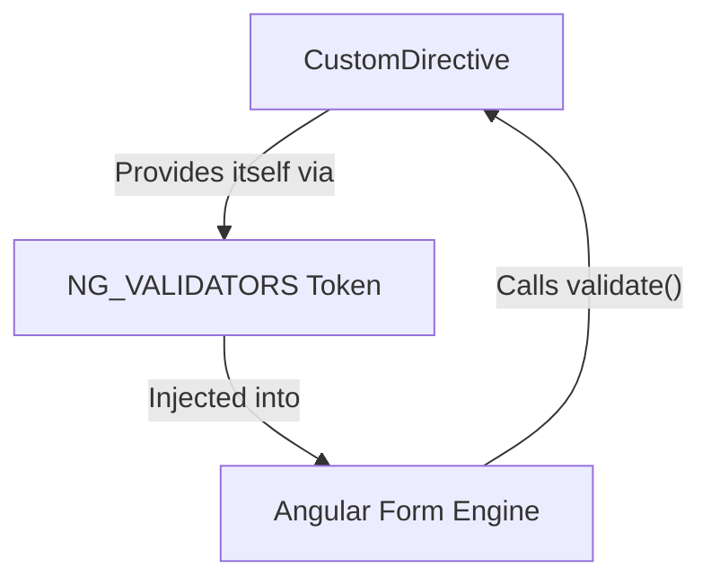
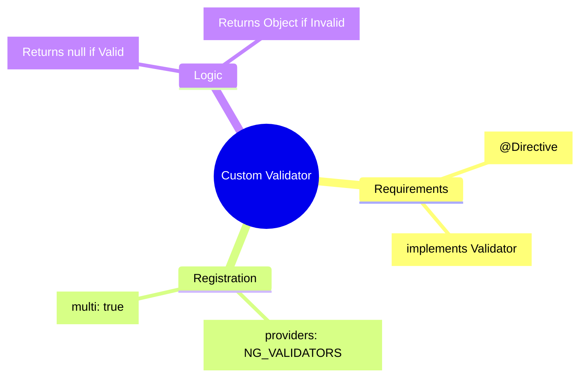

# ⚙️ Custom Validators

> **Goal**: Implement complex validation logic (like "confirm password") that reusable across forms.


## 📋 Table of Contents
- [🖼️ Visual Flow](#visual-flow)
- [🆕 1. What Problem Does It Solve?](#1-what-problem-does-it-solve)
- [🆕 2. Real-World Scenarios](#2-real-world-scenarios)
  - [🔑 Scenario A: Password Confirmation](#scenario-a-password-confirmation)
  - [🚫 Scenario B: Ban Lists (Blacklisting)](#scenario-b-ban-lists-blacklisting)
  - [📅 Scenario C: Date Range](#scenario-c-date-range)
- [3. 🔍 How It Works (Original Section)](#3--how-it-works-original-section)
  - [The Mechanism](#the-mechanism)
  - [📊 Validator Registration](#validator-registration)
- [🆕 Deep Dive: The "Magic" Classes](#deep-dive-the-magic-classes)
  - [A. `NG_VALIDATORS` (The Token)](#a-ng_validators-the-token)
  - [B. `Validator` (The Interface)](#b-validator-the-interface)
- [4. 🚀 Step-by-Step Implementation](#4--step-by-step-implementation)
  - [Step 1: The Directive](#step-1-the-directive)
  - [Step 2: Cross-Field Validation](#step-2-cross-field-validation)
  - [Step 3: Usage](#step-3-usage)
- [🆕 Interview & Scenario Questions](#interview--scenario-questions)
  - [🛑 Scenario 1: The "Multi: True" Trap](#scenario-1-the-multi-true-trap)
  - [🔄 Scenario 2: Validator vs Accessor](#scenario-2-validator-vs-accessor)
  - [❓ Scenario 3: Parameterized Validators](#scenario-3-parameterized-validators)
- [🆕 Summary Cheat Sheet](#summary-cheat-sheet)
  - [📦 Data Flow Summary (Visual Box Diagram)](#data-flow-summary-visual-box-diagram)
- [5. 🧠 Mind Map: Quick Visual Reference](#5--mind-map-quick-visual-reference)

---
---

## 🖼️ Visual Flow



---

## 🆕 1. What Problem Does It Solve?

Standard HTML5 validators (`required`, `minlength`, `pattern`) are limited. They can't do:
1.  **Cross-field checks**: "Does Password match Confirm Password?"
2.  **External checks**: "Is this username already taken on the server?" (Async)
3.  **Complex Logic**: "Is this a valid credit card using the Luhn Algorithm?"

**Custom Validators** allow you to write a JavaScript function (or Class) that returns validation errors, giving you infinite flexibility.

---

## 🆕 2. Real-World Scenarios

### 🔑 Scenario A: Password Confirmation
*   **Requirement**: Two fields must match exactly.
*   **Implementation**: A directive that looks at its parent form, finds the sibling "password" control, and compares values.

### 🚫 Scenario B: Ban Lists (Blacklisting)
*   **Requirement**: Users cannot choose "admin", "root", or "superuser" as usernames.
*   **Implementation**: A validator that checks the input against a hardcoded list or regex.

### 📅 Scenario C: Date Range
*   **Requirement**: "End Date" must be after "Start Date".
*   **Implementation**: A validator on the group or the end-date input that compares timestamps.

---

## 3. 🔍 How It Works (Original Section)

### The Mechanism
In Template Driven Forms, validation is done via **Directives**.
To create a custom validator, you must:
1.  Create a Directive (`@Directive`).
2.  Implement the `Validator` interface (`validate()`).
3.  Register it with Angular's `NG_VALIDATORS` token so the form engine "sees" it.

### 📊 Validator Registration



---

## 🆕 Deep Dive: The "Magic" Classes

### A. `NG_VALIDATORS` (The Token)
*   **Role**: Angular has a "multi-provider" token called `NG_VALIDATORS`.
*   **Mechanism**: When a form starts, it asks DI: *"Give me everything registered under NG_VALIDATORS"*. It then runs ALL of them.
*   **Implementation**: Your custom directive MUST provide itself to this token, or Angular won't ignore it.

### B. `Validator` (The Interface)
*   **Role**: Enforces the shape of your class.
*   **Method**: `validate(control: AbstractControl): ValidationErrors | null`.
*   **Return**: `null` means "Valid". An object `{ errorName: true }` means "Invalid".

---

## 4. 🚀 Step-by-Step Implementation

### Step 1: The Directive
The key is the `providers` array. This tells Angular "I am a validator".

```typescript
@Directive({
  selector: '[appCustomVal]',
  providers: [{
    provide: NG_VALIDATORS,
    useExisting: CustomValidatorDirective,
    multi: true // Essential! Don't overwrite other validators
  }]
})
export class CustomValidatorDirective implements Validator {
  validate(control: AbstractControl): ValidationErrors | null {
    return isValid ? null : { myError: true };
  }
}
```

### Step 2: Cross-Field Validation
To match passwords, the validator needs to see the *other* field.

```typescript
// Look up the parent form to find sibling controls
const otherControl = control.parent.get('password');
```

### Step 3: Usage
Just add the selector to your input!

```html
<input name="confirm" [(ngModel)]="val" appCustomVal>
```

---

## 🆕 Interview & Scenario Questions

### 🛑 Scenario 1: The "Multi: True" Trap
**Q: I created a validator, but now 'required' stopped working. Why?**
> **A:** You probably forgot `multi: true` in your provider. Without it, you *replaced* the entire default validator set with your single custom one. `multi: true` adds yours to the list.

### 🔄 Scenario 2: Validator vs Accessor
**Q: What's the difference between a ControlValueAccessor and a Validator?**
> **A:**
> *   **CVA**: Writes data FROM model TO view (and vice versa). Handles "How to display it".
> *   **Validator**: Checks data correctness. Handles "Is it valid?".

### ❓ Scenario 3: Parameterized Validators
**Q: How do I pass an argument to my validator (like `min="5"`)?**
> **A:** Use `@Input()` inside your directive! `<input appForbiddenName="admin">`. Your directive class will read `this.forbiddenName` inside the `validate()` function.

---

## 🆕 Summary Cheat Sheet

| Concept | Role | Code |
| :--- | :--- | :--- |
| **`NG_VALIDATORS`** | The collection of all validators. | `provide: NG_VALIDATORS` |
| **`validate()`** | The function Angular calls. | `return null` (Pass) / `{err:true}` (Fail) |
| **`AbstractControl`** | The parameter passed to validate. | Gives access to `value`, `parent`, etc. |

---

### 📦 Data Flow Summary (Visual Box Diagram)

```
┌─────────────────────────────────────────────────────────────┐
│  CUSTOM VALIDATOR DIRECTIVE (Template-Driven Forms)         │
│                                                             │
│   DIRECTIVE STRUCTURE:                                      │
│   ┌───────────────────────────────────────────────────────┐ │
│   │ @Directive({                                          │ │
│   │   selector: '[appPasswordMatch]',                     │ │
│   │   providers: [{                                       │ │
│   │     provide: NG_VALIDATORS,        // Register        │ │
│   │     useExisting: PasswordMatchDirective,              │ │
│   │     multi: true                    // Don't overwrite │ │
│   │   }]                                                  │ │
│   │ })                                                    │ │
│   │ export class PasswordMatchDirective implements Validator {│ │
│   │   validate(control: AbstractControl): ValidationErrors | null {│ │
│   │     const password = control.parent?.get('password');  │ │
│   │     return control.value === password?.value           │ │
│   │       ? null                    // ✅ Valid            │ │
│   │       : { passwordMismatch: true }; // ❌ Invalid      │ │
│   │   }                                                   │ │
│   │ }                                                     │ │
│   └───────────────────────────────────────────────────────┘ │
│                                                             │
│   USAGE:                                                    │
│   ┌───────────────────────────────────────────────────────┐ │
│   │ <input name="confirmPassword"                         │ │
│   │        [(ngModel)]="confirmPwd"                       │ │
│   │        appPasswordMatch>         ← Just add selector! │ │
│   └───────────────────────────────────────────────────────┘ │
└─────────────────────────────────────────────────────────────┘
```

> **Key Takeaway**: Custom validators are directives that implement `Validator` and register via `NG_VALIDATORS`!

---

## 5. 🧠 Mind Map: Quick Visual Reference


