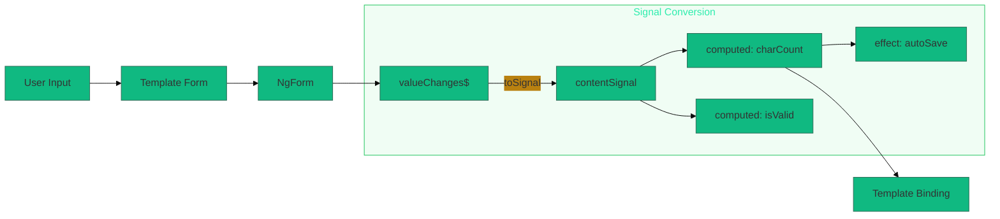

# 🚦 Signals Integration in Template-Driven Forms

> **Goal**: Bridge Template-Driven Forms with Angular Signals for reactive, computed state without complex RxJS.


## 📋 Table of Contents
- [🏛️ What Problem Does It Solve?](#what-problem-does-it-solve)
  - [The "Async Pipe Soup" Problem](#the-async-pipe-soup-problem)
  - [The "Injection Context" Challenge](#the-injection-context-challenge)
- [🔬 Deep Dive: Key Concepts](#deep-dive-key-concepts)
  - [A. The Timing Challenge](#a-the-timing-challenge)
  - [B. Signal Types for Forms](#b-signal-types-for-forms)
- [1. 🔍 How It Works (The Concept)](#1--how-it-works-the-concept)
- [2. 🚀 Step-by-Step Implementation](#2--step-by-step-implementation)
  - [Step 1: Inject the Injector](#step-1-inject-the-injector)
  - [Step 2: Create Basic Signals for Initial State](#step-2-create-basic-signals-for-initial-state)
  - [Step 3: Create Computed Signals](#step-3-create-computed-signals)
  - [Step 4: Bridge Form to Signals in AfterViewInit](#step-4-bridge-form-to-signals-in-afterviewinit)
  - [Step 5: Use Signals in Template](#step-5-use-signals-in-template)
- [3. 🌍 Real World Use Cases](#3--real-world-use-cases)
- [7. ❓ Interview & Practice Questions](#7--interview--practice-questions)
  - [Q1: Why can't you use `toSignal()` directly in ngAfterViewInit?](#q1-why-cant-you-use-tosignal-directly-in-ngafterviewinit)
  - [Q2: What is `runInInjectionContext()` and why is it needed?](#q2-what-is-runininjectioncontext-and-why-is-it-needed)
  - [Q3: What's the difference between `signal()` and `toSignal()`?](#q3-whats-the-difference-between-signal-and-tosignal)
  - [Q4: How do you handle the initial value when form isn't ready?](#q4-how-do-you-handle-the-initial-value-when-form-isnt-ready)
  - [Q5: Why use `{ allowSignalWrites: true }` in effect?](#q5-why-use--allowsignalwrites-true--in-effect)
  - [Q6: SCENARIO: Your computed signal needs both form value AND a route parameter. How?](#q6-scenario-your-computed-signal-needs-both-form-value-and-a-route-parameter-how)
  - [Q7: Can you use `toSignal()` with individual NgModel controls?](#q7-can-you-use-tosignal-with-individual-ngmodel-controls)
  - [Q8: How do signals help avoid "ExpressionChangedAfterItHasBeenChecked"?](#q8-how-do-signals-help-avoid-expressionchangedafterithasbeenchecked)
  - [Q9: What happens when the component is destroyed?](#q9-what-happens-when-the-component-is-destroyed)
  - [Q10: SCENARIO: You want to debounce form changes before updating a signal. How?](#q10-scenario-you-want-to-debounce-form-changes-before-updating-a-signal-how)
  - [Q11: How do effects work with Template-Driven form signals?](#q11-how-do-effects-work-with-template-driven-form-signals)
  - [Q12: Can you use `computed()` to derive validation state?](#q12-can-you-use-computed-to-derive-validation-state)
  - [Q13: SCENARIO: You need to save to localStorage when form changes. Should you use `computed()` or `effect()`?](#q13-scenario-you-need-to-save-to-localstorage-when-form-changes-should-you-use-computed-or-effect)
  - [Q14: How do you access multiple form fields in a computed signal?](#q14-how-do-you-access-multiple-form-fields-in-a-computed-signal)
  - [Q15: What's the advantage of signals over `async` pipe for form state?](#q15-whats-the-advantage-of-signals-over-async-pipe-for-form-state)
  - [Q16: SCENARIO: Your effect is running too often. How do you optimize?](#q16-scenario-your-effect-is-running-too-often-how-do-you-optimize)
  - [Q17: Can signals work with async validators?](#q17-can-signals-work-with-async-validators)
  - [Q18: How do you test components with form signals?](#q18-how-do-you-test-components-with-form-signals)
  - [Q19: What's the pattern for bidirectional signal-form binding?](#q19-whats-the-pattern-for-bidirectional-signal-form-binding)
  - [Q20: SCENARIO: You have a wizard form with 5 steps. How do you track progress with signals?](#q20-scenario-you-have-a-wizard-form-with-5-steps-how-do-you-track-progress-with-signals)

---
---

## 🏛️ What Problem Does It Solve?

### The "Async Pipe Soup" Problem
*   **The Problem**: Using RxJS observables in templates requires the `async` pipe everywhere, making templates verbose.
*   **The Solution**: Convert form observables to signals with `toSignal()`. Use `computed()` for derived values.
*   **The Benefit**: Cleaner templates with synchronous-looking syntax (`{{ count() }}` vs `{{ count$ | async }}`).

### The "Injection Context" Challenge
*   **The Problem**: `toSignal()` requires an injection context, but the form isn't available until AfterViewInit.
*   **The Solution**: Use `runInInjectionContext()` to create signals after the form is available.

---

## 🔬 Deep Dive: Key Concepts

### A. The Timing Challenge
```typescript
// ❌ PROBLEM: Form doesn't exist in constructor
constructor() {
    this.formSignal = toSignal(this.myForm.valueChanges); // ERROR!
}

// ✅ SOLUTION: Wait for AfterViewInit + injection context
ngAfterViewInit() {
    runInInjectionContext(this.injector, () => {
        this.formSignal = toSignal(this.myForm.valueChanges);
    });
}
```

### B. Signal Types for Forms
| Type | Use Case |
|------|----------|
| `signal()` | Component state that you manually set |
| `toSignal()` | Convert Observable to Signal |
| `computed()` | Derived values (char count, validation) |
| `effect()` | Side effects (logging, saving) |

---

## 1. 🔍 How It Works (The Concept)



---

## 2. 🚀 Step-by-Step Implementation

### Step 1: Inject the Injector
```typescript
private injector = inject(Injector);
```

### Step 2: Create Basic Signals for Initial State
```typescript
contentSignal = signal('');
statusSignal = signal('INVALID');
```

### Step 3: Create Computed Signals
```typescript
charCount = computed(() => this.contentSignal().length);
remaining = computed(() => this.MAX_CHARS - this.charCount());
canSubmit = computed(() => 
    this.statusSignal() === 'VALID' && this.charCount() > 0
);
```

### Step 4: Bridge Form to Signals in AfterViewInit
```typescript
ngAfterViewInit(): void {
    setTimeout(() => {
        runInInjectionContext(this.injector, () => {
            const content$ = this.myForm.valueChanges!.pipe(
                map(v => v?.content ?? '')
            );
            const contentSig = toSignal(content$, { initialValue: '' });
            
            effect(() => {
                this.contentSignal.set(contentSig() ?? '');
            }, { allowSignalWrites: true });
        });
    });
}
```

### Step 5: Use Signals in Template
```html
<div class="counter">{{ charCount() }} / {{ MAX_CHARS }}</div>
<button [disabled]="!canSubmit()">Submit</button>
```

---

## 3. 🌍 Real World Use Cases

1. **Character Counters**: Twitter-style remaining chars display
2. **Real-time Validation Summary**: Show valid/invalid field count
3. **Conditional UI**: Show/hide panels based on form state signals
4. **Auto-calculated Totals**: Shopping cart line item totals
5. **Form Progress**: Compute completion percentage

---

## 7. ❓ Interview & Practice Questions

### Q1: Why can't you use `toSignal()` directly in ngAfterViewInit?
**A:** `toSignal()` requires an injection context. In ngAfterViewInit, you're outside the context. Use `runInInjectionContext()` to create one.

### Q2: What is `runInInjectionContext()` and why is it needed?
**A:** It creates an injection context where DI-aware functions like `toSignal()` can run. The form isn't available in constructor, so we need this bridge.

### Q3: What's the difference between `signal()` and `toSignal()`?
**A:** `signal()` creates a writable signal you set manually. `toSignal()` creates a read-only signal from an Observable.

### Q4: How do you handle the initial value when form isn't ready?
**A:** Create basic signals with default values first, then update them when the form initializes.

### Q5: Why use `{ allowSignalWrites: true }` in effect?
**A:** By default, effects can't write to signals. This flag allows it, which we need when bridging observables to signals.

### Q6: SCENARIO: Your computed signal needs both form value AND a route parameter. How?
**A:**
```typescript
routeId = toSignal(this.route.params.pipe(map(p => p['id'])));
formValue = signal({});
combined = computed(() => ({
    id: this.routeId(),
    data: this.formValue()
}));
```

### Q7: Can you use `toSignal()` with individual NgModel controls?
**A:** Yes, if you have a ViewChild reference:
```typescript
@ViewChild('emailCtrl') emailCtrl!: NgModel;
// In AfterViewInit:
emailSignal = toSignal(this.emailCtrl.valueChanges);
```

### Q8: How do signals help avoid "ExpressionChangedAfterItHasBeenChecked"?
**A:** Signals trigger their own change detection cycle. Reading a signal in the template is synchronous and predictable.

### Q9: What happens when the component is destroyed?
**A:** Signals created with `toSignal()` automatically unsubscribe. Manual signals don't need cleanup.

### Q10: SCENARIO: You want to debounce form changes before updating a signal. How?
**A:**
```typescript
const debounced$ = this.form.valueChanges.pipe(debounceTime(300));
this.debouncedSignal = toSignal(debounced$, { initialValue: {} });
```

### Q11: How do effects work with Template-Driven form signals?
**A:** Effects run whenever their signal dependencies change. If `contentSignal` updates, all effects reading it re-run.

### Q12: Can you use `computed()` to derive validation state?
**A:**
```typescript
isEmailValid = computed(() => 
    this.emailSignal()?.includes('@') ?? false
);
```

### Q13: SCENARIO: You need to save to localStorage when form changes. Should you use `computed()` or `effect()`?
**A:** `effect()` - localStorage writes are side effects:
```typescript
effect(() => {
    localStorage.setItem('draft', JSON.stringify(this.formSignal()));
});
```

### Q14: How do you access multiple form fields in a computed signal?
**A:**
```typescript
fullName = computed(() => 
    `${this.firstNameSignal()} ${this.lastNameSignal()}`
);
```

### Q15: What's the advantage of signals over `async` pipe for form state?
**A:** 
- Cleaner syntax: `count()` vs `count$ | async`
- Easy composition with `computed()`
- No subscription management
- Glitch-free updates

### Q16: SCENARIO: Your effect is running too often. How do you optimize?
**A:** Use `untracked()` for reads that shouldn't trigger re-runs:
```typescript
effect(() => {
    const count = this.charCount(); // tracks
    const timestamp = untracked(() => Date.now()); // doesn't track
});
```

### Q17: Can signals work with async validators?
**A:** Yes! Create a signal from `statusChanges`:
```typescript
statusSignal = toSignal(this.form.statusChanges, { initialValue: 'INVALID' });
isPending = computed(() => this.statusSignal() === 'PENDING');
```

### Q18: How do you test components with form signals?
**A:**
```typescript
it('should compute char count', () => {
    component.contentSignal.set('hello');
    expect(component.charCount()).toBe(5);
});
```

### Q19: What's the pattern for bidirectional signal-form binding?
**A:** Template forms handle the model. Signals are read-only derived state. Don't try to write back to the form from signals.

### Q20: SCENARIO: You have a wizard form with 5 steps. How do you track progress with signals?
**A:**
```typescript
step1Valid = signal(false);
step2Valid = signal(false);
// ...
completionPercent = computed(() => {
    const completed = [this.step1Valid(), this.step2Valid(), ...]
        .filter(Boolean).length;
    return Math.round((completed / 5) * 100);
});
```
