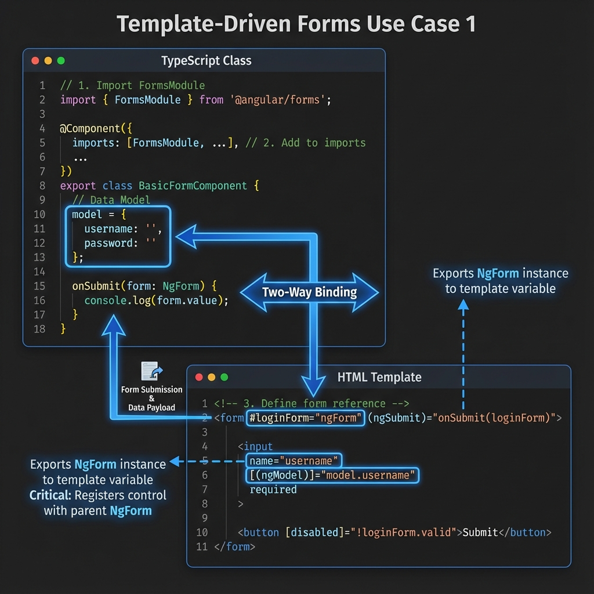

# 🚀 Use Case 1: The Basics

> **Goal**: Understand the fundamental building blocks of Template Driven Forms.

---



## 1. 🔍 How It Works

### The Mechanics
Angular creates a `FormGroup` instance automatically when it sees a `<form>` tag (if `FormsModule` is imported). It treats the HTML template as the source of truth.

*   **FormsModule**: Required in `imports`.
*   **ngForm**: The directive that attaches to `<form>`. You export it to a local variable (`#ref="ngForm"`) to access form state.
*   **ngModel**: The directive that binds an input to a property on the form. It requires a `name` attribute to register itself.

### 📊 Data Flow Diagram

```mermaid
graph TD
    User([User Types]) -->|Updates| View[Input Field]
    View -->|ngModel (Updates)| Model[Component Property]
    Model -->|ngModel (Updates)| View
    
    subgraph "Form Context"
        Form[ngForm Directive]
        Controls[FormControl Instances]
    end
    
    View -.->|Registers via name| Form
```

---

## 2. 🚀 Step-by-Step Implementation

### Step 1: Import FormsModule
This is the most common mistake! Always import it.

```typescript
import { FormsModule } from '@angular/forms';

@Component({
  imports: [FormsModule]
})
```

### Step 2: Template Reference
Export `ngForm` to a variable so you can pass it around or check valid states.

```html
<form #myForm="ngForm" (ngSubmit)="save(myForm)">
```

### Step 3: Binding Inputs
Use `[(ngModel)]` for two-way binding. **Critical**: You MUST provide a `name` attribute.

```html
<input name="email" [(ngModel)]="user.email" required>
```

---

### 📦 Data Flow Summary (Visual Box Diagram)

```
┌─────────────────────────────────────────────────────────────┐
│  TEMPLATE-DRIVEN FORMS: TEMPLATE IS SOURCE OF TRUTH         │
│                                                             │
│   ANGULAR AUTO-CREATES:                                     │
│   ┌───────────────────────────────────────────────────────┐ │
│   │ <form> tag detected                                   │ │
│   │    │                                                  │ │
│   │    ▼ Angular creates FormGroup automatically          │ │
│   │                                                       │ │
│   │ <input ngModel name="email">                          │ │
│   │    │                                                  │ │
│   │    ▼ Angular creates FormControl, registers with name │ │
│   └───────────────────────────────────────────────────────┘ │
│                                                             │
│   TWO-WAY BINDING:                                          │
│   ┌───────────────────────────────────────────────────────┐ │
│   │ Template: [(ngModel)]="user.email"                    │ │
│   │                                                       │ │
│   │ User types → Input value updates                      │ │
│   │           → ngModel syncs to user.email               │ │
│   │           → Component property updated                │ │
│   │                                                       │ │
│   │ Component changes user.email → Input shows new value  │ │
│   └───────────────────────────────────────────────────────┘ │
│                                                             │
│   KEY REQUIREMENTS:                                         │
│   ┌───────────────────────────────────────────────────────┐ │
│   │ ① Import FormsModule                                  │ │
│   │ ② Add name attribute (REQUIRED!)                      │ │
│   │ ③ Export with #ref="ngForm" for form access           │ │
│   └───────────────────────────────────────────────────────┘ │
└─────────────────────────────────────────────────────────────┘
```

> **Key Takeaway**: Template-driven = less code, Angular manages form model. Always add `name` attribute with `ngModel`!

---

## 3. 🧠 Mind Map: Quick Visual Reference

```mermaid
mindmap
  root((Template Forms))
    Setup
      Import FormsModule
    Form Tag
      #ref="ngForm"
      (ngSubmit)="method()"
    Inputs
      [(ngModel)]="prop"
      name="uniqueName"
    State
      form.valid
      form.dirty
      form.value
```
