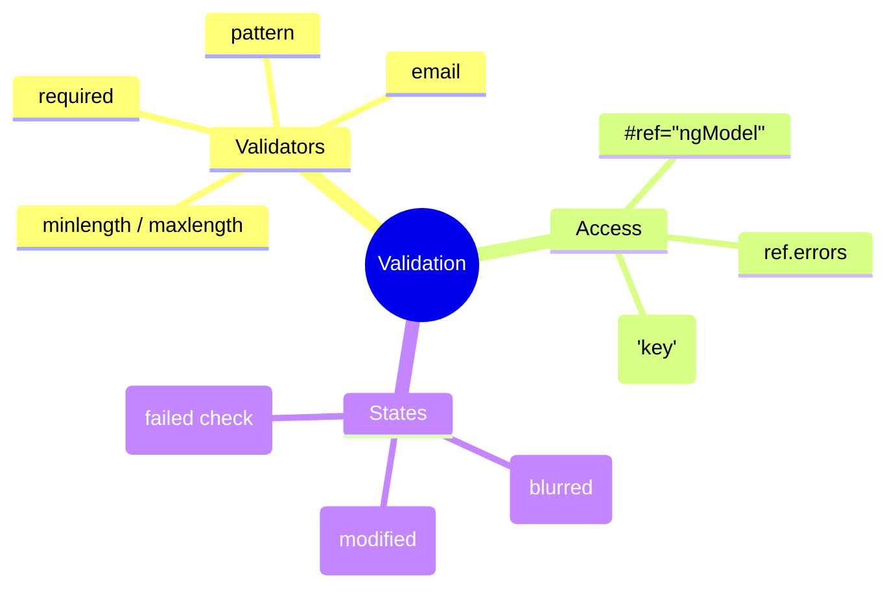

# ✅ Use Case 2: Validation

> **Goal**: Provide immediate user feedback and prevent invalid command submission.

---

## 1. 🔍 How It Works

### The Mechanism
Angular attaches `FormControl` objects to every input with `ngModel`. These controls track three main states:
1.  **Status**: `valid` / `invalid` / `pending`
2.  **Interaction**: `touched` (blurred) / `untouched`
3.  **Changes**: `dirty` (changed) / `pristine`

By exporting `ngModel` to a local variable (`#emailCtrl="ngModel"`), you gain access to these states in your template.

### 📊 Validation Flow diagram

```mermaid
graph LR
    Input[Input Field] -->|Validators: required, email| Control[FormControl]
    
    Control -->|Validates| Errors{Has Errors?}
    
    Errors -- Yes --> State[Invalid]
    Errors -- No --> State[Valid]
    
    State -->|#ref="ngModel"| Template[Show/Hide Logic]
    
    Template -->|*ngIf="ref.errors?.required"| Msg[Error Message]
```

---

## 2. 🚀 Step-by-Step Implementation

### Step 1: Add Validator Attributes
Use standard HTML5 attributes (`required`, `minlength`, `maxlength`, `pattern`) or Angular directives (`email`).

```html
<input type="text" required minlength="3">
```

### Step 2: Export ngModel
This breaks open the black box so you can see inside the control.

```html
<input ... #nameCtrl="ngModel">
```

### Step 3: Show Errors
Combine `invalid` and `touched` (so you don't yell at the user before they start typing).

```html
<div *ngIf="nameCtrl.invalid && nameCtrl.touched">
  <small *ngIf="nameCtrl.errors?.['required']">Required!</small>
</div>
```

### Step 4: Styling
Angular automatically adds CSS classes like `.ng-invalid`, `.ng-dirty`, `.ng-touched` to the input element. You can style these directly.

```css
input.ng-invalid.ng-touched {
  border-color: red;
}
```

---

## 3. 🧠 Mind Map: Quick Visual Reference


