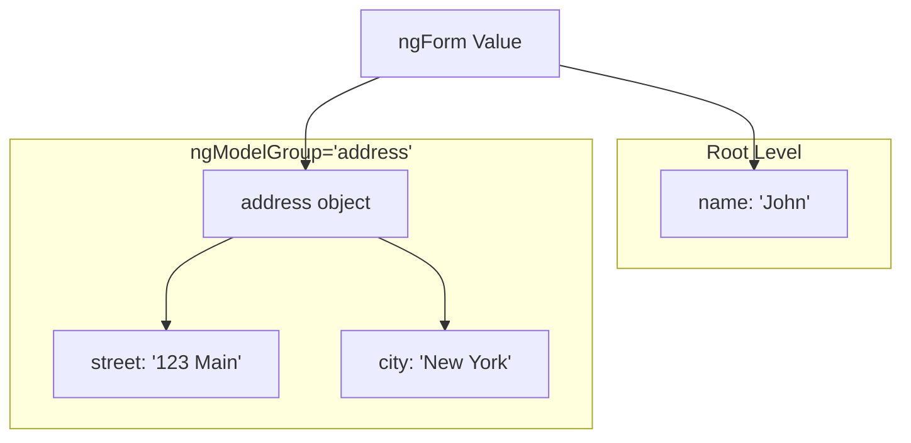
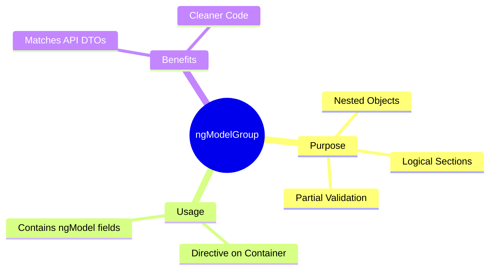

# 🗂️ Use Case 3: Grouping Data

> **Goal**: Organize form data into nested objects without writing custom object mapping logic.

---

## 1. 🔍 How It Works

### The Mechanism
By default, `ngModel` registers controls as direct properties of the form object (flat structure).
`ngModelGroup` creates a **child FormGroup** within the parent form. All `ngModel` directives inside the group are registered to that child group.

**Result**: Only the form *structure* changes; the HTML layout is irrelevant to the data structure unless you use `ngModelGroup`.

### 📊 Structure Visualization



---

## 2. 🚀 Step-by-Step Implementation

### Step 1: Define the Structure
Decide how you want your data to look.

```typescript
// Desired Output
{
  name: "John",
  address: {
    street: "123 Main St",
    zip: "90210"
  }
}
```

### Step 2: Use ngModelGroup
Wrap the related inputs in an element (div, fieldset) and add the directive.

```html
<!-- Root prop -->
<input name="name" [(ngModel)]="user.name">

<!-- Nested group -->
<div ngModelGroup="address">
  <input name="street" [(ngModel)]="user.address.street">
  <input name="zip" [(ngModel)]="user.address.zip">
</div>
```

### Step 3: Accessing Group Status
You can even export the group to check validation just for that section!

```html
<div ngModelGroup="address" #addrGroup="ngModelGroup">
  <p *ngIf="addrGroup.invalid">Address is incomplete!</p>
</div>
```

---

### 📦 Data Flow Summary (Visual Box Diagram)

```
┌─────────────────────────────────────────────────────────────┐
│  ngModelGroup: NESTED DATA STRUCTURE                        │
│                                                             │
│   WITHOUT ngModelGroup (flat):                              │
│   ┌───────────────────────────────────────────────────────┐ │
│   │ form.value = {                                        │ │
│   │   name: "John",                                       │ │
│   │   street: "123 Main",  // ❌ Flat!                    │ │
│   │   city: "NYC"                                         │ │
│   │ }                                                     │ │
│   └───────────────────────────────────────────────────────┘ │
│                                                             │
│   WITH ngModelGroup (nested):                               │
│   ┌───────────────────────────────────────────────────────┐ │
│   │ <input name="name" [(ngModel)]="user.name">           │ │
│   │                                                       │ │
│   │ <div ngModelGroup="address">                          │ │
│   │   <input name="street" [(ngModel)]="user.address.street">│ │
│   │   <input name="city" [(ngModel)]="user.address.city"> │ │
│   │ </div>                                                │ │
│   │                                                       │ │
│   │ form.value = {                                        │ │
│   │   name: "John",                                       │ │
│   │   address: {              // ✅ Nested object!        │ │
│   │     street: "123 Main",                               │ │
│   │     city: "NYC"                                       │ │
│   │   }                                                   │ │
│   │ }                                                     │ │
│   └───────────────────────────────────────────────────────┘ │
└─────────────────────────────────────────────────────────────┘
```

> **Key Takeaway**: Use `ngModelGroup` to create nested objects. Matches API DTOs without manual mapping!

---

## 3. 🧠 Mind Map: Quick Visual Reference


