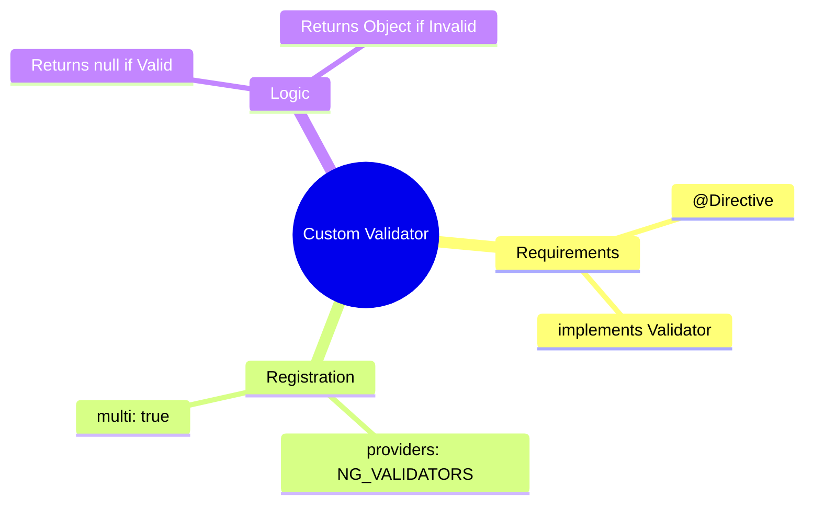

# ⚙️ Use Case 4: Custom Validators

> **Goal**: Implement complex validation logic (like "confirm password") that reusable across forms.

---

## 1. 🔍 How It Works

### The Mechanism
In Template Driven Forms, validation is done via **Directives**.
To create a custom validator, you must:
1.  Create a Directive (`@Directive`).
2.  Implement the `Validator` interface (`validate()`).
3.  Register it with Angular's `NG_VALIDATORS` token so the form engine "sees" it.

### 📊 Validator Registration

```mermaid
graph TD
    Directive[CustomDirective]
    Token[NG_VALIDATORS Token]
    Engine[Angular Form Engine]
    
    Directive -->|Provides itself via| Token
    Token -->|Injected into| Engine
    
    Engine -->|Calls validate()| Directive
```

---

## 2. 🚀 Step-by-Step Implementation

### Step 1: The Directive
The key is the `providers` array. This tells Angular "I am a validator".

```typescript
@Directive({
  selector: '[appCustomVal]',
  providers: [{
    provide: NG_VALIDATORS,
    useExisting: CustomValidatorDirective,
    multi: true // Essential! Don't overwrite other validators
  }]
})
export class CustomValidatorDirective implements Validator {
  validate(control: AbstractControl): ValidationErrors | null {
    return isValid ? null : { myError: true };
  }
}
```

### Step 2: Cross-Field Validation
To match passwords, the validator needs to see the *other* field.

```typescript
// Look up the parent form to find sibling controls
const otherControl = control.parent.get('password');
```

### Step 3: Usage
Just add the selector to your input!

```html
<input name="confirm" [(ngModel)]="val" appCustomVal>
```

---

## 3. 🧠 Mind Map: Quick Visual Reference


