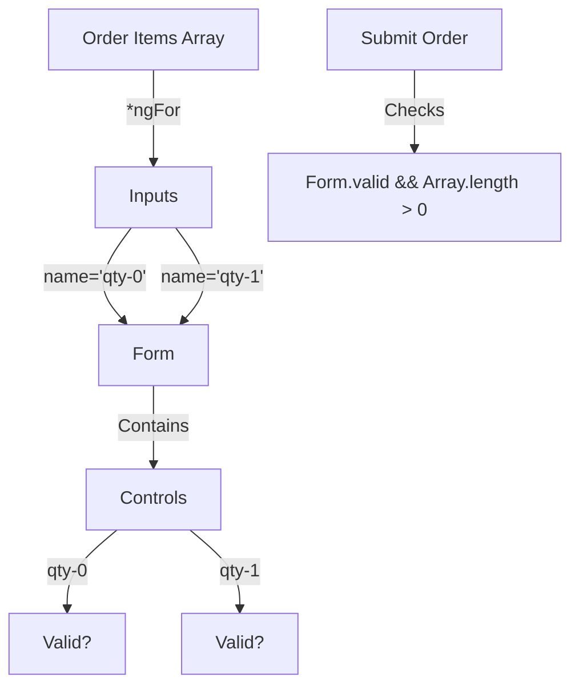

# 🔢 Use Case 5: Dynamic Forms

> **Goal**: Manage dynamic lists of data (Arrays) where items can be added or removed, while maintaining correct form state and validation.

---

## 1. 🔍 How It Works

### The Challenge
When you loop over an array with `*ngFor` in a form, every input needs a **unique name** attribute. If two inputs have `name="product"`, they will overwrite each other in the `ngForm` registry.

### The Solution
1.  **Unique Naming**: Append the index or ID to the name: `name="product-{{i}}"`.
2.  **Tracking**: Use `trackBy` to prevent focus loss when the array changes.
3.  **Manual Validation**: Some rules (like "Min 1 item") are easier to check manually than with a directive.

### 📊 Validation Flow diagram



---

## 2. 🚀 Step-by-Step Implementation

### Step 1: Loops and Naming
This is the most critical part.

```html
<div *ngFor="let item of items; let i = index">
  <!-- Unique Name is mandatory! -->
  <input [name]="'product-' + i" [(ngModel)]="item.name">
</div>
```

### Step 2: Adding/Removing Logic
Standard array manipulation in TypeScript.

```typescript
addItem() {
  this.items.push({ name: '', price: 0 });
}

removeItem(index: number) {
  this.items.splice(index, 1);
}
```

### Step 3: TrackBy Function
Without this, Angular might re-render the DOM for every change, causing the input to lose focus while typing.

```typescript
trackById(index, item) {
  return item.id;
}
```

---

## 3. 🧠 Mind Map: Quick Visual Reference

```mermaid
mindmap
  root((Dynamic Forms))
    Looping
      *ngFor
      trackBy (Critical!)
    Naming
      [name]="'prop-' + i"
      Must be unique
    Logic
      push() to add
      splice() to remove
      reduce() for totals
```
