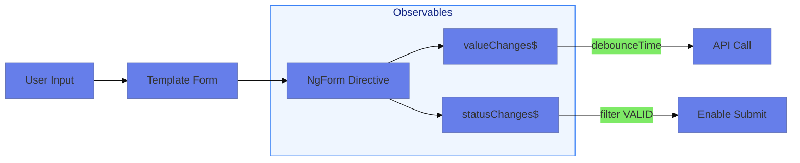

# 📡 Use Case 7: Observing Form Changes in Template-Driven Forms

> **Goal**: React to value and status changes in real-time using `valueChanges` and `statusChanges` observables.

---

## 🏛️ What Problem Does It Solve?

### The "Manual Polling" Problem
*   **The Problem**: Without observables, you'd have to manually check form values on every interaction or use complex event handlers.
*   **The Solution**: Subscribe to `valueChanges` and `statusChanges` observables for automatic, reactive updates.
*   **The Benefit**: Clean, declarative code that reacts to changes without polling.

### The "Debounce API Calls" Problem
*   **The Problem**: Making an API call on every keystroke overwhelms the server.
*   **The Solution**: Use RxJS operators like `debounceTime()` and `distinctUntilChanged()`.

---

## 🔬 Deep Dive: Important Classes & Concepts

### A. Accessing the Form with `@ViewChild`
```typescript
@ViewChild('formName') form!: NgForm;
```
- In Template-Driven forms, the form is created in the template
- You MUST access it after `ngAfterViewInit()`, not `ngOnInit()`

### B. Available Observables
| Observable | Type | Emits When |
|------------|------|------------|
| `form.valueChanges` | `Observable<any>` | Any control value changes |
| `form.statusChanges` | `Observable<string>` | VALID, INVALID, PENDING |
| `control.valueChanges` | `Observable<any>` | This specific control changes |
| `control.statusChanges` | `Observable<string>` | This control's status changes |

### C. Accessing Individual Controls
```typescript
// Via NgForm
this.form.controls['username'].valueChanges

// Via control reference (if you have it)
@ViewChild('usernameCtrl') usernameCtrl!: NgModel;
this.usernameCtrl.valueChanges
```

---

## 1. 🔍 How It Works (The Concept)

### 📊 Data Flow



---

## 2. 🚀 Step-by-Step Implementation Guide

### Step 1: Create ViewChild Reference

```typescript
@ViewChild('myForm') myForm!: NgForm;
```

### Step 2: Subscribe in AfterViewInit

```typescript
ngAfterViewInit(): void {
    // Use setTimeout to avoid ExpressionChangedAfterItHasBeenChecked
    setTimeout(() => {
        this.myForm.valueChanges.pipe(
            debounceTime(300),
            distinctUntilChanged()
        ).subscribe(values => {
            console.log('Form values:', values);
        });
    });
}
```

### Step 3: Always Unsubscribe

```typescript
private sub!: Subscription;

ngAfterViewInit(): void {
    this.sub = this.myForm.valueChanges.subscribe(...);
}

ngOnDestroy(): void {
    this.sub?.unsubscribe();
}
```

---

## 3. 🌍 Real World Use Cases

1. **Auto-Save Drafts**: Save form data to localStorage every few seconds
2. **Search-as-You-Type**: Debounce search input and fetch results
3. **Form Analytics**: Track which fields users modify most
4. **Conditional UI**: Show/hide sections based on form status
5. **Real-time Collaboration**: Sync form changes to server

---

## 4. ⚠️ Common Pitfalls

### ❌ Subscribing in ngOnInit
```typescript
// WRONG - form doesn't exist yet!
ngOnInit() {
    this.myForm.valueChanges.subscribe(...); // ERROR!
}

// CORRECT - form exists in AfterViewInit
ngAfterViewInit() {
    setTimeout(() => {
        this.myForm.valueChanges.subscribe(...);
    });
}
```

### ❌ Forgetting to Unsubscribe
```typescript
// WRONG - memory leak!
ngAfterViewInit() {
    this.form.valueChanges.subscribe(...);
}

// CORRECT
ngOnDestroy() {
    this.subscription.unsubscribe();
}
```

### ❌ ExpressionChangedAfterItHasBeenCheckedError
```typescript
// This error happens when changing component state in AfterViewInit
// Solution: Wrap in setTimeout
setTimeout(() => {
    this.myForm.valueChanges.subscribe(v => this.data = v);
});
```

---

## 7. ❓ Interview & Practice Questions

### Q1: Why do we use `@ViewChild` to access the form?
**A:** In Template-Driven forms, the NgForm directive is created by Angular when parsing the template. It's not available until after the view initializes.

### Q2: When is the form available - ngOnInit or ngAfterViewInit?
**A:** `ngAfterViewInit`. The template must be rendered before the NgForm directive instance is accessible.

### Q3: Why do we use `setTimeout` when subscribing in ngAfterViewInit?
**A:** To avoid `ExpressionChangedAfterItHasBeenCheckedError`. Angular has already run change detection, so modifying state synchronously causes this error.

### Q4: How do you access an individual control's observable?
**A:** Either via `form.controls['fieldName'].valueChanges` or by creating a separate `@ViewChild` for the NgModel.

### Q5: What's the difference between form-level and control-level observables?
**A:** Form-level observables emit the entire form value. Control-level observables emit only that control's value.

### Q6: SCENARIO: You want to auto-save the form every 5 seconds, but only if it changed. What RxJS operators help?
**A:**
```typescript
this.form.valueChanges.pipe(
    debounceTime(5000),
    distinctUntilChanged((a, b) => JSON.stringify(a) === JSON.stringify(b))
).subscribe(value => this.autoSave(value));
```

### Q7: How do you observe only the 'email' field, not the entire form?
**A:**
```typescript
this.form.controls['email'].valueChanges.subscribe(...);
// OR
@ViewChild('emailCtrl') emailCtrl!: NgModel;
this.emailCtrl.valueChanges.subscribe(...);
```

### Q8: What values does `statusChanges` emit?
**A:** Strings: `'VALID'`, `'INVALID'`, `'PENDING'`, `'DISABLED'`.

### Q9: SCENARIO: You want to enable the submit button only when the form becomes VALID after being INVALID. How?
**A:**
```typescript
this.form.statusChanges.pipe(
    distinctUntilChanged(),
    filter(s => s === 'VALID')
).subscribe(() => this.enableSubmit());
```

### Q10: Can you use `takeUntilDestroyed()` with Template-Driven forms?
**A:** Yes, but you need to inject `DestroyRef` and create the subscription in AfterViewInit, not the constructor.

### Q11: How does `valueChanges` differ from `(ngModelChange)`?
**A:** `(ngModelChange)` is an event for a single control. `valueChanges` is an Observable that can be combined with RxJS operators.

### Q12: SCENARIO: Your form has 10 fields but you only want to react to 3 of them. What's the cleanest approach?
**A:** Use `pluck` or `map` to extract only needed fields:
```typescript
this.form.valueChanges.pipe(
    map(v => ({ name: v.name, email: v.email, phone: v.phone })),
    distinctUntilChanged((a, b) => JSON.stringify(a) === JSON.stringify(b))
).subscribe(...);
```

### Q13: What happens if you subscribe to `valueChanges` before the form is populated?
**A:** You'll receive emissions for both the initial population AND user changes. Use `skip(1)` to ignore the initial value.

### Q14: How do you combine valueChanges with an API call?
**A:**
```typescript
this.form.controls['search'].valueChanges.pipe(
    debounceTime(300),
    distinctUntilChanged(),
    switchMap(term => this.api.search(term))
).subscribe(results => this.results = results);
```

### Q15: SCENARIO: You need the form value AND form status together. How do you combine them?
**A:** Use `combineLatest`:
```typescript
combineLatest([
    this.form.valueChanges,
    this.form.statusChanges
]).subscribe(([value, status]) => {
    console.log(value, status);
});
```

### Q16: Why might valueChanges emit `undefined` initially?
**A:** If you subscribe before the form controls are initialized. Always wait for ngAfterViewInit.

### Q17: How do you prevent `valueChanges` from emitting during `patchValue()`?
**A:** Template forms don't have direct `patchValue`, but if you modify the model programmatically, wrap in `emitEvent: false` (not directly available - this is a Reactive Forms feature).

### Q18: Can you use `async` pipe with form observables in the template?
**A:** Yes, but be careful of timing. The observable might not exist until AfterViewInit.

### Q19: SCENARIO: Your `valueChanges` subscription is firing twice per keystroke. Why?
**A:** You might have subscribed multiple times (e.g., in ngAfterViewInit without cleanup). Always check for existing subscriptions or use `take(1)` for one-time reads.

### Q20: How do you test valueChanges subscriptions?
**A:**
```typescript
it('should log value changes', fakeAsync(() => {
    component.model.query = 'test';
    fixture.detectChanges();
    tick(300); // Wait for debounce
    expect(component.valueLog.length).toBeGreaterThan(0);
}));
```
