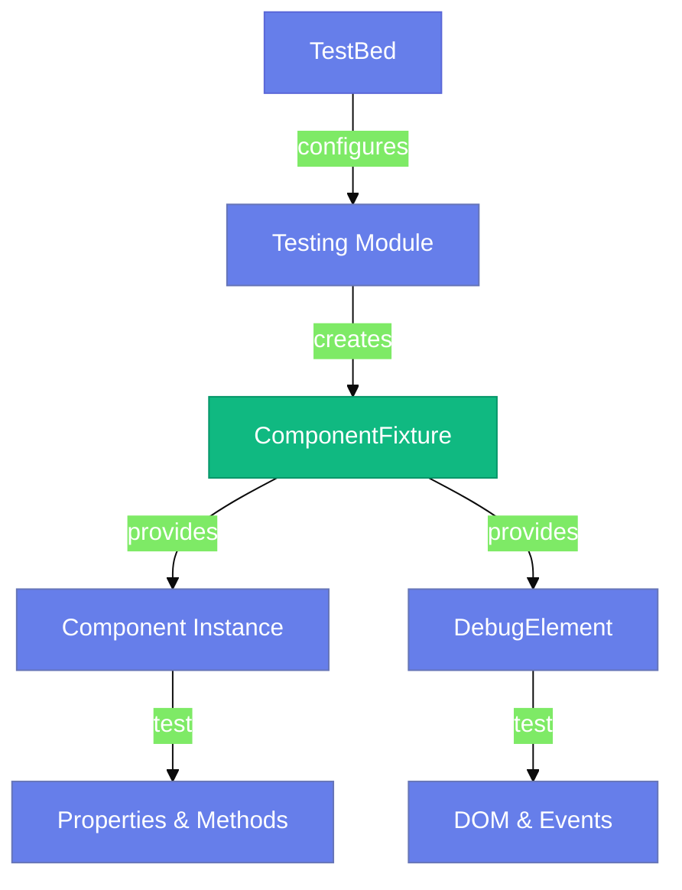
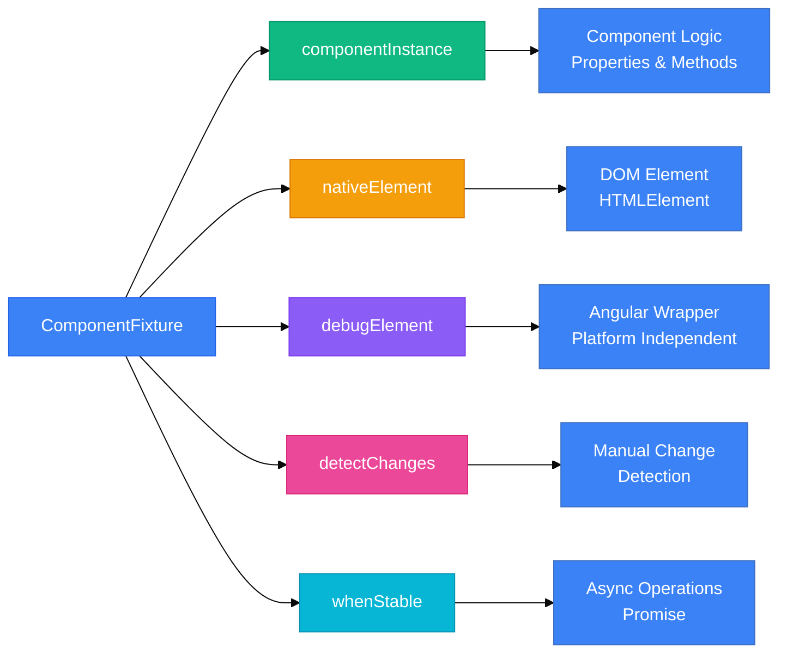

# 🧩 Component Testing Basics

> **💡 Lightbulb Moment**: Component tests verify that your templates and logic work together correctly. They test what the *user sees*, not implementation details!


## 📋 Table of Contents
- [📊 Complete Testing Flow](#complete-testing-flow)
- [1. 🔍 How It Works](#1--how-it-works)
  - [The Testing Triangle](#the-testing-triangle)
  - [Key Players](#key-players)
- [1.1 🔧 Understanding ComponentFixture](#11--understanding-componentfixture)
  - [What is ComponentFixture?](#what-is-componentfixture)
  - [The ComponentFixture Anatomy](#the-componentfixture-anatomy)
  - [Key Properties & Methods](#key-properties--methods)
    - [1. **componentInstance** - Access Component Logic](#1-componentinstance---access-component-logic)
    - [2. **nativeElement** - Raw DOM Access](#2-nativeelement---raw-dom-access)
    - [3. **debugElement** - Angular's DOM Wrapper (Recommended ✅)](#3-debugelement---angulars-dom-wrapper-recommended)
    - [4. **detectChanges()** - Manual Change Detection](#4-detectchanges---manual-change-detection)
    - [5. **whenStable()** - Wait for Async Operations](#5-whenstable---wait-for-async-operations)
  - [Why is ComponentFixture Needed?](#why-is-componentfixture-needed)
  - [Typical Usage Pattern](#typical-usage-pattern)
  - [nativeElement vs debugElement - Which to Use?](#nativeelement-vs-debugelement---which-to-use)
  - [Memory Trick 🧠](#memory-trick)
- [2. 🚀 Step-by-Step Implementation](#2--step-by-step-implementation)
  - [Step 1: Configure TestBed](#step-1-configure-testbed)
  - [Step 2: Create Fixture & Component](#step-2-create-fixture--component)
  - [Step 3: Query the DOM](#step-3-query-the-dom)
  - [Step 4: Simulate Events](#step-4-simulate-events)
- [3. 🎯 Understanding Jasmine Matchers (expect & toBe)](#3--understanding-jasmine-matchers-expect--tobe)
  - [What are Matchers?](#what-are-matchers)
  - [The toBe(0) Explained](#the-tobe0-explained)
  - [toBe vs Other Matchers](#tobe-vs-other-matchers)
  - [Common Testing Patterns](#common-testing-patterns)
    - [1. Testing Component State (Numbers)](#1-testing-component-state-numbers)
    - [2. Testing DOM Content (Strings)](#2-testing-dom-content-strings)
    - [3. Testing Boolean Properties](#3-testing-boolean-properties)
    - [4. Testing Objects & Arrays](#4-testing-objects--arrays)
  - [Complete Matcher Reference](#complete-matcher-reference)
    - [Equality Matchers](#equality-matchers)
    - [Truthiness Matchers](#truthiness-matchers)
    - [Number Matchers](#number-matchers)
    - [String/Array Matchers](#stringarray-matchers)
    - [Spy Matchers (EventEmitter testing)](#spy-matchers-eventemitter-testing)
  - [Decision Tree: Which Matcher to Use?](#decision-tree-which-matcher-to-use)
  - [Real-World Examples from Our Component](#real-world-examples-from-our-component)
  - [Memory Tricks 🧠](#memory-tricks)
- [4. 🕵️ Understanding spyOn - The Jasmine Spy System](#4--understanding-spyon---the-jasmine-spy-system)
  - [What is spyOn?](#what-is-spyon)
  - [Basic Syntax](#basic-syntax)
  - [🎯 What Does a Spy Do?](#what-does-a-spy-do)
  - [📚 Real Example from Your Code](#real-example-from-your-code)
  - [🛠️ Spy Strategies - Controlling Behavior](#spy-strategies---controlling-behavior)
    - [1. **Default Behavior** - Track Only (No Execution)](#1-default-behavior---track-only-no-execution)
    - [2. **`.and.callThrough()`** - Track AND Execute](#2-andcallthrough---track-and-execute)
    - [3. **`.and.returnValue()`** - Return Fake Value](#3-andreturnvalue---return-fake-value)
    - [4. **`.and.callFake()`** - Custom Implementation](#4-andcallfake---custom-implementation)
    - [5. **`.and.throwError()`** - Simulate Errors](#5-andthrowerror---simulate-errors)
    - [6. **`.and.stub()`** - Do Nothing (Explicit No-op)](#6-andstub---do-nothing-explicit-no-op)
  - [🧪 Spy Assertion Matchers](#spy-assertion-matchers)
  - [💡 Common Use Cases](#common-use-cases)
    - [Testing `@Output()` EventEmitters](#testing-output-eventemitters)
    - [Testing Service Method Calls](#testing-service-method-calls)
    - [Testing Multiple Calls with Different Arguments](#testing-multiple-calls-with-different-arguments)
    - [Preventing Real Method Execution (Side Effects)](#preventing-real-method-execution-side-effects)
    - [Testing Method Call Order](#testing-method-call-order)
    - [Testing Private Method Calls (Indirectly)](#testing-private-method-calls-indirectly)
  - [🔍 Spy Call Inspection - Advanced Techniques](#spy-call-inspection---advanced-techniques)
  - [🎭 Spy Analogy: The Secret Agent](#spy-analogy-the-secret-agent)

---
## 📊 Complete Testing Flow


---

## 1. 🔍 How It Works

### The Testing Triangle



### Key Players

| Concept | Role |
|---------|------|
| **TestBed** | Angular's test module configurator |
| **ComponentFixture** | Wrapper around component + template |
| **DebugElement** | DOM abstraction for queries |
| **detectChanges()** | Triggers change detection manually |

---

## 1.1 🔧 Understanding ComponentFixture

### What is ComponentFixture?

**ComponentFixture** is a **wrapper** around a component instance created by Angular's `TestBed`. It provides access to the component and its template for testing purposes.

> **💡 Think of it as**: A "test harness" or "testing container" that holds your component and provides tools to test it.

### The ComponentFixture Anatomy



### Key Properties & Methods

#### 1. **componentInstance** - Access Component Logic

The actual component instance you're testing.

```typescript
// Access component properties
fixture.componentInstance.count = 10;
fixture.componentInstance.title = 'Test';

// Call component methods
fixture.componentInstance.increment();

// Verify component state
expect(fixture.componentInstance.count).toBe(11);
```

**Use case**: Testing component logic, properties, and methods

---

#### 2. **nativeElement** - Raw DOM Access

The actual DOM element (platform-specific).

```typescript
// Query DOM directly
const h1 = fixture.nativeElement.querySelector('h1');

// Get text content
const text = h1.textContent;

// Simulate DOM events
const button = fixture.nativeElement.querySelector('button');
button.click();
```

**Use case**: Direct DOM manipulation (less common, platform-specific)

---

#### 3. **debugElement** - Angular's DOM Wrapper (Recommended ✅)

Platform-independent wrapper with Angular-specific utilities.

```typescript
// Query using By.css (recommended)
const button = fixture.debugElement.query(By.css('[data-testid="increment-btn"]'));

// Trigger events (platform-independent)
button.triggerEventHandler('click', null);

// Access underlying native element
const nativeBtn = button.nativeElement;
```

**Use case**: Preferred for Angular tests - works across all platforms

---

#### 4. **detectChanges()** - Manual Change Detection

Triggers Angular's change detection cycle manually.

```typescript
// Modify component state
component.count = 5;

// DOM is NOT updated yet! ⚠️

// Trigger change detection to update DOM
fixture.detectChanges();

// NOW DOM reflects the change ✅
const display = fixture.nativeElement.querySelector('[data-testid="count-display"]');
expect(display.textContent).toBe('5');
```

**Why needed?**: In tests, change detection is MANUAL. In real apps, it's automatic.

---

#### 5. **whenStable()** - Wait for Async Operations

Returns a Promise that resolves when all async operations complete.

```typescript
it('should load data', async () => {
    component.loadData();  // Triggers async HTTP call
    
    // Wait for all async operations (HTTP, setTimeout, Promise, etc.)
    await fixture.whenStable();
    
    // Now async data is available
    expect(component.data).toBeDefined();
});
```

**Use case**: Testing async validators, HTTP calls, setTimeout, Promises

---

### Why is ComponentFixture Needed?

| Benefit | Explanation |
|---------|-------------|
| ✅ **Isolation** | Wraps component in a test harness separate from the real application |
| ✅ **Manual Control** | Gives you manual control over change detection via `detectChanges()` |
| ✅ **DOM Access** | Provides access to both component logic AND rendered DOM |
| ✅ **Testing Utilities** | Offers helper methods (`whenStable`, `autoDetectChanges`, etc.) |

### Typical Usage Pattern

```typescript
describe('MyComponent', () => {
    let component: MyComponent;
    let fixture: ComponentFixture<MyComponent>;

    beforeEach(() => {
        // 1️⃣ Configure TestBed
        TestBed.configureTestingModule({
            imports: [MyComponent]
        });
        
        // 2️⃣ Create ComponentFixture
        fixture = TestBed.createComponent(MyComponent);
        
        // 3️⃣ Get component instance from fixture
        component = fixture.componentInstance;
        
        // 4️⃣ Trigger initial change detection
        fixture.detectChanges();
    });

    it('should update view', () => {
        // Modify component state
        component.title = 'New Title';
        
        // Apply changes to DOM
        fixture.detectChanges();
        
        // Query and assert DOM
        const h1 = fixture.nativeElement.querySelector('h1');
        expect(h1.textContent).toContain('New Title');
    });
});
```

### nativeElement vs debugElement - Which to Use?

| Aspect | nativeElement | debugElement |
|--------|---------------|--------------|
| **Type** | HTMLElement (browser-specific) | DebugElement (Angular wrapper) |
| **Platform** | Browser only | All platforms (browser, server, mobile) |
| **Querying** | `querySelector()`, `querySelectorAll()` | `query(By.css(...))`, `queryAll(...)` |
| **Events** | `.click()`, `.dispatchEvent()` | `.triggerEventHandler('click', null)` |
| **Recommended?** | ⚠️ Platform-specific | ✅ **Preferred for Angular tests** |

**Example Comparison:**

```typescript
// ❌ Using nativeElement (platform-specific)
const button = fixture.nativeElement.querySelector('[data-testid="btn"]');
button.click();

// ✅ Using debugElement (platform-independent, recommended)
const button = fixture.debugElement.query(By.css('[data-testid="btn"]'));
button.triggerEventHandler('click', null);
```

### Memory Trick 🧠

**ComponentFixture = Component + Fixture (tools/utilities)**

- **Component** = Your actual component instance (the lamp 💡)
- **Fixture** = The testing "fixture" (harness) that holds it (the test stand 🔧)

Think of it like a **lamp in a test stand**. The fixture holds the lamp and provides controls to test it!

```
    🔧 ComponentFixture (Test Stand)
    ├── 💡 componentInstance (The Lamp)
    ├── 🎛️ detectChanges() (Turn On/Off)
    ├── 📏 nativeElement (Lamp's Physical Body)
    └── 🔍 debugElement (Inspection Tools)
```

---

## 2. 🚀 Step-by-Step Implementation

### Step 1: Configure TestBed

```typescript
beforeEach(async () => {
    await TestBed.configureTestingModule({
        imports: [ComponentUnderTest]  // Standalone component
    }).compileComponents();
});
```

### Step 2: Create Fixture & Component

```typescript
fixture = TestBed.createComponent(ComponentUnderTest);
component = fixture.componentInstance;
fixture.detectChanges();  // Initial binding
```

### Step 3: Query the DOM

```typescript
// By CSS (fragile)
const el = fixture.debugElement.query(By.css('.my-class'));

// By data-testid (recommended ✅)
const btn = fixture.debugElement.query(By.css('[data-testid="submit-btn"]'));
```

### Step 4: Simulate Events

```typescript
btn.triggerEventHandler('click', null);
fixture.detectChanges();  // Update view after event
```

---

## 3. 🎯 Understanding Jasmine Matchers (expect & toBe)

### What are Matchers?

**Matchers** are Jasmine methods that perform assertions - they compare actual values to expected values.

```typescript
expect(actualValue).toBe(expectedValue);
//     ↑            ↑    ↑
//   Actual      Matcher Expected
```

### The toBe(0) Explained

When you see: `expect(component.count).toBe(0)`

**Breaking it down:**
1. `expect(component.count)` → Wraps the actual value being tested
2. `.toBe(0)` → The matcher that checks strict equality (===)
3. `0` → The expected value

**How it works:**
```typescript
// Behind the scenes, Jasmine does:
if (component.count === 0) {
    // ✅ Test passes
} else {
    // ❌ Test fails with helpful message
}
```

### toBe vs Other Matchers

| Matcher | Use Case | Example |
|---------|----------|---------|
| **toBe()** | Primitives (strict ===) | `expect(count).toBe(5)` |
| **toEqual()** | Objects/Arrays (deep equality) | `expect(user).toEqual({name: 'John'})` |
| **toBeTruthy()** | Any truthy value | `expect(value).toBeTruthy()` // 1, "text", true |
| **toBeFalsy()** | Any falsy value | `expect(value).toBeFalsy()` // 0, "", false, null |
| **toBeTrue()** | Exactly true | `expect(flag).toBeTrue()` |
| **toBeFalse()** | Exactly false | `expect(flag).toBeFalse()` |

### Common Testing Patterns

#### 1. Testing Component State (Numbers)
```typescript
it('should initialize with count = 0', () => {
    // ✅ CORRECT: toBe for primitives
    expect(component.count).toBe(0);
    
    // ❌ WRONG: Don't use toEqual for primitives
    expect(component.count).toEqual(0);  // Works but unnecessary
});
```

#### 2. Testing DOM Content (Strings)
```typescript
it('should display count in DOM', () => {
    const countEl = fixture.debugElement.query(By.css('[data-testid="count"]'));
    
    // ⚠️ IMPORTANT: DOM textContent is always a STRING!
    expect(countEl.nativeElement.textContent.trim()).toBe('0');  // ✅ String '0'
    
    // ❌ WRONG: This will FAIL - type mismatch!
    expect(countEl.nativeElement.textContent.trim()).toBe(0);  // String vs Number
});
```

#### 3. Testing Boolean Properties
```typescript
it('should disable button when count is 0', () => {
    const btn = fixture.debugElement.query(By.css('[data-testid="decrement-btn"]'));
    
    // ✅ PREFERRED: Explicit boolean check
    expect(btn.nativeElement.disabled).toBeTrue();
    
    // ✅ ALSO WORKS: But less semantic
    expect(btn.nativeElement.disabled).toBe(true);
    
    // ⚠️ TOO LOOSE: Accepts ANY truthy value (1, "yes", etc.)
    expect(btn.nativeElement.disabled).toBeTruthy();
});
```

#### 4. Testing Objects & Arrays
```typescript
it('should return user object', () => {
    const user = component.getUser();
    
    // ✅ CORRECT: toEqual for deep comparison
    expect(user).toEqual({ name: 'John', age: 30 });
    
    // ❌ WRONG: toBe checks reference, not content
    expect(user).toBe({ name: 'John', age: 30 });  // FAILS - different objects
});
```

### Complete Matcher Reference

#### Equality Matchers
```typescript
expect(value).toBe(expected)              // Strict === (primitives)
expect(value).toEqual(expected)           // Deep equality (objects/arrays)
expect(value).not.toBe(unexpected)        // Negation
```

#### Truthiness Matchers
```typescript
expect(value).toBeTrue()                  // Exactly true
expect(value).toBeFalse()                 // Exactly false
expect(value).toBeTruthy()                // Any truthy (1, "yes", true, {})
expect(value).toBeFalsy()                 // Any falsy (0, "", false, null)
expect(value).toBeDefined()               // Not undefined
expect(value).toBeUndefined()             // Is undefined
expect(value).toBeNull()                  // Is null
```

#### Number Matchers
```typescript
expect(value).toBeGreaterThan(5)          // value > 5
expect(value).toBeGreaterThanOrEqual(5)   // value >= 5
expect(value).toBeLessThan(10)            // value < 10
expect(value).toBeLessThanOrEqual(10)     // value <= 10
expect(value).toBeCloseTo(5.3, 0.1)       // Floating point (precision)
expect(value).toBeNaN()                   // Is NaN
```

#### String/Array Matchers
```typescript
expect(array).toContain(item)             // Array includes item
expect(string).toMatch(/regex/)           // Regex match
expect(string).toMatch('substring')       // String contains
```

#### Spy Matchers (EventEmitter testing)
```typescript
const spy = spyOn(component.save, 'emit');
expect(spy).toHaveBeenCalled()            // Called at least once
expect(spy).toHaveBeenCalledWith(arg)     // Called with specific args
expect(spy).toHaveBeenCalledTimes(n)      // Called exactly n times
expect(spy).not.toHaveBeenCalled()        // Never called
```

### Decision Tree: Which Matcher to Use?

```
Testing a value?
│
├─ Primitive (number, string, boolean)?
│  ├─ Number/String → use .toBe()
│  └─ Boolean → use .toBeTrue() or .toBeFalse()
│
├─ Object or Array?
│  └─ use .toEqual()
│
├─ Checking if exists?
│  ├─ Truthy/Falsy → .toBeTruthy() or .toBeFalsy()
│  └─ Defined → .toBeDefined() or .toBeUndefined()
│
├─ Number comparison?
│  └─ .toBeGreaterThan(), .toBeLessThan(), etc.
│
└─ EventEmitter (spy)?
   └─ .toHaveBeenCalled(), .toHaveBeenCalledWith()
```

### Real-World Examples from Our Component

```typescript
// ✅ Example 1: Testing initial state
expect(component.count).toBe(0);
// Why toBe? → Comparing primitive number with strict equality

// ✅ Example 2: Testing after increment
component.increment();
expect(component.count).toBe(1);
// Why toBe? → Still a primitive, checking exact value

// ✅ Example 3: Testing DOM text
const el = fixture.debugElement.query(By.css('[data-testid="count-display"]'));
expect(el.nativeElement.textContent.trim()).toBe('0');
// Why string '0'? → textContent always returns string!

// ✅ Example 4: Testing button disabled state
const btn = fixture.debugElement.query(By.css('[data-testid="decrement-btn"]'));
expect(btn.nativeElement.disabled).toBeTrue();
// Why toBeTrue? → Explicit boolean check, most semantic

// ✅ Example 5: Testing EventEmitter
const spy = spyOn(component.countChange, 'emit');
component.increment();
expect(spy).toHaveBeenCalledWith(1);
// Why spy matcher? → Testing @Output emissions
```

### Memory Tricks 🧠

| Matcher | Memory Trick |
|---------|--------------|
| **toBe** | "To **be** or not to **be**" - Shakespeare (exact match) |
| **toEqual** | "All **equal** in value" - Deep comparison |
| **toBeTrue** | "**Be** exactly **true**" - No impostors! |
| **toContain** | "Does it **contain** this item?" - Arrays & strings |
| **toHaveBeenCalled** | "**Has** the spy **been** watching?" - EventEmitter |

---

## 4. 🕵️ Understanding spyOn - The Jasmine Spy System

### What is spyOn?

`spyOn` is a **Jasmine utility function** that creates a **spy** (mock) to track and control method calls. It's essential for testing outputs, event emitters, and method invocations without executing the real implementation.

> **🎭 Analogy**: Think of `spyOn` like hiring a **secret agent** to watch and report on method calls without interfering with the original mission (unless you want to).

### Basic Syntax

```typescript
spyOn(object, 'methodName')
//    ↑       ↑
//  Object   Method name as string
```

**Returns**: A spy object that you can use with assertion matchers

---

### 🎯 What Does a Spy Do?

A **spy** is like a secret agent that:

| Feature | Description | Example |
|---------|-------------|---------|
| 📹 **Records** | Tracks when method is called | `spy.calls.count()` |
| 📝 **Tracks Arguments** | Remembers what arguments were passed | `spy.calls.argsFor(0)` |
| 🔢 **Counts Calls** | Knows how many times called | `toHaveBeenCalledTimes(3)` |
| 🎭 **Can Fake** | Can replace method behavior | `.and.returnValue(fake)` |
| 🚫 **Blocks Execution** | Prevents real method from running (by default) | Just `spyOn(obj, 'method')` |

---

### 📚 Real Example from Your Code

```typescript
it('should emit countChange when incremented', () => {
    // 1️⃣ ARRANGE: Create a spy on the 'emit' method
    const emitSpy = spyOn(component.countChange, 'emit');
    //              ↑       ↑                      ↑
    //           Function  Object              Method Name
    //                    (EventEmitter)       (to spy on)
    
    // 2️⃣ ACT: Call the increment method
    component.increment();
    // This internally calls: this.countChange.emit(1)
    // The spy intercepts and records it!
    
    // 3️⃣ ASSERT: Verify 'emit' was called with value 1
    expect(emitSpy).toHaveBeenCalledWith(1);
});
```

**What happens behind the scenes:**
```typescript
// WITHOUT spy:
component.increment() 
  → this.countChange.emit(1) 
  → Event fires to parent component

// WITH spy:
component.increment() 
  → SPY intercepts emit(1)
  → Records the call (method name, arguments, timestamp)
  → DOESN'T actually emit (unless you use .and.callThrough())
  → You can verify: expect(spy).toHaveBeenCalledWith(1)
```

### 🛠️ Spy Strategies - Controlling Behavior

#### 1. **Default Behavior** - Track Only (No Execution)

```typescript
spyOn(component.countChange, 'emit');
// ✅ Tracks the call
// ❌ Doesn't execute the real emit() method
// Use case: Testing @Output without triggering parent logic
```

#### 2. **`.and.callThrough()`** - Track AND Execute

```typescript
spyOn(component.countChange, 'emit').and.callThrough();
// ✅ Tracks the call
// ✅ Executes the real emit() method
// Use case: When you need both tracking and real behavior
```

#### 3. **`.and.returnValue()`** - Return Fake Value

```typescript
spyOn(userService, 'getUser').and.returnValue({ id: 1, name: 'Test User' });
// ✅ Tracks the call
// ✅ Returns fake data instead of executing real method
// Use case: Mocking service calls, avoiding HTTP requests
```

**Example:**
```typescript
it('should load user data', () => {
    const fakeUser = { id: 1, name: 'John Doe' };
    spyOn(userService, 'getUser').and.returnValue(fakeUser);
    
    component.loadUser();
    
    expect(component.user).toEqual(fakeUser);
    expect(userService.getUser).toHaveBeenCalled();
});
```

#### 4. **`.and.callFake()`** - Custom Implementation

```typescript
spyOn(service, 'calculate').and.callFake((a, b) => {
    console.log('Fake calculation');
    return a + b;
});
// ✅ Tracks the call
// ✅ Runs your custom logic instead of real method
// Use case: Complex mocking scenarios, conditional logic
```

#### 5. **`.and.throwError()`** - Simulate Errors

```typescript
spyOn(httpService, 'getData').and.throwError('Network error');
// ✅ Tracks the call
// ✅ Throws error when called
// Use case: Testing error handling, negative scenarios
```

**Example:**
```typescript
it('should handle service error', () => {
    spyOn(dataService, 'loadData').and.throwError('API Error');
    
    component.loadData();
    
    expect(component.errorMessage).toBe('Failed to load data');
});
```

#### 6. **`.and.stub()`** - Do Nothing (Explicit No-op)

```typescript
spyOn(console, 'log').and.stub();
// ✅ Tracks calls
// ✅ Does nothing (explicitly)
// Use case: Silencing console logs in tests
```

---

### 🧪 Spy Assertion Matchers

After creating a spy, verify it was used correctly:

| Matcher | Purpose | Example |
|---------|---------|---------|
| **`toHaveBeenCalled()`** | Was it called at all? | `expect(spy).toHaveBeenCalled()` |
| **`toHaveBeenCalledWith(args)`** | Called with specific arguments? | `expect(spy).toHaveBeenCalledWith(1, 'test')` |
| **`toHaveBeenCalledTimes(n)`** | Called exactly n times? | `expect(spy).toHaveBeenCalledTimes(3)` |
| **`not.toHaveBeenCalled()`** | Never called? | `expect(spy).not.toHaveBeenCalled()` |
| **`toHaveBeenCalledBefore(otherSpy)`** | Called before another spy? | `expect(spy1).toHaveBeenCalledBefore(spy2)` |

---

### 💡 Common Use Cases

#### Testing `@Output()` EventEmitters

```typescript
@Component({...})
export class MyComponent {
    @Output() save = new EventEmitter<string>();
    
    onSave(data: string) {
        this.save.emit(data);
    }
}

// ✅ Test:
it('should emit save event with data', () => {
    const spy = spyOn(component.save, 'emit');
    
    component.onSave('test-data');
    
    expect(spy).toHaveBeenCalledWith('test-data');
    expect(spy).toHaveBeenCalledTimes(1);
});
```

#### Testing Service Method Calls

```typescript
it('should call userService.getUser()', () => {
    const fakeUser = { id: 1, name: 'John' };
    const spy = spyOn(userService, 'getUser').and.returnValue(fakeUser);
    
    component.loadUser();
    
    expect(spy).toHaveBeenCalled();
    expect(component.user).toEqual(fakeUser);
});
```

#### Testing Multiple Calls with Different Arguments

```typescript
it('should emit count change for each increment', () => {
    const spy = spyOn(component.countChange, 'emit');
    
    component.increment();  // count = 1
    component.increment();  // count = 2
    component.increment();  // count = 3
    
    expect(spy).toHaveBeenCalledTimes(3);
    expect(spy).toHaveBeenCalledWith(1);  // First call
    expect(spy).toHaveBeenCalledWith(2);  // Second call
    expect(spy).toHaveBeenCalledWith(3);  // Third call
});
```

#### Preventing Real Method Execution (Side Effects)

```typescript
it('should not actually save to database', () => {
    // Spy prevents real database call
    const spy = spyOn(database, 'save');
    
    component.saveData({ name: 'Test' });
    
    // ✅ Verifies method was called
    expect(spy).toHaveBeenCalledWith({ name: 'Test' });
    
    // ✅ Database never actually hit (no side effects)
});
```

#### Testing Method Call Order

```typescript
it('should call methods in correct order', () => {
    const spy1 = spyOn(service, 'initialize');
    const spy2 = spyOn(service, 'load');
    
    component.setup();
    
    expect(spy1).toHaveBeenCalledBefore(spy2);
});
```

#### Testing Private Method Calls (Indirectly)

```typescript
// Component has private method showMessage()
it('should show message after increment', () => {
    // Can't spy on private methods directly,
    // but can spy on setTimeout which showMessage uses
    spyOn(window, 'setTimeout');
    
    component.increment();
    
    expect(window.setTimeout).toHaveBeenCalled();
});
```

---

### 🔍 Spy Call Inspection - Advanced Techniques

```typescript
it('should track detailed call information', () => {
    const spy = spyOn(component.countChange, 'emit');
    
    component.increment();  // Call 1
    component.increment();  // Call 2
    
    // Get call count
    expect(spy.calls.count()).toBe(2);
    
    // Get arguments of first call (index 0)
    expect(spy.calls.argsFor(0)).toEqual([1]);
    
    // Get arguments of second call
    expect(spy.calls.argsFor(1)).toEqual([2]);
    
    // Get most recent call
    expect(spy.calls.mostRecent().args).toEqual([2]);
    
    // Get first call
    expect(spy.calls.first().args).toEqual([1]);
    
    // Get all calls
    expect(spy.calls.all().length).toBe(2);
    
    // Reset spy (clear history)
    spy.calls.reset();
    expect(spy.calls.count()).toBe(0);
});
```

---

### 🎭 Spy Analogy: The Secret Agent

Think of `spyOn` like hiring a **secret agent** (James Bond style 🕵️):

| Real World Spy | Testing Spy | Code Example |
|----------------|-------------|--------------|
| 🕵️ **Hire agent** | Create spy | `spyOn(component, 'method')` |
| 📸 **Agent records activities** | Spy tracks calls | `spy.calls.count()` |
| 📋 **Agent reports back** | Check assertions | `expect(spy).toHaveBeenCalled()` |
| 🎭 **Agent can impersonate** | Return fake data | `.and.returnValue(fakeData)` |
| 🚫 **Agent intercepts** | Block real method | Default behavior |
| 🔢 **Count surveillance** | Count calls | `.toHaveBeenCalledTimes(3)` |
| 📝 **Note conversations** | Track arguments | `spy.calls.argsFor(0)` |

**Story Example:**
```typescript
// Mission: Watch the emit() method without alerting parent component
const spy = spyOn(component.countChange, 'emit');  // Deploy agent 🕵️

component.increment();  // Target performs action

// Agent reports back:
expect(spy).toHaveBeenCalled();         // "Yes, target made contact"
expect(spy).toHaveBeenCalledWith(1);    // "Conversation was about '1'"
expect(spy).toHaveBeenCalledTimes(1);   // "Only one meeting occurred"
