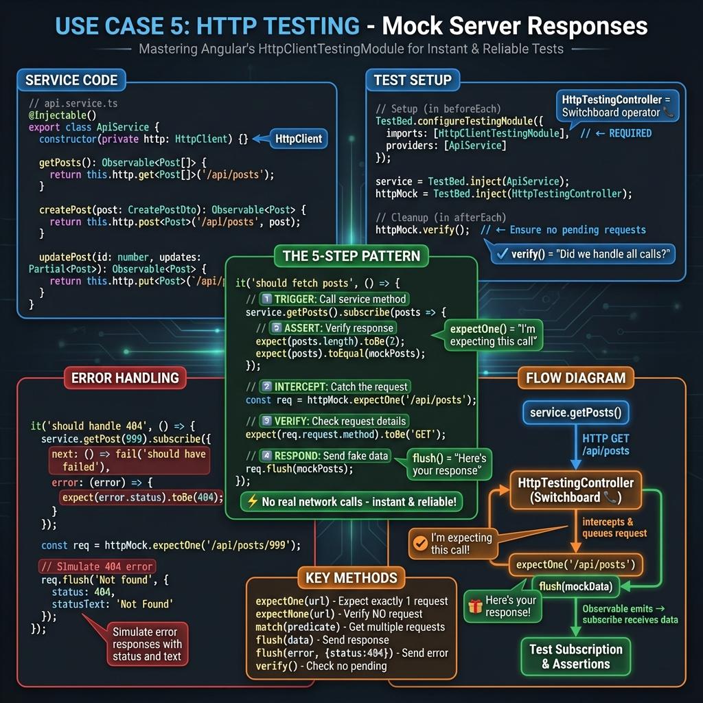
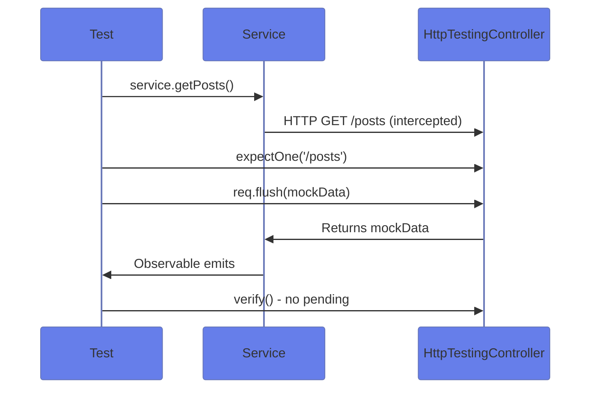
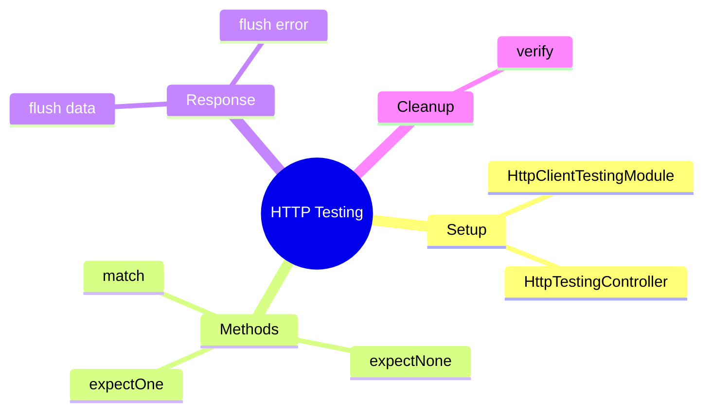

# 🌐 HTTP Testing



## 📋 Table of Contents
- [1. 🔍 How It Works](#1--how-it-works)
- [2. 🚀 Implementation](#2--implementation)
  - [Setup](#setup)
  - [Test GET Request](#test-get-request)
  - [Test Error Handling](#test-error-handling)
- [2.1 🌐 Understanding HTTP Testing - Deep Dive](#21--understanding-http-testing---deep-dive)
  - [Quick HTTP Testing Reference](#quick-http-testing-reference)
- [2.2 🔧 Testing All HTTP Methods](#22--testing-all-http-methods)
  - [GET Requests](#get-requests)
  - [POST Requests](#post-requests)
  - [PUT/PATCH Requests](#putpatch-requests)
  - [DELETE Requests](#delete-requests)
- [2.3 📨 Query Parameters & Headers](#23--query-parameters--headers)
  - [Testing Query Parameters](#testing-query-parameters)
  - [Testing Headers](#testing-headers)
- [2.4 🚨 Error Handling Patterns](#24--error-handling-patterns)
  - [HTTP Error (4xx, 5xx)](#http-error-4xx-5xx)
  - [Network Error](#network-error)
- [2.5 🔀 Multiple Requests](#25--multiple-requests)
  - [Sequential Requests](#sequential-requests)
  - [Concurrent Requests](#concurrent-requests)
- [2.6 🎯 Common Testing Patterns](#26--common-testing-patterns)
  - [Pattern 1: Basic GET](#pattern-1-basic-get)
  - [Pattern 2: POST with Body Verification](#pattern-2-post-with-body-verification)
  - [Pattern 3: Error Handling](#pattern-3-error-handling)
  - [Pattern 4: Multiple Requests](#pattern-4-multiple-requests)
- [2.7 🧠 Memory Tricks](#27--memory-tricks)
  - [Restaurant Order Analogy 🍽️](#restaurant-order-analogy)
  - [Quick Decision Tree](#quick-decision-tree)
- [3. 🐛 Common Pitfalls](#3--common-pitfalls)
  - [📦 Data Flow Summary (Visual Box Diagram)](#data-flow-summary-visual-box-diagram)
- [❓ Interview Questions (25+)](#interview-questions-25)
- [🧠 Mind Map](#mind-map)

---
*Complete HTTP testing workflow with HttpTestingController, expectOne(), flush(), and error handling*

> **💡 Lightbulb Moment**: `HttpTestingController` intercepts all HTTP requests in tests. You control exactly what the "server" returns!

---

## 1. 🔍 How It Works



---

## 2. 🚀 Implementation

### Setup

```typescript
beforeEach(() => {
    TestBed.configureTestingModule({
        imports: [HttpClientTestingModule]
    });
    service = TestBed.inject(ApiService);
    httpMock = TestBed.inject(HttpTestingController);
});

afterEach(() => {
    httpMock.verify();  // Fail if requests pending
});
```

### Test GET Request

```typescript
it('should fetch data', () => {
    service.getData().subscribe(data => {
        expect(data).toEqual(mockData);
    });
    
    const req = httpMock.expectOne('/api/data');
    expect(req.request.method).toBe('GET');
    req.flush(mockData);
});
```

### Test Error Handling

```typescript
it('should handle 404', () => {
    service.getData().subscribe({
        error: (err) => expect(err.message).toContain('404')
    });
    
    httpMock.expectOne('/api/data')
        .flush('Not found', { status: 404, statusText: 'Not Found' });
});
```

---

## 2.1 🌐 Understanding HTTP Testing - Deep Dive

For detailed HTTP testing explanations, see [Service Testing - Sections 2.8-2.12](../use-case-2/guide.md#28--testing-http-calls-with-httptestingcontroller)

This use case demonstrates the same HTTP testing concepts applied to a dedicated API service.

### Quick HTTP Testing Reference

**The 5-Step Pattern:**
1. **Trigger**: `service.getData()`
2. **Intercept**: `const req = httpMock.expectOne('/api/data')`
3. **Verify**: `expect(req.request.method).toBe('GET')`
4. **Respond**: `req.flush(mockData)`
5. **Assert**: `expect(result).toEqual(mockData)`

---

## 2.2 🔧 Testing All HTTP Methods

### GET Requests

```typescript
it('should fetch posts', () => {
    service.getPosts().subscribe(posts => {
        expect(posts.length).toBe(2);
        expect(posts).toEqual(mockPosts);
    });
    
    const req = httpMock.expectOne('https://api.example.com/posts');
    expect(req.request.method).toBe('GET');
    req.flush(mockPosts);
});
```

**Flow:**
```
service.getPosts() → HTTP GET /posts → httpMock intercepts → 
req.flush(mockPosts) → Observable emits → subscribe receives data
```

---

### POST Requests

```typescript
it('should create post', () => {
    const newPost = { title: 'New', body: 'Content', userId: 1 };
    
    service.createPost(newPost).subscribe(post => {
        expect(post.id).toBe(101);
        expect(post.title).toBe('New');
    });
    
    const req = httpMock.expectOne('/posts');
    expect(req.request.method).toBe('POST');
    expect(req.request.body).toEqual(newPost);  // Verify payload
    
    req.flush({ id: 101, ...newPost });
});
```

**What to verify:**
- ✅ Request method is POST
- ✅ Request body contains correct data
- ✅ Response is handled properly

---

### PUT/PATCH Requests

```typescript
it('should update post', () => {
    const updates = { title: 'Updated Title' };
    
    service.updatePost(1, updates).subscribe(post => {
        expect(post.title).toBe('Updated Title');
    });
    
    const req = httpMock.expectOne('/posts/1');
    expect(req.request.method).toBe('PUT');
    expect(req.request.body).toEqual(updates);
    
    req.flush({ ...mockPost, title: 'Updated Title' });
});
```

---

### DELETE Requests

```typescript
it('should delete post', () => {
    service.deletePost(1).subscribe();
    
    const req = httpMock.expectOne('/posts/1');
    expect(req.request.method).toBe('DELETE');
    
    req.flush(null);  // DELETE often returns empty response
});
```

---

## 2.3 📨 Query Parameters & Headers

### Testing Query Parameters

```typescript
it('should send query params', () => {
    service.getPostsByUser(1).subscribe();
    
    // Match by function to check params
    const req = httpMock.expectOne(r =>
        r.url.includes('/posts') && 
        r.params.get('userId') === '1'
    );
    
    expect(req.request.params.get('userId')).toBe('1');
    req.flush(mockPosts);
});
```

**Service code:**
```typescript
getPostsByUser(userId: number) {
    return this.http.get('/posts', { 
        params: { userId: userId.toString() }
    });
}
```

---

### Testing Headers

```typescript
it('should send authorization header', () => {
    service.getProtectedData().subscribe();
    
    const req = httpMock.expectOne('/api/protected');
    
    // Verify headers
    expect(req.request.headers.get('Authorization'))
        .toBe('Bearer token123');
    expect(req.request.headers.get('Content-Type'))
        .toBe('application/json');
    
    req.flush({ data: 'secret' });
});
```

---

## 2.4 🚨 Error Handling Patterns

### HTTP Error (4xx, 5xx)

```typescript
describe('error handling', () => {
    it('should handle 404 not found', () => {
        service.getPost(999).subscribe({
            next: () => fail('should have failed'),
            error: (error) => {
                expect(error.status).toBe(404);
                expect(error.message).toContain('404');
            }
        });
        
        const req = httpMock.expectOne('/posts/999');
        
        // Simulate 404 response
        req.flush(
            'Post not found',  // Error message
            { 
                status: 404, 
                statusText: 'Not Found' 
            }
        );
    });
    
    it('should handle 500 server error', () => {
        service.getPosts().subscribe({
            next: () => fail('should have failed'),
            error: (error) => {
                expect(error.status).toBe(500);
            }
        });
        
        const req = httpMock.expectOne('/posts');
        req.flush(
            { error: 'Internal server error' },
            { 
                status: 500, 
                statusText: 'Internal Server Error' 
            }
        );
    });
});
```

---

### Network Error

```typescript
it('should handle network error', () => {
    service.getPosts().subscribe({
        next: () => fail('should have failed'),
        error: (error) => {
            expect(error.error.message).toBe('Network failed');
        }
    });
    
    const req = httpMock.expectOne('/posts');
    
    // Simulate network error
    req.error(new ErrorEvent('Network error', {
        message: 'Network failed'
    }));
});
```

---

## 2.5 🔀 Multiple Requests

### Sequential Requests

```typescript
it('should handle multiple sequential requests', () => {
    // First request
    service.getPost(1).subscribe();
    const req1 = httpMock.expectOne('/posts/1');
    req1.flush(mockPost1);
    
    // Second request
    service.getPost(2).subscribe();
    const req2 = httpMock.expectOne('/posts/2');
    req2.flush(mockPost2);
});
```

---

### Concurrent Requests

```typescript
it('should handle concurrent requests', () => {
    // Trigger both at once
    service.getPost(1).subscribe();
    service.getPost(2).subscribe();
    
    // Match all requests to '/posts/*'
    const requests = httpMock.match(req => 
        req.url.includes('/posts/')
    );
    
    expect(requests.length).toBe(2);
    
    // Respond to each
    requests[0].flush({ ...mockPost, id: 1 });
    requests[1].flush({ ...mockPost, id: 2 });
});
```

---

## 2.6 🎯 Common Testing Patterns

### Pattern 1: Basic GET

```typescript
it('should fetch data', () => {
    service.getData().subscribe(data => {
        expect(data).toEqual(mockData);
    });
    
    httpMock.expectOne('/api/data').flush(mockData);
});
```

---

### Pattern 2: POST with Body Verification

```typescript
it('should send correct payload', () => {
    const payload = { name: 'test' };
    service.create(payload).subscribe();
    
    const req = httpMock.expectOne('/api/data');
    expect(req.request.method).toBe('POST');
    expect(req.request.body).toEqual(payload);
    req.flush({ id: 1, ...payload });
});
```

---

### Pattern 3: Error Handling

```typescript
it('should handle errors', () => {
    service.getData().subscribe({
        error: err => expect(err.status).toBe(404)
    });
    
    httpMock.expectOne('/api/data')
        .flush(null, { status: 404, statusText: 'Not Found' });
});
```

---

### Pattern 4: Multiple Requests

```typescript
it('should handle multiple calls', () => {
    service.getData().subscribe();
    service.getData().subscribe();
    
    const reqs = httpMock.match('/api/data');
    expect(reqs.length).toBe(2);
    reqs.forEach(req => req.flush(mockData));
});
```

---

## 2.7 🧠 Memory Tricks

### Restaurant Order Analogy 🍽️

```
Your Service    = 📞 "I'd like to order food"
HTTP Request    = 📨 Placing the order
HttpController  = 👨‍🍳 Restaurant (intercepts order)
expectOne()     = 👨‍🍳 "I got your order for pizza"
flush()         = 🍕 "Here'syour food!"
verify()        = 📋 "Did we miss any orders?"
```

---

### Quick Decision Tree

```
What are you testing?
│
├─ Single GET request
│  └─ expectOne(url).flush(data)
│
├─ POST with body
│  ├─ expectOne(url)
│  ├─ expect(req.request.body).toEqual(payload)
│  └─ flush(response)
│
├─ Error scenario
│  └─ flush(error, { status: 404 })
│
├─ Multiple requests
│  └─ match(predicate)
│
└─ No request made
   └─ expectNone(url)
```

---

## 3. 🐛 Common Pitfalls

| ❌ Wrong | ✅ Right |
|----------|----------|
| Forgetting `httpMock.verify()` | Always verify in `afterEach` |
| Not subscribing to Observable | Must subscribe before `expectOne` |
| Wrong URL in expectOne | Match exact URL or use function |

---

### 📦 Data Flow Summary (Visual Box Diagram)

```
┌─────────────────────────────────────────────────────────────┐
│  HTTP TESTING: MOCK YOUR SERVER                             │
│                                                             │
│   SETUP:                                                    │
│   ┌───────────────────────────────────────────────────────┐ │
│   │ TestBed.configureTestingModule({                      │ │
│   │   imports: [HttpClientTestingModule]                  │ │
│   │ });                                                   │ │
│   │ httpMock = TestBed.inject(HttpTestingController);     │ │
│   │                                                       │ │
│   │ afterEach: httpMock.verify();  // ⚠️ CRITICAL!        │ │
│   └───────────────────────────────────────────────────────┘ │
│                                                             │
│   TEST FLOW:                                                │
│   ┌───────────────────────────────────────────────────────┐ │
│   │ // 1. Trigger HTTP request                            │ │
│   │ service.getData().subscribe(data => {                 │ │
│   │   expect(data).toEqual(mockData);                     │ │
│   │ });                                                   │ │
│   │                                                       │ │
│   │ // 2. Intercept and respond                           │ │
│   │ const req = httpMock.expectOne('/api/data');          │ │
│   │ expect(req.request.method).toBe('GET');               │ │
│   │ req.flush(mockData);  // Return mock response         │ │
│   └───────────────────────────────────────────────────────┘ │
│                                                             │
│   TEST ERRORS:                                              │
│   req.flush('Not found', { status: 404, statusText: 'Not Found' });│
└─────────────────────────────────────────────────────────────┘
```

> **Key Takeaway**: HttpTestingController intercepts ALL requests. expectOne + flush = mock response. Always verify() in afterEach!

---

## ❓ Interview Questions (25+)

**Q1: What is HttpTestingController?**
> A: Testing utility that intercepts HTTP requests for controlled testing.

**Q2: How to set up HTTP testing?**
> A: Import `HttpClientTestingModule`, inject `HttpTestingController`.

**Q3: What does expectOne() do?**
> A: Expects exactly one matching request, returns TestRequest to control.

**Q4: What's the difference between expectOne and match?**
> A: `expectOne` expects 1 request; `match` returns array of all matching.

**Q5: What does flush() do in HTTP testing?**
> A: Simulates server response with provided data.

**Q6: Why call verify() in afterEach?**
> A: Ensures no unexpected/pending HTTP requests - catches forgotten mocks.

**Q7: How to test HTTP error responses?**
> A: `req.flush(errorMsg, { status: 404, statusText: 'Not Found' })`.

**Q8: How to match request by URL pattern?**
> A: `expectOne(req => req.url.includes('/api/'))`.

**Q9: What if you forget to subscribe?**
> A: Request never fires - expectOne() fails.

**Q10: How to verify request method?**
> A: `expect(req.request.method).toBe('POST')`.

**Q11: How to verify request headers?**
> A: `expect(req.request.headers.get('Auth')).toBe('token')`.

**Q12: How to verify request body?**
> A: `expect(req.request.body).toEqual({name: 'test'})`.

**Q13: How to test multiple requests?**
> A: Call `expectOne()` for each, or use `match()`.

**Q14: What's expectNone()?**
> A: Asserts NO request was made to URL - useful for caching tests.

**Q15: Can you test interceptors?**
> A: Yes - verify modified requests/responses through HttpTestingController.

**Q16: How to test request with query params?**
> A: Match full URL with params or check `req.request.params`.

**Q17: How to test timeout errors?**
> A: `req.flush(null, { status: 0, statusText: 'Unknown Error' })`.

**Q18: How to test retry logic?**
> A: Flush errors multiple times, then success - verify retry count.

**Q19: What if multiple requests to same URL?**
> A: Use callback in `expectOne()` to distinguish or handle in order.

**Q20: How to test network failure?**
> A: `req.error(new ErrorEvent('Network error'))`.

**Q21: Can you use real HTTP in tests?**
> A: No - HttpClientTestingModule blocks real HTTP.

**Q22: How to test request cancellation?**
> A: Unsubscribe before flush, verify() should pass.

**Q23: How to test concurrent requests?**
> A: Store multiple `expectOne()` results, flush in desired order.

**Q24: Should you mock HttpClient directly?**
> A: No - use HttpTestingController for proper HTTP testing.

**Q25: How to test download progress?**
> A: Use `flush()` with `reportProgress: true`, emit progress events.

---

## 🧠 Mind Map



