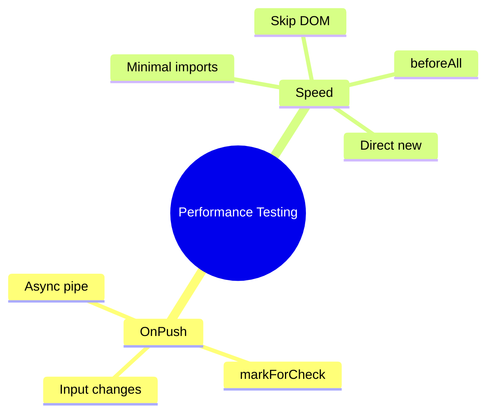

# ⚡ Performance-Aware Testing


## 📋 Table of Contents
- [1. 🎯 Key Optimizations](#1--key-optimizations)
- [2. 🚀 Testing OnPush Components](#2--testing-onpush-components)
  - [Trigger CD for OnPush:](#trigger-cd-for-onpush)
- [3. ⚡ Speed Patterns](#3--speed-patterns)
  - [Minimal TestBed](#minimal-testbed)
  - [Logic-Only Tests](#logic-only-tests)
  - [Direct Instantiation](#direct-instantiation)
- [3.1 ⚡ Deep Dive: Performance Optimization](#31--deep-dive-performance-optimization)
  - [Why Test Speed Matters](#why-test-speed-matters)
  - [Optimization 1: Minimal TestBed Imports 🚀](#optimization-1-minimal-testbed-imports)
  - [Optimization 2: Logic-Only Tests ⚡](#optimization-2-logic-only-tests)
  - [Optimization 3: Direct Instantiation 🏎️](#optimization-3-direct-instantiation)
  - [Optimization 4: Shared TestBed (beforeAll) 📦](#optimization-4-shared-testbed-beforeall)
- [3.2 🔄 OnPush Testing Patterns](#32--onpush-testing-patterns)
  - [Pattern 1: Testing @Input Changes](#pattern-1-testing-input-changes)
  - [Pattern 2: Testing with markForCheck](#pattern-2-testing-with-markforcheck)
  - [Pattern 3: Testing Internal Mutations (Negative Case)](#pattern-3-testing-internal-mutations-negative-case)
- [3.3 📊 Benchmark Comparison](#33--benchmark-comparison)
- [3.4 🧠 Memory Tricks](#34--memory-tricks)
  - [OnPush = Lazy Employee 😴](#onpush--lazy-employee)
  - [📦 Data Flow Summary (Visual Box Diagram)](#data-flow-summary-visual-box-diagram)
- [🧠 Mind Map](#mind-map)

---
*Performance optimization strategies: OnPush testing, minimal TestBed, logic-only tests, and speed benchmarks*

> **💡 Lightbulb Moment**: Fast tests = faster feedback loop. Optimize your test suite like you optimize your app!

---

## 1. 🎯 Key Optimizations

| Technique | Impact |
|-----------|--------|
| Minimal TestBed imports | 🟢 High |
| Logic-only tests (skip DOM) | 🟢 High |
| beforeAll for shared config | 🟡 Medium |
| Direct instantiation | 🟢 High |
| Skip detectChanges when possible | 🟡 Medium |

---

## 2. 🚀 Testing OnPush Components

```mermaid
%%{init: {'theme': 'base', 'themeVariables': { 'primaryColor': '#667eea'}}}%%
flowchart TD
    A[Internal mutation] -->|OnPush| B[DOM NOT updated]
    C[@Input change] -->|OnPush| D[DOM updated ✓]
    E[markForCheck] -->|OnPush| F[DOM updated ✓]
    
    style B fill:#ef4444,color:#fff
    style D fill:#10b981,color:#fff
    style F fill:#10b981,color:#fff
```

### Trigger CD for OnPush:

```typescript
// Method 1: Change input reference
fixture.componentRef.setInput('data', newData);

// Method 2: Manual markForCheck
fixture.componentRef.changeDetectorRef.markForCheck();
fixture.detectChanges();
```

---

## 3. ⚡ Speed Patterns

### Minimal TestBed
```typescript
// ✅ Fast
imports: [ComponentUnderTest]

// ❌ Slow - loads everything
imports: [AppModule]
```

### Logic-Only Tests
```typescript
it('tests logic without DOM', () => {
    component.updateValue(5);
    expect(component.value).toBe(5);
    // No fixture.detectChanges()!
    // No DOM queries!
});
```

### Direct Instantiation
```typescript
const service = new MyService();  // No TestBed!
```

---

## 3.1 ⚡ Deep Dive: Performance Optimization

### Why Test Speed Matters

**Fast Feedback Loop:**
- Unit tests run on every save (watch mode)
- Pre-commit hooks run full suite
- CI/CD runs tests multiple times per day

**The Math:**
```
1000 tests × 100ms = 100 seconds (< 2min) ✅
1000 tests × 500ms = 500 seconds (8+ min) ❌

Savings:  400 seconds × 50 runs/day = 5.5 hours saved!
```

---

### Optimization 1: Minimal TestBed Imports 🚀

**The Problem:**
```typescript
// ❌ BAD: Loads entire app
TestBed.configureTestingModule({
    imports: [AppModule]  // 100+ components, 50+ services
});
// Result: 500ms+ per test
```

**The Solution:**
```typescript
// ✅ GOOD: Only what's needed
TestBed.configureTestingModule({
    imports: [ComponentUnderTest]  // Just 1 component
});
// Result: 50-100ms per test (5-10x faster!)
```

**Impact:** HIGH 🟢

---

### Optimization 2: Logic-Only Tests ⚡

**Test WHAT, not HOW:**

```typescript
// ❌ SLOW: Testing implementation via DOM
it('should calculate total', () => {
    const input = fixture.debugElement.query(By.css('input'));
    input.nativeElement.value = '5';
    input.triggerEventHandler('input', ...);
    fixture.detectChanges();
    const output = fixture.debugElement.query(By.css('.total'));
    expect(output.nativeElement.textContent).toBe('10');
}); // ~50ms

// ✅ FAST: Testing logic directly
it('should calculate total', () => {
    component.quantity = 5;
    component.calculateTotal();
    expect(component.total).toBe(10);
}); // ~5ms (10x faster!)
```

**When to use:**
- Pure functions
- Business logic
- Data transformations
- Calculations

**Impact:** HIGH 🟢

---

### Optimization 3: Direct Instantiation 🏎️

**Skip TestBed entirely:**

```typescript
// For services without dependencies
describe('CalculatorService', () => {
    let service: CalculatorService;
    
    beforeEach(() => {
        service = new CalculatorService();  // ⚡ INSTANT
    });
    
    it('adds numbers', () => {
        expect(service.add(2, 3)).toBe(5);
    }); // ~1ms (100x faster than TestBed!)
});
```

**Limitation:** Won't work with `inject()` function

**Impact:** HIGHEST 🟢

---

### Optimization 4: Shared TestBed (beforeAll) 📦

**Configure once, use many times:**

```typescript
describe('MyComponent', () => {
    beforeAll(async () => {
        await TestBed.configureTestingModule({...}).compileComponents();
    });
    
    beforeEach(() => {
        fixture = TestBed.createComponent(MyComponent);
    });
    
    // All tests share the same compiled module
});
```

**Trade-off:** 
- ✅ Faster (compile once)
- ❌ Tests share state (potential flakiness)

**Impact:** MEDIUM 🟡

---

## 3.2 🔄 OnPush Testing Patterns

### Pattern 1: Testing @Input Changes

```typescript
it('should update on input change', () => {
    // Simulate parent component setting input
    fixture.componentRef.setInput('count', 42);
    fixture.detectChanges();
    
    const el = fixture.debugElement.query(By.css('.count'));
    expect(el.nativeElement.textContent).toBe('42');
});
```

**Why `setInput()`?**
- Proper input binding simulation
- Automatically triggers OnPush
- More realistic than direct assignment

---

### Pattern 2: Testing with markForCheck

```typescript
it('should update after markForCheck', () => {
    // Method that internally calls markForCheck()
    component.incrementWithCD();
    fixture.detectChanges();
    
    expect(component.count).toBe(1);  // State updated
    // DOM also updated because of markForCheck
});
```

---

### Pattern 3: Testing Internal Mutations (Negative Case)

```typescript
it('should NOT update DOM without markForCheck', () => {
    component.incrementWithoutCD();  // Just this.count++
    fixture.detectChanges();
    
    expect(component.count).toBe(1);  // ✅ State changed
    
    const el = fixture.debugElement.query(By.css('.count'));
    // DOM still shows  old value (OnPush behavior)
    expect(el.nativeElement.textContent).toBe('0');  // ✅ DOM unchanged
});
```

---

## 3.3 📊 Benchmark Comparison

| Strategy | Setup Time | Per Test | 1000 Tests | Use When |
|----------|-----------|----------|------------|----------|
| **Direct Instantiation** | 0ms | 1-5ms | 5s ⚡ | Services w/o dependencies |
| **Logic Only** | 50ms | 10-20ms | 20s ⚡ | Business logic |
| **Minimal TestBed** | 100ms | 50-100ms | 100s 🙂 | Component testing |
| **Full TestBed** | 2000ms | 500ms+ | 500s+ 😱 | Integration tests only |

---

## 3.4 🧠 Memory Tricks

### OnPush = Lazy Employee 😴

```
Default CD:  Always listening, always working
OnPush CD:   Sleeping until you wake them up

Wake up methods:
- setInput()      = New task arrives
- markForCheck()  = Tap on shoulder
- Event           = Alarm clock rings
- Internal change = Whisper (they don't hear!)
```

---

###Performance = Racing 🏎️

```
Minimal imports  = Lightweight race car (fast)
Logic tests      = Straight highway (fast)
DOM tests        = Winding mountain road (slower)
Full TestBed     = Heavy truck (slow)
Direct new       = Teleportation (instant!)
```

---

### 📦 Data Flow Summary (Visual Box Diagram)

```
┌─────────────────────────────────────────────────────────────┐
│  PERFORMANCE-AWARE TESTING                                  │
│                                                             │
│   MINIMAL TESTBED (HIGH IMPACT):                            │
│   ┌───────────────────────────────────────────────────────┐ │
│   │ ✅ imports: [ComponentUnderTest]  // Only what's needed│ │
│   │ ❌ imports: [AppModule]           // Loads everything  │ │
│   └───────────────────────────────────────────────────────┘ │
│                                                             │
│   LOGIC-ONLY TESTS (SKIP DOM):                              │
│   ┌───────────────────────────────────────────────────────┐ │
│   │ it('tests logic', () => {                             │ │
│   │   component.updateValue(5);                           │ │
│   │   expect(component.value).toBe(5);                    │ │
│   │   // No fixture.detectChanges()!                      │ │
│   │ });                                                   │ │
│   └───────────────────────────────────────────────────────┘ │
│                                                             │
│   ONPUSH COMPONENT TESTING:                                 │
│   ┌───────────────────────────────────────────────────────┐ │
│   │ // Must trigger CD manually for OnPush                │ │
│   │ fixture.componentRef.setInput('data', newData);       │ │
│   │ // OR: fixture.componentRef.changeDetectorRef         │ │
│   │ //       .markForCheck();                             │ │
│   └───────────────────────────────────────────────────────┘ │
│                                                             │
│   DIRECT INSTANTIATION (NO TESTBED):                        │
│   const service = new MyService();  // ⚡ Fastest!          │
└─────────────────────────────────────────────────────────────┘
```

> **Key Takeaway**: Minimal imports, skip DOM when possible, direct instantiation for services. Fast tests = faster feedback!

---

## 🧠 Mind Map


