# ⚙️ Service Testing

> **💡 Lightbulb Moment**: Services are the easiest to test because they're just TypeScript classes. No DOM, no template—just pure logic!


## 📋 Table of Contents
- [📊 Complete Testing Flow](#complete-testing-flow)
- [1. 🔍 How It Works](#1--how-it-works)
  - [Service Testing is Simple](#service-testing-is-simple)
- [1.1 🔧 Understanding TestBed.inject()](#11--understanding-testbedinject)
  - [What is TestBed.inject()?](#what-is-testbedinject)
  - [The TestBed.inject() Flow](#the-testbedinject-flow)
  - [Why Use TestBed.inject()?](#why-use-testbedinject)
  - [When to Use TestBed vs Direct Instantiation?](#when-to-use-testbed-vs-direct-instantiation)
    - [Use TestBed.inject() when:](#use-testbedinject-when)
    - [Use Direct Instantiation (`new`) when:](#use-direct-instantiation-new-when)
  - [Comparison: TestBed.inject() vs new Service()](#comparison-testbedinject-vs-new-service)
  - [Dependency Injection in Tests - How It Works](#dependency-injection-in-tests---how-it-works)
  - [Service Testing vs Component Testing](#service-testing-vs-component-testing)
  - [Think of it as:](#think-of-it-as)
  - [Common Service Testing Patterns](#common-service-testing-patterns)
    - [1. Testing Synchronous Methods](#1-testing-synchronous-methods)
    - [2. Testing Observables](#2-testing-observables)
    - [3. Testing Signals (Angular 17+)](#3-testing-signals-angular-17)
    - [4. Testing Async Operations](#4-testing-async-operations)
  - [Test Isolation - Fresh Instance Per Test](#test-isolation---fresh-instance-per-test)
  - [Memory Tricks 🧠](#memory-tricks)
  - [TestBed.inject() vs TestBed.get() (Deprecated)](#testbedinject-vs-testbedget-deprecated)
- [2. 🚀 Implementation](#2--implementation)
  - [Basic Service Test](#basic-service-test)
  - [Testing Observables](#testing-observables)
- [2.1 🌊 Understanding Observable Testing - Deep Dive](#21--understanding-observable-testing---deep-dive)
  - [What are Observables?](#what-are-observables)
  - [Why Testing Observables is Different](#why-testing-observables-is-different)
  - [The Observable Testing Flow](#the-observable-testing-flow)
- [2.2 📊 Three Observable Testing Patterns](#22--three-observable-testing-patterns)
  - [Pattern 1: done() Callback (Single Emission)](#pattern-1-done-callback-single-emission)
  - [Pattern 2: Array Collection (Best for Sequences) ⭐](#pattern-2-array-collection-best-for-sequences)
  - [Pattern 3: firstValueFrom() (Modern Async/Await) 🆕](#pattern-3-firstvaluefrom-modern-asyncawait)
- [2.3 📚 Pattern Comparison Table](#23--pattern-comparison-table)
- [2.4 🎬 Visual Timeline: Array Collection Pattern](#24--visual-timeline-array-collection-pattern)
- [2.5 💡 Real-World Example: Testing HTTP Service](#25--real-world-example-testing-http-service)
- [2.6 🚨 Common Pitfalls & Solutions](#26--common-pitfalls--solutions)
  - [Pitfall 1: Forgetting to Unsubscribe](#pitfall-1-forgetting-to-unsubscribe)
  - [Pitfall 2: Missing `done()` Callback](#pitfall-2-missing-done-callback)
  - [Pitfall 3: Not Using `async` with `firstValueFrom()`](#pitfall-3-not-using-async-with-firstvaluefrom)
- [2.7 🧠 Memory Tricks](#27--memory-tricks)
- [2.8 🌐 Testing HTTP Calls with HttpTestingController](#28--testing-http-calls-with-httptestingcontroller)
  - [What is HttpTestingController?](#what-is-httptestingcontroller)
  - [Why Use HttpTestingController?](#why-use-httptestingcontroller)
  - [The HTTP Testing Pattern](#the-http-testing-pattern)
  - [Step 1: `service.loadUsers()` - Make the HTTP Call](#step-1-serviceloadusers---make-the-http-call)
  - [Step 2: `expectOne('/api/users')` - Intercept & Verify](#step-2-expectoneapiusers---intercept--verify)
  - [Step 3: `.flush(data)` - Send Fake Response](#step-3-flushdata---send-fake-response)
  - [Complete Flow Visualization](#complete-flow-visualization)
  - [Timeline Breakdown](#timeline-breakdown)
  - [Real-World Example](#real-world-example)
- [2.9 🔧 HttpTestingController Methods](#29--httptestingcontroller-methods)
  - [expectOne() - Expect Exactly ONE Request](#expectone---expect-exactly-one-request)
  - [expectNone() - Expect NO Requests](#expectnone---expect-no-requests)
  - [match() - Get Multiple Requests](#match---get-multiple-requests)
  - [verify() - Ensure No Pending Requests](#verify---ensure-no-pending-requests)
- [2.10 📨 TestRequest Methods](#210--testrequest-methods)
  - [1. flush() - Send Success Response](#1-flush---send-success-response)
  - [2. flush() - Send Error Response](#2-flush---send-error-response)
  - [3. error() - Network Error](#3-error---network-error)
  - [4. Inspect Request Properties](#4-inspect-request-properties)
- [2.11 🎯 Common HTTP Testing Patterns](#211--common-http-testing-patterns)
  - [Pattern 1: Success Response](#pattern-1-success-response)
  - [Pattern 2: Error Response (404)](#pattern-2-error-response-404)
  - [Pattern 3: Network Error](#pattern-3-network-error)
  - [Pattern 4: Multiple Requests](#pattern-4-multiple-requests)
  - [Pattern 5: POST with Body](#pattern-5-post-with-body)
- [2.12 🧠 Memory Tricks](#212--memory-tricks)
  - [Restaurant Phone Order Analogy 📞🍕](#restaurant-phone-order-analogy)
  - [Quick Reference Card](#quick-reference-card)
  - [Decision Tree: Which Method?](#decision-tree-which-method)
  - [Key Takeaways](#key-takeaways)
  - [Testing Signals (Angular 17+)](#testing-signals-angular-17)
- [3. 🐛 Common Pitfalls](#3--common-pitfalls)
- [4. ⚡ Performance Tips](#4--performance-tips)
- [5. ❓ Interview Questions](#5--interview-questions)
- [❓ Additional Interview Questions (23+)](#additional-interview-questions-23)
  - [Setup & Configuration Questions](#setup--configuration-questions)
  - [Observable Testing Questions](#observable-testing-questions)
  - [Signal Testing Questions](#signal-testing-questions)
  - [Method Testing Questions](#method-testing-questions)
  - [Spy & Mock Questions](#spy--mock-questions)
  - [Best Practice Questions](#best-practice-questions)
- [🧠 Mind Map](#mind-map)
- [🧮 Calculator Test Analogy (Easy to Remember!)](#calculator-test-analogy-easy-to-remember)
  - [📖 Story to Remember:](#story-to-remember)
  - [🎯 Quick Reference:](#quick-reference)
- [🧠 Mind Map](#mind-map)

---
## 📊 Complete Testing Flow


---

## 1. 🔍 How It Works


### Service Testing is Simple

| Step | Action |
|------|--------|
| 1 | Configure TestBed with service |
| 2 | Inject service instance |
| 3 | Call methods |
| 4 | Assert results |

---

## 1.1 🔧 Understanding TestBed.inject()

### What is TestBed.inject()?

**TestBed.inject()** is Angular's way to retrieve service instances from the testing module's **dependency injection (DI) container**.

> **💡 Think of it as**: "Get me a service instance from the test kitchen"

### The TestBed.inject() Flow


### Why Use TestBed.inject()?

| Reason | Explanation |
|--------|-------------|
| ✅ **Dependency Injection** | Service has constructor dependencies (other services) |
| ✅ **Automatic Mocking** | TestBed can provide mocks automatically |
| ✅ **Isolation** | Get test instance, not app's singleton |
| ✅ **Realistic** | Uses Angular's DI system like in production |

### When to Use TestBed vs Direct Instantiation?

#### Use TestBed.inject() when:

```typescript
// Service with dependencies
@Injectable()
export class UserService {
    constructor(private http: HttpClient, private auth: AuthService) {}
    //                      ↑                      ↑
    //                Dependencies - need TestBed to inject mocks
}

// Test
beforeEach(() => {
    TestBed.configureTestingModule({
        providers: [
            UserService,
            { provide: HttpClient, useValue: mockHttp },
            { provide: AuthService, useValue: mockAuth }
        ]
    });
    service = TestBed.inject(UserService);  // ✅ Dependencies auto-injected
});
```

#### Use Direct Instantiation (`new`) when:

```typescript
// Simple service with NO dependencies
@Injectable()
export class CounterService {
    private count = 0;
    
    increment() { this.count++; }
    //         ↑
    //    No dependencies - just pure logic!
}

// Test
beforeEach(() => {
    service = new CounterService();  // ✅ Faster, simpler
});
```

### Comparison: TestBed.inject() vs new Service()

| Aspect | TestBed.inject() | new Service() |
|--------|------------------|---------------|
| **Use When** | Service has dependencies | Simple service, no DI |
| **DI Support** | ✅ Yes, full Angular DI | ❌ No, manual dependencies |
| **Speed** | Slower (DI overhead) | ⚡ Faster (direct) |
| **Mocking Deps** | Easy (provide in TestBed) | Manual (pass to constructor) |
| **Realistic** | Yes (uses real DI) | Simplified (skips DI) |
| **Boilerplate** | More (configure TestBed) | Less (just new) |

### Dependency Injection in Tests - How It Works

```typescript
// 1️⃣ Real Service with Dependencies
@Injectable()
export class DataService {
    constructor(
        private http: HttpClient,      // ← Dependency 1
        private logger: LoggerService  // ← Dependency 2
    ) {}
}

// 2️⃣ Test Setup - Provide Mocks
beforeEach(() => {
    const mockHttp = jasmine.createSpyObj('HttpClient', ['get', 'post']);
    const mockLogger = jasmine.createSpyObj('LoggerService', ['log']);
    
    TestBed.configureTestingModule({
        providers: [
            DataService,                                    // ← Service under test
            { provide: HttpClient, useValue: mockHttp },   // ← Mock dependency 1
            { provide: LoggerService, useValue: mockLogger } // ← Mock dependency 2
        ]
    });
    
    // 3️⃣ Inject Service
    service = TestBed.inject(DataService);
    //        ↑
    //   TestBed creates DataService and injects mockHttp + mockLogger
});

// 4️⃣ Test
it('should use dependencies', () => {
    service.loadData();
    
    // Verify mocks were called
    expect(mockHttp.get).toHaveBeenCalled();
    expect(mockLogger.log).toHaveBeenCalledWith('Loading data...');
});
```

### Service Testing vs Component Testing

| Aspect | Component Testing | Service Testing |
|--------|-------------------|-----------------|
| **Setup Tool** | ComponentFixture | TestBed.inject() or new |
| **What's Tested** | Template + Logic + DOM | Logic ONLY |
| **Change Detection** | ✅ Need `detectChanges()` | ❌ No DOM, not needed |
| **Complexity** | Higher (template + logic) | Lower (pure logic) |
| **Speed** | Slower (template rendering) | ⚡ Faster (no rendering) |
| **Analogy** | Testing entire phone 📱 | Testing calculator chip 🧮 |

### Think of it as:

```
Component Testing = Test the whole phone (screen, buttons, apps)
Service Testing   = Test just the calculator chip (pure logic)

Services have NO DOM, NO template - just TypeScript! ✨
```

### Common Service Testing Patterns

#### 1. Testing Synchronous Methods

```typescript
it('should increment count', () => {
    service.increment();
    expect(service.currentCount).toBe(1);
});
```

#### 2. Testing Observables

```typescript
it('should emit values', () => {
    const values: number[] = [];
    service.count$.subscribe(v => values.push(v));
    
    service.increment();
    service.increment();
    
    expect(values).toEqual([0, 1, 2]);
});
```

#### 3. Testing Signals (Angular 17+)

```typescript
it('should update signal', () => {
    service.increment();
    expect(service.countSignal()).toBe(1);
    expect(service.doubleCount()).toBe(2);  // Computed signal
});
```

#### 4. Testing Async Operations

```typescript
it('should load data', async () => {
    const value = await firstValueFrom(service.data$);
    expect(value).toBe(expectedData);
});
```

### Test Isolation - Fresh Instance Per Test

Each test gets a **FRESH** service instance (via `beforeEach`):

```typescript
describe('CounterService', () => {
    let service: CounterService;
    
    beforeEach(() => {
        service = TestBed.inject(CounterService);  // ← Fresh instance each test
    });
    
    it('test 1 - sets count to 100', () => {
        service.setCount(100);
        expect(service.currentCount).toBe(100);
    });
    
    it('test 2 - count is 0 (fresh instance)', () => {
        // New test = new instance, count resets!
        expect(service.currentCount).toBe(0);  // ✅ Pass
    });
});
```

**Benefits of test isolation:**
- ✅ No shared state between tests
- ✅ Tests are independent
- ✅ Tests can run in any order
- ✅ One test can't break another

### Memory Tricks 🧠

**TestBed.inject() = "Get service from test kitchen"**

```
🍳 TestBed          = Test Kitchen (where services are prepared)
🍽️ inject()         = Serve me a fresh dish (service instance)
📖 providers        = Recipe book (how to create services)
🥗 Service Instance = The dish served to you
🔪 Dependencies     = Ingredients (other services needed)
```

**Quick Decision Tree:**

```
Does service have constructor dependencies (other services injected)?
│
├─ YES → Use TestBed.inject()
│         • TestBed provides/mocks dependencies automatically
│         • More realistic (uses Angular DI)
│         • Required for services with @Injectable() dependencies
│
└─ NO  → Can use new Service()
          • Faster (no DI overhead)
          • Simpler (less boilerplate)
          • Works for pure logic services
```

### TestBed.inject() vs TestBed.get() (Deprecated)

| Method | Status | Type Safety |
|--------|--------|-------------|
| **TestBed.inject()** | ✅ Current (Angular 9+) | ✅ Type-safe |
| **TestBed.get()** | ❌ Deprecated | ⚠️ Less type-safe |

**Always use `.inject()` in new code!**

```typescript
// ✅ CORRECT (Modern)
service = TestBed.inject(UserService);

// ❌ AVOID (Deprecated)
service = TestBed.get(UserService);
```

---

## 2. 🚀 Implementation

### Basic Service Test

```typescript
describe('CounterService', () => {
    let service: CounterService;

    beforeEach(() => {
        TestBed.configureTestingModule({
            providers: [CounterService]
        });
        service = TestBed.inject(CounterService);
    });

    it('should increment', () => {
        service.increment();
        expect(service.currentCount).toBe(1);
    });
});
```

### Testing Observables

```typescript
it('should emit updates', (done) => {
    const values: number[] = [];
    service.count$.subscribe(v => values.push(v));
    
    service.increment();
    service.increment();
    
    expect(values).toEqual([0, 1, 2]);
    done();
});
```

---

## 2.1 🌊 Understanding Observable Testing - Deep Dive

### What are Observables?

**Observables** are **streams of data** that emit values over time. Think of them like a TV channel 📺 that broadcasts updates continuously.

> **💡 Key Concept**: Unlike regular values, Observables are **lazy** - they don't emit anything until you **subscribe** to them!

### Why Testing Observables is Different

| Aspect | Regular Values | Observables |
|--------|---------------|-------------|
| **Timing** | Synchronous | Asynchronous (emit over time) |
| **Access** | Direct (`service.count`) | Must subscribe (`count$.subscribe()`) |
| **Cleanup** | None needed | Must unsubscribe to prevent leaks |
| **Testing** | Simple assert | Need async handling |

### The Observable Testing Flow


---

## 2.2 📊 Three Observable Testing Patterns

### Pattern 1: done() Callback (Single Emission)

**Use case**: Testing a single asynchronous emission

```typescript
it('should emit initial value of 0', (done) => {
    //                                  ↑
    //                          Jasmine's done callback
    
    service.count$.subscribe(value => {
        //      ↑          ↑
        //  Observable   Subscribe to receive emissions
        
        expect(value).toBe(0);  // Assert the emitted value
        
        done();  // ✅ Tell Jasmine: "Test complete!"
        //  ↑
        // CRITICAL: Without this, test would finish before Observable emits
    });
});
```

**How it works:**

```
Timeline:
─────────────────────────────────────────────
1. Test starts
2. Subscribe to Observable
3. Observable emits value (0)
4. Callback runs → expect(value).toBe(0)
5. done() is called
6. Test finishes ✅
─────────────────────────────────────────────
```

**Why `done()` is needed:**

```typescript
// ❌ WITHOUT done() - WRONG!
it('should emit value', () => {
    service.count$.subscribe(value => {
        expect(value).toBe(0);
    });
    // Test finishes immediately here! ❌
    // Subscribe callback never runs!
});

// ✅ WITH done() - CORRECT!
it('should emit value', (done) => {
    service.count$.subscribe(value => {
        expect(value).toBe(0);
        done();  // Test waits for this! ✅
    });
});
```

---

### Pattern 2: Array Collection (Best for Sequences) ⭐

**Use case**: Testing multiple emissions over time (RECOMMENDED)

```typescript
it('should emit updates when count changes', async () => {
    // STEP 1: Create array to collect emissions
    const emittedValues: number[] = [];
    //    ↑
    // This will store: [0, 1, 2, 1]
    
    // STEP 2: Subscribe and collect
    const subscription = service.count$.subscribe(val => {
        emittedValues.push(val);
        //            ↑
        // Every emission → add to array
    });
    
    // STEP 3: Trigger actions
    service.increment();  // count: 0 → 1, emits 1
    service.increment();  // count: 1 → 2, emits 2
    service.decrement();  // count: 2 → 1, emits 1
    
    // STEP 4: Unsubscribe (cleanup)
    subscription.unsubscribe();
    
    // STEP 5: Assert entire sequence
    expect(emittedValues).toEqual([0, 1, 2, 1]);
    //     ↑                       ↑  ↑  ↑  ↑
    //   Actual            Initial + 3 changes
});
```

**Timeline Visualization:**

```
Time:     T0          T1          T2          T3
─────────────────────────────────────────────────────
Action:   Subscribe   increment   increment   decrement
Count:    0           1           2           1
Emits:    0     →     1      →    2      →    1
Array:    [0]   →     [0,1]  →    [0,1,2] →   [0,1,2,1]
─────────────────────────────────────────────────────
```

**Why this pattern is best:**

| Benefit | Explanation |
|---------|-------------|
| ✅ **Complete History** | Captures all emissions in order |
| ✅ **Easy Debugging** | Inspect array to see what was emitted |
| ✅ **Order Verification** | Confirms emission sequence is correct |
| ✅ **No Complex Async** | Simpler than done() for multiple values |

**Think of it as:** Recording a TV broadcast 📹
- **Subscribe** = Start recording
- **Actions** = TV shows play
- **Array** = Your recorded episodes
- **Assert** = Verify what you recorded

---

### Pattern 3: firstValueFrom() (Modern Async/Await) 🆕

**Use case**: Getting first emission as a Promise

```typescript
it('should work with firstValueFrom', async () => {
    //                                 ↑
    //                         Must use async keyword
    
    service.setCount(42);
    
    const value = await firstValueFrom(service.count$);
    //            ↑     ↑
    //         await    Observable → Promise converter
    
    expect(value).toBe(42);
});
```

**How `firstValueFrom()` works:**

```typescript
// Behind the scenes:
firstValueFrom(service.count$)
  ↓
1. Subscribe to Observable
2. Wait for FIRST emission
3. Get the value (42)
4. Unsubscribe automatically
5. Return as Promise
```

**Comparison: done() vs firstValueFrom()**

```typescript
// OLD WAY (done callback) - Verbose
it('test', (done) => {
    service.count$.subscribe(value => {
        expect(value).toBe(42);
        done();
    });
});

// NEW WAY (firstValueFrom) - Clean ✨
it('test', async () => {
    const value = await firstValueFrom(service.count$);
    expect(value).toBe(42);
});
```

**When to use `firstValueFrom()`:**

| ✅ Use | ❌ Don't Use |
|--------|--------------|
| HTTP requests (single response) | Multiple emissions |
| First emission only | Testing emission sequence |
| Want async/await syntax | Need to verify order |

---

## 2.3 📚 Pattern Comparison Table

| Pattern | Best For | Pros | Cons | Syntax |
|---------|----------|------|------|--------|
| **`done()` callback** | Single emission | Simple for one value | Verbose for multiple | `(done) => { ... done(); }` |
| **Array collection** ⭐ | Multiple emissions | Tests entire sequence | More setup | `const arr = []; subscribe(v => arr.push(v))` |
| **`firstValueFrom()`** | First value only | Clean async/await | Only gets first | `await firstValueFrom(obs$)` |

---

## 2.4 🎬 Visual Timeline: Array Collection Pattern

```
Observable Stream:  ──0──→──1──→──2──→──1──→
                      ↑     ↑     ↑     ↑
                   Initial  +3 changes from actions

Collection Array:
─────────────────────────────────────────────────────
After subscribe:     [0]
After increment():   [0, 1]
After increment():   [0, 1, 2]
After decrement():   [0, 1, 2, 1]  ← Final assertion
─────────────────────────────────────────────────────
```

---

## 2.5 💡 Real-World Example: Testing HTTP Service

```typescript
// Service
@Injectable()
export class UserService {
    users$ = new BehaviorSubject<User[]>([]);
    
    loadUsers() {
        this.http.get<User[]>('/api/users')
            .subscribe(users => this.users$.next(users));
    }
}

// Test - Pattern 2: Array Collection
it('should emit users when loaded', () => {
    const emittedUsers: User[][] = [];
    
    service.users$.subscribe(users => emittedUsers.push(users));
    
    // Initial emission (empty)
    expect(emittedUsers).toEqual([[]]);
    
    // Trigger load
    service.loadUsers();
    httpTestingController.expectOne('/api/users')
        .flush([{ id: 1, name: 'John' }]);
    
    // Verify both emissions
    expect(emittedUsers).toEqual([
        [],                          // Initial
        [{ id: 1, name: 'John' }]   // After load
    ]);
});

// Test - Pattern 3: firstValueFrom
it('should return current users', async () => {
    service.loadUsers();
    httpTestingController.expectOne('/api/users')
        .flush([{ id: 1, name: 'John' }]);
    
    const users = await firstValueFrom(service.users$);
    expect(users).toEqual([{ id: 1, name: 'John' }]);
});
```

---

## 2.6 🚨 Common Pitfalls & Solutions

### Pitfall 1: Forgetting to Unsubscribe

```typescript
// ❌ MEMORY LEAK!
it('test', () => {
    service.count$.subscribe(val => emittedValues.push(val));
    // Subscription stays active! ❌
});

// ✅ CORRECT
it('test', () => {
    const sub = service.count$.subscribe(val => emittedValues.push(val));
    // ... test logic ...
    sub.unsubscribe();  // Clean up! ✅
});
```

### Pitfall 2: Missing `done()` Callback

```typescript
// ❌ Test finishes before Observable emits!
it('test', () => {
    service.count$.subscribe(value => {
        expect(value).toBe(0);
    });
    // Test ends immediately! ❌
});

// ✅ CORRECT
it('test', (done) => {
    service.count$.subscribe(value => {
        expect(value).toBe(0);
        done();  // Wait for this! ✅
    });
});
```

### Pitfall 3: Not Using `async` with `firstValueFrom()`

```typescript
// ❌ Missing async keyword!
it('test', () => {
    const value = await firstValueFrom(service.count$);  // ❌ Error!
    expect(value).toBe(42);
});

// ✅ CORRECT
it('test', async () => {
    //        ↑ async keyword required
    const value = await firstValueFrom(service.count$);
    expect(value).toBe(42);
});
```

---

## 2.7 🧠 Memory Tricks

**Observable Testing = Recording a TV Show 📺**

```
TV Channel        = Observable (broadcasts data)
Subscribe         = Turn on TV and start recording
Emissions         = TV shows/episodes playing
Array             = Your recorded episodes list
Unsubscribe       = Turn off TV, stop recording
Assert            = Review what you recorded
```

**Quick Decision Guide:**

```
How many emissions do you need to test?
│
├─ One (first only)
│  ├─ Want callback style? → use done()
│  └─ Want async/await?    → use firstValueFrom()
│
└─ Multiple (sequence)
   └─ Use array collection pattern ⭐ (RECOMMENDED)
```

---

## 2.8 🌐 Testing HTTP Calls with HttpTestingController

### What is HttpTestingController?

**HttpTestingController** is Angular's testing utility for intercepting and controlling HTTP requests in tests.

> **💡 Think of it as**: A "phone switchboard operator" 📞 who intercepts all your HTTP calls and lets you control the responses

### Why Use HttpTestingController?

| Without HttpTestingController | With HttpTestingController | Result |
|------------------------------|---------------------------|--------|
| ❌ Real HTTP calls to API | ✅ Intercepted requests | No real network calls |
| ❌ Depends on API availability | ✅ Controlled responses | Reliable tests |
| ❌ Slow (network delays) | ✅ Instant responses | Fast tests |
| ❌ Hard to test errors | ✅ Easy to simulate errors | Test edge cases |

---

### The HTTP Testing Pattern

```typescript
service.loadUsers();
httpTestingController.expectOne('/api/users')
    .flush([{ id: 1, name: 'John' }]);
```

Let's break this down step-by-step:

---

### Step 1: `service.loadUsers()` - Make the HTTP Call

```typescript
service.loadUsers();
```

**What happens:**
```typescript
// Inside the service
loadUsers() {
    this.http.get('/api/users')
        .subscribe(users => this.users$.next(users));
    //  ↑
    // HTTP request is PENDING (waiting for response)
}
```

**Think of it as:** 📞 "Dialing the phone number, but nobody picked up yet..."

---

### Step 2: `expectOne('/api/users')` - Intercept & Verify

```typescript
httpTestingController.expectOne('/api/users')
//                    ↑            ↑
//            Method name      URL to match
```

**What it does:**

1. ✅ **Verifies** exactly ONE HTTP request was made to `/api/users`
2. ✅ **Captures** that pending request
3. ✅ **Returns** a `TestRequest` object (so you can respond to it)

**What it checks:**
- Was a request made? ✅
- Does the URL match? ✅
- Is it exactly ONE request (not 0, not 2+)? ✅

**If checks fail:**
```typescript
// 0 requests → Error: "Expected one matching request, found none"
// 2+ requests → Error: "Expected one matching request, found multiple"
```

**Think of it as:** 🎧 "Switchboard operator: I caught your call to `/api/users`!"

---

### Step 3: `.flush(data)` - Send Fake Response

```typescript
.flush([{ id: 1, name: 'John' }])
//      ↑
//  The mock response body
```

**What flush() does:**

1. **Responds** to the intercepted HTTP request
2. **Sends** fake data back (like a mock API)
3. **Completes** the Observable

```typescript
// Before flush():
service.users$ value: []  // Empty, no data yet

// After flush():
service.users$ value: [{ id: 1, name: 'John' }]  // Data received!
```

**Think of it as:** 📨 "Here's your response! Call complete!"

---

### Complete Flow Visualization

```mermaid
%%{init: {'theme': 'base', 'themeVariables': { 'primaryColor': '#3b82f6'}}}%%
sequenceDiagram
    participant Test
    participant Service
    participant HttpController as HttpTestingController
    participant Observable as users$ Observable
    
    Note over Test: 1. Trigger HTTP Call
    Test->>Service: loadUsers()
    Service->>HttpController: http.get('/api/users')
    Note over HttpController: Request PENDING
    
    Note over Test: 2. Intercept & Verify
    Test->>HttpController: expectOne('/api/users')
    HttpController-->>Test: Returns TestRequest
    Note over Test: ✅ Verified: 1 request to /api/users
    
    Note over Test: 3. Send Fake Response
    Test->>HttpController: flush([{id:1, name:'John'}])
    HttpController->>Service: Response received
    Service->>Observable: next([{id:1, name:'John'}])
    Note over Observable: Observable emits data
    
    Note over Test: 4. Verify Result
    Test->>Observable: Get current value
    Observable-->>Test: [{id:1, name:'John'}]
```



---

### Timeline Breakdown

```
Time:  T0              T1                    T2                T3
       │               │                     │                 │
─────────────────────────────────────────────────────────────────────
Action: Make HTTP      Intercept &           Send fake         Data
        request        verify request        response          received
       │               │                     │                 │
Code:  service         httpTesting           .flush([{...}])   service.users$
       .loadUsers()    Controller                              emits data
                       .expectOne()
       │               │                     │                 │
State: Request         Request               Observable        Test can
       PENDING         CAUGHT                COMPLETES         verify data
```

---

### Real-World Example

```typescript
// SERVICE
@Injectable()
export class UserService {
    users$ = new BehaviorSubject<User[]>([]);
    
    loadUsers() {
        this.http.get<User[]>('/api/users')
            .subscribe(users => this.users$.next(users));
    }
}

// TEST
describe('UserService HTTP', () => {
    let service: UserService;
    let httpTestingController: HttpTestingController;
    
    beforeEach(() => {
        TestBed.configureTestingModule({
            imports: [HttpClientTestingModule],  // ← REQUIRED!
            providers: [UserService]
        });
        
        service = TestBed.inject(UserService);
        httpTestingController = TestBed.inject(HttpTestingController);
    });
    
    afterEach(() => {
        // Verify no outstanding requests
        httpTestingController.verify();
    });
    
    it('should load users from API', () => {
        const mockUsers = [
            { id: 1, name: 'John' },
            { id: 2, name: 'Jane' }
        ];
        
        // 1️⃣ ACT: Trigger HTTP call
        service.loadUsers();
        
        // 2️⃣ INTERCEPT: Catch the request
        const request = httpTestingController.expectOne('/api/users');
        
        // Optional: Verify request details
        expect(request.request.method).toBe('GET');
        expect(request.request.url).toBe('/api/users');
        
        // 3️⃣ RESPOND: Send fake data
        request.flush(mockUsers);
        
        // 4️⃣ ASSERT: Verify service received data
        expect(service.users$.value).toEqual(mockUsers);
    });
});
```

---

## 2.9 🔧 HttpTestingController Methods

### expectOne() - Expect Exactly ONE Request

```typescript
// By URL string
httpTestingController.expectOne('/api/users')

// By URL pattern (regex)
httpTestingController.expectOne(/\/api\/users/)

// By match function
httpTestingController.expectOne(req => 
    req.url === '/api/users' && req.method === 'GET'
)

// By RequestMatch object
httpTestingController.expectOne({
    url: '/api/users',
    method: 'GET'
})
```

**Returns:** `TestRequest` object

**Fails if:**
- ❌ 0 matching requests → "Expected one, found none"
- ❌ 2+ matching requests → "Expected one, found multiple"

---

### expectNone() - Expect NO Requests

```typescript
httpTestingController.expectNone('/api/users')
// Verifies NO requests were made to /api/users
```

**Use case:** Verify a method doesn't make unnecessary HTTP calls

```typescript
it('should not load users on init', () => {
    component.ngOnInit();
    httpTestingController.expectNone('/api/users');
});
```

---

### match() - Get Multiple Requests

```typescript
const requests = httpTestingController.match('/api/users');
// Returns array of all matching requests

requests[0].flush(data1);
requests[1].flush(data2);
```

**Use case:** When expecting multiple calls to same endpoint

---

### verify() - Ensure No Pending Requests

```typescript
afterEach(() => {
    httpTestingController.verify();
    // Fails if any requests weren't flushed or expected
});
```

**What it checks:**
- ✅ All requests were handled (flushed or error)
- ❌ Fails if requests are still pending

---

## 2.10 📨 TestRequest Methods

After calling `expectOne()`, you get a `TestRequest` object:

```typescript
const request = httpTestingController.expectOne('/api/users');
```

### 1. flush() - Send Success Response

```typescript
// Simple data
request.flush([{ id: 1 }]);

// With options
request.flush(
    [{ id: 1 }],           // Body
    {
        status: 200,        // Status code
        statusText: 'OK',   // Status text
        headers: {          // Headers
            'Content-Type': 'application/json'
        }
    }
);
```

---

### 2. flush() - Send Error Response

```typescript
// 404 Error
request.flush(
    'User not found',     // Error message
    {
        status: 404,
        statusText: 'Not Found'
    }
);

// 500 Error
request.flush(
    { error: 'Server error' },
    {
        status: 500,
        statusText: 'Internal Server Error'
    }
);
```

---

### 3. error() - Network Error

```typescript
request.error(
    new ErrorEvent('Network error', {
        message: 'Failed to connect'
    })
);
```

---

### 4. Inspect Request Properties

```typescript
// Method
expect(request.request.method).toBe('POST');

// URL
expect(request.request.url).toBe('/api/users');

// Headers
expect(request.request.headers.get('Authorization'))
    .toBe('Bearer token123');

// Body
expect(request.request.body).toEqual({ name: 'John' });
```

---

## 2.11 🎯 Common HTTP Testing Patterns

### Pattern 1: Success Response

```typescript
it('should load users successfully', () => {
    const mockUsers = [{ id: 1, name: 'John' }];
    
    service.loadUsers();
    
    const req = httpTestingController.expectOne('/api/users');
    req.flush(mockUsers);
    
    expect(service.users).toEqual(mockUsers);
});
```

---

### Pattern 2: Error Response (404)

```typescript
it('should handle 404 error', () => {
    service.loadUsers();
    
    const req = httpTestingController.expectOne('/api/users');
    req.flush('Not found', {
        status: 404,
        statusText: 'Not Found'
    });
    
    expect(service.error).toBe('Failed to load users');
});
```

---

### Pattern 3: Network Error

```typescript
it('should handle network error', () => {
    service.loadUsers();
    
    const req = httpTestingController.expectOne('/api/users');
    req.error(new ErrorEvent('Network error'));
    
    expect(service.error).toBe('Network error occurred');
});
```

---

### Pattern 4: Multiple Requests

```typescript
it('should handle multiple calls', () => {
    service.loadUsers();
    service.loadUsers();
    
    const requests = httpTestingController.match('/api/users');
    expect(requests.length).toBe(2);
    
    requests[0].flush([{ id: 1 }]);
    requests[1].flush([{ id: 2 }]);
});
```

---

### Pattern 5: POST with Body

```typescript
it('should send user data in POST', () => {
    const newUser = { name: 'John', email: 'john@example.com' };
    
    service.createUser(newUser);
    
    const req = httpTestingController.expectOne('/api/users');
    
    // Verify request
    expect(req.request.method).toBe('POST');
    expect(req.request.body).toEqual(newUser);
    
    // Respond
    req.flush({ id: 1, ...newUser });
});
```

---

## 2.12 🧠 Memory Tricks

### Restaurant Phone Order Analogy 📞🍕

```
service.loadUsers()           = 📞 "Hello, I'd like to order pizza"
                                  (Make the phone call)

HttpTestingController         = 🎧 Restaurant employee
  .expectOne('/api/users')       "Yes, I got your order for pizza!"
                                  (Verify call was made to right place)

.flush([{ id: 1, ... }])      = 🍕 "Here's your pizza, enjoy!"
                                  (Send the response)

service.users$ receives data  = 🏠 "Pizza delivered to my door!"
                                  (Data arrives at service)

httpController.verify()       = 📋 "Did we forget any orders?"
                                  (Check no pending requests)
```

---

### Quick Reference Card

| Step | Code | Purpose |
|------|------|---------|
| **1. Setup** | `HttpClientTestingModule` | Import in TestBed |
| **2. Inject** | `TestBed.inject(HttpTestingController)` | Get controller instance |
| **3. Trigger** | `service.loadUsers()` | Make HTTP call |
| **4. Intercept** | `expectOne('/api/users')` | Catch the request |
| **5. Respond** | `.flush(data)` | Send fake response |
| **6. Verify** | `httpController.verify()` | Check no pending requests |

---

### Decision Tree: Which Method?

```
What do you want to test?
│
├─ Success response
│  └─ request.flush(data)
│
├─ HTTP error (404, 500)
│  └─ request.flush(error, { status: 404 })
│
├─ Network error
│  └─ request.error(new ErrorEvent('error'))
│
├─ Multiple calls to same endpoint
│  └─ httpController.match(url)
│
└─ Verify NO call was made
   └─ httpController.expectNone(url)
```

---

### Key Takeaways

| Concept | Purpose | Example |
|---------|---------|---------|
| **HttpClientTestingModule** | Required import for HTTP testing | Import in TestBed |
| **HttpTestingController** | Intercepts and controls HTTP requests | `TestBed.inject(HttpTestingController)` |
| **expectOne(url)** | Verify exactly 1 request, get TestRequest | `expectOne('/api/users')` |
| **flush(data)** | Send fake successful response | `.flush([{id:1}])` |
| **error()** | Simulate network error | `.error(new ErrorEvent())` |
| **verify()** | Ensure no pending requests | Call in `afterEach()` |

**Remember the flow:**
1. **Make** the HTTP call (`service.loadUsers()`)
2. **Catch** it (`expectOne('/api/users')`)
3. **Respond** to it (`.flush(data)`)
4. **Verify** the result (`expect(service.users)...`)

This gives you **complete control** over HTTP responses - no real API needed! 🎯

---
### Testing Signals (Angular 17+)

```typescript
it('should update signal', () => {
    service.increment();
    expect(service.countSignal()).toBe(1);
    expect(service.doubleCount()).toBe(2);  // Computed
});
```

---

## 3. 🐛 Common Pitfalls

| ❌ Wrong | ✅ Right |
|----------|----------|
| Testing private methods | Test public API only |
| Shared state between tests | Fresh instance per test |
| Testing framework internals | Test your business logic |

---

## 4. ⚡ Performance Tips

1. **Skip TestBed for simple services**:
   ```typescript
   let service = new CounterService();  // Direct instantiation
   ```

2. **Use `firstValueFrom` for async**:
   ```typescript
   const value = await firstValueFrom(service.count$);
   ```

---

## 5. ❓ Interview Questions

**Q: When should you use TestBed vs direct instantiation?**
> Use TestBed when the service has dependencies (other services injected). Use direct `new Service()` for simple services with no DI.

**Q: How do you test an Observable that emits multiple values?**
> Collect values in an array via `subscribe`, then assert on the array after triggering changes.

---

## ❓ Additional Interview Questions (23+)

### Setup & Configuration Questions

**Q3: When to use TestBed vs new Service()?**
> A: Use TestBed if service has dependencies. Use `new` for simple services with no DI.

**Q4: How to inject dependencies in service tests?**
> A: Provide in TestBed: `providers: [MyService, { provide: HttpClient, useValue: mockHttp }]`.

**Q5: How to test singleton service?**
> A: Same as any service - TestBed creates test instance, doesn't use app singleton.

**Q6: Can you skip TestBed entirely?**
> A: Yes for simple services: `service = new CounterService()`.

---

### Observable Testing Questions

**Q7: How to test Observable emissions?**
> A: Subscribe and collect values:
> ```typescript
> const values: number[] = [];
> service.data$.subscribe(v => values.push(v));
> service.emit(5);
> expect(values).toEqual([5]);
> ```

**Q8: How to test Observable errors?**
> A: Subscribe to error callback:
> ```typescript
> service.data$.subscribe({
>   error: err => expect(err.message).toBe('Error')
> });
> ```

**Q9: How to test Observable completion?**
> A: Use `done()` callback or marble testing.

**Q10: What is firstValueFrom()?**
> A: RxJS helper that converts Observable to Promise - gets first emission:
> ```typescript
> const value = await firstValueFrom(service.data$);
> ```

**Q11: How to test debounced Observables?**
> A: Use `fakeAsync()` and `tick(delay)` to fast-forward time.

---

### Signal Testing Questions

**Q12: How to test signals?**
> A: Call signal like function: `expect(service.count()).toBe(5)`.

**Q13: How to test computed signals?**
> A: Same as regular signals - they auto-update:
> ```typescript
> service.count.set(5);
> expect(service.double()).toBe(10);
> ```

**Q14: Do signals need detectChanges()?**
> A: Not in service tests (no DOM). Yes in component tests.

---

### Method Testing Questions

**Q15: How to test method return values?**
> A: Call method, assert return: `expect(service.add(2, 3)).toBe(5)`.

**Q16: How to test void methods?**
> A: Check side effects (property values, Observable emissions).

**Q17: How to test methods with side effects?**
> A: Assert state changes: `service.increment(); expect(service.count).toBe(1)`.

---

### Spy & Mock Questions

**Q18: How to spy on service methods?**
> A: Use Jasmine spy: `spyOn(service, 'getData').and.returnValue(of(data))`.

**Q19: When to use spy vs mock?**
> A: Spy to watch real service; mock for complete fake implementation.

**Q20: How to verify method was called?**
> A: `expect(spy).toHaveBeenCalled()` or `toHaveBeenCalledWith(args)`.

---

### Best Practice Questions

**Q21: Should you test private methods?**
> A: No - test public API only. Private methods tested through public ones.

**Q22: How to handle service dependencies?**
> A: Provide mocks in TestBed or inject mock in constructor.

**Q23: How to test stateful services?**
> A: Reset state in `beforeEach()` or create fresh instance.

**Q24: Should you test RxJS operators?**
> A: No - test YOUR logic, not framework internals.

**Q25: How to organize service tests?**
> A: Group by method using `describe()` blocks.

---

## 🧠 Mind Map


```
┌─────────────────────────────────────────────────────────────┐
│  SERVICE TESTING: PURE LOGIC, NO DOM                        │
│                                                             │
│   MINIMAL SETUP:                                            │
│   ┌───────────────────────────────────────────────────────┐ │
│   │ // With dependencies: use TestBed                     │ │
│   │ beforeEach(() => {                                    │ │
│   │   TestBed.configureTestingModule({                    │ │
│   │     providers: [MyService, MockHttp]                  │ │
│   │   });                                                 │ │
│   │   service = TestBed.inject(MyService);                │ │
│   │ });                                                   │ │
│   │                                                       │ │
│   │ // Simple service: just new it!                       │ │
│   │ service = new CounterService();  // No TestBed needed │ │
│   └───────────────────────────────────────────────────────┘ │
│                                                             │
│   TESTING OBSERVABLES:                                      │
│   ┌───────────────────────────────────────────────────────┐ │
│   │ it('should emit values', () => {                      │ │
│   │   const values: number[] = [];                        │ │
│   │   service.count$.subscribe(v => values.push(v));      │ │
│   │   service.increment();                                │ │
│   │   expect(values).toEqual([0, 1]);                     │ │
│   │ });                                                   │ │
│   └───────────────────────────────────────────────────────┘ │
│                                                             │
│   TESTING SIGNALS:                                          │
│   ┌───────────────────────────────────────────────────────┐ │
│   │ expect(service.countSignal()).toBe(5);  // Just call! │ │
│   └───────────────────────────────────────────────────────┘ │
└─────────────────────────────────────────────────────────────┘
```

> **Key Takeaway**: Services = pure TypeScript classes = easy to test! Use TestBed only if service has dependencies.

---

## 🧮 Calculator Test Analogy (Easy to Remember!)

Think of service testing like **testing a calculator**:

| Concept | Calculator Analogy | Memory Trick |
|---------|-------------------|--------------| 
| **Service** | 🧮 **Calculator**: Pure logic, no screen | **"Just the brain"** |
| **TestBed.inject** | 🔌 **Get the calculator**: Obtain the device | **"Get instance"** |
| **Call method** | 🔢 **Press buttons**: add(2, 3) | **"Execute function"** |
| **Assert result** | ✅ **Check display**: Should show 5 | **"Verify output"** |
| **No DOM** | 📵 **No screen test**: Just math, no display | **"Pure logic only"** |

### 📖 Story to Remember:

> 🧮 **Testing the Calculator Factory**
>
> You're quality-testing calculators (services):
>
> **Getting the Calculator:**
> ```typescript
> beforeEach(() => {
>   service = TestBed.inject(CalculatorService);  // 🔌 Get one from factory
>   // OR for simple services:
>   service = new CalculatorService();            // 🔧 Build directly
> });
> ```
>
> **Testing it works:**
> ```typescript
> it('should add numbers', () => {
>   // 🔢 Press buttons
>   const result = service.add(2, 3);
>   
>   // ✅ Check display
>   expect(result).toBe(5);
> });
> ```
>
> **Why it's easy:**
> ```
> Component Testing = Test whole phone (screen, buttons, apps)
> Service Testing   = Test just the calculator chip (pure logic)
> 
> No DOM. No templates. Just JavaScript. ✨
> ```

### 🎯 Quick Reference:
```
🧮 Service          = Calculator (pure logic)
🔌 TestBed.inject   = Get calculator from factory
🔧 new Service()    = Build calculator directly
🔢 method()         = Press buttons
✅ expect()         = Check the display
```

---

## 🧠 Mind Map


